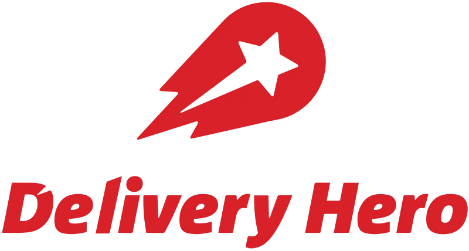

# 목차
- [딜리버리 히어로](#딜리버리-히어로)
- [한화 오션](#한화-오션)

 

# 기업 분석
## 딜리버리 히어로
- 기업명: 딜리버리 히어로(영문: Delivery Hero)
- 국적: 독일
- 종목코드: DHER

  
</p 

- 세계 최대 음식 주문 네트워크 보유한 독일 기업
- 음식 배달 서비스를 제공하는 기업
- 원래 요기요를 갖고 있었지만, 우아한 형제 인수 조건으로 공정위가 요기요 매각을 조건으로 내세웠고, 딜리버리히어로홀딩스는 우아한 형제들 인수하고 요기요 지분 가진 컴바인드디릴버리플랫폼인베스트먼트를 GS리테일에 매각하였음
- 이후 컴바인드디릴버리플랫폼인베스트먼트는 딜리버리히어로코리아의 사명을 위대한 상상으로 변경하였음
- 2024년 들어 요기요의 위상이 위태로움. 딜리버리 히어로는 잘 나감
- 다음 기사를 보면 딜리버리 히어로는 글로벌 점유율에서 잘 나가고 있음
- [참고기사](https://www.sedaily.com/NewsView/29SAMJ3XSU)
- 배달의 민족도 22년 기준 영업이익이 4200억원 흑자라고 함
- 그럼에도 아직 딜리버리 히어로는 영업이익 말고 순이익은 적자다.. ㅠ

- 자료
  - [삼성증권 분석자료 2023.6.16.](https://www.samsungpop.com/common.do?cmd=down&contentType=application/pdf&inlineYn=Y&saveKey=research.pdf&fileName=3010/2023061615583591K_02_02.pdf)
  - [삼성증권 분석자료 2024.2.15.](https://www.samsungpop.com/common.do?cmd=down&contentType=application/pdf&inlineYn=Y&saveKey=research.pdf&fileName=3010/2024021512150424K_02_03.pdf)

 ## 한화 오션
 - 기업명: 한화오션 주식회사
 - 종목코드: 042660
 - 국적: 한국
 - 한화 계열 각종 선박과 해양 플랜트, 시추선, 부유식 원유생산설비, 잠수함, 구축함 등을 건조하는 한국의 조선 해양 정문기업. HD현대중공업, 삼성중공업과 함께 대한민국 조선업계 빅3
 - 한국산업은행(28%), 한화에어로스페이스(24%), 한화시스템(12%)이 3대 대주주
 - 23년 5월 중 인수 완료
 - 미국의 조선소도 인수 추진하며 글로벌한 방산거인을 꿈꾸는 중
 - [참고기사1](https://www.fortunekorea.co.kr/news/articleView.html?idxno=35959)

 # S&P 500개 기업 조사
- 순위는 늘 변하는거라 큰 의미는 없는 듯 하니 걍 번호만 표기
- [목록보기](https://www.slickcharts.com/sp500)

## 500: 폭스 코퍼레이션 (Fox Corporation)
- 2019년 설립된 미국 대중 매체 다국적 기업
- 21세기 폭스 전체 자산 중 60% 정도 디즈니가 인수. 자회사 통합하여 폭스 코퍼레이션 탄생
- S&P 500 지수에 21세기 폭스를 대체하면서 상장기업이 됨
- 주가 30달러 수준
- 배당 1.68% 수준
- PER 18.39 수준
- [재무제표](https://kr.investing.com/equities/fox-corp-financial-summary)
- 영업이익이 그닥 매력적이지는 않음

## 499: VF Corporation
- 신발 및 의류 회사
- 미국 종합패션 지주회사
- 슈프림의 모기업
- 반스, 노스페이스, 디키즈, 슈프림 등 들어본 산하 브랜드가 있음
- [설명보기](https://namu.wiki/w/VF%20%EC%BD%94%ED%8D%BC%EB%A0%88%EC%9D%B4%EC%85%98)
- 영업이익이 이래도 되나 싶을 정도로 절단남... 패쓰!

## 498: Paramount Global
- 미국 글로벌 대중 매체 복합 기업
- 여기도 23년 영업이익이 절단 났네.. 패쓰!

# 497: Ralph Lauren Corporation
- 폴로 랄프 로렌. 맞다. 그 POLO!!
- [설명보기](https://kr.investing.com/equities/polo-ralph-laur-financial-summary)
- 21년 마이너스 적자... 23년 되니 전년보다순이익 줄어듦...
- 뭔가 5% 아쉬운 주식