## I. 물리적 통신로의 확립, Data Link Layer 개요
### 가. Data Link Layer 정의

- OSI 7 Layer의 2계층으로, 인접한 시스템 사이의 물리적인 통신 위한 통신로를 확림(Link)하고, 오류 제어를 통해 Data의 오류를 검사하고 정정하는 계층

### 나. Data Link Layer 역할

역할 | 내용 | 기술
-- | -- | -- | 
인접 노드 정보 전달 | 인접 노드 간 송신측에서 최종 수신측으로 데이터 전송 | 오류 제어, 흐름 제어
오류 제어 | Data가 통신로를 통과하는 동안 오류 검사, 재전송 | <u>FEC, BEC, 해밍코드, CRC</u>
흐름 제어 | 수신측에서 프레임 전달할 때 수신 측에서 처리할 수 있는 데이터 양 조정 | <u>ARQ</u>
주소 지정 | 프레임에 송신자와 수신지의 물리주소가 부여 | MAC, LLC
접근 제어 | 서로 다른 시스템이 동일한 링크에 연결되어 있다면 링킈으 점유를 위한 접근 방식을 제어 | CSMA/CD(유선), CSMA/CA(무선)

## II. Data Link Layer의 오류 제어
### 가. 오류 제어 정의
- 데이터 링크 계층에서 전/후진 오류 수정을 통해 오류를 검출하고 수정하고 처리함

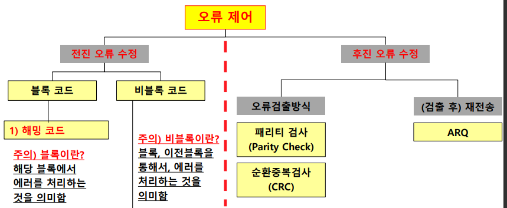

### 나. 오류 제어 상세 내용

<table>

<tr>
  <td>종류</td>
  <td>기법</td>
  <td>설명</td>
</tr>

<tr>
  <td rowspan="3">전진 오류 수정</td>
  <td colspan="2">첨가된 부가 정보를 이용해 수신 측에서 오류를 검출/정정</td>
</tr>

<tr>
  <td>블록 코드</td>
  <td>해당 블록에서 에러를 처리. <u>해밍코드</u></td>
</tr>

<tr>
  <td>비블록 코드</td>
  <td>이전 블록을 통해 에러를 처리</td>
</tr>

<tr>
  <td rowspan="4">후진 오류 수정</td>
  <td colspan="2">부가 정보를 이용해 수신 측에서 오류를 검출 시 송신 측에 데이터 재전송 요청</td>
</tr>

<tr>
  <td>패리티 검사</td>
  <td>- 정보비트수 적고, 오류발생 확률 낮을 때 가장 많이 사용 - 오류가 발생한 비트를 알 수 없고, 짝수 개의 오류 발생하면 오류 검출 불가능 -구현간단/비동기 통신 - 전송 데이터의 bit값 중 1의 개수가 짝수/홀수 되도록 부가 비트 추가 - Even/Odd 패리티</td>
</tr>

<tr>
  <td>검사합 (CheckSum)</td>
  <td>- 전송 데이터를 특정 단위로 구분 -구분된 자료 2진 정수값으로 환산하여 그 합 전송 - 수신 측에서 동일한 방법으로 수신 데이터 연산하여 전송 받읍 합과 비교</td>

<tr>
  <td>순환중복검사 (CRC;Cycle Redundance Check)</td>
  <td>- 주어진 데이터 값에 따라 CRC값을 데이터에 붙여 전송 - 수신측은 동일 방법으로 연산하여 수신된 CRC값과 비교</td>
</tr>

</table>

## III. 1비트 오류 정정 기법, 해밍코드
### 가. 해밍코드(Hamming Code) 정의
- 데이터 전송 시 1비트 오류를 정정할 수 있는 자기 오류정정정부호로, 패리티비트에 의한 오류 검출과 단일 비트 오류 정정 가능

### 나. 해밍코드 검사 방법
1) 아래 식을 만족하는 p의 최소값을 구함

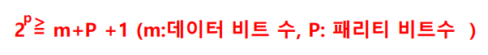

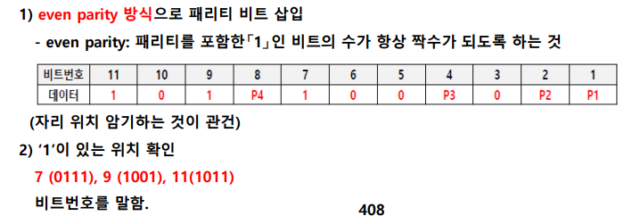

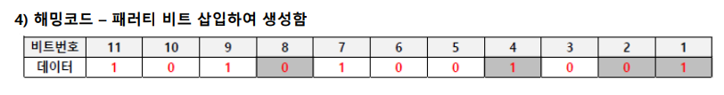
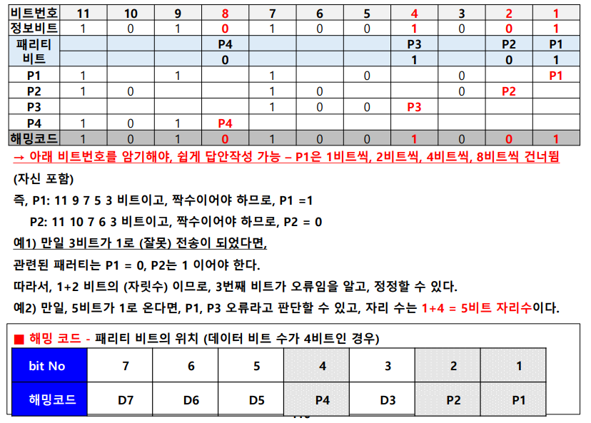

## III. 다항식을 적용한 오류 검사 기법, 순환 중복 검사
### 가. 순환 중복 검사(CRC; Cycle Redundance Check) 정의
- 송신 측이 전송 데이터 블록에 16 혹은 32비트 다항식을 적용하여 얻은 결과 코드를 블록에 덧붙이고, 수신측이 동일 다항식을 통해 얻은 결과를 보내온 결과아 비교하여 오류를 검사하고 재송신을 오청하는 기법

### 나. 순환 중복 검사 개념도
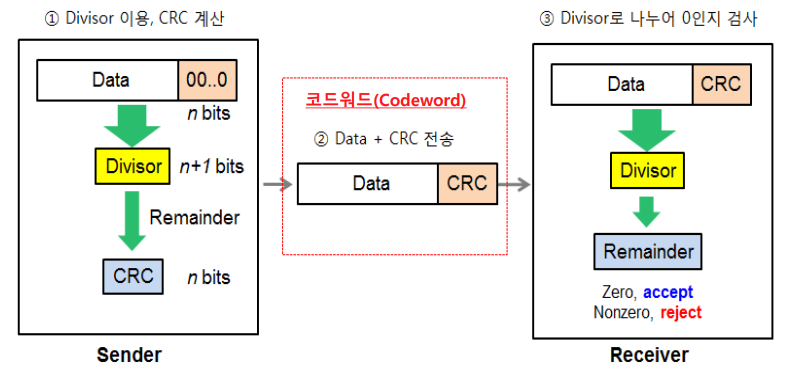
- 송신자 측이 제수(Divider)를 이용해 데이터와 0비트 문자열을 나눠 CRC 구하고, 수신자는 제수를 통하여 코드워드(Codeword)를 나눠 0인지를 검증

### 다. 순환 중복 검사 방법

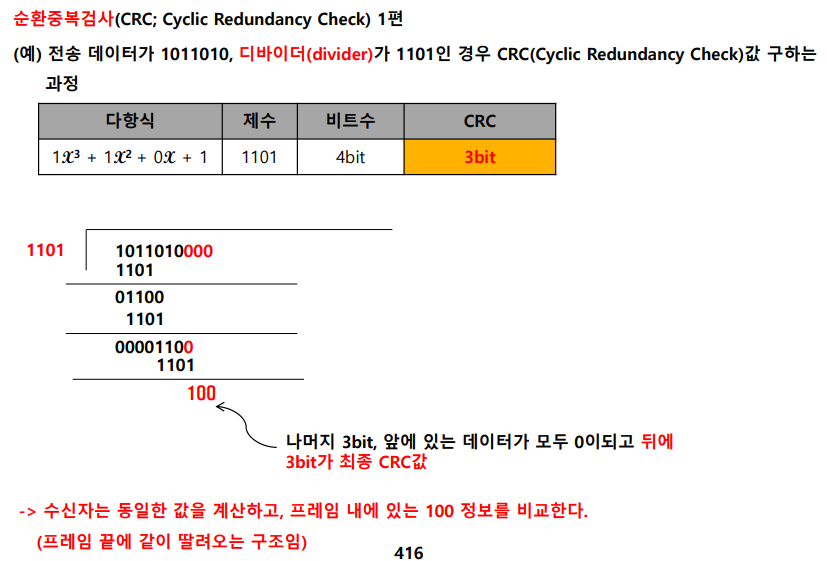

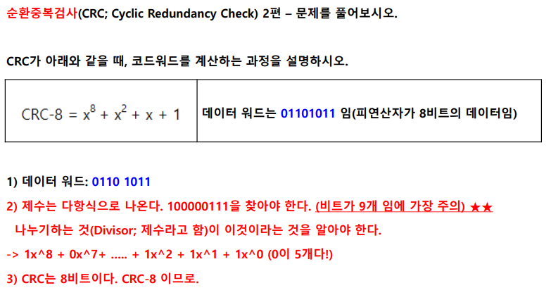

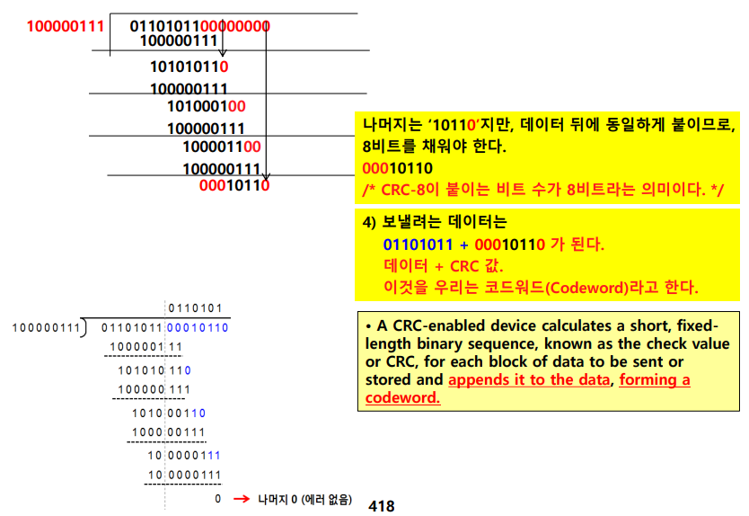

## IV. 잘못된 데이터에 대한 재전송 요구, 자동 재전송 요구
### 가. 자동 재전송 요구(ARQ;Automatic Repeat reQuest) 정의
- 데이터 수신 측에서 오류 검출 후 송신 측에 오류 사실을 알려 재전송을 요청하는 오류 제어 기술

### 나. ARQ 세부 유형별 동작원리

<table>
  <tr>
    <th>유형</th>
    <th>개념도</th>
    <th>설명</th> 
  </tr>

  <tr>
    <td>Stop and Wait</td>
    <td></img></td>
    <td>
      - 송신측에서 한 번에 하나의 프레임 전송 
      - 수신측에서 프레임에 대한 오류 검사 후 오류가 있으면 NAK를 보냄
    </td>
  </tr>

  <tr>
    <td>Go-back-N</td>
    <td>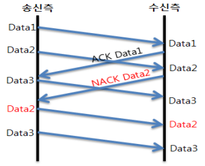</td>
    <td>
      - 수신 측에서는 오류가 있으면 'NAK + 오류 검출된 프레임 번호'를 송신 
      - 오류가 연속적으로 발생하였다면 제일 처음의 프레임부터 재전송. 오류 발생 이후의 프레임 모두 삭제 
      - 전송 효율 개선
    </td>
  </tr>

  <tr>
    <td>Selective Repeat</td>
    <td>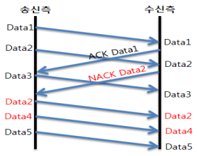</td> 
    <td>
      - 오류가 발생한 프레임만 재전송 
      - 전송 효율 뛰어나지만, 구현이 복잡
    </td>
  </tr>

  <tr>
    <td>Hybrid ARQ - Type 1</td>
    <td>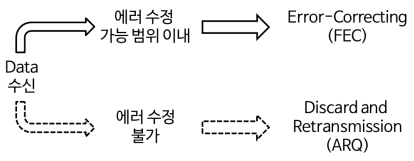</td>
    <td>
      - 오류 감지 시 오류를 수정하고, 수정 못하면 수신측 재전송 요청 
      - 여분의 패리티 비트 필요 
      - FEC기능이 있으므로 네트워크 환경이 안 좋은 곳에서 다른 ARQ 보다 처리율 좋음
    </td>
  </tr>

  <tr>
    <td>Hybrid ARQ - Type 2</td>
    <td>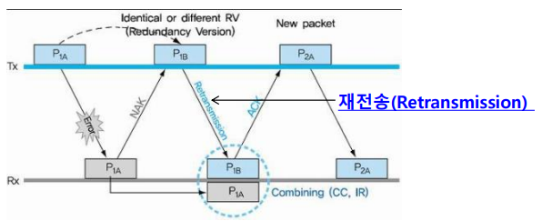</td>
    <td>
      <table>
        <tr>
          <td>CC-HARQ(Chase Combining HARQ)</td>
          <td>
            - 모든 재전송에 동일한 정보(데이터/패리티비트)를 보냄 
            - 수신자는 수신된 비트를 비트와 결합 
          </td>
        </tr>
        <tr>
          <td>IR-HARQ(Incremental Reundancy HARQ)</td>
          <td> 
            - 모든 재전송 시 보내지는 정보는 이전과 다름 
            - 코딩되는 비트세트가 다르므로 수신자는 추가 정보를 얻음 
          </td>
        </tr>
      </table>
    </td> 
</table>

- Soft Combining는 오류가 발생한 정보를 버리지 않고 재수신된 추가정보를 결합하여 프레임을 복원하는 기법