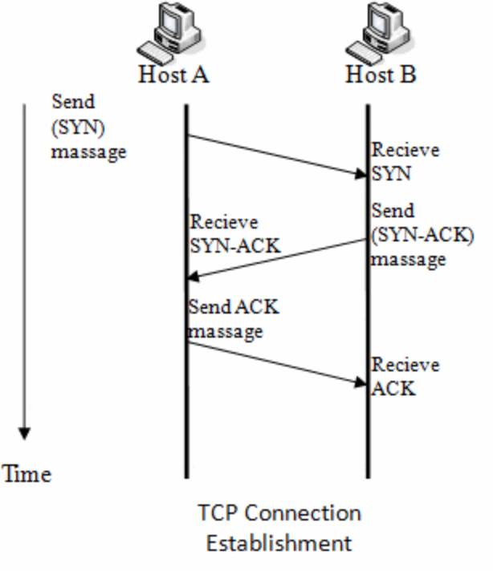
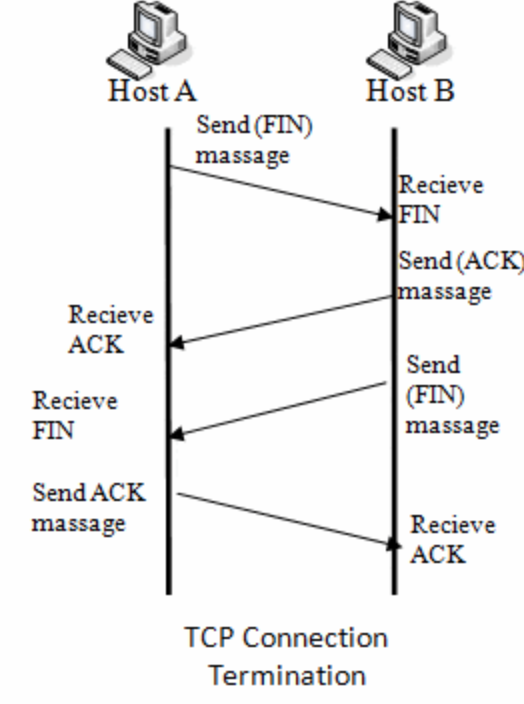
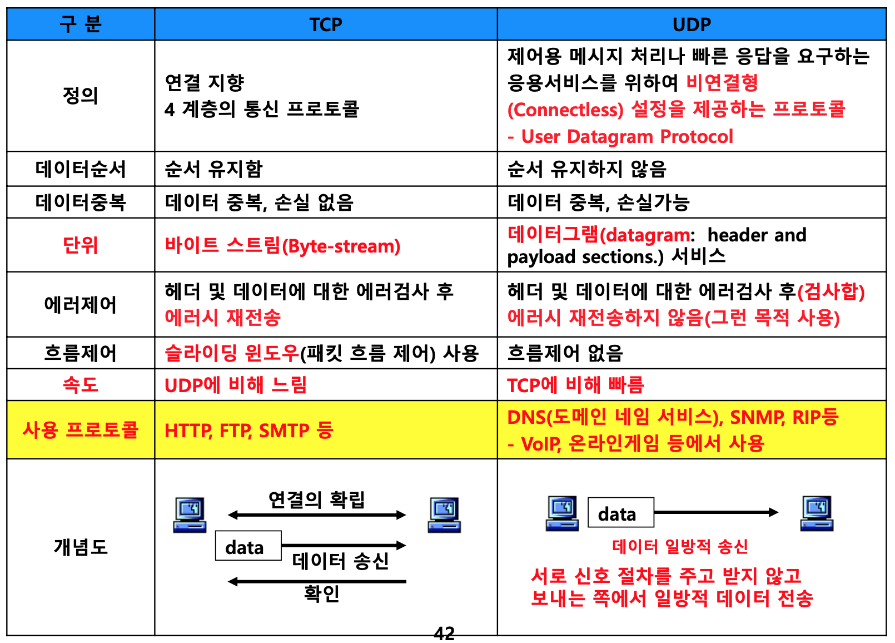

## I. 연결 지향 신뢰성 높은 연결 프로토콜, TCP 개요

### 가. TCP(Tansmission Control Protocol) 정의
- TCP는 근거리 통신망이나 인트라넷, 인터넷에 연결된 컴퓨터에서 실행되는 프로그램 간에 20바이트를 통해, 세그먼트를 순서대로, 에러없이 교환할 수 있게 하는 프로토콜

### 나. TCP 특징
특징 | 내용
-- | -- 
상태확인 | - SYN, ACK 등의 메시지를 통한 시스템 간 상태 확인
핸드쉐이킹 | - 3-way(연결수립), 4-way(연결종료) 핸드쉐이킹
순서보장 | - 데이터 순서 의미하는 Sequence Number를 이용해 순차적으로 데이터를 처리 

## II. TCP 연결 수립/종료 절차

<table>
    <tr>
        <td>구분</td>
        <td>설명</td>
    </tr>
    <tr>
        <td rowspan="2">3-Way Handshaking</td>
        <td></td>
    </tr>
    <tr>
        <td>
1. Client가 Server로 SYN 세그먼트 전송 
2. 서버는 ISN을 포함하는 SYN와 (ISN + 1)의 ACK 세그먼트를 클라이언트에게 보내어 응답 
3. 클라이언트는 서버가 보낸 SYN에 대해 서버의 (ISN + 1)의 ACK 세그먼트로 확인응답하여 연결수립 완료
</td>
    </tr>
    <tr>
        <td rowspan="2">4-Way Handshaking</td>
        <td></td>
    </tr>
    <tr>
        <td>
1. 클라이언트에서 서버와의 연결 종료를 위해 서버에 FIN 패킷을 보내고 FIN_WAIT1 상태가 됨 
2. 서버는 클라이언트로부터 FIN을 받고 응답 패킷 ACK을 보낸 후 상태는 CLOSE_WAIT가 됨 
3. 서버가 연결 종료 준비가 되면 클라이언트에게 FIN패킷을 보내고 LAST_WAIT 상태가 됨 
4. 클라이언트는 확인 패킷 ACK을 보내고 TIME_WAIT 상태가 되고 ACK을 수신한 서버는 소켓을 Terminate</td>
    </tr>
</table>

## III. TCP와 UDP 비교

 

위 과정을 통해 서버와 클라이언트는 안전하게 세션을 종료하게 됩니다.