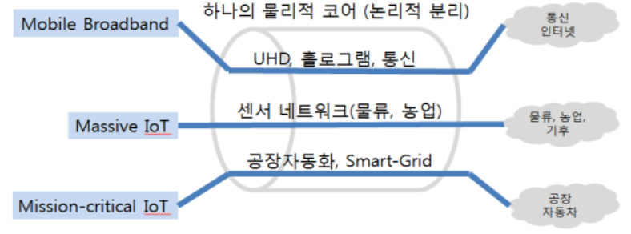
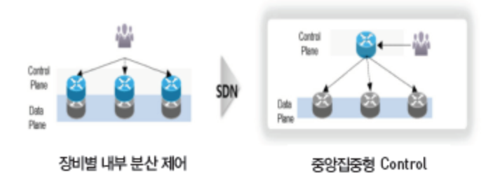
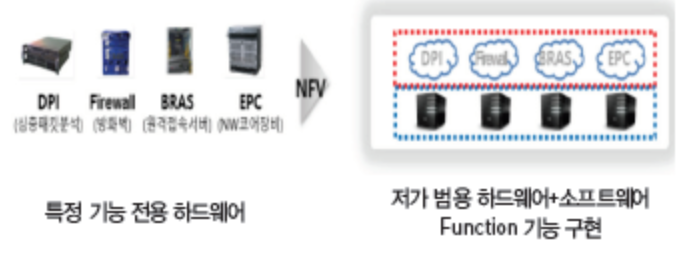
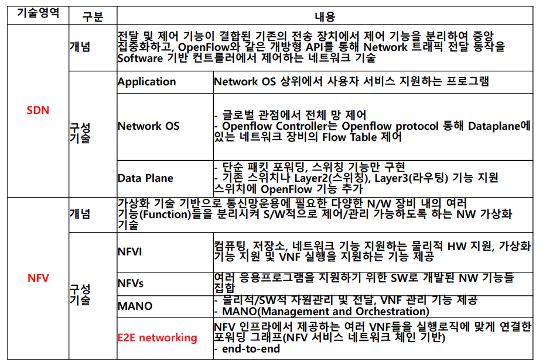
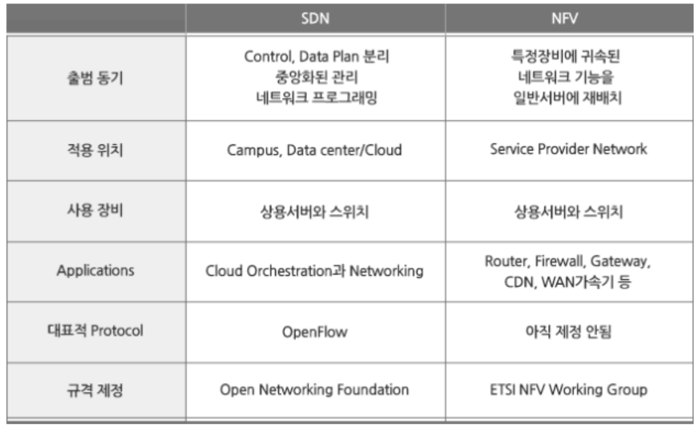
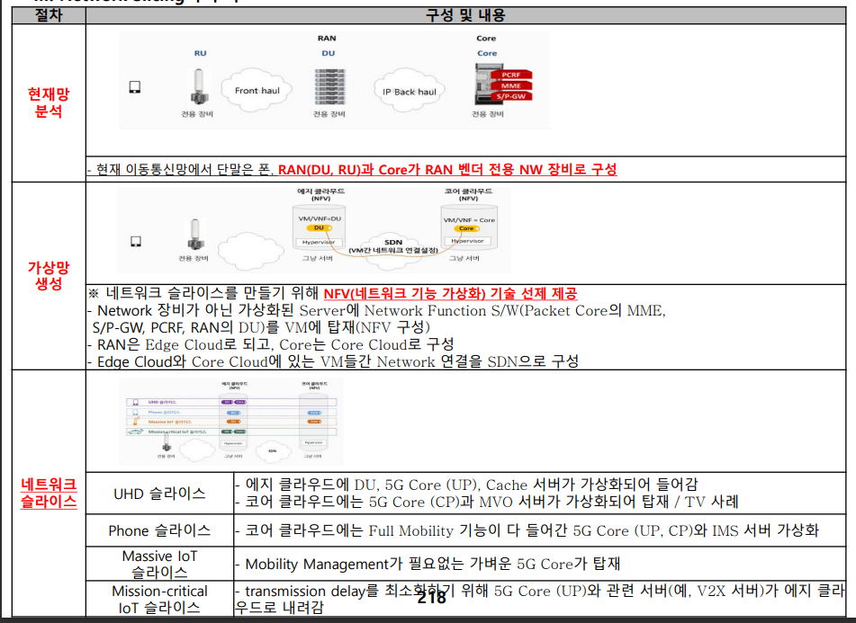

## I. 네트워크의 논리적 분리, 네트워크 슬라이싱 개요
### 가. 네트워크 슬라이싱(Network Slicing) 개념

- 물리적으로 하나의 네트워크를 논리적으로 분리하여 서로 다른 특성을 갖는 다양한 서비스로 특화된 전용 네트워크를 만드는 기술

### 나. 네트워크 슬라이싱 특징
특징 | 설명
-- | --
자원의 분리 | - 하나의 물리적 네트워크를 다수의 논리적 네트워크로 분리
맞춤형 | - 논리적으로 분리된 네트워크를 Use-Case 별로 기능 제공
독립적 관리 | - 슬라이스 간 독립적 운영 가능
경제성 | - 필요에 따른 물리망 구축 불필요. 비용절감

## II. 네트워크 슬라이싱 개념도와 기술요소
### 가. 네트워크 슬라이싱 개념도

### 나. 네트워크 슬라이싱 기술요소

기술 영역 | 개념도 | 내용 | 구성기술
-- | -- | -- | --
SDN |  | - OpenFlow 등 개방형 API로 트래픽 전달 - SW 기반 컨트롤러로 제어하는 기술 | - Application, Network OK, Data Plane
NFV |   | - 다양한 NW 장비 내 기능을 분리 - SW적으로 제어/관리하는 NW 가상화 기술 | - NFVI, NFVs, MANO, E2E Networking

### III. 네트워크 슬라이싱 기술요소 세부내용

### IV. SDN과 NFV 비교

### V. 네트워크 슬라이싱 구축 절차
