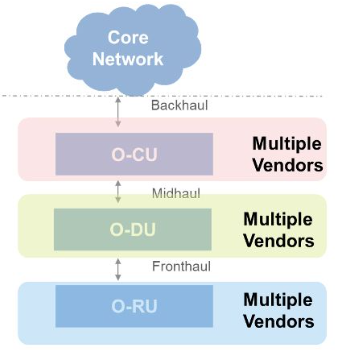

## I. 개방적/지능화된 무선 접속망 구현 위한 O-RAN 개요
### 가. O-RAN(Open Radio Access Network) 정의
- AI 기반 무선 제어 및 가상화된 무선 접속망 구축을 위해 설계
- 표준화된 인터페이스 기반으로 3GPP 및 다른 표준 지원하여 개방적/상호운용 가능한 연동 NW 플랫폼

## II. O-RAN 구성도와 구성요소
### 가. O-RAN 구성도

- O-CU, O-DU에 RIC 연결
### 나. O-RAN 구성요소

구성요소 | 기반기술 | 설명
-- | -- | --
RIC | - RIC near-RT, RIC non-RT | - RAN Intelligent Controller  - 데이터 수집과 분석을 기반으로 RAN요소와 자원 제어/최적화
O-CU | - RRC/SDAP, RDCP | - O-RAN Centralized Unit - RRC, PDCP 계층 실행하는 중앙 집중식 장치 - CU Control/User Plane 구성, 미드홀 통해 O-DU 작동제어
O-DU | - RLC, MAC, High PHY | - O-RAN Distributed Unit  - O-RU 근처에서 PLC, MAC 및 PHY 계층 일부 실행하는 분산 장치
O-RU | -RF, Low-PHY | - O-RAN Radio Unit - 안테나 근처에서 송수신되는 무선신호를 프론트홀 통해 O-DU로 전송. 디지털 신호 변환

## II. 기존 RAN과 O-RAN 비교
구분 | 기존 RAN | O-RAN
-- | -- | --
개념도 |  | 
공급 | - 단일 벤더 | - 다중 벤더
플랫폼 | - 공급업체 종속 - 시장출시 기간 길고, 고비용 | - Software Defined, 개방형 H/W
모듈성 | - 제어, 데이터, 인터페이스 통합 구성 | - 제어, 데이터, Open API 분리
애플리케이션 및 네트워크 적응성 | - 제어로직과 네트워크 리소스 고정 | - 네트워크 조건에 따라 프로그래밍 가능