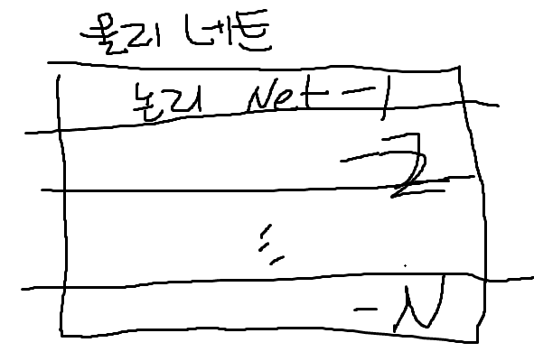

문제)
1. 가트나 전략기술(2022)의 주요 기술
2. 슈퍼앱

답)
 
## I. 2023 핵심트렌드 지속가능성, 가트너 10대 전략 기술 정의

- 정보 기술 연구, 자문 기업인 가트너에서 제시하는 IT 비즈니스에 영향을 줄 기술 및 트렌드

## II. 가트너 10대 전략 기술 주요내용

<table>
    
    <tr>
        <th>그룹</th>
        <th>기술</th>
        <th>설명</th>
    </tr>
    <tr>
        <td>최적화</td>
        <td>디지털 면역 시스템</td>
        <td class="desc">
        - SW 엔제니어링 전략 결합 
        - 위협으로부터 보호. 고객 경험 향상 
        - 관찰가능성, 자동화, 극단적 설계/테스트 
        - 운영/보안 위험 완화하는 탄력적 시스템 제공  
        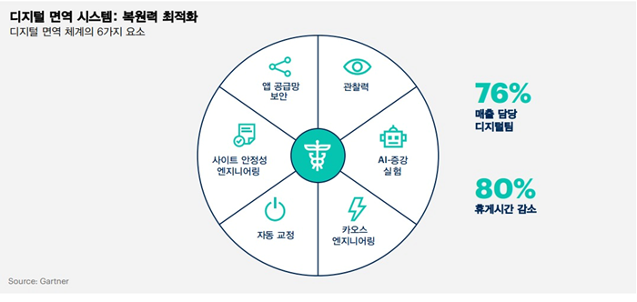
        </td>    
    </tr>
    <tr>
        <td>최적화</td>
        <td>관찰 가능성 응용</td>
        <td class="desc">
         - 로그, Trace, API 호출 등의 관찰 가능 데이터 
         - AI 학습시켜 권장사항 제시. 신속/정확한 미래 결정 
         - 응답대기시간 줄이고, 비즈니스운영 최적화  
        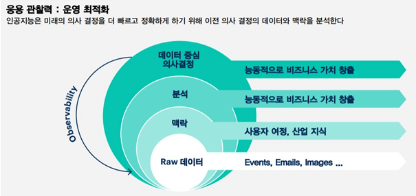
        </td>    
    </tr>
    <tr>
        <td>최적화</td>
        <td>AI신뢰 위험/보안 관리</td>
        <td class="desc">
         - AI 모델 거버넌스, 신뢰성, 공정성, 견고성, 효율성 및 데이터 보호 지원 
         - 새로운 모델 신속 배포 
         - AI보안 적극 관리, 개인정보/윤리 문제 제어 결합  
        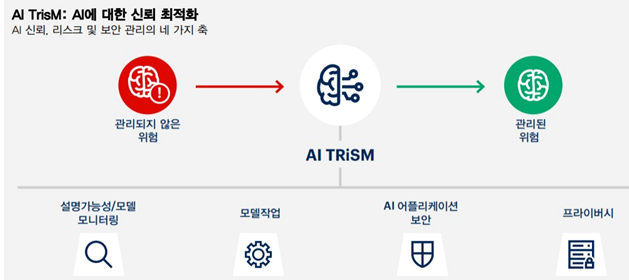
        </td>     
    </tr>
    <tr>
        <td>확장</td>
        <td>산업 클라우드 플랫폼</td>
        <td class="desc">
         - SaaS, PaaS 및 IaaS를 맞춤형 산업별 기능과 결합 
- 조직이 산업의 끊임없는 혼란 흐름에 쉽게 적응할 수 있도록 함 
- 특정 비즈니스 사용 사례를 지원하는 모듈식 기능 제공  
        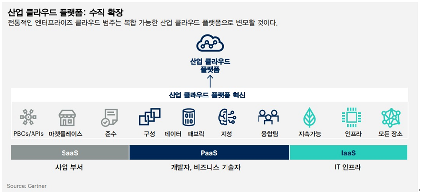
        </td>     
    </tr>
    <tr>
        <td>확장</td>
        <td>플랫폼 엔지니어 </td>
        <td class="desc">
         - 개발자-최종사용자가 쉽게 사용할 수 있도록 패키지화된 일련의 도구, 기능 및 프로세스 제공 
- 최종사용자의 생산성 높이고 개발팀 부담을 줄임  
        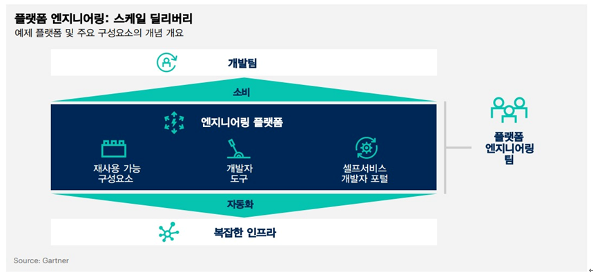
        </td>  
    </tr>
    <tr>
        <td>확장</td>
        <td>무선네트워크 가치실현 </td>
        <td class="desc">
         -전통적인 최종 사용자 컴퓨팅, 에지 장치 지원, 디지털 태깅 솔루션 등을 포함한 모든 것에서 무선 네트워크 서비스를 제공 
-위치 및 기타 실시간 정보와 분석 통찰력을 제공하고 시스템이 네트워크 에너지를 직접 수집임  
        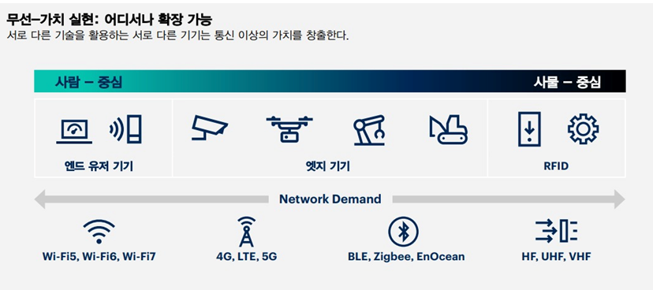
        </td>  
    </tr>
    <tr>
        <td>선구자</td>
        <td>슈퍼앱 </td>
        <td class="desc">
        - 앱, 플랫폼, 생태계의 기능을 하나의 애플리케이션에 결합
        - 제3자가 자체 미니앱을 개발하고 게시할 수 있는 플랫폼 제공
          
        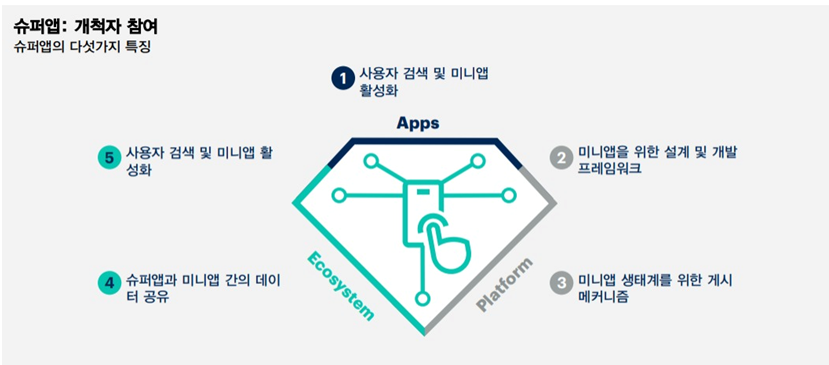
        </td>  
    </tr>
    <tr>
        <td>선구자</td>
        <td>적응형AI </td>
        <td class="desc">
        - 실시간 피드백을 사용하여 모델을 지속적으로 재교육
        - 런타임 및 개발 환경에서 학습/변화하여 실제 환경에 빠르게 적응\
          
        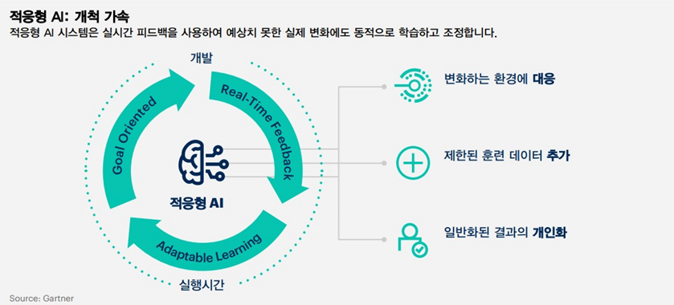
        </td>  
    </tr>
    <tr>
        <td>선구자</td>
        <td>메타버스 </td>
        <td class="desc">
        - 강화된 물리적 현실과 디지털 현실의 융합으로 생성된 집합적인 가상 3D 공유 공간으로 지속적이며 향상된 몰입 경험을 제공
        - 신체 활동 복제, 향상시킬 수 있도록 물리적 활동을 가상 세계로 전송, 확장, 변환
        - 웹3, AR 클라우드 및 디지털 트윈 등 여러 기술 조합
          
        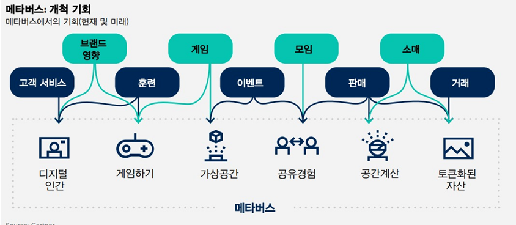
        </td>  
    </tr>    
    <tr>
        <td colspan="2">지속가능한기술</td>
        <td class="desc">
        -IT 서비스의 에너지와 효율성을 높이고, 추적 가능성, 분석, 배출 관리 소프트웨어 및 AI와 같은 기술을 통해 기업의 지속 가능성을 실현
        -고객이 자체 지속 가능 목표를 달성할 수 있도록 지원하는 솔루션 프레임워크
          
        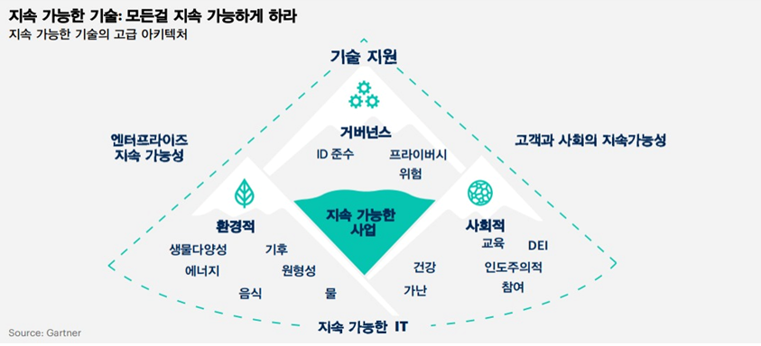
        </td>  
    </tr>
</table>

## III. 모든 서비스를 하나의 앱으로 통합, 슈퍼앱 개념
### 가. 슈퍼앱 정의
- 하나의 앱 안에서 별도의 다른 앱을 설치하지 않아도 수많은 서비스를 이용할 수 있는 앱

### 나. 슈퍼앱 개념도

### 다. 슈퍼앱 서비스 및 기술요소

구분 | 세부 | 설명
-- | -- | --
서비스 | 검색 | - 실시간 정보, 상품, 지역, 추천 서비스
서비스 | 금융 | - 입/출금, 송금, 대출, 증권 등 간편 인증 통해 제공
서비스 | 주문 | - 가전, 음식, 생필품 등 실시간 주문
서비스 | OTT | - 콘텐츠 기반 구독, 추천 서비스
기술요소 | Frontend | - React, JAVA, HTML 등 웹/앱 구현 기술 적용 
기술요소 | Backend | - SpringBoot, NodeJS, Vue 등 기술 적용
기술요소 | Database | - MySQL, MongoDB, ElasticSearch, Redis, MariaDB 등 사용
기술요소 | AI | - 추천 알고리즘, OCR, YOLO, GAN 등으로 서비스 구현
기술요소 | Cloud | - 3-Tier/MSA 구조, IaaS, PaaS, SaaS 기반 서비스 운용

## IV. 슈퍼앱 사례

사례 | 설명
-- | --
네이버 | - 검색 기반의 검색, 온라인 쇼핑, 금융, 주문
카카오 | - SNS 기반의 메신저, 금융, 주문, 가전 렌탈, 구독
야놀자 | - 숙박앱에서 여행분야로 확장
쿠팡 | 빅데이터 기반 쇼핑, 배달, OTT
배달의 민족 | 앱 기반 배달주문, 대행, 장보기 