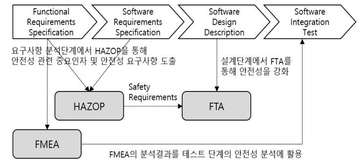
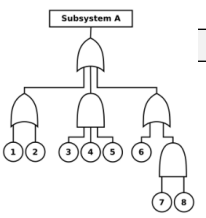
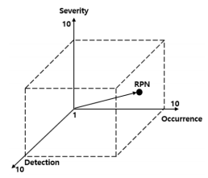
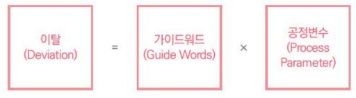

문제) 소프트웨어안정성

I. 소프트웨어 안정성 개요

가. 소프트웨어 안정성 정의

- SW를 전체 시스템 레벨에서 위험성 분석하여 안정요구사항 도출, 개발 결과물의 안정기능이 정상 작동여부 확인하는 것

나. 소프트웨어 안정성 분석 필요성

필요성 | 설명
-- | --
안전 필수 시스템 확산 | 대다수의 안전 필수 시스템에는 SW 내장
절차/특성에 따른 결함분석 필요 | 시스템 특성과 개발절차에 따른 효과적 안정성 분석 기법 필요

II. 소프트웨어 안정성 분석 개념도 및 분석 기법

가. 소프트웨어 안정성 분석 개념도

- 분석단계에서는 HAZOP과 FMEA로 안전요구사항 도출
- 설계단계에서는 FTA를, 테스트단계에서는 FMEA 분석결과 활용

나. 소프트웨어 안정성 분석 기법

<table>
  <tr>
    <th>방법</th>
    <th>개념도</th>
    <th>설명</th>    
  </tr>
  <tr>
    <td>FTA</td>
    <td></td>
    <td class="desc">
      - Fault Tree Analysis  
      - 트리다이어그램 이용  
      - 연역적, 정성/정량적  
    </td>
  </tr>

  <tr>
    <td>FMEA</td>
    <td></td>
    <td class="desc">
      - Failure Mode and Effects Analysis   
      - 고장 도출/정량화   
      - 위험도 우선순위/등급별 대응    
    </td>
  </tr>

  <tr>
    <td>HAZOP</td>
    <td></td>
    <td class="desc">
      - Hazard and Operability Study   
      - 공정변수와 가이드워드 조합   
      - 예외동작의 영향 분석
    </td>  
  </tr>

  <tr>
    <td>STPA</td>
    <td class="desc" colspan="2">    
      - System Theoretic Process Analysis   
      - 시스템 요소 간 상호작용이 안정성에 미치는 영향 분석    
    </td>  
  </tr>
</table>

