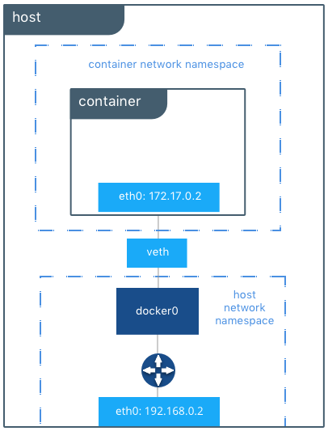
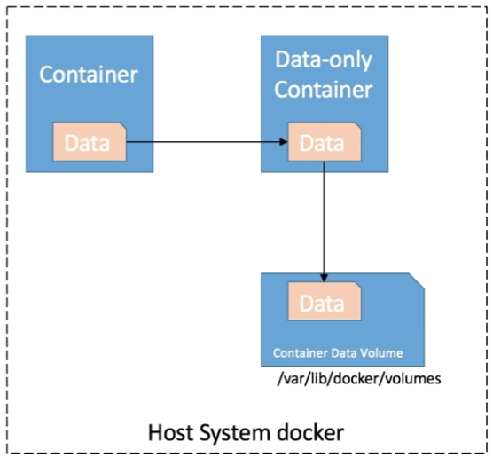
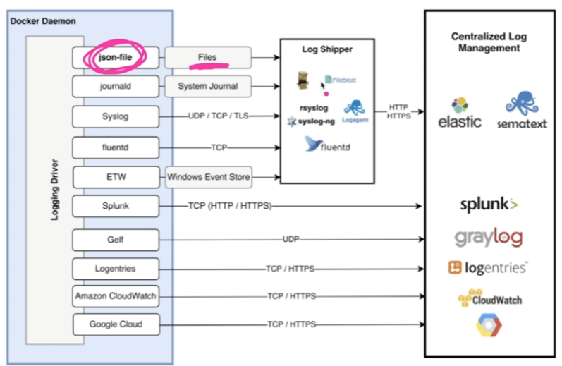

# Dockerfile 명령어

## FROM
- 도커 이미지의 바탕이 되는 베이스 이미지 지정
- Dockerfile로 이미지를 빌드할 때 먼저 FROM 명령에 지정된 이미지를 내려 받음
## RUN
- 도커 이미지를 실행할 때 컨테이너 안에서 실행할 명령어 정의
## COPY
- 도커 동작 중 호스트 머신의 파일이나 디렉터리를 도커 컨테이너로 복사
## CMD
- 도커 컨테이너 실행 시 컨테이너 안에서 실행할 프로세스 지정
## ENTRYPONT
- CMD와 마찬가지로 컨테이너 안에서 실행할 프로세스 지정

# DockerFile 실행
1. Dockerfile 경로 이동
2. docker build –t [tag_name] .

# Docker 이미지 검색
- 호스트 cmd에서 아래처럼 명령어 입력하여 검색
  - docker search nodejs  # Node.js 이미지 검색
  - docker search openjdk  # OpenJDK 이미지 검색
  - docker search kafka  # Apache Kafka
  - docer search mysql --limit 5 # MySQL

# Error : Cannot perform an interactive login from a non TTY device
- 호스트 cmd에서 도커 명령어 실행 시 위의 오류가 발생하면 맨 앞에 winpty 입력
- winpty docker container run –p 5000:3000 –it zhwan85/goodwill
- winpty docker container run –p 5000:3000 zhwan85/goodwill

# Docker 이미지 목록 확인
- docker image ls

# Docker 이미지 생성
- docker image build –t zhwan85/goodwill:latest .

# Docker 이미지 배포
- docker image push zhwan85/goodwill:latest
- docker commit c33c299a3bd4 zhwan85/goodwill:lastest
- docker image tag [이미지명:현재태그] [이미지명:변경태그]
- docker image tag zhwan85/goodwill:latest zhwan85/goodwill:0.0.1
- docker push zhwan85/goodwill:0.0.1
- [참고사이트](https://nicewoong.github.io/development/2018/03/06/docker-commit-container/)

# Docker 이미지 삭제
- docker rmi [이미지아이디]

# Docker 컨테이너 목록 확인
- docker ps –a
- docker container ls –a

# Docker 컨테이너 생성
- winpty docker container run -it –p 5000:3000 zhwan85/goodwill
포트포워딩: [호스트포트번호:컨테이너포트번호]
- -it: Windows에서 커맨드창으로 컨테이너 실행 시 -it를 안 붙이면 실행 안됨  
- 포트 포워딩은 run에서만 가능하므로, 컨테이너를 commit 후 컨테이너를 재생성하여 포트포워딩 해야 함

- docker container run -it –p 5000:3000 –p 4000:2000 zhwan85/goodwill
- 포트포워딩은 여러 개 가능

- winpty docker container run -it –p 5000:3000 –p 3308:3306 —privileged zhwan85/goodwill

- docker container run -it  -v C:\Users\JHKIM\Desktop\GoodWill:/home/app -d -p 5000:3000 -p 5030:3030 -p 5306:3306 -p 5084:8084 -p 5181:2181 -p 5092:9092 --name goodwill  --privileged zhwan85/goodwill:0.0.2 init

# Docker 컨테이너 시작/재시작/정지
- docker start/restart/stop [컨테이너명or아이디]
- [참고사이트](https://snowdeer.github.io/docker/2018/01/03/docker-launch-container-from-image/)

# Docker 컨테이너 접속
- docker attach [컨테이너명or아이디]

# Docker 컨테이너 백그라운드 실행 시 접속
- docker exec -it [컨테이너명or아이디] bash

# Docker 컨테이너 외부에서 명령 실행
- docker exec [컨테이너명or아이디] [커맨드]
- docker exec zhwan85:goodwill:0.0.1 echo “Hello!!”

# Docker 컨테이너 삭제
- docker rm [컨테이너명or아이디]
- docker rm -f [컨테이너 아이디 일부]
- docker rm -f $(docker ps -a -q)
  - 불필요한 컨테이너 모두 삭제
 
# Docker 컨테이너 재시작
- docker container restart silly_heyrovsky

# Docker 이미지 최초 배포
- docker login –u zhwan85 –p 비밀번호
- docker image push zhwan85/goodwill:latest

# Docker 컨테이너 커밋
- docker commit [컨테이너ID] [이미지명]

# Docker 이미지 태그 달기
- docker image tag [이미지명:현재태그] [이미지명:변경태그]
- docker image tag zhwan85/goodwill:latest zhwan85/goodwill:0.0.1

# Docker Node.js 설정 참고
- [참고사이트](https://www.daleseo.com/docker-nodejs/)

# Docker 파라미터 

## -i
- 컨테이너 실행 시 컨테이너 쪽 표준 입력과의 연결을 그대로 유지
- 컨테이너 쉘에 들어가 명령 실행 가능 하며 –t 옵션과 함께 사용
## -t
- 유사 터미널 기능 활성화
- -i 옵션을 사용하지 않으면 유사 터미널을 실행해도 여기에 입력할 수 없으므로 –i와 –t옵션을 같이 사용하거나 이드옵션을 축약한 –it 옵션 사용
## --rm
- 컨테이너 종료 시 컨테이너 파기 옵션
- 한 번 실행 후 유지 않아도 되는 명령행 도구 컨테이너 실행할 때 유용
## -v
- 호스트와 컨테이너 간에 디렉터리나 파일 공유
## -d
- -i 옵션의 반대로 컨테이너를 백그라운드 실행
## -p
- 포트포워딩 [외부포트]:[내부포트]
- 여러 개 열려면 –p [외부포트]:[내부포트] -p [외부포트]:[내부포트] ... 형태로 반복 해주면 됨
## -c
- CPU 자원 분배 설정
## -m
- 메모리 한계 설정
## /bin/bash
- 리눅스의 경우 컨테이너에 bash 쉘 이용
## --privileged
- 기본적으로 실행되는 unprivileged모드에서는 시스템 자원에 대한 접근이 제한적이므로 거의 모든 커널 기능을 사용하기 위하여 privileged모드로 실행해야 함
- 아래는 발생 가능한 에러
- Failed to get D-Bus connection [관련글 참고](https://lsjsj92.tistory.com/415)
  - --privileged와 init 명령어를 사용하여 컨테이너를 생성해야 함

  - docker container run -it -d -p 5000:3000 -p 3308:3306 --privileged –d zhwan85/goodwill:0.0.1 init
    - I: 표준입력 연결, t: tty 활성화, d: 백그라운드 실행
    - p: 포트포워딩, privileged: 가용 시스템 자원 확장

  - docker container run -it -d -p 5000:3000 -p 3308:3306 --privileged  zhwan85/goodwill:0.0.1 init

# 데이터 볼륨
- 컨테이너에서 실행된 애플리케이션이 stateful 유형이라면 새로운 컨테이너가 배포되어도 사용 중인 파일이나 디렉터리의 상태가 유지되어야 된다. 데이터 볼륨은 호스트와 컨테이너 사이의 디렉터리 공유 및 재사용 기능을 제공하여 애플리케이션이 사용하는 파일이나 디렉터리를 보존한다.

# 엔트리포인트(Entrypoint)
- 도커 컨테이너가 실행할 때 고정적으로 실행되는 스크립트 혹은 명령어
- 생략 가능하며 생략 시 커맨드에 지정된 명령어로 수행
- docker run --entrypoint echo ubuntu:focal hello world

# 커맨드(Command)
- 도커 컨테이너가 실행할 때 수행할 명령어 혹은 엔트리포인트에 지정된 명령어에 대한 인자값

# 환경변수
- docker run -i -t -e MY_HOST=fastcampus.com ubuntu:focal bash
- -e, --env, --env-file 
- nginx, grafana 등 컨테이너의 환경변수 확인

# docker exec
- 실행 중인 컨테이너에 명령어 실행
- docker exec [container] [command]
- docker exec -i -t my-nginx bash: my-nginx 컨테이너에 Bash 셀로 접속
- docker exec my-nginx env: my-nginx 컨테이너에 환경변수 확인
docker run -d --name my-nginx nginx
docker exec my-nginx env
docker exec -i -t my-nginx bash
  
# docker network
- Docker 컨테이너가 매우 강력한 이유 중 하나는 Docker 컨테이너 간 Network 연결을 할 수 있으며, Docker 컨테이너와 Docker 컨테이너가 아닌 워크로드에 연결결할 수 있기 때문
- Docker 컨테이너와 서비스는 연결하려는 것이 Docker 컨테이너인지 아닌지 알 필요가 없음
- Docker 호스트는 Docker를 이용해 플랫폼에 구애받지 않고 Docker 컨테이너들을 관리, 연결할 수 있음

## Docker network driver bridge
- Docker를 설치하면 자동으로 Host machine의 Network interface에 Docker0라는 Virtual interface가 생성
- Docker0는 Host machine의 네트워크에 생성되어 다음의 특징을 가짐
  - Gateway는 자동으로 172.17.0.1로 설정되고 16 bit netmask(255.255.0.0)로 설정됨
  - docker0는 일반적인 interface는 아니며, virtual ethernet bridge임
- 컨테이너가 생성될 때 사용자가 특정 Network driver를 설정한 것이 아니라면 Default로 Docker0라는 Network interface에 연결이 됨
- Docker0는 각 컨테이너의 veth 인터페이스와 바인딩되며, 호스트OS의 eth0 인터페이스와 이어주는 역할을 함

- docker run -p [HOST IP:PORT]:[CONTAINER PORT] [container]
- docker run -d -p 80:80 nginx 
  - nginx 컨테이너의 80번 포트를 호스트 모든 IP의 80번 포트와 연결하여 실행
- docker run -d -p 127.0.0.1:80:80 nginx
  - nginx 컨테이너의 80번 포트를 호스트 127.0.0.1 IP의 80번 포트와 연결하여 실행
- docker run -d -p 80 nginx
  - nginx 컨테이너의 80번 포트를 호스트의 사용 가능한 포트와 연결하여 실행
  - 호스트의 port 번호가 특정되지 않고 컨테이너의 포트번호를 80번으로 특정

- docker run -d -p 3000:3000 --name metabase metabase/metabase
- docker run --name nginx -p 80:80 -p 443:443 -it -d nginx

- docker network ls
- docker network inspect bridge
- 리눅스 계열에서 Host machine에 생성된 Docker0 확인: ip link
- Docker Network 공식 문서 보기: Bridge, Host, None, Overlay, 3rd-Party Plugins
- Bridge, Host, None: 단일 호스트에서 동작
- Overlay: 멀티호스트. 오케스트레이션 시스템에서 많이 사용. Docker S warm
- Bridge: 포트를 연결하고 외부에 노출하는 방식
- None: 해당 컨테이너가 네트워크 기능이 필요 없거나 커스터마이징이 필요할 때 사용
- Host: 가상 네트워크 사용하지 않고 호스트 네트워크에 붙어서 사용. 호스트 바인딩하지 않아도 바로 접속 가능. grafana 이미지는 기본으로 3000번 포트 사용
- Bridge: 

# expose vs. publish ?? 설명 부족
- docker run -d --expose 80 --name nginx-expose nginx

# docker volume
- 호스트나 도커 볼륨 주로 사용
## 호스트 볼륨
- 호스트의 디렉토리를 컨테이너의 특정 경로에 마운트
- docker run -d --name nginx -v /opt/html:/usr/share/nginx/html nginx

- 실습 코드
  - docker run -d -it ubuntu:focal
  - docker exec -it angry_lehmann bash
  - cat > hello
  - exit
  - docker rm -f c73
  - docker run -d -it ubuntu:focal
  - docker exec -it angry_lehmann bash
    - 이렇게 해봤자 생성한 파일은 살아있지 않음

- docker run -d -v $(pwd)/html:/usr/share/nginx/html -p 80:80 nginx
  - 현재 경로의 html을 컨테이너의 /usr/share/nginx/html로 바인딩
  - 컨테이너에서 파일을 만들고 호스트에서 확인해보면 컨테이너 파일이 있음

## 볼륨 컨테이너
 - 특정 컨테이너의 볼륨 마운트를 공유할 수 있음
 - docker run -d --name my-volume -it -v /opt/html:/usr/share/nginx html ubuntu:focal
 - docker run -d --name nginx --volumes-from my-volume nginx

 

 - 실습코드
   - docker run \ -d \ -it \ -v $(pwd)/html:usr/share/nginx/html \ --name web-volume \ ubuntu:focal
   - docker run \ --name fastcampus-nginx \ --volumes-from web-volume \ -p 80:80 \ nginx
   - docker run \ -d \ --name fastcampus-nginx2 \ --volumes-from web-volume \ -p 8080: 80 \ nginx
     - 첫번째 명령에서 web-volume을 생성해서 아래 두 개의 nginx의 Storage로 바인딩하고 있음

## 도커 볼륨
- 도커가 제공하는 볼륨 관리 기능을 활용하여 데이터를 보존
- 기본적으로 /var/lib/docker/volumes/${volume-name}/_data에 데이터가 저장

- docker volume create --name db # db 도커 볼륨 생성
- docker run -d \ --name fastcampus-mysql  -v db:/var/lib/mysql \ -p 3306:3306 \ mysql:5.7
  - 도커의 db 볼륨을 mysql의 /var/lib/mysql 경로로 마운트
- docker volume inspect db
- docker volume rm db
  - 사용 중이면 제거 안됨 → 컨테이너 모두 제거 후 재실행해야 함

## 읽기전용 볼륨 연결
- docker run -d \ --name nginx \ -v web-volume:/usr/share/nginx/html:ro \ nginx
- docker exec ro-nginx touch /usr/share/nginx/html/text
  - Read-only file system이라고 에러 메시지가 뜸

# docker log
## STDOUT / STDERR
- STDOUT, STDERR 표준으로 출력
## 로그 확인하기
- 전체 로그 확인
  - docker logs [container]
- 마지막 로그 10줄 확인
  - docker logs --tail 10 [container]
- 실시간 로그 스트림 확인
  - docker logs -f [container]
- 로그마다 타임스탬프 표시
  - docker logs -f -t [container]

## 로그 확인하기
- cat /var/lib/docker/containers/${CONTAINER_ID}/${CONTAINER_ID}-json.log

## 로그 용량 제한하기
- 컨테이너 단위로 로그 용량 제한을 할 수 있지만, 도커 엔진에서 기본 설정을 진행할 수 있음 
- 운영 환경 필수 설정

- 한 로그 파일당 최대 크기를 3MB로 제한하고, 최대 로그 파일 3개로 로테이팅
  - docker run \ -d \ --log-driver=json-file \ --log-opt max-size=3m \ --log-opt max-file=5 \ nginx

- 도커 로그 드라이버

# 도커 이미지 다루기
## 도커 이미지 구조

# docker build
