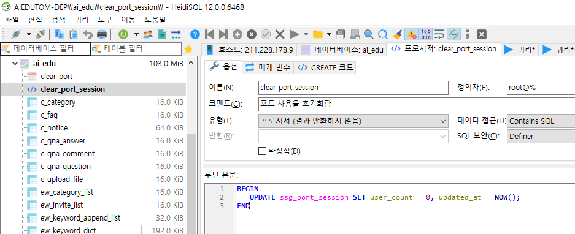

## MySQL Event 생성

- MySQL이 Event를 이용한다면 원하는 시각에 특정 쿼리를 실행시킬 수 있음
- 아래의 예제를 응용하여 원하는 동작을 구현해보자.
    
    [MySQL 프로시저 생성 (테이블 백업) 및 이벤트 스케쥴러 등록,삭제](https://shlee0882.tistory.com/252)
    

### 1. **MySQL 프로시저 생성 및 호출**

    1) HeidiSQL로 DB 접속 > 왼쪽 메뉴에서 DB 우클릭 > [새로 생성] > [저장 프로시저] 클릭

    2) clear_port_session 프로시저 만들기

```sql
# 프로시저 이름: clear_port_session
BEGIN
	UPDATE ssg_port_session SET user_count = 0, updated_at = NOW();
END
```



    3) 프로시저 호출

```sql
call clear_port_session()
```

### 2. **이벤트 스케쥴러 ON**

```sql
SHOW VARIABLES LIKE 'event%';
SET GLOBAL event_scheduler = ON ;
```

### 3. **이벤트 만들기**

```sql
# 매일 반복해서 실행
# clear_port라는 EVENT를 2022-09-15 04:00:00부터 하루 간격으로 실행
CREATE EVENT clear_port  # EVENT 이름: clear_port
ON SCHEDULE
EVERY 1 DAY  # 매일 실행
STARTS '2022-09-15 04:00:00'  
DO CALL clear_port_session();
```

### 4. **이벤트 조회 및 삭제**

```sql
SELECT * FROM information_schema.`EVENTS`;  # 이벤트 조회
DROP EVENT IF EXISTS clear_port;  # 이벤트 삭제
```


## MySQL Connection 관련

Connection 상태 확인하기

```bash
SHOW FULL PROCESSLIST;
```

Connection 수 확인하기

```bash
SHOW STATUS LIKE 'Threads_connected';
```

동작중인 Connection 수 확인하기

```bash
SHOW STATUS LIKE 'Threads_running';
```

Too Many Connection 실시간(online) 적용

```bash
set global max_connections=500;
```

[MySQL max_connections 설정](https://zetawiki.com/wiki/MySQL_max_connections_%EC%84%A4%EC%A0%95)


## Character Set

- 'utf8'은 전체 유니코드를 지원하지 않으며, 한 글자에 최대 3바이트를 할당
- 이모지를 저장하고자 한다면 utf8mb4를 사용해야 함
- Collation: 문자열을 비교 및 정렬하는 규칙

|Collation|설명|예시|
|:---:|:---:|:---:|
| utf8mb4_bin | 바이트 순서대로 정렬 | A < B < a < b |
| utf8mb4_general_ci | Case Insensitive, 대소문자 구분 없이 비교 및 정렬 | A = a < B = b |
| utf8mb4_unicode_ci | general에 더해 유럽쪽 문자 비교 로직이 추가됨 | ß == ss
| utf8mb4_0900_ai_ci | MySQL8 디폴트 값 | 0900: 유니코드 collation algorithm 9.0.0을 의미<br>Accent <br>Insensitive : 외국어에서 사용하는 악센트 기호가 있을 때 구분 없이 동일한 글자로 취급<br>Case Insensitive : 대소문자 구분 없음<br>"가" 와 "ㄱㅏ"를 동일한 문자열로 취급함