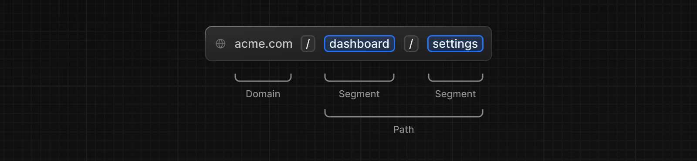
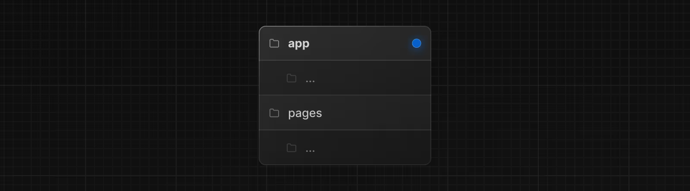
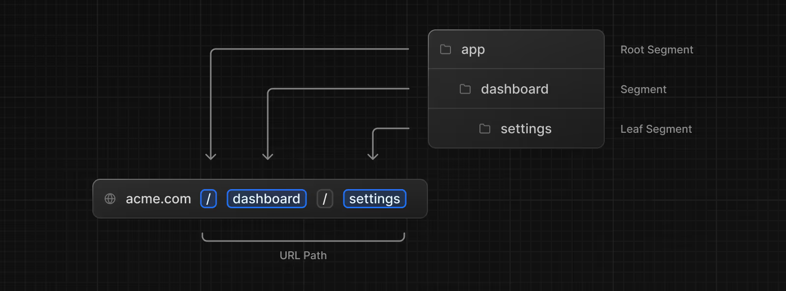
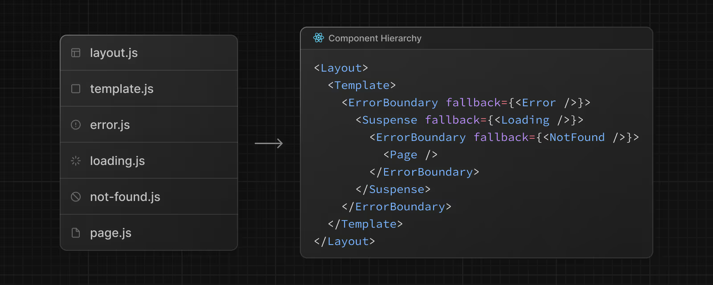
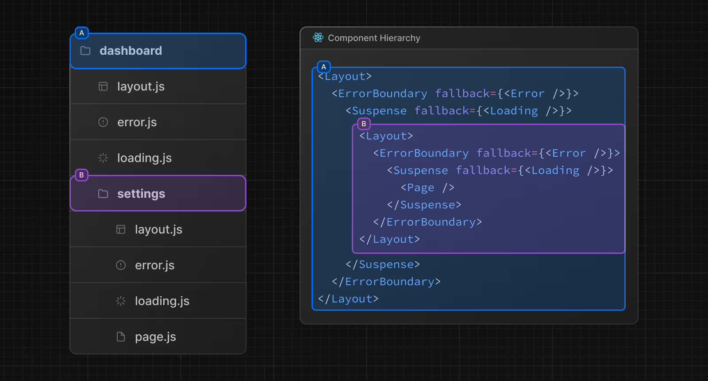
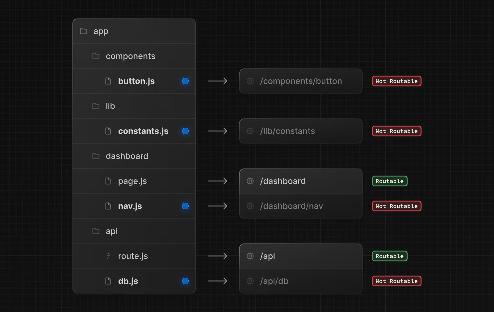

URL Segment: Part of the URL path delimited by slashes.
URL Path: Part of the URL that comes after the domain (composed of segments).

## File Conventions

layout	Shared UI for a segment and its children
page	Unique UI of a route and make routes publicly accessible
loading	Loading UI for a segment and its children
not-found	Not found UI for a segment and its children
error	Error UI for a segment and its children
global-error	Global Error UI
route	Server-side API endpoint
template	Specialized re-rendered Layout UI
default	Fallback UI for Parallel Routes

## Component Hierarchy

## Colocation