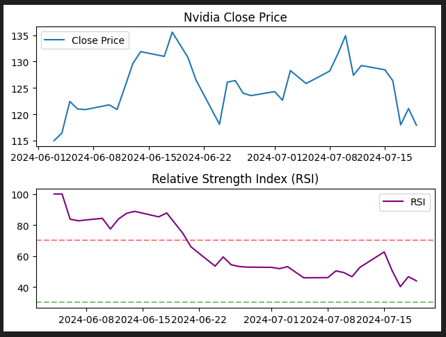

# 상대강도지수란?
- 상대강도지수(Relative Strength Index, RSI)는 기술적 분석에서 주로 사용되는 모멘텀 지표 중 하나로, 주식, 상품, 통화 등 다양한 금융 상품의 가격 움직임의 강도와 속도를 측정하여 과매수 및 과매도 상태를 판단하는 데 사용됩니다. RSI는 J. Welles Wilder Jr.가 개발했으며, 일반적으로 0에서 100 사이의 값을 가지는 지표입니다.

### RSI의 주요 개념
- 과매수와 과매도:
    - 과매수 (Overbought): RSI 값이 70 이상일 때, 시장이 과매수 상태에 있다고 간주됩니다. 이는 가격이 단기간에 너무 많이 상승했음을 의미하며, 조정이나 하락의 가능성이 높아질 수 있습니다.
    - 과매도 (Oversold): RSI 값이 30 이하일 때, 시장이 과매도 상태에 있다고 간주됩니다. 이는 가격이 단기간에 너무 많이 하락했음을 의미하며, 반등의 가능성이 높아질 수 있습니다.

### 계산 방법:
- RSI는 특정 기간 동안(일반적으로 14일) 가격 상승 폭의 평균과 하락 폭의 평균을 비교하여 계산됩니다. 계산 과정은 다음과 같습니다.

    - **N일 동안의 평균 상승폭 (Average Gain)**과 평균 하락폭 (Average Loss)을 구합니다.
    - RS (Relative Strength): 평균 상승폭을 평균 하락폭으로 나눈 값입니다.
    - RSI 공식:


### 해석:
- 70 이상: 과매수 상태로 해석되며, 매도 시점으로 간주될 수 있습니다.
- 30 이하: 과매도 상태로 해석되며, 매수 시점으로 간주될 수 있습니다.
- 50 부근: 중립 상태로 해석되며, 시장의 방향성을 판단하기 어려운 시점입니다.

## RSI 계산할 때 2주의 주가 데이터를 사용하는 이유
- RSI를 계산할 때 사용하는 기간은 일반적으로 14일(2주)을 기본으로 합니다. 이는 J. Welles Wilder Jr.가 처음 개발할 때 제안한 표준 기간입니다. 그러나 2주의 주가 데이터는 주로 초기 RSI 계산에만 사용될 수 있으며, 안정적인 RSI 값은 얻기 어렵습니다. 보통 RSI를 정확하게 계산하고 분석하기 위해서는 최소 3~4배 이상의 기간이 필요합니다.

- 예를 들어, 14일 기간의 RSI를 계산할 때는 최소 14일간의 주가 데이터를 필요로 하지만, 초기 값을 더 안정적으로 만들기 위해 50일 이상의 데이터를 사용하는 것이 좋습니다. 14일을 기준으로 계산한 RSI 값은 초기에는 값이 불안정할 수 있기 때문에, 충분한 데이터가 있을 때 더 정확한 지표를 얻을 수 있습니다.

## 과매수 혹은 과매도일 때의 대처
- 과매수(overbought)와 과매도(oversold)는 RSI 지표를 통해 시장의 상태를 판단할 때 자주 사용되는 개념입니다. 이를 통해 투자자들은 매매 전략을 세울 수 있습니다. 과매수 및 과매도 상황에서의 대처 방법에 대해 자세히 설명해드리겠습니다.

### 과매수 상태에서의 대처
- RSI가 70 이상일 때, 시장은 과매수 상태로 간주됩니다. 이는 주가가 단기간에 과도하게 상승했음을 의미하며, 조정이나 하락 가능성이 높아질 수 있습니다.

- 매도 준비: 보유 중인 주식이 과매수 상태에 있을 경우, 일부 또는 전체를 매도하여 이익을 실현할 수 있습니다.
    - 포지션 축소: 보유 비중을 줄이거나 헤징 전략을 통해 위험을 관리할 수 있습니다.
    - 차익 실현: 단기적으로 상승한 주가에서 이익을 실현하여 현금을 확보할 수 있습니다.
    - 추가 매수 자제: 과매수 상태에서는 추가 매수를 자제하고 조정 시기를 기다리는 것이 좋습니다.
    - 기술적 지표와의 조합: 다른 기술적 지표(예: MACD, Bollinger Bands)와 조합하여 매도 시점을 더 확실히 할 수 있습니다.
    - 과매도 상태에서의 대처
    - RSI가 30 이하일 때, 시장은 과매도 상태로 간주됩니다. 이는 주가가 단기간에 과도하게 하락했음을 의미하며, 반등 가능성이 높아질 수 있습니다.
<br><br>

- 매수 준비: 주식이 과매도 상태에 있을 경우, 저점 매수의 기회로 삼아 일부 또는 전체를 매수할 수 있습니다.
    - 포지션 확대: 기존 포지션을 늘리거나 새로운 포지션을 열어 반등 시 이익을 노릴 수 있습니다.
    - 단기 매매 전략: 반등을 예상하고 단기 매매 전략을 세울 수 있습니다.
    - 손실 최소화: 기존 포지션이 있는 경우, 추가 하락 가능성을 고려하여 손절매 또는 분할 매수를 통해 손실을 최소화할 수 있습니다.
    - 기술적 지표와의 조합: 다른 기술적 지표(예: MACD, Bollinger Bands)와 조합하여 매수 시점을 더 확실히 할 수 있습니다.


```python

import yfinance as yf
import pandas as pd
import numpy as np
import matplotlib.pyplot as plt
from datetime import datetime, timedelta
from dateutil.relativedelta import relativedelta

def calculate_RSI(data, window=14):
    """
    RSI를 계산하는 함수입니다.

    Parameters:
    data (pd.Series): 주가 데이터 (종가).
    window (int): RSI 계산에 사용되는 기간 (기본값은 14).

    Returns:
    pd.Series: RSI 값이 포함된 시리즈.
    """
    # 종가의 변화량 계산
    delta = data.diff()

    # 상승과 하락을 분리
    gain = delta.where(delta > 0, 0)
    loss = -delta.where(delta < 0, 0)

    # 상승과 하락의 평균값 계산 (기본값은 이동평균)
    avg_gain = gain.rolling(window=window, min_periods=1).mean()
    avg_loss = loss.rolling(window=window, min_periods=1).mean()

    # RS (Relative Strength) 계산
    rs = avg_gain / avg_loss

    # RSI 계산
    rsi = 100 - (100 / (1 + rs))

    return rsi

def anl_rsi_graph(name, ticker):
    # 한달 기간 구하기
    now = datetime.now()
    yesterday = now - timedelta(days=1)
    beforeday = now - timedelta(days=51)
    #one_month_ago = now - relativedelta(months=1)
    #beforeday = now - relativedelta(months=1) #now - timedelta(days=30)
    
    # Apple 주가 데이터 가져오기
    data = yf.download(ticker, start=beforeday.strftime("%Y-%m-%d"), end=yesterday.strftime("%Y-%m-%d"))
    
    # 종가 데이터 가져오기
    close = data['Close']
    
    # RSI 계산
    rsi = calculate_RSI(close)
    
    # 종가 그래프
    plt.subplot(2, 1, 1)
    plt.plot(data.index, close, label='Close Price')
    plt.title(name + ' Close Price')
    plt.legend()
    
    # RSI 그래프
    plt.subplot(2, 1, 2)
    plt.plot(data.index, rsi, label='RSI', color='purple')
    plt.axhline(70, linestyle='--', alpha=0.5, color='red')
    plt.axhline(30, linestyle='--', alpha=0.5, color='green')
    plt.title('Relative Strength Index (RSI)')
    plt.legend()
    
    plt.tight_layout()
    plt.show()

```

- Apple RSI
```python
anl_rsi_graph('Apple', 'AAPL')
```


- Costco RSI
```python
anl_rsi_graph('Costco', 'COST')
```


- Netflix RSI
```python
anl_rsi_graph('Netflix', 'NFLX')
```


- Nvidia RSI
```python
anl_rsi_graph('Nvidia', 'NVDA')
```


- Micron RSI
```python
anl_rsi_graph('Micron', 'MU')
```


- Amazon RSI
```python
anl_rsi_graph('Amazon', 'AMZN')
```


- Google RSI
```python
anl_rsi_graph('Google', 'GOOG')
```


- Tesla RSI
```python
anl_rsi_graph('Tesla', 'TSLA')
```


- Vertiv Holdings RSI
```python
anl_rsi_graph('Vertiv Holdings', 'VRT')
```


- Broadcom RSI
```python
anl_rsi_graph('Broadcom', 'AVGO')
```
