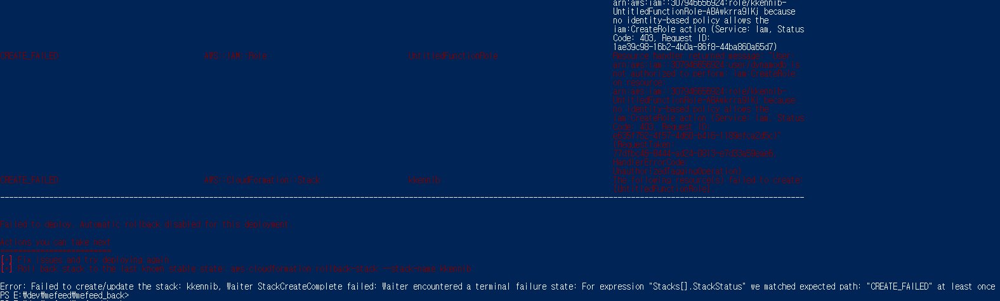

# Spring Boot 서버 AWS Lambda로 배포하기
- Spring Boot 서버를 AWS Lambda로 배포하려면 다음의 AWS 서비스에 대한 사전 사전 지식이 필요함
  - IAM, Route 53, CloudFormation, API Gateway, Lambda, S3, DynamoDB, ACM

## IAM 사용자 생성
- IAM > 사용자 > 사용자 생성 > 사용자 이름 입력: kkennib > 다음
- 직접 정책 연결 > 권한 정책 > 아래 권한 추가 > 다음 > 사용자 생성
  - AmazonAPIGatewayAdministrator
  - AmazonAPIGatewayInvokeFullAccess
  - AmazonDynamoDBFullAccess
  - AmazonS3FullAccess
  - AWSCloudFormationFullAccess
  - AWSLambda_FullAccess
  - IAMFullAccess
- 위의 권한은 테스트용이므로 더 디테일하게 넣는 것을 추천

## 액세스키 생성
- IAM > 사용자 > 사용자 선택 > 보안 자격 증명 > 액세스 키 만들기 > AWS 외부에서 실행되는 애플리케이션 > 액세스 키 메모 > 액세스 키 만들기
  - 액세스 키와 비밀 액세스 키 메모해둬야 함
  - 키가 Git에 노출되면 생성을 다시 해줘야 함

## DynamoDB 조회 앱 서버
- 다음 Repository의 앱 사용
	- https://github.com/cerulean85/kkennibhouse-back/tree/main
- Lambda 배포를 위해 필요한 파일
  - StreamLambdaHandler.java, RequestStreamHandler.java, template.yml

## AWS SAM (AWS Serveless Application Model) CLI 설치
- https://docs.aws.amazon.com/ko_kr/serverless-application-model/latest/developerguide/install-sam-cli.html

## AWS CLI 설치
- https://docs.aws.amazon.com/ko_kr/cli/latest/userguide/getting-started-install.html
- aws configure 커맨드 입력 > 액세스 키 입력

## AWS SAM으로 서버 배포
- PowerShell > template.yml가 있는 경로로 이동
- 도커 켜져 있어야 함
- 다음 명령어 차례대로 입력: 
	- sam build
    	- 배포할 앱 빌드. 성공 시 Build Succeeded 나타남
	- sam deploy --guided
    	- --guided: 처음에만 입력. deploy는 불필요
		- AWS Region 입력: 예시> ap-northeast-2
		- 이외 옵션 모두 y 해도 됨
		- 처음에는 그냥 꺼져버릴 수 있음 > sam deploy 입력

## 배포 성공시 확인할 수 있는 결과
- sam deploy 후 Successfully created/updated stack 메시지가 나타남
- CloudFormation > 스택에서 CREATE_COMPLETE 상태의 스택 확인할 수 있음
- Amazon S3 > 버킷 > 범용 버킷 > 버킷이 생성된 것을 확인할 수 있음: *.template 파일이 있음
- Lambda > 대시보드 > Lambda 함수 생성된 것을 확인할 수 있음
- Route 53 > 

## Lambda 함수에 연결할 도메인 생성
- AWS Certificate Manager > 인증서 > 인증서 요청 > 퍼블릭 인증서 요청 > 다음 > 도메인 입력 후 요청
- AWS Certificate Manager > 인증서 > 생성된 인증서 ID 클릭 > Route 53에서 레코드 생성 > 레코드 생성
  - Route 53 > 호스팅 영역 > 호스팅 영역 이름 누르면 등록한 도메인이 포함된 레코드가 나타남

## Lambda 함수에 도메인 연결
- API Gateway > API > 사용자 지정 도메인 이름 > 도메인 이름 추가
  - 도메인 이름: 앞에서 생성한 도메인 입력 > 
  - ACM 인증서: 앞에서 생성한 인증서 추가
- Route 53 > 호스팅 영역 > 도메인 이름 선택 > 레코드 생성
  - 레코드 이름: 앞에서 생성한 도메인 입력
  - 레코드 유형: A
  - 별칭: 토글 ON 후 아래 옵션 선택 후 레코드 생성
	- 트래픽 라우팅 대상
    	- 별칭: API Gateway API에 대한 별칭 선택
    	- 리전: 해당하는 리전 선택
    	- 엔드포인트: API Gateway > API > 사용자 지정 도메인 이름 > API Gateway 도메인 이름에 해당하는 엔드포인트 선택

## API 매핑
- API Gateway > API > 사용자 지정 도메인 이름 > API 매핑 구성 > 새 매핑 추가 > 다음 옵션 선택 후 저장
  - API: 생성한 API 선택
  - 스테이지: Prod나 Stage 선택

## 매핑된 도메인 테스트 예시
- 생성한 도메인(A): xxx.yyy.com
- AWS API URL(B): example.execute-api.ap-northeast-2.amazonaws.com/Prod
- 위와 같이 도메인과 URL이 매핑되었다고, 엔드포인트 test에 대해 다음의 URL로 접근 가능
  	- https://xxx.yyy.com/test
  	- https://example.execute-api.ap-northeast-2.amazonaws.com/Prod/test

## 주의사항
- 콜드 스타트로 인해 호출 간격이 길면 응답이 늦을 수 있음

## 참고		
- [[Spring / AWS] Spring Boot 3 + AWS Lambda 사용하기](https://davidy87.tistory.com/37)
- [AWS API Gateway Custom domain 설정](https://seokbin.tistory.com/entry/AWS-API-Gateway-Custom-domain-%EC%84%A4%EC%A0%95?category=678488)
- [AWS Lambda + API Gateway로 Serverless API 환경 구성하기](	https://velog.io/@seeh_h/AWS-Lambda-API-Gateway%EB%A1%9C-API-%EB%A7%8C%EB%93%A4%EA%B8%B0)		

## 메모
- sam init (확인 필요)
- 

