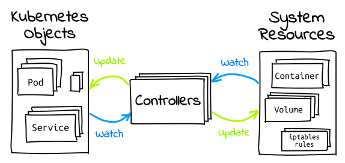
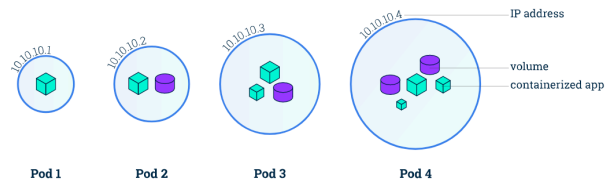

- CNCF라는 오픈소스 재단에 기부
- **오케스트레이션 시스템의 사실상 표준(De Facto Standard)**

- 컨테이너의 배포, 관리, 확장, 네트워킹을 자동화하는 기술
- 여러 머신으로 구성된 클러스터 상에서 컨테이너를 효율적으로 관리하기 위한 시스템

- Planet Scale
  - 구글에서 수 십억 개의 컨테이너를 운영할 수 있게 한 원칙 유지
  - 행성 규모로 확장할 수 있는 스케일

- Never Outgrow
  - 다양한 요구사항을 만족할 수 있는 유연함
  - 테스트용 로컬 규모부터 글로벌 서비스 규모까지 유연하게 크기 조정 가능
  - 필요한 기능이 없을 경우 CRD를 통한 기능 확장

- Run Anywhere
  - 온프레미스 / 퍼블릭 클라우드 / 하이브리드 환경 어디서나 동작
  - 대부분의 리눅스 환경에서 동작하기 때문에 환경 이동에 제약이 없음


2. 쿠버네티스 컴포넌트

쿠버네티스 클러스터
컨테이너화된 애플리케이션을 실행하는 노드인 워커 머신의 집합
모든 클러스터는 최소 한 개의 워커 노드를 가짐

워커 노드
애플리케이션의 구성요소인 파드를 호스트함
클러스터는 일반적으로 여러 노드를 실행하므로 내결함성과 고가용성을 제공

내결함성과 고가용성이란?
Google Gemini
1. 내결함성: 시스템의 일부 구성 요소에 오류가 발생하더라도 시스템 전체가 계속 작동할 수 있는 능력입니다. 장애 발생 시에도 시스템 기능의 일부 또는 전부를 유지하는 데 초점을 맞춥니다.
구현방법: 백업서버, 부하분산, 자동 재시도

2. 고가용성: 시스템이 예상치 못한 중단없이 지속적으로 사용 가능한 상태를 유지하는 능력입니다. 시스템 가동 중지 시간을 최소화하고 서비스 연속성을 보장하는 데 초점을 맞춥니다.
구현 방법
핫스태프: 시스템 장애 발생 시 즉시 작동을 이어받는 대기 서버를 유지
클러스터링: 여러 서버를 하나의 시스템처럼 작동하도록 연결하여 장애 발생 시 서비스 지속성 보장
자동 장애 전환: 장애 발생 시 자동으로 백업 시스템으로 전환하여 서비스 중단 시간 최소화

내결함성은 장애 발생 시 시스템 기능 유지에, 고가용성은 시스템 가동 중지 시간 최소화와 서비스 연속성에 초점을 맞춥니다. 내결함성은 시스템의 일부 구성 요소에 대한 개념이지만, 고가용성은 전체 시스템에 대한 개념입니다.


컨트롤 플레인
워커 노드와 클러스터 내 파드를 관리함
프로덕션 환경에서는 일반적으로 컨트롤 플레인이 여러 컴퓨터에 걸쳐 실행됨


2.1. 컨트롤 플레인 컴포넌트
컨트롤 플레인 컴포넌트는 스케쥴링과 같은 클러스터에 관한 전반적인 결정을 수행하고 클러스터 이벤트(예를 들어, 디플로이먼트의 replicas 필드에 대한 요구 조건이 충족되지 않을 경우 새로운 파드를 구동시키는 것)를 감지하고 반응함

컨트롤 플레인 컴포넌트는 클러스터 내 어떠한 머신에서든지 동작 가능
그러나 간결성을 위해 구성 스크립트는 보통 하나의 머신 안에 모든 컨트롤 플레인 컴포넌트를 구동시키고, 사용자 컨테이너는 다른 머신에서 동작시킴

2.1.1. kube-apiserver
API 서버는 쿠버네티스 API를 노출하는 쿠버네티스 컨트롤 플레인 컴포넌트
쿠버네티스 컨트롤 플레인의 프론트-엔드

쿠버네티스 API 서버의 주요 구현은 수평으로 확장되도록 디자인된 kube-apiserver임
더 많은 인스턴스를 배포해서 확장할 수 있으며, 여러 kube-apiserver 인스턴스를 실행하고 인스턴스 간 트래픽을 균형있게 조절할 수 있음

2.1.2. etcd
모든 클러스터 데이터를 담는 쿠버네티스 뒷단의 저장소
일관성과 고가용성이 높은 키-값 저장소
데이터 백업 계획 필수

2.1.3. kube-scheduler
노드가 배정되지 않은 새롭게 생성된 파드를 감지하고, 실행할 노드를 선택하는 컨트롤 플레인 컴포넌트
스케쥴링 결정 고려 요소
리소스에 대한 개별 및 총체적 요구사항
하드웨어/소프트웨어/정책적 제약
어피니티(affinity) 및 안티-어피니티(anti-affinity) 명세
데이터 지역성
워크로드 간 간섭
데드라인


어피니티에 대해 조사하기


2.1.4. kube-controller-manager
컨트롤러 프로세스를 실행하는 컨트롤 플레인 컴포넌트
논리적으로 각 컨트롤러는 분리된 프로세스이지만 복잡성을 낮추기 위해 모두 단일 바이너리로 컴파일되고 단일 프로세스 내에서 실행됨
이들 컨트롤러는 다음을 포함
노드 컨트롤러: 노드가 다운되었을 때 통지와 대응에 관한 책임을 가짐
잡 컨트롤러: 일회성 작업을 나타내는 잡 오브젝트를 감시한 다음, 해당 작업을 완료할 때까지 동작하는 파드를 생성함
엔드포인트슬라이스 컨트롤러: (서비스와 파드 사이의 연결고리를 제공하기 위해) 엔드포인트슬라이스(EndpointSlice) 오브젝트를 채움
서비스어카운트 컨트롤러: 새로운 네임스페이스에 대한 기본 서비스어카운트(ServiceAccount)를 생성함

https://kubernetes.io/ko/docs/concepts/overview/components/


2.1.5. cloud-controller-manager
클라우드별 컨트롤 로직을 포함하는 쿠버네티스 컨트롤 플레인 컴포넌트
클라우드 컨트롤 매니저를 통해 클러스터를 클라우드 공급자의 API에 연결
해당 클라우드 플랫폼과 상호 작용하는 컴포넌트와 클러스터와만 상호 작용하는 컴포넌트를 구분할 수 있게 해줌
클라우드 제공자 전용 컨트롤러만 실행
kube-controller-manager와 마찬가지로 논리적으로 독립적인 여러 컨트롤 루프를 단일 프로세스로 실행하는 단일 바이너리로 결합
수평으로 확장하여 성능을 향상시키거나 장애를 견딜 수 있음

2.2. 노드 컴포넌트
동작 중인 파드를 유지시키고 쿠버네티스 런타임 환경을 제공하며, 모든 노드 상에서 동작

2.2.1. kublet
클러스터 각 노드에서 실행되는 에이전트
파드에서 컨테이너가 확실하게 동작하도록 관리
다양한 메커니즘을 통해 제공된 파드 스펙의 집합을 받아 컨테이너가 해당 파드 스펙에 따라 건강하게 동작하는 것을 확실히 함
쿠버네티스를 통해 생성되지 않는 컨테이너는 관리하지 않음

2.2.2. kube-proxy
클러스터 각 노드에서 실행되는 네트워크 프록시
노드의 네트워크 규칙을 유지 관리
네트웤 규칙이 내부 네트워크 세션이나 클러스터 바깥에서 파드로 네트워크 통신을 할 수 있도록 해줌


# 설치
- [설치 공식 문서](https://kubernetes.io/docs/tasks/tools/install-kubectl-linux/#install-using-native-package-management)를 보고 설치할 것

# API 리소스와 오브젝트

<p align="center">

</p>

```sh
# 현재 쿠버네티스 클러스터가 지원하는 API 리소스 목록 출력
kubectl api-resources

# 특정 API 리소스에 대해 간단한 설명 확인
kubectl explain pod
```
## API 리소스
- 쿠버네티스가 관리할 수 있는 오브젝트으 ㅣ종류
- Pod, Service, ConfigMap, Secret
- Node, ServiceAccount, Role
### 매니페스트 파일
- 쿠버네티스는 오브젝트를 YAML 기반 매니페스트 파일로 관리
  - apiVersion: 오브젝트가 속한 API버전
  - kind: 오브젝트의 API 리소스 종류
  - metadata: 오브젝트 식별 정보(이름, 네임스페이스, 레이블 등)
  - spec: 오브젝트가 가지는 데이터
  - **API 리소스에 따라 spec 대신 data, rules, subjects 등 다른 속성 사용**
```yaml
apiVersion: v1
kind: pod
metadata:
  name: nginx
  labels:
    app: "nginx"
    type: "web"
  annotations:
    my-annotation1: "hello"
    my-annotation2: "fastcampus"
spec:
  containers:
  - name: nginx
    image: nginx:latest
    ports:
    - name: http
      containerPort: 80
```
### Labels와 Annotations
- 모든 쿠버네티스 오브젝트는 Labels와 Annotations 메타데이터를 가짐
- 둘 모두 문자열(String) 형식의 Key-Value 데이터를 기록
- Labels
  - 오브젝트를 식별하기 위한 목적
  - 검색 / 분류 / 필터링 등의 목적으로 사용
  - 쿠버네티스 내부 여러 기능에서 Label Selector 기능 제공
- Annotations
  - 식별이 아닌 다른 목적으로 사용
  - 보통 쿠버네티스의 애드온이 해당 오브젝트를 어떻게 처리할 지 결정하기 위한 설정 용도로 사용
## 오브젝트
- API 리소스를 인스턴스화 한 것

## kubectl 사용
### 명령형과 선언형
- 명령형(Imperative)
  - 수행하고자 하는 액션을 지시
  - 적은 리소스에 대해 빠르게 처리 가능
  - 여러 명령어를 알아야 함
- 선언형(Declarative)
  - 도달하고자 하는 상태(Desired State)를 선언
  - 코드로 관리 가능 → GitOps 활용 가능
    - 변경사항에 대한 감사(Audit) 용이
    - 코드리뷰를 통한 협업
  - 멱등성 보장(apply)
  - 많은 리소스에 대해 매니페스트 관리 방법에 따라 빠르게 처리 가능
  - 알아야 할 명령어 수가 적음
### kubectl 명령형 명령어
```bash
# ubuntu:focal 이미지로 ubuntu 파드 생성
kubectl run -i -t ubuntu --image=ubuntu:focal bash

#grafana Deployment 오브젝트에 대해 NodePort 타입의 Service 오브젝트 생성 (노드에 포트 개방)
kubectl expose deployment grafana --type=NodePort --port=80 --target-port=3000

#front-end Deployment의 www 컨테이너 이미지를 image:v2로 변경
kubectl set image deployment/frontend www=image:v2

#front-end Deployment를 리비전 2로 롤백
kubectl rollout undo deployment/frontend --to=revision=2
```
### kubectl 선언형 명령어
```bash
# deployment.yaml에 정의된 쿠버네티스 오브젝트 클러스터에 반영
kubectl apply -f deployment.yaml

# deployment.yaml에 정의된 쿠버네티스 오브젝트 제거
kubectl delete -f deployment.yaml

# 현재 디렉토리의 kustomization.yaml 파일을 쿠버네티스 오브젝트 클러스터에 반영
kubectl apply -k ./
```
## Pod
- 쿠버네티스가 컨테이너를 다루는 기본 단위
- 1개 이상의 컨테이너로 구성된 컨테이너 집합
- 동일 파드 내 컨테이너는 여러 리눅스 네임스페이스를 공유 → 네트워크 네임스페이스 공유 (동일 IP 사용)
- 사용자가 파드를 직접 관리하는 경우는 거의 없음
<p align="center">

</p>

```bash
# 파드 목록 확인
kubectl get pod

# 특정 파드 상태 확인
kubectl describe pod hello

# 특정 파드에 명령어 전달
kubectl exec -i -t hello bash

# 특정 파드 로그 확인
kubectl logs pod/hello
```