- CNCF라는 오픈소스 재단에 기부
- **오케스트레이션 시스템의 사실상 표준(De Facto Standard)**

- 컨테이너의 배포, 관리, 확장, 네트워킹을 자동화하는 기술
- 여러 머신으로 구성된 클러스터 상에서 컨테이너를 효율적으로 관리하기 위한 시스템

- Planet Scale
  - 구글에서 수 십억 개의 컨테이너를 운영할 수 있게 한 원칙 유지
  - 행성 규모로 확장할 수 있는 스케일

- Never Outgrow
  - 다양한 요구사항을 만족할 수 있는 유연함
  - 테스트용 로컬 규모부터 글로벌 서비스 규모까지 유연하게 크기 조정 가능
  - 필요한 기능이 없을 경우 CRD를 통한 기능 확장

- Run Anywhere
  - 온프레미스 / 퍼블릭 클라우드 / 하이브리드 환경 어디서나 동작
  - 대부분의 리눅스 환경에서 동작하기 때문에 환경 이동에 제약이 없음


2. 쿠버네티스 컴포넌트

쿠버네티스 클러스터
컨테이너화된 애플리케이션을 실행하는 노드인 워커 머신의 집합
모든 클러스터는 최소 한 개의 워커 노드를 가짐

워커 노드
애플리케이션의 구성요소인 파드를 호스트함
클러스터는 일반적으로 여러 노드를 실행하므로 내결함성과 고가용성을 제공

내결함성과 고가용성이란?
Google Gemini
1. 내결함성: 시스템의 일부 구성 요소에 오류가 발생하더라도 시스템 전체가 계속 작동할 수 있는 능력입니다. 장애 발생 시에도 시스템 기능의 일부 또는 전부를 유지하는 데 초점을 맞춥니다.
구현방법: 백업서버, 부하분산, 자동 재시도

2. 고가용성: 시스템이 예상치 못한 중단없이 지속적으로 사용 가능한 상태를 유지하는 능력입니다. 시스템 가동 중지 시간을 최소화하고 서비스 연속성을 보장하는 데 초점을 맞춥니다.
구현 방법
핫스태프: 시스템 장애 발생 시 즉시 작동을 이어받는 대기 서버를 유지
클러스터링: 여러 서버를 하나의 시스템처럼 작동하도록 연결하여 장애 발생 시 서비스 지속성 보장
자동 장애 전환: 장애 발생 시 자동으로 백업 시스템으로 전환하여 서비스 중단 시간 최소화

내결함성은 장애 발생 시 시스템 기능 유지에, 고가용성은 시스템 가동 중지 시간 최소화와 서비스 연속성에 초점을 맞춥니다. 내결함성은 시스템의 일부 구성 요소에 대한 개념이지만, 고가용성은 전체 시스템에 대한 개념입니다.


컨트롤 플레인
워커 노드와 클러스터 내 파드를 관리함
프로덕션 환경에서는 일반적으로 컨트롤 플레인이 여러 컴퓨터에 걸쳐 실행됨


2.1. 컨트롤 플레인 컴포넌트
컨트롤 플레인 컴포넌트는 스케쥴링과 같은 클러스터에 관한 전반적인 결정을 수행하고 클러스터 이벤트(예를 들어, 디플로이먼트의 replicas 필드에 대한 요구 조건이 충족되지 않을 경우 새로운 파드를 구동시키는 것)를 감지하고 반응함

컨트롤 플레인 컴포넌트는 클러스터 내 어떠한 머신에서든지 동작 가능
그러나 간결성을 위해 구성 스크립트는 보통 하나의 머신 안에 모든 컨트롤 플레인 컴포넌트를 구동시키고, 사용자 컨테이너는 다른 머신에서 동작시킴

2.1.1. kube-apiserver
API 서버는 쿠버네티스 API를 노출하는 쿠버네티스 컨트롤 플레인 컴포넌트
쿠버네티스 컨트롤 플레인의 프론트-엔드

쿠버네티스 API 서버의 주요 구현은 수평으로 확장되도록 디자인된 kube-apiserver임
더 많은 인스턴스를 배포해서 확장할 수 있으며, 여러 kube-apiserver 인스턴스를 실행하고 인스턴스 간 트래픽을 균형있게 조절할 수 있음

2.1.2. etcd
모든 클러스터 데이터를 담는 쿠버네티스 뒷단의 저장소
일관성과 고가용성이 높은 키-값 저장소
데이터 백업 계획 필수

2.1.3. kube-scheduler
노드가 배정되지 않은 새롭게 생성된 파드를 감지하고, 실행할 노드를 선택하는 컨트롤 플레인 컴포넌트
스케쥴링 결정 고려 요소
리소스에 대한 개별 및 총체적 요구사항
하드웨어/소프트웨어/정책적 제약
어피니티(affinity) 및 안티-어피니티(anti-affinity) 명세
데이터 지역성
워크로드 간 간섭
데드라인


어피니티에 대해 조사하기


2.1.4. kube-controller-manager
컨트롤러 프로세스를 실행하는 컨트롤 플레인 컴포넌트
논리적으로 각 컨트롤러는 분리된 프로세스이지만 복잡성을 낮추기 위해 모두 단일 바이너리로 컴파일되고 단일 프로세스 내에서 실행됨
이들 컨트롤러는 다음을 포함
노드 컨트롤러: 노드가 다운되었을 때 통지와 대응에 관한 책임을 가짐
잡 컨트롤러: 일회성 작업을 나타내는 잡 오브젝트를 감시한 다음, 해당 작업을 완료할 때까지 동작하는 파드를 생성함
엔드포인트슬라이스 컨트롤러: (서비스와 파드 사이의 연결고리를 제공하기 위해) 엔드포인트슬라이스(EndpointSlice) 오브젝트를 채움
서비스어카운트 컨트롤러: 새로운 네임스페이스에 대한 기본 서비스어카운트(ServiceAccount)를 생성함

https://kubernetes.io/ko/docs/concepts/overview/components/


2.1.5. cloud-controller-manager
클라우드별 컨트롤 로직을 포함하는 쿠버네티스 컨트롤 플레인 컴포넌트
클라우드 컨트롤 매니저를 통해 클러스터를 클라우드 공급자의 API에 연결
해당 클라우드 플랫폼과 상호 작용하는 컴포넌트와 클러스터와만 상호 작용하는 컴포넌트를 구분할 수 있게 해줌
클라우드 제공자 전용 컨트롤러만 실행
kube-controller-manager와 마찬가지로 논리적으로 독립적인 여러 컨트롤 루프를 단일 프로세스로 실행하는 단일 바이너리로 결합
수평으로 확장하여 성능을 향상시키거나 장애를 견딜 수 있음

2.2. 노드 컴포넌트
동작 중인 파드를 유지시키고 쿠버네티스 런타임 환경을 제공하며, 모든 노드 상에서 동작

2.2.1. kublet
클러스터 각 노드에서 실행되는 에이전트
파드에서 컨테이너가 확실하게 동작하도록 관리
다양한 메커니즘을 통해 제공된 파드 스펙의 집합을 받아 컨테이너가 해당 파드 스펙에 따라 건강하게 동작하는 것을 확실히 함
쿠버네티스를 통해 생성되지 않는 컨테이너는 관리하지 않음

2.2.2. kube-proxy
클러스터 각 노드에서 실행되는 네트워크 프록시
노드의 네트워크 규칙을 유지 관리
네트웤 규칙이 내부 네트워크 세션이나 클러스터 바깥에서 파드로 네트워크 통신을 할 수 있도록 해줌


# 설치
- [설치 공식 문서](https://kubernetes.io/docs/tasks/tools/install-kubectl-linux/#install-using-native-package-management)를 보고 설치할 것

# API 리소스와 오브젝트

<p align="center">

</p>

```sh
# 현재 쿠버네티스 클러스터가 지원하는 API 리소스 목록 출력
kubectl api-resources

# 특정 API 리소스에 대해 간단한 설명 확인
kubectl explain pod
```
## API 리소스
- 쿠버네티스가 관리할 수 있는 오브젝트으 ㅣ종류
- Pod, Service, ConfigMap, Secret
- Node, ServiceAccount, Role
### 매니페스트 파일
- 쿠버네티스는 오브젝트를 YAML 기반 매니페스트 파일로 관리
  - apiVersion: 오브젝트가 속한 API버전
  - kind: 오브젝트의 API 리소스 종류
  - metadata: 오브젝트 식별 정보(이름, 네임스페이스, 레이블 등)
  - spec: 오브젝트가 가지는 데이터
  - **API 리소스에 따라 spec 대신 data, rules, subjects 등 다른 속성 사용**
```yaml
apiVersion: v1
kind: pod
metadata:
  name: nginx
  labels:
    app: "nginx"
    type: "web"
  annotations:
    my-annotation1: "hello"
    my-annotation2: "fastcampus"
spec:
  containers:
  - name: nginx
    image: nginx:latest
    ports:
    - name: http
      containerPort: 80
```
### Labels와 Annotations
- 모든 쿠버네티스 오브젝트는 Labels와 Annotations 메타데이터를 가짐
- 둘 모두 문자열(String) 형식의 Key-Value 데이터를 기록
- Labels
  - 오브젝트를 식별하기 위한 목적
  - 검색 / 분류 / 필터링 등의 목적으로 사용
  - 쿠버네티스 내부 여러 기능에서 Label Selector 기능 제공
- Annotations
  - 식별이 아닌 다른 목적으로 사용
  - 보통 쿠버네티스의 애드온이 해당 오브젝트를 어떻게 처리할 지 결정하기 위한 설정 용도로 사용
## 오브젝트
- API 리소스를 인스턴스화 한 것

## kubectl 사용
### 명령형과 선언형
- 명령형(Imperative)
  - 수행하고자 하는 액션을 지시
  - 적은 리소스에 대해 빠르게 처리 가능
  - 여러 명령어를 알아야 함
- 선언형(Declarative)
  - 도달하고자 하는 상태(Desired State)를 선언
  - 코드로 관리 가능 → GitOps 활용 가능
    - 변경사항에 대한 감사(Audit) 용이
    - 코드리뷰를 통한 협업
  - 멱등성 보장(apply)
  - 많은 리소스에 대해 매니페스트 관리 방법에 따라 빠르게 처리 가능
  - 알아야 할 명령어 수가 적음
### kubectl 명령형 명령어
```bash
# ubuntu:focal 이미지로 ubuntu 파드 생성
kubectl run -i -t ubuntu --image=ubuntu:focal bash

#grafana Deployment 오브젝트에 대해 NodePort 타입의 Service 오브젝트 생성 (노드에 포트 개방)
kubectl expose deployment grafana --type=NodePort --port=80 --target-port=3000

#front-end Deployment의 www 컨테이너 이미지를 image:v2로 변경
kubectl set image deployment/frontend www=image:v2

#front-end Deployment를 리비전 2로 롤백
kubectl rollout undo deployment/frontend --to=revision=2
```
### kubectl 선언형 명령어
```bash
# deployment.yaml에 정의된 쿠버네티스 오브젝트 클러스터에 반영
kubectl apply -f deployment.yaml

# deployment.yaml에 정의된 쿠버네티스 오브젝트 제거
kubectl delete -f deployment.yaml

# 현재 디렉토리의 kustomization.yaml 파일을 쿠버네티스 오브젝트 클러스터에 반영
kubectl apply -k ./
```
## Pod
- 쿠버네티스가 컨테이너를 다루는 기본 단위
- 1개 이상의 컨테이너로 구성된 컨테이너 집합
- 동일 파드 내 컨테이너는 여러 리눅스 네임스페이스를 공유 → 네트워크 네임스페이스 공유 (동일 IP 사용)
- 사용자가 파드를 직접 관리하는 경우는 거의 없음
<p align="center">

</p>

```bash
# 파드 목록 확인
kubectl get pod

# 특정 파드 상태 확인
kubectl describe pod hello

# 특정 파드에 명령어 전달
kubectl exec -i -t hello bash

# 특정 파드 로그 확인
kubectl logs pod/hello
```

### 멀티 컨테이너 파드와 사이드카 패턴
- 동일 파드 내 컨테이너는 모두 같은 노드에서 실행(네임스페이스 공유)

### 사이드카 패턴(Side-car Pattern)
- 메인 컨테이너를 보조하는 컨테이너와 샅이 실행하는 구조
- 주요 유즈 케이스
  - Filebeat와 같은 로그 에이전트로 파드 로그 수집
  - Envoy와 같은 프록시 서버로 서비스메시 구성
  - Vault Agent와 같은 기밀 데이터 전달 목적
  - Nginx의 설정 리로드 역할 에이전트 구성
- 특정 파드 로그 확인
``` bash
kubectl logs pod/hello -c debug
```
- 특정 파드에 명령어 전달
``` bash
kubectl exec -i -t hello -c debug bash
```

## ReplicaSet
- 정해진 수의 파드가 항상 실행될 수 있도록 관리
- 기존 실행중이던 파드에 문제가 생기면 파드를 다시 스케줄링
- ReplicationController의 신규 버전
- 파드와 마찬가지로 직접 관리한느 경우는 거의 없음
<p align="center">
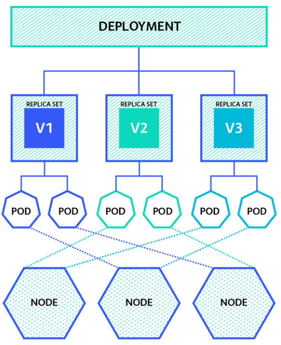
</p>

- 동작원리
  - ReplicaSet Controller가 Control Plane에 존재
  - spec.selector에 대응되는 파드의 수가 spec.replicas와 동일한지 지속적으로 검사하고, 다를 경우 스케일 아웃 혹은 인 진행
  - 레이블 셀렉터(Label Selector)
    - 쿠버네티스 오브젝트는 모두 metadata.labels에 Key-Value 형태의 레이블 값을 가짐
    - 특정 오브젝트 목록을 필터링 하기 위한 기능이 Label Selector
    - matchLabels와 matchExpressions 옵션 제공
    - 많은 쿠버네티스 API리소스가 Label Selector을 통해 기능을 제공
    → 리소스 간 느슨한 결합 유지

```yaml
apiVersion: apps/v1
kind: ReplicaSet
metadata:
  name: web
  labels:
    env: dev
    role: web
spec:
  replicas: 4
  selector:
    matchLabels:
      role: web      
```
```yaml
selector:
  matchLabels:
    component: redis
  matchExpressions:
    - {key: tier, operator: In, values: [cache]}
    - [key: environment, operator: NotIn, values: [dev]]
```

## Deployment
- 파드의 이미지 버전이 갱신될 때 배포 전략을 설정
- 디플로이먼트 오브젝트를 생성하면 대응되는 ReplicaSet과 Pod 자동 생성
- 기본적으로 Recreate 전략과 RollingUpdate 전략 지원
- 사용자는 특수한 목적이 아니라면 파드와 레플리카셋이 아닌 디플로이먼트로 워크로드 관리

### 배포전략
- 재생성(Recreate)
  - 기존 레플리카셋의 파드를 모두 종류 후 새 레플리카엣의 파드를 새로 생성

- 롤링 업데이트(Rolling Update)
  - 세부 설정에 따라 기존 레플리카셋에서 새 레플리카셋으로 점진적으로 이동
    - maxSurge: 업데이트 과정에 spec.replicas 수 기준 최대 새로 추가되는 파드 수
    - maxUnavailable: 업데이트 과정에 spec.replicas 수 기준 최대 이용 불가능 파드 수

## 서비스
- 여러 파드에 대해 클러스터 내에서 사용 가능한 고유 도메인 부여
- 여러 파드에 대한 요청을 분산하는 로드 밸런서 기능 수행
- 파드의 IP는 항상 변할 수 있음
- 일반적으로 ClusterIP 타입의 Service와 함께 Ingress를 사용하여 외부 트래픽을 처리
<p align="center">
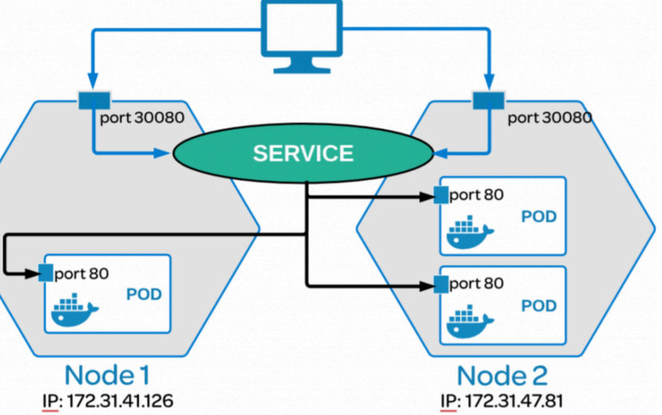
</p>

### ClusterIP와 서비스 디스커버리
- ClusterIP
  - Service API 리소스의 가장 기본적인 타입
  - 쿠버네티스 클러스터는 Pod에 부여되는 Pod IP를 위한 CIDR 대역과 Service에 부여되는 CLuster IP CIDR 대역이 독립적으로 존재
  - Label Selector를 통해 서비스와 연결할 파드 목록 관리
  - Cluster IP로 들어오는 요청에 대하여 파드에 L4 레벨의 로드밸런싱
  - Cluster IP 뿐만 아니라 내부 DNS를 통해 서비스 이름을 이용한 통신 가능
- ClusterIP 타입의 Service는 쿠버네티스 클러스터 내부 통신 목적으로만 사용 가능
- 서비스의 Cluster IP CIDR 대역 확인
```bash
kubectl cluster-info dump | grep -m 1 service-cluster-ip-range
```
<p align="center">
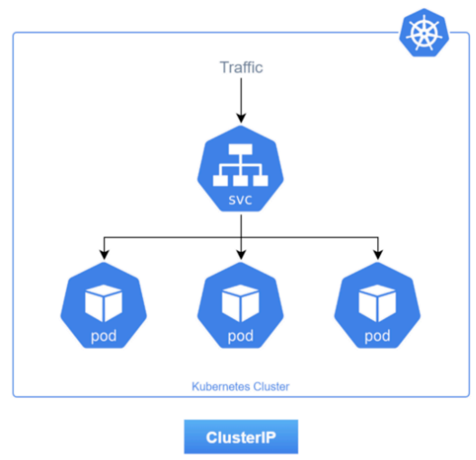
</p>

### NodePort로 외부에 노출하기
- NodePort
  - 모든 쿠버네티스 노드의 동일 포트를 개방하여 서비스에 접근하는 방식
  - NodePort는 ClusterIP 타입 서비스를 한 번 더 감싸서 만들어진 것
    - NodePort 서비스도 ClusterIP 사용 가능
    - NodePort로 들어온 요청은 실제로 ClusterIP로 전달되어 Pod로 포워딩

<p align="center">
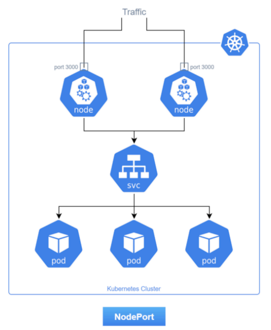
</p>


### LoadBalancer로 클라우드 프로바이더의 로드밸런서 연동
- LoadBalancer
  - 클라우드 프로바이더에서 제공하는 로드밸런서를 동적으로 생성하는 방식
  - LoadBalancer 타입 서비스는 NodePort 타입 서비스를 한 번 더 감싸서 만들어진 것
  - LoadBalancer 서비스도 ClusterIP 사용 가능
  - LoadBalancer 서비스를 통해 만들어진 로드밸런서는 NodePort를 타겟 그룹으로 생성
  - NodePort로 들어온 요청은 실제로 ClusterIP로 전달되어 Pod로 포워딩
  - AWS/GCP 등과 같은 클라우드 환경이 아니라면 기본적으로는 해당 기능 이용 불가
  - MetalLB와 같은 기술 등을 사용하여 온프레미스 환경에서도 LoadBalancer 타입 사용 가능

<p align="center">
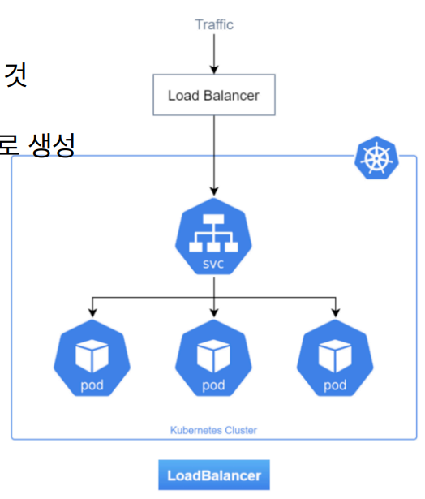
</p>

### ExternalName로 외부로 요청 전달
- ExternalName
  - 서비스가 파드를 가리키는 것이 아닌 외부 도메인을 가리키도록 구성
  - DNS의 CNAME 레코드와 동일한 역할 수행
  - 클러스터의 외부에 존재하는 레거시 시스템을 쿠버네티스로 마이그레이션하는 과정에 활용 가능
  - ExternalName 타입의 서비스는 앞서 다룬 세 서비스 타입과 비교해 많이 사용되지는 않음

<p align="center">
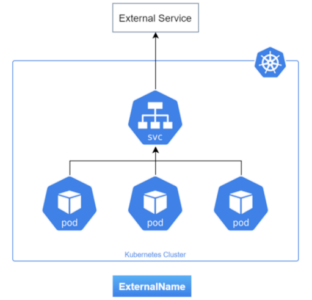
</p>

## ConfigMap
- 설정 정보를 환경변수 혹은 볼륨의 형태로 파드에 전달하기 위한 목적으로 사용
- 파드에서 직접 환경변수를 관리하지 않고 ConfigMap을 분리하여 목적에 따라 설정 데이터를 다르게 주입 가능
<p align="center">
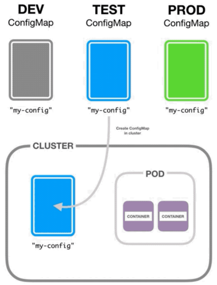
</p>

### kubectl ConfigMap 생성 명령어
- my-config 이름의 ConfigMap 생성
```bash
kubectl create configmap my-config
```
- my-config 이름의 ConfigMap 생성 - 로컬의 config.yaml 파일을 config.yaml을 키로 저장
```bash
kubectl create configmap my-config --from-file config.yaml
```
- my-config 이름의 ConfigMap 생성 - 로컬의 config.yaml 파일을 config을 키로 저장
```bash
kubectl create configmap my-config --from-file config=config.yaml
```
- my-config 이름의 ConfigMap YAML 출력 - 로컬의 config.yaml 파일을 config을 키로 저장
```bash
kubectl create configmap my-config --from-file config=config.yaml -dry-run -o yaml
```

## Secret
- 패스워드, API Key, SSH Key 등 민감한 정보를 컨테이너에 주입할 때 사용
- 컨피그맵과 사용법 비슷
- 사용 목적에 따라 몇 가지 종류로 나뉨
- 쿠버네티스는 기본적으로 시크릿 값을 저장할 때 Base64 인코딩
<p align="center">
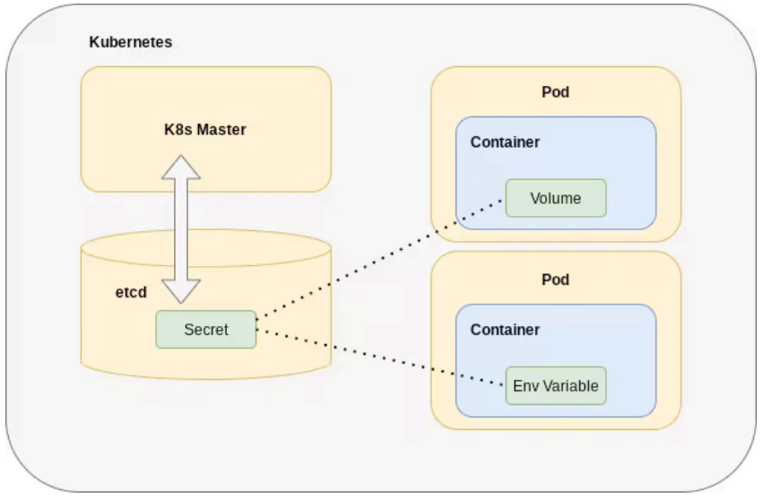
</p>

### 종류
- Opaque(generic): 일반적인 용ㄷ의 시크릿
- dockerconfigjson: 도커 이미지 저장소 인증 정보
- tls: TLS 인증서 정보
- service-account-token: ServiceAccount의 인증정보
- my-secret이름의 generic 타입 Secret 생성
```bash
kubectl create secret generic my-secret
```
- my-secret이름의 generic 타입 Secret 생성: 로컬의 secret.yaml 파일을 secret.yaml을 키로 저장
```bash
kubectl create secret generic my-secret --from-file secret.yaml
```
- my-secret이름의 generic 타입 Secret 생성: 로컬의 secret.yaml 파일을 secret을 키로 저장
```bash
kubectl create secret generic my-secret --from-file secret=secret.yaml
```
- my-secret이름의 generic 타입 Secret YAML 출력: 로컬의 secret.yaml 파일을 secret을 키로 저장
```bash
kubectl create secret generic my-secret --from-file secret=secret.yaml --dry-run -o yaml
```
### 선언적 관리
- Git과 같은 버전관리시스템에서 관라하기에 기밀 정보가 담겨 있어 부적절
- External Secrets
  - HashiCorp Vault, AWS Secrets Manager 등과 통합
  - ExternalSecret 오브젝트를 생성하면 컨트롤러가 프로바이더로부터 기밀값을 가져와 Secret 오브젝트 생성
- Sealed Secrets
  - 쿠버네티스 클러스터 상에 컨트롤러 실행
  - 클러스터 상에 암호화 키 보관
  - kubeseal CLI가 컨트롤러가 통신하며 데이터 암호화
  - SealedSecret 오브젝트를 생성하면 컨트롤러가 복호화하여 Secret 오브젝트 생성

## Namespace
- 쿠버네티스상의 API 오브젝트들을 논리적으로 구분하여 관리
- 해당 논리적인 그룹에 대하여 권한 관리, CPU&Memory 등 리소스 제한
- 리소스를 논리적으로 나누기 위한 방법 제공(논리적 그룹)
- 네임스페이스의 단위는 사용자 목적에 맞추어 결정
  - 팀 단위, 환경 단위, 서비스 단위

<p align="center">
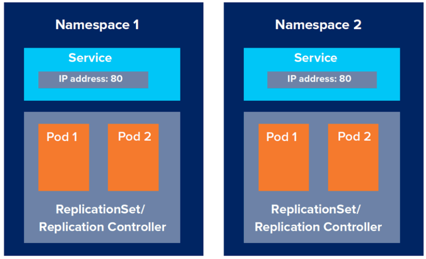
</p>

### 클러스터 범위 API 리소스와 네임스페이스 범위 API 리소스
- 네임스페이스 범위 API 리소스(Namespace-scoped API Resources)
  - Pod, Deployment, Service, Ingress, Secret, ConfigMap, ServiceAccount, Role, RoleBinding 등
```bash
kubectl api-resources --namespaced=true
```
- 클러스터 범위 API 리소스(Cluster-scoped API Resources)
  - Node, Namespace, IngressClass, PriorityClass, ClusterRole, ClusterRoleBinding 등
```bash
kubectl api-resources --namespaced=false
```

### 클러스터 기본 네임스페이스
- 쿠버네티스 클러스터를 생성하고 나면 기본적으로 만들어져 있는 네임스페이스
  - default: 네임스페이스를 지정하지 않은 경우 기본적으로 할당되는 네임스페이스
  - kube-system: 쿠버네티스 시스템에 의해 생성되는 API 오브젝트들을 관리하기 위한 네임스페이스
  - kube-public: 클러스터 내 모든 사요자로부터 접근 가능하고 읽을 수 있는 오브젝트들을 관리하기 위한 네임스페이스
  - kube-node-lease: 쿠버네티스 클러스터 내 노드의 연결 정보를 관리하기 위한 네임스페이스

### 다른 네임스페이스의 서비스 접근하기
- 서로 다른 서비스가 통신하기 위해서는 서비스명으로는 충분하지 않음
- FQDN(Fully Qualified Domain Name)과 Domain Search 옵션
```bash
curl ${service}.${namespace}.svc.cluster.local
curl ${service}.${namespace}.svc
curl ${service}.${namespace}
curl ${service}
```
### RecourceQuota와 LimiRange
- 네임스페이스 단위의 자원 사용량 관리할 수 있는 기능 제공

- ResourceQuota
  - 네임스페이스에서 사용할 수 있는 자원 사용량의 합을 제한
    - 할당할 수 있는 자원(CPU, Memory, Volume 등)의 총합 제한
    - 생성할 수 있는 리소스(Pod, Service, Deployment 등)의 개수 제한

- LimitRange
  - 파드 혹은 컨테이너에 대하여 자원 기본 할당량 설정, 혹은 최대/최소 할당량 설정

## 잡
- 지속적으로 실행되는 서비스가 아니라 특정 작업을 수행하고 종료해야 하는 경우 사용
- 특정 동작을 수행하고 종료하는 작업을 정의하기 위한 리소스
- 내부적으로 파드를 생성하여 작업 수행
- Pod의 상태가 Running이 아닌 COmpleted가 되는 것이 최종 상태
- 실패시 재시작 옵션, 작업 수행 회수, 동시 실행 수 등 세부 옵션 제공

### 크론잡
- 주기적으로 특정 작업을 수행하고 종료해야 하는 경우 사용
- 주기적으로 특정 동작을 수행하고 종료하는 작업을 저의하기 위한 리소스
- 리눅스의 크론 스케줄링 방법을 그대로 사용
- 내부적으로 잡을 생성하여 작업 수행
- 주기적으로 데이터를 백업하거나 데이터 점검 및 알림 전송 등의 목적으로 사용

## DaemonSet
- 각 노드마다 꼭 실행되어야 하는 워크로드(로그 수집, 메트릭 수집, 네트워크 구성)를 위해 사용
- 클러스터 상의 모든 노드에 동일한 파드를 하나씩 생성
- 로그 수집/메트릭 수집/네트워크 구성 등의 목적으로 많이 사용
  - 로그 수집: filebeat / fluentbit 등
  - 메트릭 수집: node-exporter / metricbeat / telegraf 등
  - 네트워크 구성: kube-proxy / calico 등
- Deployment와 마찬가지로 Label Selector 기반으로 동작
- nodeSelector / Affinity / Toleration 등을 통해 실행되어야 할 노드 목록 필터링 가능

<p align="center">
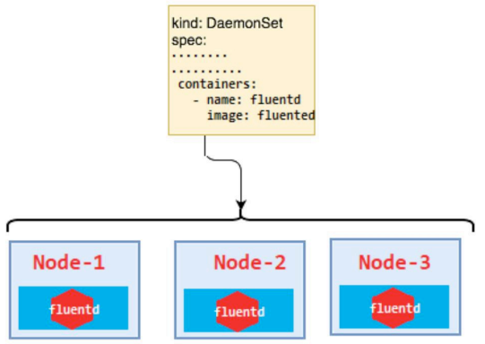
</p>


## Ingress
- 외부 요청을 받아 L7에서 어떻게 처리할 것인지 결정
- 라우팅 기능 수행 (Host, Path 단위로 라우팅 가능)
- SSL/TLS 통신 암호화 처리: 각 연결 호스트에 대해 인증서 적용
<p align="center">
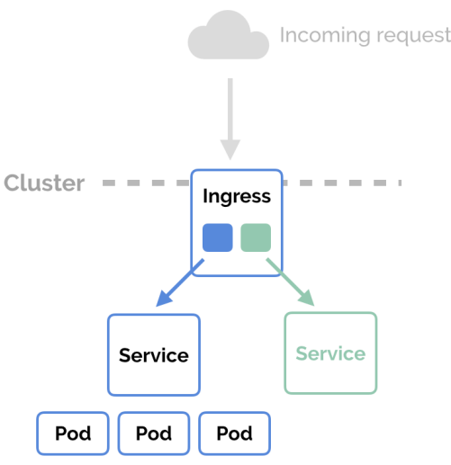
</p>

### 인그레스 컨트롤러
- 쿠버네티스 클러스터는 기본적으로 Ingress API 리소스를 다루는 Ingress Controller를 제공하지 않음
- Ingress API 리소스에 대한 스펙만 제공 → 사용자 직접 Ingress Controller 설치 필요
- 대표적인 Ingress Controller
  - NGINX Ingress Controller
  - Kong Ingress Controller
  - AWS Load Balancer Controller
  - Google Load Balancer Controller
- 인그레스 클래스
  - 하나의 클러스터에서 여러 인그레스 컨트롤러를 사용할 수 있도록 하기 위해 만들어진 리소스
    - IngressClass = IngressController + Configuration
- 인그레스
  - 라우팅 규칙 및 TSL 설정 정의
  - 하나의 인그레스 클래스와 연결
- NGINX 웹 서버 기반 Ingress Controller
<p align="center">
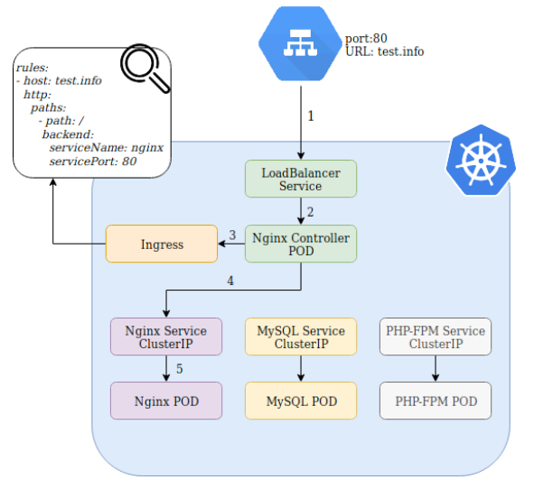
</p>

- AWS Load Balancer Controller
  - AWS에서 관리하는 오픈소스 컨트롤러로 다음 기능 제공
    - AWS ALB(Application Load Balancer) 기반의 Ingress Controller
    - AWS NLB(Network Load Balancer) 기반의 Load Balancer 타입 Service
<p align="center">
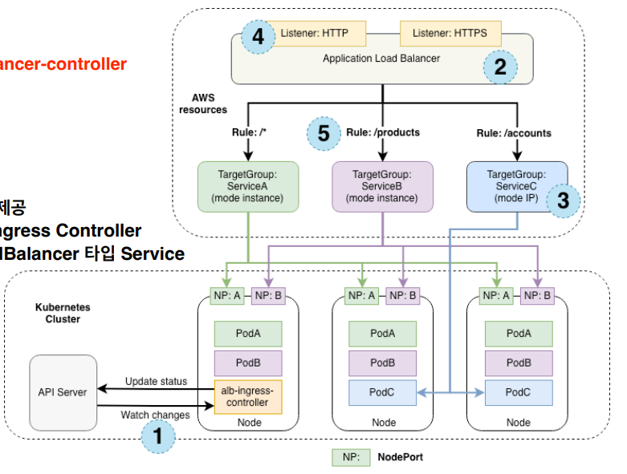
</p>

# 파드 배치 전략
## Node Selector
### minikube로 멀티 노드 클러스터 구성
- minikube는 멀티 노드 클러스터 지원
``` bash
# 기존 minikube 클러스터 제거
# 싱글 노드로 생성된 minikube 클러스터는 기본적으로 CNI를 설치 하지 않으므로,
# 재구성이 간단
minikube delete

# 노드 3개로 구성된 minikube 클러스터 구성(docker driver 이용)
minikube start --nodes 3 --driver=docker
```
### nodeName을 이용한 배치
- 매니페스트의 재활용성이 떨어지며, 노드와 강결합되므로 추천되지 않음
- 노드 이름 기반으로 파드가 배치될 노드 결정
```yaml
spec:
  containers:
  - name: nginx
    image: nginxdemos/hello:plain-text
    ports:
    - name: http
      containerPort: 80
      protocol: TCP
  nodeName: minikube
```
- 노드도 쿠버네티스 API 오브젝트로 관리되기 때문에 Labels를 가지고 있음
- 노드에 설정된 Label 기반으로 하여 Label Selector 기반 파드 배치 가능
```yaml
spec:
  containers:
  - name: nginx
    image: nginxdemos/hello:plain-text
    ports:
    - name: http
      containerPort: 80
      protocol: TCP
  nodeSelector: 
    team: red
```
### 노드 Label 관리
- 노드를 새로 구성할 때 kubelet 옵션을 통해 기본 Labels 설정도 가능
- kubectl을 통해 노드의 label 관리 가능
```bash
# minikube-m02 노드에 team=key Label 추가
kubectl label node minikube-m02 team=red

#minikube-m02 노드에 team Label 제거
kubectl label node minikube-m02 team-
```

## Affinity
### nodeAffinity을 이용한 배치
- 선호하는 노드를 설정하는 방법으로, nodeSelector 보다 확장된 Label Selector 기능 지원
  - matchExpressions 사용 가능(In, NotIn, Exists, DoesNotExist, Gt, Lt 등)
- 여러 유스케이스에 활용 가능한 다양한 옵션 제공
  - 반드시 충족해야 하는 조건(Hard)
    - requiredDuringSchedulingIgnoredDuringExecution
  - 선호하는 조건(Soft)
    - preferredDuringSchedulingIgnoredDuringExecution
```yaml
sepc:
  containers:
  - name: nginx
    image: nginxdemos/hello:plain-text
    ports:
    - name: http
      containerPort: 80
      protocol: TCP
  affinity:
    nodeAffinity:
      requiredDuringSchedulingIgnoredDuringExecution:
        nodeSelectorTerms:
        - matchExpressions:
          - key: team
            operator: In
            values:
            - blue
            - red
```
- IgnoredDuringExecution=> 실행중인 워크로드에 대해 해당 규칙을 무시

### podAffinity을 이용한 배치
- 선호하는 파드를 설정하는 방법으로, 사용법은 nodeAffinity와 거의 동일
- 여러 유스케이스에 활용 가능한 다양한 옵션 제공
  - 반드시 충족해야 하는 조건(Hard)
    - requiredDuringSchedulingIgnoredDuringExecution
  - 선호하는 조건(Soft)
    - preferredDuringSchedulingIgnoredDuringExecution
``` yaml
spec:
  containers:
  - name: nginx
    image: nginxdemos/hello:plain-text
    ports:
    - name: http
      containerPort: 80
      protocol: TCP
    affinity:
      podAffinity:
        requiredDuringSchedulingIgnoredDuringExecution:
        - labelSelector:
            matchExpressions:
            - key: app
              operator: In
              values:
              - mysql
          topologyKey: kubernetes.io/hostname
```
- 토폴로지 키(Topology Key)
  - Label Selector를 수행할 노드의 범위를 결정
  - 노드 단위: kubernetes.io/hostname
  - 존 단위: topology.kubernetes.io/zone
  - 리전 단위: topology.kubernetes.io/region

- 선호하지 않는 파드를 설정하는 방법은, ```podAffinity```를 ```podAntiAffinity```로만 변경하면 사용법 동일

## Taint와 Toleration
### Taint(얼룩)
- 노드에 설정. 노드에 Taint를 설정하여 임의의 파드가 할당되는 것을 방지
### Toleration(용인)
- 파드에 설정. 특정 Taint를 용인할 수 있는 Toleration 설정을 가진 파드는 해당 노드에 할당 가능
<p align="center">
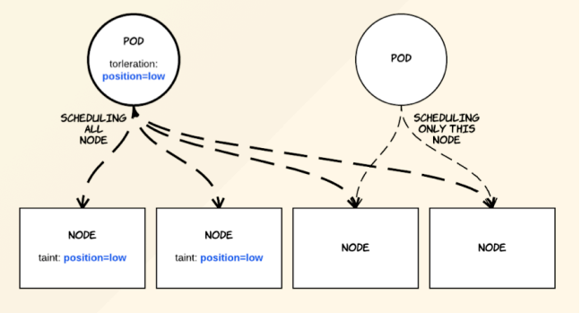
</p>


### 노드 Taint 관리
- 노드를 새로 구성할 때 kubelet 옵션을 통해 기본 Taint 설정도 가능
- kubectl을 통해 노드의 Taint 관리 가능
- Label/Annotation과 비슷하지만, 추가적으로 Effect 파라미터를 가짐
  - Key=Value:Effect

### Effect
- Taint가 노드에 설정될 시 적용될 효과
- NoSchedule: 파드를 스케줄링 하지 않음
- NoExecute: 파드의 실행을 허용하지 않음
- PreferNoSchedule: 파드 스케줄링을 선호하지 않음

``` bash
# minikube-m02 노드에 role=system:NoSchedule Taint 추가
kubectl taint node minikube-m02 role=system:NoSchedule

# minikube-m02 노드에 role:NoSchedule Taint 제거
kubectl taint node minikube-m02 role:NoSchedule-

# minikube-m02 노드에 role 키를 가진 모든 Taint 제거
$ kubectl taint node minikube-m02 role
```

### 다양한 Toleration 설정 방법
- 모든 종류의 Taint 용인
```yaml
spec:
  containers:
  - name: nginx
    image: nginxdemos/hello:plain-text
    ports:
    - name: http
      containerPort: 80
      protocol: TCP
  tolerations:
  - operator: Exists
```
- 키가 role인 모든 Taint를 용인
```yaml
spec:
  containers:
  - name: nginx
    image: nginxdemos/hello:plain-text
    ports:
    - name: http
      containerPort: 80
      protocol: TCP
  tolerations:
  - key: role
    operator: Exists
```
- 키가 role이고 효과가 NoExecute인 모든Taint를 용인
```yaml
spec:
  containers:
  - name: nginx
    image: nginxdemos/hello:plain-text
    ports:
    - name: http
      containerPort: 80
      protocol: TCP
  tolerations:
  - key: role
    operator: Exists
    effect: NoExecute
```
- role=system:NoSchedule Taint를 용인
```yaml
spec:
  containers:
  - name: nginx
    image: nginxdemos/hello:plain-text
    ports:
    - name: http
      containerPort: 80
      protocol: TCP
  tolerations:
  - key: role
    operator: Exists
    value: system
    effect: NoExecute
```