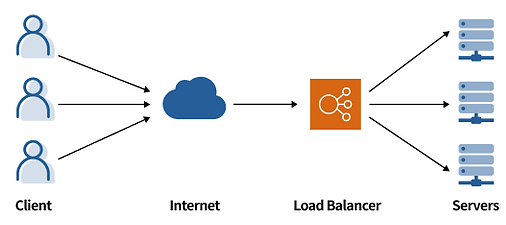
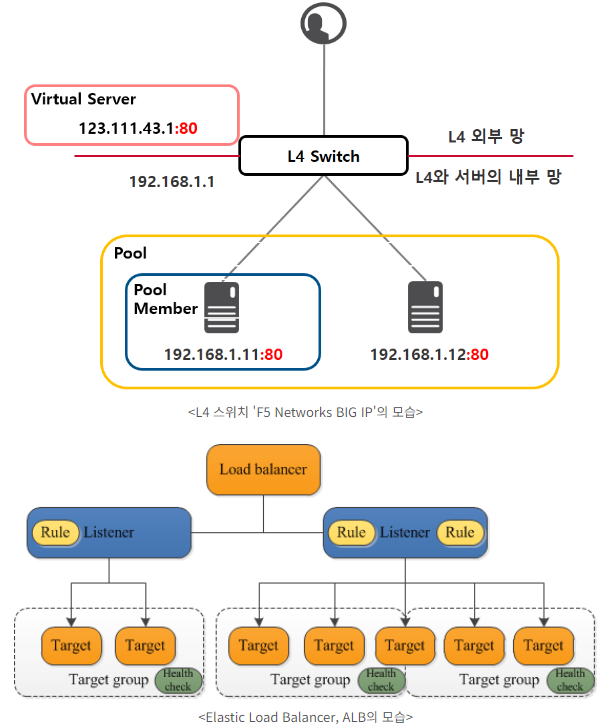

# 스케일업과 스케일아웃
- Scale up: 기존 서버 성능 향상
- Scale out: 서버 추가하여 시스템 확장

# 로드밸런싱 알고리즘
- 정적 로드 밸런싱
  - 라운드 로빈 방식(Round Robin Method)
  - 가중치 기반 라운드 로빈 방식(Weighted ROund Robin Method)
    - 각 서버마다 가중치 매겨 가중치 높은 서버에 클라이언트 요청 먼저 배분
  - IP 해시 방식(IP Hash Method)
    - 클라이언트 IP 주소를 숫자로 변환하여 개별 서버에 매핑
- 동적 로드 밸런싱
  - 최소 연결 방법(Least Connection Method)
    - 활성 연결이 가장 적은 서버로 트래픽 전송
  - 최소 응답 시간 방법(Least Response Time Method)
    - 가장 짧은 응답 시간을 보내는 서버로 트래픽 전송

# ALB(Application Load Balacer)
- 복잡한 최신 애플리케이션에는 단일 애플리케이션 기능을 전담하는 여러 서버를 포함하는 서버 팜이 존재
- ALP는 HTTP 헤더나 SSL 세션 ID 같은 요청 콘텐츠를 확인하여 트래픽을 리다이렉션
- 예를 들어, 전자 상거래 애플리케이션에는 제품 디렉터리, 장바구니 및 결제 기능이 있는데, 이미지나 비디오 등의 콘텐츠는 제공하지만 연결 유지는 필요없음. 또한 제품 검색 시 ALB는 검색 요청을 연결 유지가 필요없는 서버로 전송할 수 있음. 반면 장바구니는 클라이언트 연결 유지가 필요하므로 오랫동안 저장할 수 있는 서버로 전송을 요청함
- ALB는 애플리케이션 레벨에서 로드밸런싱을 제공하며, HTTP/HTTPS 트래픽에 적합
- L7 기반 로드 밸런서를 지원하며 SSL 적용 가능
- ALB는 개방형 시스템 간 상호 연결(OSI) 모델의 일곱 번째 계층인 애플리케이션 계층에서 작동
- 로드 밸런서는 요청을 받으면 우선순위에 따라 리스터 규칙을 평가하여 적용할 규칙을 결정한 다음, 규칙 작업의 대상 글부에서 대상을 선택함
- ALB는 AWS에서 제공하는 4가지 로드밸런서 중 하나로 OSI 7 Layer에서 일곱번째 계층에 해당하는 Application Layer를 다루는 로드밸런서

# NLB(Network Load Balancer)
- IP 주소 및 기타 네트워크 정보를 검사하여 트래픽을 최적으로 리다이렉션
- 애플리케이션 트래픽의 소스를 추적하고 여러 서버에 고정 IP 주소를 할당할 수 있음
- NLB는 앞서 설명한 고정 및 동적 로드 밸런싱 알고리즘을 사용하여 서버 로드를 배포
- 고성능을 요구하는 환경에서 부하분산에 적합한 솔루션
낮은 레이턴시로 초당 수백만 건의 요청을 처리할 수 있으며 갑작스러운 트래픽 증대 및 변화에도 최적화
- 실시간 스트리밍 서비스나 화상 회의 애플리케이션, 채팅 애플리케이션에는 NLB를 사용하여 연결을 관리하는 것이 조금 더 적합
- NLB 사용하여 세션 지속성을 효과적으로 유지할 수 있음
- 네트워크 레벨에서 로드밸런싱을 제공하고, TCP/UDP 트래픽에서 적합
- L4 기반 로드 밸런서 지원

# ELB(Elastic Laod Balancer)
- 둘 이상의 가용 영역에서 EC2 인스턴스 컨테이너, IP 주소 등 여러 대상에 걸쳐 수신되는 트래픽을 자동으로 분산
- ELB의 경우 L4와 L7에 대한 부하 제어 가능
- 서버의 기본 주소 바뀌면 로드밸런서를 새로 생성해야 하며 하나의 주소에 하나의 타겟 그룹을 보내게 됨
타겟 그룹이 많을수록 더 많은 수의 로드밸런서가 필요하고 비용도 그만큼 더 들어감
- AWS 환경에서 제공하는 4가지 유형의 로드 밸런서 지원
- 뛰어난 확장성과 유연성을 제공. 사용자의 다양한 요구 사항과 환경에 맞출 수 있음

# ELB
- AWS의 사용자 정의 네트워크인 Virtual Private Network(VPC)에 탑재
- 사용자 요청 받아 VPC 내 리소스(EC2 등)에 적절히 부하 분산
- ELB는 외부 요청을 받아 들이는 리스너(Listener)와 요청을 분산/전달할 리소스의 집합인 대상 그룹(Target Group)으로 구성
- ELB는 다수의 리스너와 대상 그룹을 거느릴 수 있음
- 부하 분산 대상인 대상 그룹 내 리소스들은 헬스 체크(Health Check)를 활용해 끊임없이 상태 확인받음
- 리스너는 외부 요청을 받아들이므로 서비스 포트(Service Port)를 보유
- 외부의 요청은 서비스 포트로 접속하는 요청만을 처리함
- 웹 서비스의 경우 보통 80포트를 사용하는 것처럼, 대상 그룹 또한 서비스 포트를 보유하고 있으며 부하 분산 대상인 EC2는 해당 포트가 열려 있어야 함
- 대상그룹의 포트는 꼭 리스너와 같은 포트가 아니어도 됨
- 요청을 검토한 리스너가 요청이 적합한 경우 대상그룹에게 이를 전달할 때 대상 그룹의 포트로 'Port Translation'을 실시하기 때문
- L4 스위치와 비교해보면 리스너는 Virtual Server에, 대상 그룹은 Pool에 해당
- ELB는 크게 외부 인터넷에서 접속 가능한 공인/사설 IP 모두를 갖는 Internet LB와 내부 접근만을 허용하는 사설 IP 갖는 Internal LB로 구분

https://aws-hyoh.tistory.com/128

# 참고사이트
- [SMILESHARK](https://www.smileshark.kr/post/what-is-a-load-balancer-a-comprehensive-guide-to-aws-load-balancer)
- [AWS Elastic Load Balancer(ELB) 쉽게 이해하기 #1](https://aws-hyoh.tistory.com/128)
- [AWS Elastic Load Balancer(ELB) 쉽게 이해하기 #2](https://aws-hyoh.tistory.com/133)