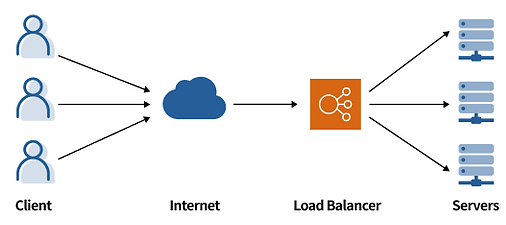
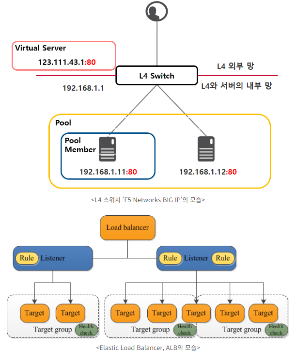

# NAT
- 대부분의 네트워크는 모든 호스트 중 일부만 인터넷 통신을 수행
- 대부분의 호스트는 PrivateIP를 이용하고 인터넷 통신에만 PublicIP 사용하여 외부에 노출하는 PublicIP 수를 줄임
- PrivateIP에서 인터넷으로 요청을 보낼 때 해당 요청이 NAT를 제공하는 라우터를 통과하면, NAT 라우터는 주소 변환 테이블에 가지고 있떤 PrivateIP를 PublicIP로 IP를 변환하여 요청을 보내고 변환 내용을 NAT 변환 테이블에 기록함
- 이후 인터넷으로 보낸 응답이 도착하면 기록해두었던 NAT 변환 테이블을 참조하여 요청을 보낸 PrivateIP를 가진 호스트에게 응답을 반환함

# AWS의 NAT gateway란?
- NAT 게이트웨이는 AWS에서 제공하는 NAT 서비스
- NAT의 개념과 동일하게 프라이빗 서브넷의 인스턴스가 VPC 외부 서비스(인터넷)에 연결할 수 있도록 하고, 외부 서비스에선느 프라이빗 서브넷 내의 인스턴스와 연결할 수 없도록 하기 위해 NAT 게이트웨이를 사용
- 즉, 프라이빗 서브넷 내의 EC2를 인터넷, AWS 서비스에 접근 가능하게 하고, 외부에서는 해당 EC2에 대한 접근을 막기 위해 사용
- VPC 내의 Public Subnet 내에 생성해야 함

# NAT 게이트웨이 설정 순서
1. NAT 게이트웨이가 속할 퍼블릭 서브넷 지정
2. NAT 게이트웨이와 연결할 탄력적 IP 주소 지정
  - NAT 게이트웨이 연결 후에는 탄력적 IP 주소를 변경할 수 없음
3. NAT 게이트웨이 만든 뒤 한 개 이상의 프라이빗 서브넷과 연결된 라우팅 테이블을 업데이트하여 인터넷 바운드 트래픽이 NAT 게이트웨이를 가리키도록 함
- [링크1](https://hyeyeon13.tistory.com/20)


# ELB(Elastic Laod Balancer)
- AWS의 사용자 정의 네트워크인 VPC(Virtual Private Network)에 탑재
- 사용자 요청 받아 VPC 내 리소스(EC2 등)에 적절히 부하 분산
- <b>리스너(Listener)</b>와 <b>대상그룹(Target Group)</b>으로 구성
  - 리스너: 외부 요청을 받아 들여 요청 분산하여 전달
  - 대상그룹: 요청 처리하는 리소스
- 다수의 리스너와 대상그룹을 거느릴 수 있음
- 부하분산 대상인 대상그룹 내 리소스들은 헬스체크(Health Check) 활용하여 끊임없이 상태 확인
- 리스너는 외부 요청을 받아들이므로 서비스 포트(Service Port) 보유
- 외부 요청은 서비스 포트로 접속하는 요청만 처리
- 웹 서비스의 경우 보통 80포트를 사용하는 것처럼, 대상그룹 또한 서비스 포트를 보유하고 있으며 부하분산 대상인 EC2는 해당 포트가 열려 있어야 함
- 대상그룹의 포트는 꼭 리스너와 같은 포트가 아니어도 됨
  - 리스너가 적합한 요청을 대상그룹에게 전달할 때 대상그룹의 포트로 'Port Translation'을 실시하기 때문
- L4 스위치와 비교해보면 리스너는 Virtual Server에, 대상그룹은 Pool에 해당
- ELB는 크게 외부 인터넷에서 접속 가능한 공인/사설 IP 모두를 갖는 Internet LB와 내부 접근만을 허용하는 사설 IP 갖는 Internal LB로 구분
- L4와 L7에 대한 부하 제어 가능
- 둘 이상의 가용 영역에서 EC2 인스턴스 컨테이너, IP 주소 등 여러 대상에 걸쳐 수신되는 트래픽을 자동으로 분산
- 서버의 기본 주소 바뀌면 로드밸런서를 새로 생성해야 하며 하나의 주소에 하나의 대상 그룹을 보내게 됨
- 대상 그룹이 많을수록 더 많은 수의 로드밸런서가 필요하고 비용도 그만큼 더 들어감
- AWS 환경에서 제공하는 4가지 유형의 로드 밸런서 지원
- 뛰어난 확장성과 유연성을 제공. 사용자의 다양한 요구 사항과 환경에 맞출 수 있음



## 리전(Region)
- 물리적으로 호스팅 영역을 구분
- 서비스되는 국가와 가장 가까운 리전을 선택하면 빠른 속도를 낼 수 있음
- 전 세계로 영역이 분산되어 있으므로 천재지변 등의 불가항력에 대처 가능
- 각 리전은 서로 완전히 독립적으로, 서울 리전에서 만든 리소스는 미국 버지니아 북부 리전에서는 사용할 수 없음

## 가용 영역(Availability Zone, AZ)

- 리전은 가용영역이라는 더 작은 단위로 격리됨
- 리전은 최소 2개 이상의 가용 영역으로 구성
- 각 가용 영역은 최소 1개 이상의 데이터 센터로 구성
- 개별 데이터 센터는 일반적으로 50,000 ~ 80,000대의 물리적 서버가 있다고 함
- 한국에는 총 4개의 가용영역이 존재
- 각 가용영역은 같은 리전이지만 지리적으로 멀리 떨어짐
  - 천재지변, 테러 등의 불가항력으로부터 대비하기 위함
- 가용영역 확인: [AWS 글로벌 인프라](https://aws.amazon.com/ko/about-aws/global-infrastructure/)
- [참고사이트](https://hudi.blog/region-and-availability-zone/)


## 로드밸런서 노드(Load Balancer Node)
- VPC 내에서 하나의 형태로 존재하는 다수의 네트워크 인터페이스로, 공인/사설 IP 모두 보유 가능
- ELB에서 실질적으로 사용자의 요청 받아들여 부하분산 대상들에게 요청을 나누어줌
- AWS 콘솔상에서는 네트워크 인터페이스 형태로만 보이기 때문에 EC2 서비스의 네트워크 인터페이스에서 확인 가능
- AZ마다 하나씩 존재하고, 가용영역 내의 부하분산 대상에게 요청 전달
- 소속된 AZ의 부하분산 대상만 책임짐
- VPC에서 바라보는 ELB는 로드밸런서 노드와 EC2의 집합으로 보이며, 각각 리스너(로드밸런서 노드), 대상그룹(EC2 집합)에 해당

여기부터!!!!!!!!!!!!!!!!!!!!!!!!!!
- ELB의 Network Interface(Load Balancer Node) 확인

- [AWS Elastic Load Balancer(ELB) 쉽게 이해하기 #1](https://aws-hyoh.tistory.com/128)
- [AWS Elastic Load Balancer(ELB) 쉽게 이해하기 #2](https://aws-hyoh.tistory.com/133)


# 리전과 가용영역 참고
- [참고사이트](https://hudi.blog/region-and-availability-zone/)

# 가용 영역(Availability Zone)과 로드밸런서 노드(Load Balancer Node)
- ELB는 VPC 내에서 하나이ㅡ 형태로 존재하고 다수의 네트워크 인터페이스를 가지며, 

# 참고사이트
- [SMILESHARK](https://www.smileshark.kr/post/what-is-a-load-balancer-a-comprehensive-guide-to-aws-load-balancer)
- [AWS Elastic Load Balancer(ELB) 쉽게 이해하기 #1](https://aws-hyoh.tistory.com/128)
- [AWS Elastic Load Balancer(ELB) 쉽게 이해하기 #2](https://aws-hyoh.tistory.com/133)


# 스케일업과 스케일아웃
- Scale up: 기존 서버 성능 향상
- Scale out: 서버 추가하여 시스템 확장

# 로드밸런싱 알고리즘
- 정적 로드 밸런싱
  - 라운드 로빈 방식(Round Robin Method)
  - 가중치 기반 라운드 로빈 방식(Weighted ROund Robin Method)
    - 각 서버마다 가중치 매겨 가중치 높은 서버에 클라이언트 요청 먼저 배분
  - IP 해시 방식(IP Hash Method)
    - 클라이언트 IP 주소를 숫자로 변환하여 개별 서버에 매핑
- 동적 로드 밸런싱
  - 최소 연결 방법(Least Connection Method)
    - 활성 연결이 가장 적은 서버로 트래픽 전송
  - 최소 응답 시간 방법(Least Response Time Method)
    - 가장 짧은 응답 시간을 보내는 서버로 트래픽 전송

# ALB(Application Load Balacer)
- 복잡한 최신 애플리케이션에는 단일 애플리케이션 기능을 전담하는 여러 서버를 포함하는 서버 팜이 존재
- ALP는 HTTP 헤더나 SSL 세션 ID 같은 요청 콘텐츠를 확인하여 트래픽을 리다이렉션
- 예를 들어, 전자 상거래 애플리케이션에는 제품 디렉터리, 장바구니 및 결제 기능이 있는데, 이미지나 비디오 등의 콘텐츠는 제공하지만 연결 유지는 필요없음. 또한 제품 검색 시 ALB는 검색 요청을 연결 유지가 필요없는 서버로 전송할 수 있음. 반면 장바구니는 클라이언트 연결 유지가 필요하므로 오랫동안 저장할 수 있는 서버로 전송을 요청함
- ALB는 애플리케이션 레벨에서 로드밸런싱을 제공하며, HTTP/HTTPS 트래픽에 적합
- L7 기반 로드 밸런서를 지원하며 SSL 적용 가능
- ALB는 개방형 시스템 간 상호 연결(OSI) 모델의 일곱 번째 계층인 애플리케이션 계층에서 작동
- 로드 밸런서는 요청을 받으면 우선순위에 따라 리스터 규칙을 평가하여 적용할 규칙을 결정한 다음, 규칙 작업의 대상 글부에서 대상을 선택함
- ALB는 AWS에서 제공하는 4가지 로드밸런서 중 하나로 OSI 7 Layer에서 일곱번째 계층에 해당하는 Application Layer를 다루는 로드밸런서

# NLB(Network Load Balancer)
- IP 주소 및 기타 네트워크 정보를 검사하여 트래픽을 최적으로 리다이렉션
- 애플리케이션 트래픽의 소스를 추적하고 여러 서버에 고정 IP 주소를 할당할 수 있음
- NLB는 앞서 설명한 고정 및 동적 로드 밸런싱 알고리즘을 사용하여 서버 로드를 배포
- 고성능을 요구하는 환경에서 부하분산에 적합한 솔루션
낮은 레이턴시로 초당 수백만 건의 요청을 처리할 수 있으며 갑작스러운 트래픽 증대 및 변화에도 최적화
- 실시간 스트리밍 서비스나 화상 회의 애플리케이션, 채팅 애플리케이션에는 NLB를 사용하여 연결을 관리하는 것이 조금 더 적합
- NLB 사용하여 세션 지속성을 효과적으로 유지할 수 있음
- 네트워크 레벨에서 로드밸런싱을 제공하고, TCP/UDP 트래픽에서 적합
- L4 기반 로드 밸런서 지원


# ELB 비용
- Classic Load Balancer 및 Application Load Balancer만 월별 750시간까지 무료
- Classic Load Balancer에서 데이터처리 15GB까지 가능
- Application Load Balancer에서 15LCU 사용

# 비용 관련
- [비용 정리 잘되어 있는 사이트](https://inpa.tistory.com/entry/AWS-%F0%9F%92%B0-%ED%94%84%EB%A6%AC%ED%8B%B0%EC%96%B4-%EC%9A%94%EA%B8%88-%ED%8F%AD%ED%83%84-%EB%B0%A9%EC%A7%80-%F0%9F%92%B8-%EB%AC%B4%EB%A3%8C-%EC%82%AC%EC%9A%A9%EB%9F%89-%EC%A0%95%EB%A6%AC)


# Notion 정리
https://www.notion.so/AWS-SAA-SAP-4b098215302c4bb680c68941be9c32dc


# EBS(Elastic Block Store)
- AWS가 제공하는 블록 수준 스토리지 볼륨
- 하나의 가용영역 서버들의 자원을 모아 생성하므로, 99.9999%의 가용성 제공
- 생성된 EBS는 물리적 하드디스크처럼 동일한 가용영역에서 생성된 EC2 장치에 탈부착 가능
- EBS는 독립적이므로 탈부착하더라도 데이터는 유효

## EBS 스냅샷
- 스냅샷을 만들어 증분식 백업 가능
- 요금은 저장된 데이터 양에 따라 결정
- 스냅샷 작업 시점에 플러시 되지 않은 쓰기가 문제를 일으킬 수 있으므로, 스냅샷 생성 시에는 ```fsfreeze -f <마운트디렉토리>``` 명령을 통해 EBS를 열어야 함
- 스냅샷 생성 실행 후 바로 ```fsfreeze -u <마운트디렉토리>``` 명령으로 파일시스템 액세스를 허용해도 됨
- 생성된 스냅샷은 다른 가용 영역에서도 사용 가능

## EBS 볼륨 유형
1. SSD
  - 범용 SSD
    - 가격과 성능 간 균형이 잡힌 볼륨으로, gp2와 gp3가 있으며 볼륨당 최대 처리량에 차이가 있음
  - Provisioned IOPS SSD
    - 보다 고성능을 위한 볼륨으로, 16000 IOPS 이상이 필요한 워크로드일 때 사용
    - io2Block Express, io2, io1이 있으며, 이 유형의 볼륨 사용시 하나의 EBS에 여러 인스턴스 연결 가능
    - IOPS(Input/Output Operations Per Second, IOPS)는 HDD, SDD 또는 NVMe 등 저장장치의 속도를 나타내는 데 사용되는 측정 단위
      - [링크](https://hiseon.me/server/iops-calculator/#google_vignette)
    - NVMe(비휘발성 메모리 익스프레스): 플래시 스토리지와 솔리드 스테이트 드라이브(SSD)에 사용되는 입출력(I/O)당 시스템 오버헤드를 줄이면서 고도로 병렬화된 데이터 전송을 위한 프로토콜로, NVMe SSD는 병렬 처리와 폴링을 허용하는 장치 드라이버의 변경으로 인해 기존 하드 디스크 드라이브보다 빠른 응답 속도 제공
      - [링크](https://www.ibm.com/kr-ko/topics/nvme)