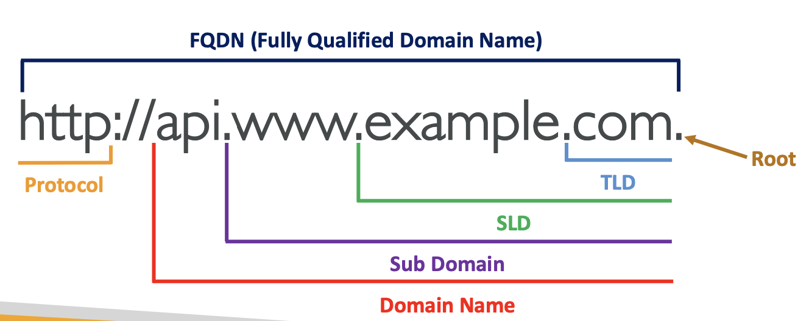
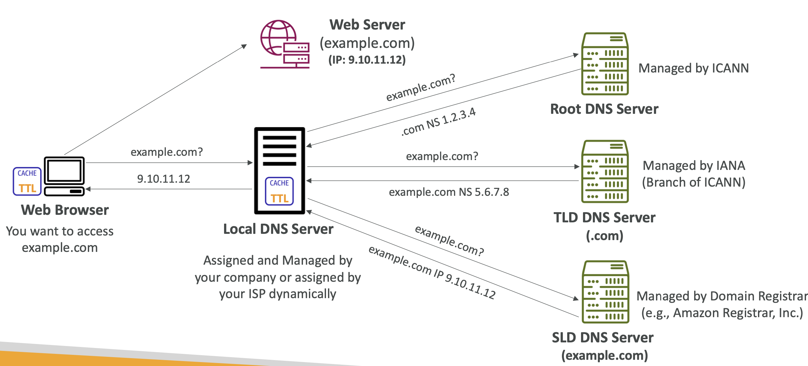

DNS에서 사용되는 용어
Domain Registrar: Amazon Route 53, GoDaddy 등과 같이 DNS 정보를 기록하는 저장소이다.
DNS Records: A, AAAA, CNAME, NS 등이 있다.
Zone File: DNS 기록을 보관한다.
Name Server: DNS 쿼리를 해결하는 장소이다.
Top Level Domain (TLD): .com, .us, .in, .gov, .org 등이 있다.
Second Level Domain (SLD): amazon.com, google.com 등이 이에 해당한다.

