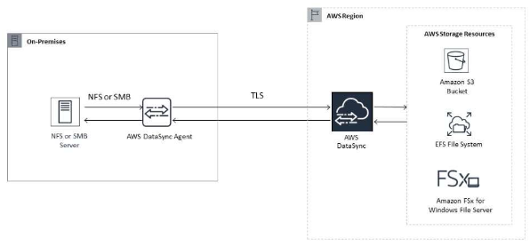
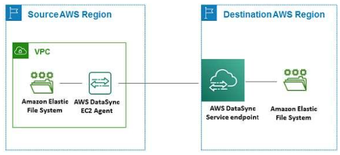

# AWS DataSync

- 데이터 마이그레이션을 간소화하고 AWS 스토리지 서비스 간 파일 또는 개체 데이터를 빠르고 쉽고 안전하게 전송할 수 있도록 지원하는 온라인 데이터 이동 및 검색 서비스

- 온프레미스 스토리지 이동
  - DataSync는 다음의 온프레미스 스토리지 시스템에서 동작
    - Network File System(NFS)
    - Server Message Block (SMB)
    - Hadoop Distributed File Systems (HDFS)
    - Object storage

- AWS 스토리지 이동
  - DataSync는 다음의 AWS 스토리지 서비스에서 동작
    - Amazon S3
    - Amazon EFS
    - Amazon FSx for Windows File Server
    - Amazon FSx for Lustre
    - Amazon FSx for OpenZFS
    - Amazon FSx for NetApp ONTAP

- 다른 클라우드 스토리지 이동
  - DataSync는 다음의 다른 클라우드 스토리지 서비스에서 작동
    - Google Cloud Storage
    - Microsoft Azure Blob Storage
    - Microsoft Azure Files
    - Wasabi Cloud Storage
    - DigitalOcean Spaces
    - Oracle Cloud Infrastructure Object Storage
    - Cloudflare R2 Storage
    - Backblaze B2 Cloud Storage
    - NAVER Cloud Object Storage
    - Alibaba Cloud Object Storage Service
    - IBM Cloud Object Storage
    - Seagate Lyve Cloud

- 엣지 스토리지 이동
  - DataSync는 다음의 엣지 스토리지 서비스와 디바이스로 이동
    - Amazon S3 compatible storage on AWS Snowball Edge
    - AWS Sonwcone

- Use cases
  - Discover data: 온프레미스 스토리 성능과 활용으로 가시성을 확보. AWS DataSync Discovery는 AWS 스토리지 서비스로 마이그레이션에 대한 권장사항(recommendation)을 제공
  - Migrate data: 네트워크를 거쳐 AWS 스토리지 서비스로 사용중인 데이터를 빠르게 이동. DataSync는 자동 암호화와 데이터 무결성 유혀성을 포함하며, 당신의 데이터가 보안상 안전하게 도착하고 즉시 사용할 수 있도록 도움
  - Archive cold data
  - Replica data
  - Transfer data for timely in-cloud processing

- DataSync 에이전트를 통해 온프레미스 혹은 AWS 클라우드의 스토리지 서버(혹은 스토리지 서비스)에서 AWS의 또 다른 스토리지 서비스로 데이터를 동기화하는 서비스

- 온프레미스의 데이터를 AWS 스토리지 서비스로 복사

- AWS EFS에서 또다른 AWS EFS로 데이터 복사

- DataSync만을 위한 별도의 에이전트를 온프레미스 환경이나 AWS 환경에 배포해야 함

- 소스 데이터는 DataSync 에이전트를 통해 AWS 스토리지로 동기화

- 온프레미스에 DataSync 에이전트를 배포하기 위해 DataSync에서는 ESXi, KVM, Hyper-V 방식의 하이퍼바이저에서 구동될 DataSync 에이전트 이미지를 제공하고 있음

- AWS 환경에 DataSync 에이전트를 배포하기 위해 DataSync 에이전트 전용 AMI 이미지로 EC2 인스턴스를 생성하도록 안내하고 있음

- AWS 문서에 따르면 온프레미스의 데이터를 DataSync를 통해 동기화하기 위해서는 온프레미스-AWS 인프라로의 진입 거기를 최소화해야 AWS에서 개발한 가속 프로토콜을 이용하여 최대한의 속도를 낼 수 있기에 DataSync 에이전트를 온프레미스 소스 스토리지와 근접한 곳에 배포할 것을 권장하고 있음

## 참고사이트
- [AWS DataSync 개념 및 간단한 사용 예시](https://engmisankim.tistory.com/42)

- [What is AWS DataSync?](https://docs.aws.amazon.com/datasync/latest/userguide/what-is-datasync.html)