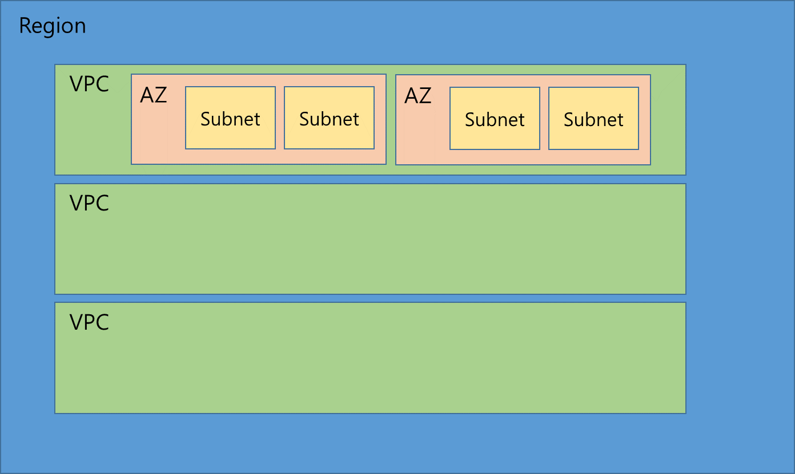

# [28] 일방향 트러스트로도 충분한 이유
- AWS SSO는 AD의 사용자 정보를 신뢰할 수 있고, AD는 AWS SSO에 대한 신뢰를 설정할 필요가 없음
   - 이로 인해 AD에서 사용자를 관리하면서 AWS 리소스에 대한 인증이 가능함

- 일방향 트러스트를 사용하면 AWS 환경이 온프레미스 AD의 내부 네트워크에 의존하지 않기 때문에 보안 위험을 줄일 수 있음
   - AD에서 인증된 사용자만 AWS 리소스에 접근할 수 있도록 설정하면, 외부에서 AWS 환경으로의 무단 접근을 방지할 수 있음

# [30] 비용 효율에 대한 고찰
- 비용 효율적이라는 얘기는 무조건 싸다는 의미가 아님
- 상대적으로 운영 오버헤드가 크거나 성능 등의 다른 메트릭이 향상된다면 비용이 조금 더 비싸도 효율적이라 할 수 있음

# [68] VPN 터널 장단점
VPN 터널을 사용하는 것은 AWS와 온프레미스 데이터 센터 혹은 다른 클라우드 환경 간에 안전하게 네트워크를 연결하는 방법 중 하나입니다. VPN 터널의 장단점은 다음과 같습니다.

### 장점
1. **보안성**: VPN 터널은 트래픽을 암호화하여 안전하게 보호하므로, 인터넷을 통해 데이터를 주고받더라도 데이터 유출 위험을 줄일 수 있습니다.
   
2. **비용 효율성**: VPN 터널은 비교적 저렴하게 구현할 수 있습니다. AWS에서는 Site-to-Site VPN을 통해 저렴한 비용으로 AWS VPC와 온프레미스 네트워크 간 연결을 지원하며, 고가의 전용 회선 없이도 네트워크 연결이 가능합니다.

3. **빠른 설정**: Site-to-Site VPN은 설정 및 구현이 비교적 빠르며, 온프레미스 네트워크와 클라우드 간 보안 연결을 신속히 구축할 수 있습니다.

4. **유연성**: VPN 연결은 네트워크 설정과 구성이 유연하여 필요에 따라 다양한 네트워크 간 연결을 설정할 수 있습니다. 예를 들어, 다중 지역 또는 다중 VPC를 연결할 때도 활용할 수 있습니다.

### 단점
1. **대역폭 및 지연 시간 제한**: VPN 터널은 공용 인터넷을 통해 통신하므로, 대역폭에 제한이 있고 지연 시간 문제가 발생할 수 있습니다. 대규모 데이터 전송이 필요한 경우나 지연이 중요한 경우에는 성능이 부족할 수 있습니다.

2. **신뢰성**: 공용 인터넷을 통해 연결되므로, 인터넷 상태에 따라 연결이 불안정할 수 있습니다. 연결이 끊기거나 속도가 느려지는 등의 문제가 발생할 수 있으며, 특히 인터넷 회선 품질이 낮은 지역에서 문제가 커질 수 있습니다.

3. **관리 오버헤드**: VPN은 각 연결을 유지하고 관리해야 하기 때문에, 규모가 커질수록 관리가 복잡해질 수 있습니다. 다중 터널을 구성하는 경우에는 모니터링과 유지보수도 추가적인 관리 작업이 필요합니다.

4. **추가적인 성능 한계**: VPN 터널을 사용하는 경우 AWS에서 제공하는 SLA(Service Level Agreement)가 제한적이기 때문에 성능 보장이 어렵습니다. 고성능이나 고가용성이 요구되는 환경에서는 AWS Direct Connect와 같은 전용 네트워크 연결이 더 적합할 수 있습니다.


# [93] Database Cloning
- **빠른 복제:** 데이터베이스 클로닝을 사용하면 전체 데이터베이스를 빠르게 복제할 수 있으므로, 스테이징 환경을 신속하게 설정할 수 있도록 함

   - **why?** 클로닝은 데이터를 실제로 복사하지 않고, 메타데이터와 스냅샷 기능을 이용해 빠르게 생성하기 때문!!

- **운영 오버헤드 최소화:** 클로닝은 백업 및 복원 과정보다 훨씬 빠르고 효율적이며, 운영 오버헤드를 최소화함

# [98] SQS FIFO Queue
## 메시지 중복 제거
- SQS FIFO 큐는 메시지 중복 제거 기능을 제공하여 동일한 메시지가 여러 번 처리되는 것을 방지할 수 있음
- 메시지 중복 제거 ID를 사용하면 동일한 메시지가 여러 번 처리되지 않도록 할 수 있음
- FIFO 큐는 메시지의 순서를 보장하므로, 메시지가 올바른 순서로 처리됨
- 순서와 정확성이 중요한 경우에 적합하며, 중복없는 정확한 처리가 필요할 때 사용

## Standard Queue는 왜 중복된 메시지가 전달될 가능성이 높은가?
1. 중복 허용 설계
   - 많은 양의 메시지를 빠르게 처리하기 위해 분산 환경에서 동시성 있게 작동함
   - 메시지를 여러 서버에서 처리할 수 있도록 복제하여 빠르게 전달할 수 있는데, 이 과정에서 동일한 메시지가 여러 번 복제되어 전달될 가능성이 생김
   > 표준 큐는 메시지의 중복 가능성을 허용하는 설계일 뿐, 모든 메시지가 중복으로 입력되거나 전달되는 것은 아님
   > 표준 큐는 대규모의 처리량을 지원하면서도 많은 경우 중복 없이 메시지를 처리할 수 있지만, 다만 극한 상황이나 높은 부하 상태에서 중복이 발생할 가능성이 존재하는 것임

2. 최대 처리 보장
   - 표준 큐는 메시지 순서를 엄격하게 유지하거나 중복을 완벽히 방지하기 위한 추가적인 제약을 두지 않기 때문에 처리 속도를 높일 수 있음
   - 이를 통해 큐의 무제한 확장성을 지원하여 대규모 작업 부하를 처리할 수 있음

# [104] CloudFront 동적 컨텐츠 제공 성능 향상
- 정적 콘텐츠 제공 이외에도 Node.js 웹서버, PHP, Go, Python 등 서버에서 매번 바뀌는 동적인 콘텐츠 제공 부분에도 성능을 향상시킬 수 있음

- CloudFront는 여러 나라의 Edge를 보유하고 있으므로, 사용자는 각 위치에서 멀리 떨어져 있는 Origin에 직접 연결하는 것이 아닌, 가장 가까운 Edge에 접근하여 콘텐츠를 제공받게 되며 그 과정속에서 Edge와 Origin 사이의 데이터 전송의 지속적인 연결을 유지하기에 콘텐츠 전송 속도의 향상이 증가됨

- 그 밖에도 전송 데이터를 줄일 수 있는 GZIP Compression 기능 등을 Cloudfront에서 제공하고 있기 때문에 오리진 서버에서 압축을 위해서 별도의 자원을 사용할 필요가 없기도 함

## 동적 콘텐츠 요청 예시
1. 사용자 요청
   - 사용자가 웹사이트에 접속하여 특정 상품 페이지를 열면 상품 정보와 함께 개인화된 정보(사용자 할인율, 추천 상푸 등)가 필요
2. CloudFront 엣지 서버로 전달
   - 사용자의 요청은 CloudFront로 먼저 전달
   - CloudFront는 사용자의 위치와 가까운 엣지 서버에서 이 요청을 처리 
   - 이때 AWS Edge Location 사용
3. Origin 서버와의 최소화된 연결
   - 엣지 서버가 오리진 서버로 요청을 보내고, 상품 데이터와 개인화된 정보를 가져옴
   - 이 과정에서 CloudFront가 Persistent Connections를 유지하고, HTTP/2 또는 HTTP/3 프로토콜을 사용하여 데이터를 빠르게 전송
4. 동적 콘텐츠 응답
   - 엣지 서버는 받은 데이터를 사용자에게 빠르게 반환
   - Origin Shiled 같은 설정이 활성화되어 있다면, 여러 사용자의 비슷한 요청은 오리진 서버가 아닌 가까운 캐시 레이어에서 처리되어 오리진 부하가 줄어듦

## Origin Shield
- CloudFront가 콘텐츠를 오리진에서 캐시로 가져올 때 특정 중간 위치를 추가하여 캐시 히트를 높이고, 오리진 서버에 가는 요청을 줄여줌

## Lambda@Edge 혹은 CloudFront Functions
- 동적 콘텐츠 제공 중 사용자 맞춤화가 필요할 경우, Lambda@Edge 혹은 CloudFront Functions를 사용해 엣지에서 요청을 처리할 수 잇음
- 이렇게 하면 오리진 서버에 대한 요청을 줄이고, 엣지에서 사용자 요청을 직접 처리하여 응답 속도가 빨라짐
- URL 리디렉션, 쿠키 기반 사용자 세그먼트별 콘텐츠 제공 등을 CloudFront 엣지 서버에서 수행 가능
- 사용자의 IP 주소나 쿠키 값 기반으로 맞춤형 콘텐츠 제공할 수 있음

## TTL 최소화
   - 동적 콘텐츠는 일반적으로 자주 변경되므로, CloudFront의 TTL(Time to Live)을 낮게 설정하여 오래된 데이터가 사용되지 않도록 할 수 있음
   - TTL 설정을 조절해 적절한 수준의 캐시 신선도를 유지하면서도 오리진 서버 요청을 최소화할 수 있음
   - **정적콘텐츠**: 웹사이트의 정적 리소스는 거의 변경되지 않으므로, 장기간 캐시할 수 있음
   - **동적콘텐츠**: 사용자의 요청에 따라 실시간으로 변하므로, 너무 긴 TTL을 설정하면 구식 데이터를 제공받을 위험이 있음
      - Cache-Contrl 헤더를 사용해 ```no-cache``` 또는 ```max-age=0``` 등을 설정하면, 사용자에게 항상 최신 데이터를 제공
   - **뉴스 및 실시간 데이터(주식 싯, 날씨, 스포트 스코어 등)**: 
      - 잦은 갱신이 필요하며, Lambda@Edge 사용하여 조건부 캐싱(사용자 인증이나 URL 파라미터 기반 등)을 구현하여 특정 콘텐츠만 캐싱하고 나머지는 실시간으로 처리 가능
   - **API 응답(로그인, 인증 토큰, 사용자 세션)**
      - 민감한 데이터에 대해 TTL 낮게 설정하거나, API 응답에 대해 Cache-Control 헤더를 활용해 필요에 따라 캐싱 최적화
      - 예를 들어, 세션 정보는 5분 동안만 캐시하도록 설정할 수 있음
   - **비디오 스트리밍**
      - 비디오의 경우 상대적으로 긴 TTL을 설정하여 자주 변경되지 않는 콘텐츠를 캐싱할 수 있음
      - 실시간 스트리밍이나 라이브 방송은 짧은 TTL을 설정하여 최신 콘텐츠를 제공할 수 있음

## Persistent Connections 설정
   - CloudFront는 오리진 서버와의 연결을 유지할 수 있는 Persistent Connections를 사용하여 성능을 높임
   - 매번 새로운 연결을 생성하지 않고도 데이터를 빠르게 전송할 수 있어 응답 지연이 줄어듦

## HTTP/2, HTTP/3
   - CloudFront에서 HTTP/2 및 HTTP/3 프로토콜을 사용하면 요청의 다중화, 압축, 헤더 최적화를 통해 동적 콘텐츠 전송이 최적화됨
   - HTTP/3는 특히 모바일 환경에서 지연 시간이 낮아 성능이 더 향상될 수 있음


# [130] 단순 스케일링 정책(Simple Scaling Policy)
- 특정 조건이 충족될 때만 인스턴스를 추가하거나 제거함
- 이는 CPU 사용률을 일정하게 유지하는 데 충분하지 않을 수 있음

# [150] CloudWatch Synthetics Canaries
- 애플리케이션의 가용성과 성능을 모니터링하는 데 사용되는 서비스
- 이를 통해 특정 사용자 시나리오를 주기적으로 테스트하고 성능 이슈나 가용성 문제를 조기에 감지할 수 있음
- Canary라 불리는 스크립트를 사용하여 애플리케이션의 특정 경로를 테스트
- 이 캔디드는 웹사이트나 API에 대해 사용자가 수행할 작업을 자동으로 시뮬레이션하며, 사용자 상호작용을 모방해 애플리케이션의 정상 동작을 지속적으로 확인
- 더 찾아볼 것

- Amazon CloudWatch의 기능 중 하나
- 웹 애플리케이션과 API의 **성능** 및 **가용성**을 모니터링하는 데 사용
- 자동화된 **가상 사용자**를 통해 주기적으로 웹 애플리케이션과 API를 테스트하고, 이를 기반으로 성능 문제나 장애를 조기에 감지할 수 있도록 도와줌

### CloudWatch Synthetics Canaries의 주요 특징

1. **자동화된 웹 애플리케이션 및 API 테스트**:
   - CloudWatch Synthetics는 "canary"라는 가상 사용자를 만들어 설정한 주기(예: 매 1분 또는 5분 간격)로 웹 페이지나 API를 호출하여 **가용성**과 **성능**을 점검합니다.
   - 이 테스트는 사용자가 실제로 사이트에 접근하는 것처럼 수행되며, 실제 사용자 행동을 시뮬레이션합니다.

2. **통합된 CloudWatch 모니터링**:
   - Synthetics는 CloudWatch와 통합되어, 테스트의 결과를 CloudWatch 지표와 로그로 출력합니다. 이를 통해 AWS Management Console에서 실시간으로 테스트 결과를 모니터링할 수 있습니다.
   - 장애나 성능 저하가 발생한 경우, CloudWatch 알림을 통해 즉시 알림을 받을 수 있습니다.

3. **테스트 시나리오 사용자 정의**:
   - 기본적으로 HTTP 요청을 보내는 것 외에도, 사용자는 다양한 **스크립트**를 작성하여 Synthetics Canary가 특정 웹 페이지를 탐색하거나, 로그인 후 페이지를 로드하는 등의 시나리오를 자동으로 실행하게 할 수 있습니다.
   - 스크립트는 **Node.js** 기반으로 작성되며, Selenium WebDriver와 같은 기술을 사용하여 웹 페이지를 인터랙티브하게 테스트할 수 있습니다.

4. **다양한 테스트 유형 지원**:
   - **HTTP API**: HTTP 요청을 통해 API의 응답 속도 및 가용성을 테스트할 수 있습니다.
   - **웹 페이지**: 페이지가 로드되는 시간, 리소스가 제대로 로드되는지, 로그인 후 특정 페이지로 이동하는 등의 동작을 검증할 수 있습니다.
   - **사용자 정의 스크립트**: 특정 시나리오를 위한 고유의 테스트 스크립트를 작성하여, 복잡한 사용자 인터랙션도 자동화할 수 있습니다.

5. **다양한 로케이션에서의 테스트**:
   - Canaries는 AWS의 다양한 **글로벌 엣지 로케이션**에서 실행될 수 있으므로, 전 세계의 여러 위치에서 애플리케이션의 성능을 측정할 수 있습니다. 이 기능을 활용하면, 사용자 위치에 따른 성능 차이를 모니터링할 수 있습니다.

### CloudWatch Synthetics Canaries의 활용 예시

1. **웹 애플리케이션의 가용성 및 성능 모니터링**:
   - 예를 들어, 쇼핑몰 웹사이트의 결제 페이지가 정상적으로 작동하는지, 결제 처리 후 사용자에게 정확한 페이지가 로드되는지 테스트할 수 있습니다.
   - 이를 통해, 사용자가 실제로 결제할 때 발생할 수 있는 오류를 사전에 파악하고 대응할 수 있습니다.

2. **API의 응답 시간 및 오류 추적**:
   - API 서버의 성능을 모니터링하여 응답 시간이 지연되거나 오류가 발생하면 바로 알림을 받도록 설정할 수 있습니다.
   - 예를 들어, 백엔드 API가 너무 느리거나 오류가 발생하면, 이를 조기에 감지하여 서비스의 품질을 유지할 수 있습니다.

3. **로그인 및 사용자 경험 흐름 테스트**:
   - 웹사이트나 애플리케이션에서 로그인 후 특정 기능이 잘 동작하는지, 예를 들어 사용자 대시보드가 정상적으로 로드되는지, 특정 데이터를 표시하는지 등을 자동화된 스크립트를 통해 테스트할 수 있습니다.

4. **다국적 웹 애플리케이션의 글로벌 성능 추적**:
   - 전 세계 여러 지역에서 애플리케이션의 응답 시간을 테스트하고, 성능 문제가 특정 지역에서 발생하는지 확인할 수 있습니다. 예를 들어, 미국에서의 성능이 좋지만 아시아에서 문제가 발생하는지 추적할 수 있습니다.


# [151] AWS Control Tower의 Residency Guardrails
- 데이터 레지던시 요구사항을 충족하도록 AWS 환경을 보호하고 관리하기 위해 사용하는 일련의 규칙
- 각국의 법적 규제나 산업 표준을 준수해야 하는 조직에서는 데이터가 특정 국가나 지역 내에 머물러야 할 필요가 있을 수 있음
- Residency Guardrails는 이러한 규제에 따라 데이터를 물리적으로 지정된 위치에 유지하도록 관리하는 기능을 제공

1. **데이터 위치 제한**: 
   - 특정 리전으로 제한된 리소스 생성 및 데이터 저장이 가능하도록 지원
   - 이를 통해 데이터가 특정 리전을 벗어나지 않도록 보장할 수 있음
  
2. **거버넌스 및 모니터링**
   - 데이터가 요구되는 위치에 있는지, 사용자가 규정을 준수하고 있는지에 대한 가시성과 모니터링을 제공
   - 이를 통해 컴플라이언스 상태를 지속적으로 확인할 수 있음

3. **자동화된 정책 적용**
   - Control Tower가 제공하는 자동화된 guardrails를 통해 사용자의 설정이 데이터 레지던시 규칙을 준수하도록 강제할 수 있음

# [152] AWS Systems Manager Session Manager
- AWS 인스턴스에 대한 안전한 원격 셸 접근을 제공하는 서비스

# [156] AWS Lake Formation
- 데이터 레이크를 간편하게 구축하고 관리할 수 있도록 돕는 서비스
- **데이터 레이크란?** 다양한 원천에서 수집된 구조화 및 비구조화 데이터를 대규모로 저장하고 분석할 수 있는 중앙 저장소 역할을 함 
- 이 데이터 레이크를 쉽게 설정하고, 데이터의 보안과 거버넌스를 관리하며, 데이터 분석을 위한 준비 작업을 자동화하는 데 초점을 맞추고 있음

# [156] AWS Lake Formation의 Blueprint
- 데이터 파이프라인을 자동으로 설정하여 특정 데이터 소스에서 데이터를 수집하고, 이를 AWS 데이터 레이크로 변환 및 저장하는 데 사용되는 템플릿
- 이를 통해 데이터 수집과 ETL(Extract, Transform, Load) 작업을 자동화하여 데이터 레이크 구축을 더욱 간편하게 할 수 있음

# [184] Lambda 함수에도 보안 그룹(Security Group)을 설정
- Lambda 함수에도 보안 그룹(Security Group)을 설정할 수 있음
- 이는 Lambda 함수가 **VPC(Virtual Private Cloud)** 내에서 실행될 때 가능

- Lambda 함수가 VPC 내의 리소스와 통신해야 할 경우, 예를 들어 RDS 데이터베이스에 접근할 때, 특정 서브넷과 보안 그룹을 지정하여 네트워크 접근을 제어할 수 있음

- 다음 블로그에서 더 자세한 내용 살펴보기
   - https://jibinary.tistory.com/348

# [184] 보안그룹(Security Group)
- VPC 내에서 실행되는 리소스(예: EC2 인스턴스, Lambda 함수, RDS 등)에 대한 네트워크 트래픽을 제어하는 가상 방화벽 역할을 함

# [186] AWS Storage Gateway
- 온프레미스와 AWS 간의 하이브리드 클라우드 스토리지 솔루션
- 다중 AZ에 걸친 Windows 파일 시스템을 제공하는 데 적합하지 않음

# [201] Pinpoint
- 마케팅 커뮤니케이션 서비스로, SMS 메시지를 전송하는 데 적합
- Pinpoint는 사용자에게 SMS 메시지를 보내고, 사용자의 응답을 처리할 수 있음
- 이벤트를 Amazon Kinesis 데이터 스트림으로 전송하여, 실시간으로 데이터를 분석하고 아카이빙할 수 있음

# [205] Amazon Lightsail
- 간편하게 웹 애플리케이션, 블로그, 개인 프로젝트 등을 배포하고 관리할 수 있도록 설계된 저비용 클라우드 서비스
- 복잡한 설정 없이 몇 가지 클릭만으로 서버 인스턴스, 데이터베이스, 네트워크 구성 등을 쉽게 할 수 있으며, 예측 가능한 고정 비용 모델을 제공하여 예산 관리에 용이함

- 주로 소규모 웹사이트, 테스트 환경, 블로그와 같은 프로젝트에 적합하며, 빠른 설정과 간단한 관리가 필요할 때 유용
- 다만 확장성과 고급 기능이 필요한 경우에는 EC2, S3, RDS 등의 다른 AWS 서비스를 사용하는 것이 더 효과적일 수 있음

# [217] active-active
- 두 개가 동시에 실행되면서 요청을 번갈아 처리함
- active-passive는 프라이머리가 죽으면 passive의 세컨더리 active됨

# [224] Amazon Route 53 multivalue answer routing policy
- 이 라우팅 정책은 여러 IP 주소를 반환하여 트래픽을 무작위로 분산시킬 수 있음

# [230] NAT 게이트웨이 다른 AZ로 배포 효과와 자동 확장
- 서로 다른 가용 영역에 NAT 게이트웨이를 배포하면, 하나의 가용 영역에 장애가 발생하더라도 다른 가용 영역의 NAT 게이트웨이가 트래픽을 처리할 수 있음
- NAT 게이트웨이는 자동으로 확장되어 트래픽 증가를 처리할 수 있으므로, 수동으로 인스턴스를 관리할 필요가 없음

# [237] VPC 피어링의 단일 장애 지점
- AWS가 고가용성 구조로 설계해두었기 때문에 단일 장애 지점이 발생하지 않음

# [237] VPC Gateway Endpoints
- S3나 DynamoDB와 같은 특정 AWS 서비스에 대한 프라이빗 연결을 제공하는 데 사용되므로, EC2 인스턴스 간의 연결에는 적합하지 않음

# [237] Virtual Private Gateway
- 온프레미스 네트워크와 VPC 간의 연결을 설정하는 데 사용되므로, VPC 간의 연결에는 적합하지 않음

# [237] Private Virtual Interface
- 프라이빗 VIF는 Direct Connect를 통해 온프레미스 네트워크와 VPC 간의 연결을 설정하는 데 사용되므로,  VPC 간의 연결에는 적합하지 않음

# [242] Multivalue Answer Routing Policy
- 헬스 체크를 지원하여, 건강한 인스턴스의 IP 주소만 반환할 수 있음

# [298] 서브넷과 AZ
- Region에는 VPC 생성 가능 (한 계정에 최대 5개)
- VPC에는 여러 AZ를 생성 가능
- AZ에는 Subnet 여러 개 생성 가능
- Region > VPC > AZ > Subnet > AWS Resource
- Security Group은 VPC에서 생성하고 관리할 수 있으며, VPC 내 인스턴스에 배정이 가능




# [309] S3 Storage Lens
- 스토리지 사용량 및 활동에 대한 포괄적인 메트릭과 인사이트를 제공하는 도구
- S3 Storage Lens 대시보드를 사용하면 S3 버킷의 액세스 패턴을 쉽게 분석할 수 있음

# [326] S3 Standard-IA
- S3 Standard-IA는 자주 접근되지 않는 객체에 적합하지만, **접근 패턴이 불규칙한 경우** **비용이 증가**할 수 있음

# [329] Amazon Detective
- AWS에서 제공하는 보안 분석 및 조사 서비스
- AWS 환경에서 발생하는 보안 문제를 빠르게 조사하고 해결하는 데 도움을 줌
- 주로 잠재적 보안 위협을 식별하고 분석할 수 있도록 도와주는 도구
- 이 서비스는 AWS 리소스에서 발생하는 로그 데이터를 자동으로 수집하고, 머신 러닝과 그래프 이론을 사용하여 이를 분석함으로써 보안 사건의 원인과 맥락을 파악하는 데 효과적임

# [351]  AWS Step Functions
- 서버리스 워크플로우 서비스로, 상태 머신을 사용하여 여러 AWS Lambda 함수를 조정하고 관리할 수 있음
- 이를 통해 분산된 이벤트 기반 아키텍처를 구축하고, 운영 오버헤드를 최소화할 수 있음

# [338] Aurora global db cluster 복제
- 최소 하나의 DB 인스턴스를 보조 리전에 지정하면 데이터 복제가 지속적으로 이루어지므로, 재해 복구 시 빠르게 활성화할 수 있음

# [358] Lambda@Edge
- CloudFront 배포와 연동하여 요청 및 응답을 처리할 수 있음
- 이 솔루션은 이미지 관리 라이브러리를 Lambda@Edge 함수에 배포하여 이미지 크기 조정 및 형식 변환을 클라우드 엣지에서 처리할 수 있게 함
- 이렇게 하면 운영 오버헤드가 적고, 전 세계에 분산된 클라이언트들에게 빠르게 서비스를 제공할 수 있음

# [359] aws:SecureTransport
- S3 버킷 정책에서 `aws:SecureTransport` 조건을 사용하여 HTTPS(TLS)를 통한 암호화된 연결만 허용

# [379] 프로비저닝된 동시성(Provisioned Concurrency)
- Lambda 함수가 항상 준비 상태를 유지하여 콜드 스타트 지연을 줄일 수 있음

# [383] Dedicated Reserved Hosts
- Dedicated Hosts는 물리적 서버를 전용으로 사용할 수 있는 옵션
- 소켓과 코어 기반의 소프트웨어 라이선싱 모델을 지원
- Reserved Hosts는 예약된 용량을 제공하여 비용을 절감할 수 있음

# [393] Amazon Connect, Amazon Transcribe
- 콜 센터 솔루션
- 음성 파일을 텍스트로 변환하고, PII 제거 기능을 제공

# [394]
|타입|범용|Provisioned IOPS|쓰루풋 최적화 HDD| Cold HDD| 마그네틱|
|:---:|:---:|:---:|:---:|:---:|:---:|
|이름|GP3|IO2|ST1|SC1|Standard|
|용량|1GB~16TB|4GB~16TB|500GB~16TB|500GB~16TB|1GB~1TB|
|사용|일반 범용|IOPS가 중요한 App/DB|쓰루풋이 중요한 App/Hadoop/OLAP DB 등|파일 저장소|백업/비주기적 데이터 액세스|
|MAX IOPS|16,000|64,000|500|250|40~200|

# [399] Amazon API Gateway Regional API 엔드포인트
- 특정 AWS 리전에 API를 배포하여, 리전 내에서 직접 API 요청을 처리할 수 있는 엔드포인트
- 주로 동일 리전 내의 애플리케이션 또는 리전 간 라우팅을 최소화하려는 경우에 사용

# [401] EBS Multi-Attach
- Amazon Elastic Block Store(EBS)에서 제공하는 기능으로, 하나의 EBS 볼륨을 여러 Amazon EC2 인스턴스에 동시에 연결할 수 있게 해줌
- 이를 통해 동일한 데이터를 여러 EC2 인스턴스에서 동시에 읽고 쓸 수 있어, 고가용성이나 공유 스토리지가 필요한 애플리케이션에 유용

# [419] IAM permission boundary
- AWS에서 IAM 사용자나 역할이 특정 작업을 수행할 때, 최대 권한을 제한하는 기준을 설정하는 기능
- 이는 IAM 정책을 통해 부여한 권한 외에도, 더 세밀한 제어를 제공하여 지정된 범위 내에서만 권한이 유효하도록 제한할 수 있음

# [420] 다시 풀어보기

# [421] AWS Transfer Family
- S3 버킷을 백엔드 스토리지로 지원

# [422] AWS App Mesh
- 마이크로서비스 애플리케이션의 네트워크 트래픽을 관리하고 서비스 간의 통신을 제어하는 서비스 메시
- 이 서비스를 사용하면, 애플리케이션의 서비스 간 연결을 쉽게 설정하고, 트래픽 흐름을 제어하며, 서비스의 가용성, 보안, 성능을 향상시킬 수 있음

# [423] IAM 정책
- 사용자, 그룹, 역할과 같은 IAM 주체(principal)에 연결할 수 있음
- IAM 정책은 리소스 기반 정책이 아니므로, Amazon ECS 리소스나 Amazon EC2 리소스에 직접 연결할 수 없음

# [436] 다시 풀어보기

# [440] 다시 풀어보기
- Aurora에 RDS Snapshot은 직접 Import, Dump는 S3를 통해 Update하여 Import

# [442] 다시 풀어보기: AWS Lake Formation의 태그 기반 접근 제어(TBAC)
- 데이터에 태그를 할당하고, 이러한 태그를 기반으로 접근 권한을 관리할 수 있는 기능을 제공

# [448] 다시 풀어보기

# [454] Workload Discovery on AWS
- AWS 리소스의 아키텍처 다이어그램을 자동으로 생성하고, 리소스 간의 관계를 시각화하는 도구

# [455] 답 외우기...
- B, D, F:  SCP를 사용하여 추가 리소스 프로비저닝을 방지하는 것이 적절
- AWS Budget이 작업 수행하려면 IAM role 필요..
- 리소스 프로비저닝에는 SCP가 유용

# [457] 다시 풀기: AWS Transfer Family
- AS2 프로토콜을 지원하며, AWS Lambda를 사용하여 사용자 인증을 위한 커스텀 로직을 구현할 수 있음
- Storage Gateway는 AS2 프로토콜 지원 안함

# [458] AWS Lambda
- 서버리스 컴퓨팅 서비스로, 메모리와 스토리지 요구 사항에 맞게 동적으로 확장 가능

# [464] 다시 풀기

# [465] Amazon EC2 Nitro
- 원시 성능에 가까운 속도를 제공하여 **고성능 컴퓨팅(HPC)**이나 I/O 집약적인 작업에 유리
- 네트워크, 컴퓨팅, 스토리지 성능이 최적화

# [468] VPC 링크
- API Gateway가 프라이빗 VPC 서브넷에 있는 ECS 서비스에 안전하게 액세스할 수 있음
- API Gateway가 VPC 내의 리소스에 접근할 수 있게 되며, 이를 통해 API 호출이 외부 인터넷을 거치지 않고 프라이빗 네트워크 내에서 처리될 수 있음
- 예를 들어, VPC 내의 로드 밸런서를 통해 EC2 인스턴스에 요청을 전달하거나 Lambda 함수와 연결할 수 있음
- VPC Link는 프라이빗 연결을 제공하므로, 데이터를 안전하게 주고받을 수 있음
- 특히 인터넷에 노출되지 않는 환경에서 서비스하는 API가 필요한 경우 유용

# [460] 다시풀기
D. Use S3 Inventory to identify and transition objects that have not been accessed from S3 Standard to S3 Intelligent-Tiering
S3 Inventory는 객체의 상태를 기록하는 데 유용하지만, 객체 액세스 패턴에 따라 스토리지 클래스를 자동으로 전환하지 않습니다. S3 Intelligent-Tiering이 자동으로 전환을 관리하는 것과 비교해 비용 절감에 덜 효과적입니다.


# [470] Egress-Only Internet Gateway
- IPv6 트래픽에 대해 아웃바운드 인터넷 액세스를 제공하면서, 외부에서의 인바운드 트래픽을 차단하는 데 사용
- 회사의 보안 정책을 준수하면서 EC2 인스턴스가 외부 애플리케이션과 통신할 수 있도록 함

# [475] Amazon Elastic File System (Amazon EFS)
- 고가용성과 내구성을 제공하는 완전 관리형 파일 시스템
- 각 가용 영역에 마운트 타겟을 제공하며, AWS Backup을 사용하여 다른 리전으로 데이터를 복제할 수 있d음
- EFS는 여러 가용 영역에 걸쳐 데이터를 자동으로 복제하여 높은 내구성을 보장하며, AWS Backup을 통해 8시간의 RPO를 충족할 수 있음
- AWS Backup을 이용한 복제가 필요하지 않다면 다른 FSx의 사용도 고려해볼 수 있지만, 이 문제에서는 EFS만이 AWS Backup을 이용한 복제 가능

# [475] Amazon FSx 사용하는 이유
- 고성능 파일 시스템이 필요하거나 Windows 환경에서 특화된 기능을 요구하는 경우 사용
- FSx for Windows File Server: Windows 서버 환경에서 SMB 프로토콜 사용, AD 통합, NTFS 권한 관리 기능 등 제공
- FSx for Lustre: 고성능 컴퓨팅, 빅데이터 분석, 기계 학습 등

# [476] 다시 풀기
- 권한 부여를 위한 가장 안전한 방법

# [481] 다시 풀기
- Write-through caching 전략은 데이터를 캐시와 데이터베이스에 동시에 기록하는 방식입니다. 이 전략을 사용하면 데이터베이스에 항목이 추가되거나 업데이트될 때, 해당 데이터를 캐시에도 즉시 반영합니다. 이 방식은 캐시와 데이터베이스의 데이터가 항상 일치하도록 보장합니다. 즉, 데이터베이스와 캐시 간의 일관성을 유지할 수 있습니다.

# [484] 다시 풀기. 답 외우기: Amazon Cognito
- 주로 애플리케이션 사용자 인증에 사용되며, 중앙 디렉터리 서비스와의 통합에는 적합하지 않음

# [489] 다시 풀기

# [491] 다시 풀기
- 카드 인증 차례대로 할 필요 없음

# [492] AWS Organizations와 SCP를 사용
- 중앙에서 계정의 리소스 사용을 제어가능. 최소한의 개발 노력으로 요구 사항을 충족할 수 있는 방법

# [493] 다시 풀기


# [500] 다시 보기: DataSync
- 파일 권한을 포함한 메타데이터를 유지하면서 데이터를 전송

# [523] AWS AppSync
- GraphQL API를 사용하여 여러 데이터 소스에서 데이터를 효율적으로 가져올 수 있음
- 파이프라인 리졸버는 여러 DynamoDB 테이블에서 데이터를 가져오는 데 최적화되어 있음

# [527] 교차 리전 복제본 
- Aurora 글로벌 데이터베이스를 사용하는 것보다 교차 리전 복제본을 사용하는 것은 더 많은 지연 시간을 초래할 수 있음

# [533] SQS, SNS의 용도
- SQS: 비동기 작업 처리, 작업 대기열 관리
- SNS: 실시간 알림, 푸시 메시지 전송, 여러 곳으로 동시에 메시지 발송

# [539] AWS Elastic Disaster Recovery (DRS)
- 디스크 변경 사항을 AWS로 실시간으로 복제하여 RPO를 30초 이하로 유지할 수 있음
- 또한, 복구 시간 목표(RTO) 60분 이내에 시스템을 복구할 수 있도록 지원
- 이 솔루션은 비용을 최소화하면서도 요구되는 RPO와 RTO를 충족할 수 있음

# [542] Cognito Identity Pool
- 사용자가 로그인한 후 AWS서비스에 액세스할 수 있는 임시 자격 증명 발급 받을 수 있음
- 이 자격 증명을 이용하여 S3와 DynamoDB 등의 AWS서비스에 접근
- 인증 시의 속성 정보에 따라 사전에 정의된 IAM Role이 할당되며, 이 IAM Role에 부여된 권한에 따라 AWS의 다양한 서비스에 접근할 수 있는 임시 자격 증명이 발급
- ID Pool 자체에도 외부 ID Provider와 연동된 인증 기능이 구현되어 있어 유저 풀을 사용하지 않고 ID 풀만으로 인증 구현 가능

# [573] Lambda SnapStart
- Java 기반 Lambda 함수의 콜드 스타트 시간을 줄이기 위해 설계된 기능

# [580] 리프트 앤 시프트(Lift and Shift)
- 기존의 온프레미스 애플리케이션을 클라우드 환경으로 그대로 이전하는 방법
- 이 방식은 애플리케이션의 구조나 코드를 변경하지 않고, 기존의 기능을 그대로 유지하면서 클라우드 인프라로 옮기는 것이 특징

# [584] Spread placement group
- 각 EC2 인스턴스를 서로 다른 물리적 하드웨어에 배치하여, 단일 하드웨어 장애가 여러 인스턴스에 영향을 미치지 않도록 함
- 대량의 데이터를 병렬로 처리하는 애플리케이션에 적합하며, 네트워크 아키텍처를 구성하여 노드 그룹이 동일한 하드웨어를 공유하지 않도록 할 수 있음

# [598] AWS Storage Gateway의 Amazon S3 File Gateway
- 이 모드로 배포하면 SMB와 NFS 프로토콜을 통해 파일 공유 가능
- 온프레미스 또는 클라우드에서 사용하는 스토리지 환경을 S3와 연결하여 기존의 파일 기반 워크로드를 클라우드 스토리지로 통합하는 데 적합

# [599] Outposts
- 온프레미스 환경에서 AWs서비스와 인프라를 사용하는 서비스
- 데이터 센터의 물리적 환경과 보안, 유지관리는 사용자가 책임져야 함

# [601] Aurora 읽기 복제본
- RDS의 Aurora 읽기 복제본을 생성하면 RDS for PostgreSQL DB 인스턴스와 실시간으로 동기화
- 그런 다음 읽기 복제본을 Aurora PostgreSQL DB 클러스터로 승격하면 최소한의 다운타임과 데이터 손실로 마이그레이션할 수 있음
- 이는 자동화된 프로세스이므로 운영 오버헤드가 적음

# [608] WAF IP 주소 기반 필터링
- WAF는 ALB와 통합하여 IP 주소 기반 필터링이 가능함

# [617] Amazon EFS의 NFS 프로토콜 지원
- Amazon EFS는 NFS(Network File System) 프로토콜을 기본적으로 지원
- NFS 버전 4.0 및 4.1을 지원하여, POSIX 호환 파일 시스템으로 리눅스 기반 서버 및 다른 NFS 클라이언트에서도 손쉽게 접근이 가능
- AWS가 NFS를 기본으로 채택한 이유는, EFS가 주로 파일 공유와 협업을 필요로 하는 리눅스 워크로드를 대상으로 설계되었기 때문
- 이를 통해 EC2 인스턴스들이 여러 가용 영역에서 동시에 접근할 수 있어, 파일 기반 애플리케이션에 매우 유용

# [622] rapidly evolve their schema.
- 스키마를 변경할 수 있는 유연한 서비스가 필요 => DynamoDB


# [624] Federation
- 서로 다른 시스템이나 네트워크가 서로의 사용자 인증 정보를 공유하고 상호 작용할 수 있도록 하는 기술
- 즉, 한 시스템에서 인증된 사용자가 다른 시스템에 접근할 때, 추가적인 로그인 과정 없이 인증 정보를 공유하여 단일 로그인(SSO, Single Sign-On)을 구현하는 방식
- **아이덴티티 제공자(Identity Provider, IdP)**
   - 사용자 인증을 담당하는 시스템
   - Active Directory, Google, Facbook, 또는 AWS Cognito 같은 서비스가 여기에 해당
- 서비스 제공자: 사용자 인증 후 접근하는 서비스나 애플리케이션 (AWS, Saleforce, Google Cloud 등)

- 페더레이션의 동작 방식:
   1. 사용자 인증: 사용자는 페더레이션이 설정된 아이덴티티 제공자(IdP)에 로그인을 합니다. 예를 들어, 회사의 Active Directory에 로그인할 수 있습니다.

   2. 토큰 발급: 아이덴티티 제공자는 사용자가 인증되었음을 확인하고, 서비스 제공자(SP)에 전달할 **인증 토큰(주로 SAML 토큰 또는 OAuth 토큰)**을 발급합니다.

   3. 인증 토큰 전달: 사용자가 서비스 제공자에 접근할 때, 발급된 인증 토큰을 함께 전달합니다. 서비스 제공자는 이 토큰을 사용하여 사용자를 인증하고, 해당 사용자가 접근할 수 있는 권한을 부여합니다.

- AWS에서의 페더레이션
   - AWS에서는 SAML 2.0을 기반으로 한 페더레이션을 사용하여, 온프레미스 Active Directory나 다른 외부 아이덴티티 제공자와 연동하여 사용자를 인증
   - 이를 통해 사용자는 별도의 AWS 계정을 만들지 않고, 기존 Active Directory 자격 증명을 사용해 AWS에 로그인하고 리소스에 접근할 수 있음
   - 예를 들어, AWS에서 페더레이션을 설정하면, 사용자는 자신의 회사 Active Directory에 로그인하여, AWS 관리 콘솔에 SSO로 로그인하고, 필요한 권한을 가진 AWS 리소스에 접근할 수 있게 됩니다. 이 과정에서 AWS는 SAML 2.0 토큰을 사용하여 인증하고, 필요한 권한을 부여합니다.

# [624] Amazon Cognito
- 주로 웹과 모바일 애플리케이션을 위한 사용자 인증 서비스

# [628] S3 Storage Lens
- S3 버킷에 대한 메트릭을 제공하고, 미완료된 멀티파트 업로드에 대한 통계를 수집할 수 있음

# [629] Blue/Green Deployment
- 두 개의 배포 환경(Blue와 Green)을 이용해 신속하고 안전하게 새로운 버전을 배포하는 방식
- **가용성**과 **안전성**이 높은 배포를 수행할 수 있으며, 문제가 발생할 경우 빠르게 이전 버전으로 되돌리는 **롤백**이 용이
- Blue/Green Deployment의 동작 방식:
   - Blue 환경 (현재 운영 중인 버전): 기존 버전의 애플리케이션이 배포된 환경입니다. 예를 들어, Blue 환경은 현재 프로덕션 환경으로, 실제 사용자들이 접속하고 있는 서비스입니다.

   - Green 환경 (새로운 버전): 새로운 버전의 애플리케이션이 배포되는 대기 환경입니다. Green 환경에서는 새로운 애플리케이션 버전이 테스트되고 준비됩니다. 이때 Green 환경은 Blue 환경과 동일한 인프라를 사용하여, 새 버전이 실제 서비스 환경에서 잘 동작하는지 확인할 수 있습니다.

   - 트래픽 전환: 새로운 버전(그린 환경)이 준비되면, 전체 트래픽을 Green 환경으로 전환합니다. 이 전환은 DNS 변경, 로드 밸런서 설정 수정 등을 통해 이루어질 수 있습니다. 이 과정은 중단 없이 이루어지며, 새로운 버전의 애플리케이션이 정상적으로 동작하는지 확인할 수 있습니다.

   -   롤백 (필요 시): 만약 Green 환경에서 문제가 발생하면, 즉시 Blue 환경으로 롤백하여 기존 안정적인 버전을 사용자에게 다시 제공할 수 있습니다. 이 방식은 롤백이 매우 빠르기 때문에 리스크를 최소화할 수 있습니다.

# [635] NetApp SnapMirror
- NetApp의 데이터 복제 기술로, 데이터의 백업, 복구, 재해 복구(DR)를 지원하는 기능
- 원본 파일 시스템의 스냅샷을 만들어 원격지 또는 로컬 스토리지 시스템으로 데이터를 복제할 수 있음
- 이를 통해 데이터의 복제본을 여러 위치에 유지하여 재해 발생 시 신속하게 복구할 수 있으며, 온프레미스와 클라우드 환경 간 데이터 복제도 지원

# [639] Session Affinity
- 세션 어피니티를 비활성화하면 ALB가 트래픽을 인스턴스에 고르게 분배할 수 있어 특정 인스턴스에 트래픽이 몰리는 현상을 방지할 수 있음

# [648] Amazon FSx for Lustre
- Amazon FSx for Lustre scratch file system
   - **A (Amazon FSx for Lustre 임시 파일 시스템 사용)**: 임시 파일 시스템은 주로 데이터 처리의 중간 결과를 저장하는 데 사용되며, 지속적인 데이터 저장에는 적합하지 않습니다. 데이터가 저장된 후에도 지속적으로 접근할 수 있어야 하므로 적합하지 않습니다.
- Amazon FSx for Lustre persistent file system
   - **B (Amazon FSx for Lustre 지속 파일 시스템 사용)**: FSx for Lustre의 지속 파일 시스템은 고성능 스토리지 솔루션으로, HPC 환경에서 대량의 데이터를 낮은 지연 시간으로 처리할 수 있습니다. 여러 인스턴스에서 동시에 데이터를 읽고 쓸 수 있도록 설계되었습니다.

# [652] Amazon EMR Cluster에서 노드 종류 
Amazon EMR 클러스터에서는 분산 데이터 처리 작업을 위해 세 가지 주요 노드 유형을 제공합니다. 각 노드는 클러스터 내에서 고유한 역할을 하며, 데이터를 처리하고 저장하는 방식에서 차이가 있습니다.

### 1. **Primary Node (프라이머리 노드)**
   - **역할**: 클러스터의 **마스터 노드**로, 작업을 조정하고 리소스를 관리합니다. 다른 노드의 상태를 모니터링하며, 작업을 분배하고 클러스터 내 모든 데이터 흐름을 조정합니다.
   - **특징**: 클러스터의 제어와 조정 기능을 담당하기 때문에 항상 하나만 존재합니다. Primary 노드가 중단되면 클러스터 전체가 중단될 수 있습니다.
   - **예시**: Spark, Hadoop, Hive 등의 작업을 조정하고 클러스터의 상태를 모니터링하여 작업이 원활하게 이루어지도록 합니다.

### 2. **Core Node (코어 노드)**
   - **역할**: 데이터를 **영구적으로 저장**하고, 실제 데이터 처리 작업을 수행하는 노드입니다.
   - **특징**: 분산 파일 시스템(HDFS)에서 데이터를 저장하고 유지 관리하며, 클러스터의 작업을 분산하여 처리합니다. Core 노드가 중단되면 데이터 손실의 위험이 있으므로 항상 유지됩니다.
   - **예시**: 데이터 분산 저장 및 분석을 위한 노드로, 분석 중간 결과를 저장하거나 결과 데이터를 영구적으로 저장하는 역할을 합니다.

### 3. **Task Node (태스크 노드)**
   - **역할**: **일시적인 데이터 처리 작업**만을 수행하는 노드입니다. 데이터를 저장하지 않고, 단순히 처리 작업만을 위해 추가되는 노드로 **스팟 인스턴스**로 주로 사용됩니다.
   - **특징**: 필요에 따라 수평 확장이 가능하며, 작업 완료 후 언제든지 종료될 수 있습니다. 작업을 확장하여 클러스터의 성능을 높이는 데 기여합니다.
   - **예시**: 일회성 작업이나 특정 분석 작업이 필요할 때 추가로 사용되며, 비용 절감을 위해 필요할 때만 추가하고 작업이 끝나면 종료시킬 수 있습니다.

### 요약
- **Primary Node**: 클러스터 관리 및 작업 조정 (마스터 역할).
- **Core Node**: 영구 데이터 저장 및 처리 (데이터 보존 필요).
- **Task Node**: 일시적 데이터 처리 (저장 없이 처리만).

이러한 노드 구성을 통해 Amazon EMR은 확장성, 성능 최적화, 비용 효율성을 지원하는 유연한 클러스터 구성을 제공합니다.


# [655] ALB 세션 고정 기능
**Application Load Balancer(ALB)**는 **세션 고정 기능(Session Stickiness, 또는 Sticky Sessions)**을 지원합니다. 이를 통해 특정 사용자가 ALB를 통해 연결되면, 이후의 요청들이 동일한 백엔드 인스턴스로 전달되도록 설정할 수 있습니다.

### ALB 세션 고정 방식

ALB에서 세션 고정을 활성화하면, 로드 밸런서는 특정 사용자 요청을 동일한 백엔드 인스턴스로 계속 전달하기 위해 **쿠키 기반**으로 세션을 관리합니다. ALB는 두 가지 세션 고정 쿠키 옵션을 제공합니다.

1. **로드 밸런서 생성 쿠키 (AWSALB 쿠키)**:
   - ALB가 자체적으로 생성한 쿠키를 사용해 세션을 고정합니다.
   - 쿠키의 만료 시간을 설정할 수 있으며, 쿠키가 만료되면 새로운 백엔드 인스턴스로 연결될 수 있습니다.

2. **애플리케이션 생성 쿠키**:
   - 애플리케이션이 생성한 쿠키를 사용해 세션을 고정하는 방식입니다.
   - 애플리케이션 측에서 쿠키를 생성하고 관리해야 하며, 이를 통해 세션 고정이 이루어집니다.
   - 이 방식은 애플리케이션이 세션 유지 관리에 대해 더 많은 제어 권한을 가지게 해줍니다.

### 세션 고정 기능의 사용 예시

세션 고정 기능은 **상태 정보를 유지해야 하는 웹 애플리케이션**에 유용합니다. 예를 들어, 사용자가 로그인한 상태나 장바구니와 같은 세션 데이터를 특정 서버에 저장하는 애플리케이션에서는 세션 고정을 통해 일관된 사용자 경험을 보장할 수 있습니다.

세션 고정은 AWS 콘솔이나 CLI, SDK를 통해 ALB 설정 시 활성화할 수 있으며, 만료 시간 등 세부 설정도 조정이 가능합니다.


# [657] 관리형 접두사 목록으로 네트워크 CIDR 블록 통합 및 관리
- 관리형 접두사 목록은 하나 이상의 CIDR 블록 세트
- 접두사 목록을 사용하면 보안 그룹과 라우팅 테이블을 보다 쉽게 구성하고 유지 관리할 수 있dma
- 자주 사용하는 IP 주소에서 접두사 목록을 만들고, 이를 개별적으로 참조하지 않고 보안 그룹 규칙 및 경로의 집합으로 참조할 수 있음
- 예를 들어, 서로 다른 CIDR 블록은 있지만 포트와 프로토콜은 동일한 보안 그룹 규칙을 접두사 목록을 사용하는 단일 규칙으로 통합할 수 있음
- 네트워크를 확장하고 다른 CIDR 블록의 트래픽을 허용해야 하는 경우, 관련 접두사 목록을 업데이트할 수 있으며 그러면 접두사 목록을 사용하는 모든 보안 그룹이 업데이트됨
- Resource Access Manager(RAM)를 사용하여 다른 AWS 계정과 함께 관리형 접두사 목록을 사용할 수도 있음

## 접두사 목록유형이 있습니다.
- **고객 관리형 접두사 목록** 
   - 사용자가 정의하고 관리하는 IP 주소 범위 세트
   - 접두사 목록을 다른 AWS 계정과 공유하여 해당 계정이 자체 리소스의 접두사 목록을 참조하도록 할 수 있음

- **AWS 관리형 접두사 목록**
   - AWS 서비스의 IP 주소 범위 세트
   - AWS 관리형 접두사 목록은 생성, 수정, 공유 또는 삭제할 수 없음


# [658] FSx 종류별 프로토콜 지원
- Lustre: NFS, SMB 등의 멀티 프로토콜 지원하지 않음
- OpenZFS: NFS는 지원 하지만, SMB 지원하지 않음
- **NetApp ONTAP**: NFS, SMB 등의 멀티 프로토콜 지원

# [658] 배치 그룹 특성
- 파티션 배치 그룹: 인스턴스를 여러 파티션에 배치하는 방법으로, 고가요엉을 달성하며 성능 향상은 미약
- 클러스터 배치 그룹: 인스턴스를 **단일 가용 영역** 내에 배치하여 **지연 시간을 최소화하고 네트워크 성능을 최대화**하는 데 적합

# [663] VPC 엔드포인트
- VPC 엔드포인트: AWS 서비스와 VPC 간의 트래픽이 인터넷을 거치지 않고 안전하게 VPC 내부 네트워크에서 이루어지도록 하는 가상 디바이스
- Gateway 엔드포인트: 라우팅 테이블에 S3나 DynamoDB에 대한 엔트리를 추가하여 트래픽을 라우팅해야 하며, 보안 그룹을 직접적으로 적용할 수 없음
- Interface 엔드포인트: 보안 그룹을 설정해 인바운드 및 아웃바운드 트래픽을 제어할 수 있음

# [666]
**Reliability(신뢰성)**는 시스템, 장치, 서비스 등이 일정한 조건하에 특정 기간 동안 일관되게 정상적으로 작동할 수 있는 능력을 의미합니다. 즉, 신뢰성이 높은 시스템은 고장 없이 안정적으로 동작하며, 예상되는 성능을 유지하는 것을 말합니다. 

### 신뢰성의 주요 요소:
1. **가용성(Availability)**: 시스템이 사용 가능한 시간의 비율로, 시스템이 다운되지 않고 정상적으로 작동하는 시간을 나타냅니다.
  
2. **장애 내성(Fault Tolerance)**: 시스템이 특정 장애가 발생했을 때도 지속적으로 기능을 수행할 수 있는 능력입니다.

3. **복구력(Recoverability)**: 장애 발생 후 시스템이 빠르게 정상 상태로 복구되는 능력입니다.

4. **일관성(Consistency)**: 시스템의 데이터가 예상대로 정확하고 일관되게 유지되는 정도를 나타냅니다.

5. **성능(Performance)**: 시스템이 주어진 작업을 수행하는 속도와 효율성입니다.

### 신뢰성의 중요성:
- **비즈니스 지속성**: 신뢰성 높은 시스템은 비즈니스 운영의 중단을 최소화하고 고객에게 안정적인 서비스를 제공합니다.
- **비용 절감**: 장애 발생 시 복구 비용과 운영 비용을 줄일 수 있습니다.
- **고객 신뢰**: 고객은 신뢰성 있는 서비스를 경험함으로써 기업에 대한 신뢰를 높이고 충성도를 증가시킵니다.

신뢰성은 특히 클라우드 컴퓨팅, 웹 서비스, 데이터베이스 시스템 등 다양한 IT 시스템에서 매우 중요한 개념입니다.

# [668] 허용된 값을 지정하는 태그 정책
- AWS Organizations의 태그 정책으로, 조직 내 여러 계정에서 일관된 태그 관리를 강제하는 데 사용
- `application name` 태그에 대해 허용된 값을 지정하는 태그 정책을 생성함으로써, 조직 내에서 생성되는 모든 리소스가 이 정책을 준수하도록 할 수 있음
- 이렇게 하면 각 개별 계정이나 리소스에 대해 복잡한 IAM 정책 구성을 필요로 하지 않고도 중앙 집중식으로 태그 준수를 강제할 수 있음

# [673] AWS Storage Gateway의 Amazon S3 File Gateway
- 이 모드로 배포하면 SMB와 NFS 프로토콜을 통해 파일 공유 가능

# [678] AWS KMS 고객 관리 키
- 고객 관리 키(customer managed key)를 사용하면 기업이 AWS KMS에서 키를 생성하고 관리할 수 있음
- 이는 사용자가 키를 생성, 회전 및 비활성화하는 데 필요한 모든 제어 권한을 제공하므로, 민감한 데이터에 대한 보안 요구 사항을 충족
- **자동화된 키 회전**: AWS KMS는 고객 관리 키에 대한 자동 키 회전을 지원하며, 사용자가 이를 설정하면, 키 회전이 자동으로 이루어지며 관리 작업의 수고를 덜 수 있음

# [682] Systems Manager
- 비준수 리소스(예: 암호화되지 않은 EBS 볼륨)를 자동으로 수정하는 작업을 설정할 수 있음
-  이를 통해 자동화된 리메디에이션이 이루어져, 관리 오버헤드가 최소화됨

# [684] AWS Local Zones
- 특정 지역의 가까운 위치에 배치된 AWS 인프라를 제공하여 지연 시간을 최소화
- Local Zone을 사용하면 데이터 및 애플리케이션이 규제를 준수하면서도 높은 성능을 제공할 수 있음
- 규제 요건을 충족하면서도 single-digit millisecond latency를 보장

# [687] Amazon Forecast
- 예측을 자동으로 생성하기 위해 설계된 서비스로, 사용자가 머신러닝에 대한 깊은 지식이 없어도 사용할 수 있는 관리형 솔루션
- 이 단계에서는 S3 버킷의 과거 데이터를 사용하여 예측기를 훈련하여 제조 프로세스에 필요한 리소스를 예측할 수 있음

# [680] AWS DataSync
- 단순히 온프레미스 스토리지에서 AWS 클라우드로의 데이터 전송 뿐만 아니라, AWS 클라우드 내부에서도 AWS DataSync를 사용해서 데이터를 옮길 수도 있음
- AWS DataSync는 단순히 온프레미스와 클라우드 간 데이터 전송뿐만 아니라 AWS 클라우드 내에서도 데이터 전송을 지원
- 즉, DataSync를 활용하여 AWS 서비스 간에도 데이터를 효율적으로 이동할 수 있dma
- 예를 들어, Amazon S3, Amazon EFS, Amazon FSx 간의 데이터 전송을 DataSync를 통해 자동화하고 가속화할 수 있음

# [690] S3 multipart uploads, random prefix
1. **C. Use S3 multipart uploads.**
   - **S3 멀티파트 업로드**를 사용하면 큰 파일을 여러 개의 파트로 나누어 동시에 업로드할 수 있습니다. 이 방식은 업로드 속도를 향상시키고, 전송 중에 오류가 발생했을 경우 특정 파트만 재전송하면 되므로 효율적입니다.

2. **E. Add a random prefix to each object when uploading the files.**
   - S3의 객체 이름은 키를 기반으로 해시되어 분산됩니다. 따라서 **랜덤 프리픽스**를 추가하면 객체를 서로 다른 물리적 서버에 분산 저장하여 병렬 처리 속도를 높일 수 있습니다. 이는 S3에서의 요청 처리 성능을 향상시킵니다.

# [698] StorageClass
- **Amazon Elastic Kubernetes Service (EKS)**와 같은 Kubernetes 클러스터에서 **동적 볼륨(provisioning)**을 위한 구성을 정의하는 Kubernetes 리소스 객체입니다. Kubernetes에서 StorageClass는 스토리지 볼륨의 특성, 즉 스토리지 타입과 프로비저닝 방식에 대한 정보를 제공하고, 이를 통해 클러스터 내에서 **PersistentVolume (PV)**이 자동으로 생성될 수 있도록 합니다.

# [699] EFS 사용이유
- Docker 컨테이너 환경에서 S3보다는 **EFS (Elastic File System)**를 사용하는 것이 더 적합합니다. 그 이유는 Docker와 같은 컨테이너화된 애플리케이션은 파일 시스템에서 영구적인 저장소를 필요로 하기 때문입니다.

# [702] FSx for Lustre와 S3의 통합
- FSx 제품군 중에 S3와 통합이 가능한 제품은 FSx for Lustre 밖에 없음
- 자주 사용하는 데이터는 Lustre에 두고, 처리 후 결과물이나 더이상 필요하지 않은 데이터는 S3에 저장하여 비용을 절감할 수 있음
- FSx for Lustre는 고성능을 제공하지만, 저장 비용이 상대적으로 높음
- S3는 저비용의 객체 스토리지로, 대규모 데이터를 장기 저장하는 데 적합함
- Lustre는 고성능을 제공하지만, 확장성과 데이터 이동에 있어 S3만큼 유연하지 않아 데이터 보관용으로는 S3가 더 효율적

# [711] RDS Proxy는 Aurora에서도 사용 가능
- RDS Proxy는 Aurora 클러스터의 장애 조치 시간이 줄어들도록 도와주며, 클라이언트 애플리케이션이 중단 없이 연결을 유지할 수 있또록 지원함


# [712] DNS 레코드 유형
- **A**: 도메인 이름을 IPv4 주소로 매핑
- **AAAA**: 도메인 이름을 IPv6 주소로 매핑
- **CNAME**: 도메인 이름을 다른 도메인 이름으로 매핑
- **MX**: 메일 서버를 지정하여 이메일 전송 관리
- **NS**: 도메인을 관리하는 DNS 서버 정보를 제공
- **PTR**: IP주소를 도메인 이름으로 매핑

# [712] Amazon Route 53 Resolver에 대해
- AWS의 하이브리드 클라우드 환경에서 DNS 해석 기능을 제공하는 서비스
- AWS VPC와 온프레미스 네트워크 간의 DNS 요청을 처리하도록 설계
- 온프레미스 리소스와 VPC 리소스 간에 안전한 사설 네트워크 통신을 가능하게 함
- **인바운드 엔드포인트**: 온프레미스 네트워크 → VPC 내 리소스에 대한 DNS 조회
- **아웃바운드 엔드포인트**: VPC 내 → 온프레미스 네트워크의 DNS 요청 전달
- **Resolver 규칙**: 특정 도메인에 대한 DNS 쿼리를 온프레미스 DNS 서버로 전달할지, 인터넷으로 전달할지 정의

# [712] Route 53 호스티드 존
- Route 53에서 특정 도메인 이름을 관리하는데 필요한 모든 DNS 레코드를 저장하는 컨테이너
- **공개 호스티드 존**: 공개적으로 인터넷에서 접근 가능한 도메인 이름을 위한 호스티드 존
- **사설 호스티드 존**: 특정 VPC 내에서만 접근 가능한 도메인 이름을 위한 호스티드 존

# [714] Least Outstanding Requests
- 현재 처리 중인 요청 수가 가장 적은 서버에게 새로운 요청을 전달하는 방식

# [714] CloudWatch 메트릭
- RequestCountPerTarget: 각 대상(Target)으로 전송된 HTTP(S) 요청의 총 횟수
- ActiveConnectionCount: 현재 활성 상태인 연결의 수를 나타내는 메트릭으로, 특정 시간에 로드 밸런서와 대상 간에 유지되고 있는 활성 연결의 개수
- RequestCount: 로드 밸런서 또는 서비스에 의해 처리된 요청의 총 횟수
- TargetResponseTime: 각 대상(Target)이 요청에 응답하는 데 걸리는 평균 시간

# [715] Savings Plans
- Savings Plans의 알림 구독을 생성하면, 커버리지와 관련된 알림을 즉시 받을 수 있

# [718] AWS Outposts란?
- AWS의 관리형 서비스로, AWS 인프라, 서비스 및 운영 모델을 온프레미스 데이터 센터나 코로케이션 시설에 확장할 수 있도록 설계
- AWS의 다양한 서비스(EC2, EBS, RDS 등)를 온프레미스 환경에서 사용할 수 있게 해주며, 이를 통해 기존 AWS 클라우드와 동일한 API 및 도구를 사용할 수 있음
- **하이브리드 클라우드 구현**: 온프레미스 환경과 AWS 클라우드를 원활하게 통합할 수 있으며, 애플리케이션을 클라우드로 확장하거나 복제하는 데 유용

# [719]
- 위에 [658]번 참고: ONTAP

# [720] all-at-once 배포 전략
- 전체 애플리케이션을 한 번에 동시에 업데이트하는 방법

# [726] What is multipart upload?
- In Amazon S3, allows to upload large files by splitting them into smaller parts and uploading them simultaneously
- efficiently transmitting large files, especially in unstable network environments

# [735] Kinesis Data Streams
- 대규모 트래픽 스파이크를 처리할 수 있는 스트리밍 데이터 서비스로, 메시지가 도착한 순서대로 데이터를 처리할 수 있음
- AWS Lambda와 통합하여 서버를 관리할 필요 없이 실시간으로 데이터를 처리할 수 있음

# [736] S3 Same-Region Replication (SRR)
- 동일 리전 내에서 한 S3 버킷의 객체를 다른 S3 버킷으로 자동 복제하는 기능
- 이 기능은 데이터의 복제 및 백업을 자동화하고, 여러 버킷 간에 데이터의 가용성 및 내구성을 높이는 데 유용

# [748] CloudWatch cross-account observability
- 여러 AWS 계정에서 실행되는 리소스와 애플리케이션을 모니터링하고 분석할 수 있는 기능을 의미
- 이를 통해 단일 AWS 계정 내에서만 데이터와 메트릭을 수집하는 것이 아니라, 다양한 계정에서 수집된 데이터를 통합하여 중앙에서 관찰할 수 있음
- 이 기능은 특히 대규모 기업 환경이나 조직이 여러 부서, 팀 또는 프로젝트에 걸쳐 AWS 계정을 사용하는 경우에 유용함

# [748] CloudFormation 템플릿을 이용한 리소스 및 권한 설정 자동화

- 여러 AWS 계정에서 필요한 리소스 및 권한을 설정하는 과정을 자동화할 수 있음
- CloudFormation은 인프라를 코드로 관리할 수 있게 해주는 서비스로, JSON 또는 YAML 형식의 템플릿을 통해 AWS 리소스를 프로비저닝하고 관리할 수 있음

아래는 AWS CloudFormation 템플릿을 사용하여 각 계정에서 EC2 인스턴스와 IAM 역할을 설정하는 예시입니다. 이 템플릿은 기본적인 EC2 인스턴스와 그 인스턴스에 부여할 IAM 역할을 정의하고 있습니다.

### CloudFormation 템플릿 예시

```yaml
AWSTemplateFormatVersion: '2010-09-09'
Description: CloudFormation Template to create an EC2 instance with IAM role

Resources:
  # IAM Role 정의
  MyIAMRole:
    Type: AWS::IAM::Role
    Properties:
      RoleName: MyEC2Role
      AssumeRolePolicyDocument:
        Version: "2012-10-17"
        Statement:
          - Effect: Allow
            Principal:
              Service: ec2.amazonaws.com
            Action: sts:AssumeRole
      Policies:
        - PolicyName: MyS3AccessPolicy
          PolicyDocument:
            Version: "2012-10-17"
            Statement:
              - Effect: Allow
                Action:
                  - s3:ListBucket
                Resource: "*"

  # EC2 인스턴스 정의
  MyEC2Instance:
    Type: AWS::EC2::Instance
    Properties:
      InstanceType: t2.micro
      ImageId: ami-0c55b159cbfafe1f0  # Amazon Linux 2 AMI 예시 (지역에 따라 변경 필요)
      KeyName: MyKeyPair  # 사전에 생성한 키 페어 이름
      IamInstanceProfile: !Ref MyInstanceProfile
      SecurityGroupIds:
        - !Ref MySecurityGroup

  # IAM 인스턴스 프로파일 정의
  MyInstanceProfile:
    Type: AWS::IAM::InstanceProfile
    Properties:
      Roles:
        - !Ref MyIAMRole

  # 보안 그룹 정의
  MySecurityGroup:
    Type: AWS::EC2::SecurityGroup
    Properties:
      GroupDescription: Enable SSH access
      VpcId: vpc-12345678  # 사전에 생성된 VPC ID
      SecurityGroupIngress:
        - IpProtocol: tcp
          FromPort: 22
          ToPort: 22
          CidrIp: 0.0.0.0/0  # 모든 IP에서 SSH 접근 허용 (실제 환경에서는 제한 필요)

Outputs:
  InstanceId:
    Description: The Instance ID of the newly created EC2 instance
    Value: !Ref MyEC2Instance
```

### 설명

1. **IAM Role (`MyIAMRole`)**:
   - EC2 인스턴스가 S3 버킷에 접근할 수 있도록 권한을 부여하는 IAM 역할을 정의합니다. 이 역할은 EC2 인스턴스가 자신의 리소스에 대한 작업을 수행할 수 있도록 허용합니다.

2. **EC2 Instance (`MyEC2Instance`)**:
   - 기본 Amazon Linux 2 AMI를 사용하는 EC2 인스턴스를 생성합니다. 이 인스턴스는 IAM 역할(`MyIAMRole`)을 할당받아 S3에 접근할 수 있습니다.

3. **IAM Instance Profile (`MyInstanceProfile`)**:
   - EC2 인스턴스에 할당할 IAM 역할을 포함하는 인스턴스 프로파일을 정의합니다.

4. **Security Group (`MySecurityGroup`)**:
   - SSH 접근을 허용하는 보안 그룹을 생성합니다. 이 예시에서는 모든 IP에서 SSH 접근을 허용하도록 설정되어 있으나, 실제 환경에서는 특정 IP로 제한하는 것이 좋습니다.


# [750] IdP(Identity Provider)
- 사용자의 디지털 신원(identity)을 관리하고 이를 인증하는 역할을 하는 시스템
- IdP는 사용자의 로그인 자격 증명을 저장하고, 사용자가 특정 애플리케이션에 로그인할 때 해당 신원을 확인해 주는 서비스

### IdP의 주요 기능
1. **사용자 인증(Authentication)**: 사용자가 애플리케이션에 접근할 때 IdP는 사용자의 자격 증명(예: 사용자 이름, 비밀번호, 2차 인증 정보 등)을 확인하여 사용자가 본인이 맞는지 확인합니다.
2. **권한 부여(Authorization)**: 사용자가 인증되면, IdP는 사용자가 접근할 수 있는 리소스와 허용된 작업을 결정합니다.
3. **SSO (Single Sign-On)**: IdP는 SSO를 통해 사용자가 하나의 자격 증명으로 여러 애플리케이션과 시스템에 로그인할 수 있도록 지원합니다. 이를 통해 편의성과 보안을 동시에 높일 수 있습니다.
4. **다중 인증 (MFA)**: IdP는 추가적인 보안 단계로 MFA를 제공하여, 비밀번호 이외에도 다양한 인증 수단(예: OTP, 지문, Face ID 등)을 통해 보안을 강화합니다.

### IdP의 사용 예
- **AWS IAM Identity Center (AWS SSO)**: AWS에서 제공하는 IdP로, AWS 환경 내 애플리케이션과 서비스에 대한 통합 인증을 제공합니다.
- **Microsoft Azure AD**: Microsoft의 IdP 서비스로, Microsoft 365, Dynamics 365와 같은 클라우드 애플리케이션 및 SaaS 애플리케이션에 대한 인증을 제공합니다.
- **Google Identity Platform**: Google 계정을 통해 Google Workspace와 여러 서드파티 애플리케이션에 접근할 수 있는 인증을 제공합니다.
- **Okta, Auth0**: 클라우드 기반 IdP로서, 다양한 기업 및 애플리케이션에 SSO와 MFA 같은 통합 인증 솔루션을 제공합니다.

### IdP의 장점
- **중앙 집중화된 사용자 관리**: 조직 내 사용자의 계정을 중앙에서 관리하고 모니터링할 수 있습니다.
- **보안 강화**: MFA 및 SSO를 통해 보안을 강화하여 자격 증명의 유출로 인한 위험을 줄일 수 있습니다.
- **관리 용이성**: 계정 관리와 권한 설정을 쉽게 변경할 수 있어, IT 관리자가 사용자 계정과 접근 권한을 효과적으로 관리할 수 있습니다.

IdP는 특히 **조직 내에서 SSO 구현**과 **다중 애플리케이션에 대한 통합 인증 제공**에 유용하며, 사용자의 접근 보안을 강화하고 IT 관리를 단순화하는 데 핵심적인 역할을 합니다.

# [750] AWS IAM Identity Center
- AWS의 사용자 관리 및 Single Sign-On(SSO) 솔루션으로, 기존의 **IdP와 통합하여 사용자를 프로비저닝**할 수 있음
- 이를 통해 여러 AWS 계정에 대한 접근을 중앙 집중식으로 관리할 수 있으며, 수천 명의 직원에게 효율적으로 접근 권한을 부여할 수 있음
- 이 방법은 사용자 경험을 향상시키고 관리 오버헤드를 줄임

# [752] Amazon Simple Queue Service (Amazon SQS) FIFO 큐
- **정확히 한 번**(exactly-once) 배달을 보장하며, 메시지가 삽입된 순서대로 처리되도록 보장
- 따라서, 결제 처리와 같이 메시지의 순서와 정확한 배달이 중요한 애플리케이션에 적합

# [756] Object Lambda Access Point
- Amazon S3에 저장된 객체에 대해 실시간으로 데이터를 변환할 수 있는 기능을 제공
- 이를 통해 Lambda 함수가 PII를 마스킹하면서 외부 서비스 제공자가 필요한 샘플 대화를 안전하게 접근할 수 있도록 할 수 있음

# [757] CloudWatch 자동 복구
- CloudWatch 알람을 설정하면 EC2 인스턴스에 문제가 발생했을 때 자동으로 복구할 수 있는 조치를 취할 수 있음
- 예를 들어, EC2 인스턴스가 비정상 상태로 전환되면 CloudWatch가 감지하여 해당 인스턴스를 자동으로 재시작할 수 있음
- 이는 **복구 시간을 개선**하는 데 도움을 주며, 시스템이 한 대의 인스턴스에서만 실행되더라도 기본적인 복원력을 제공할 수 있음

# [758] Task Placement Strategy
- Amazon Elastic Container Service (ECS)에서 작업이 실행되는 방법을 제어하는 설정
- ECS는 컨테이너화된 애플리케이션을 관리하기 위해 다양한 작업 배치 전략을 제공
- 이 전략들은 ECS가 클러스터 내의 EC2 인스턴스 또는 AWS Fargate에서 작업을 어떻게 배치할지를 결정하는 데 도움을 줌

### 주요 Task Placement Strategy 유형

1. **spread**:
   - 이 전략은 작업을 클러스터의 리소스에 균등하게 분산
   - 예를 들어, 가용 영역(AZ)이나 태그를 기준으로 작업을 분산시킬 수 있음
   - 이 방식은 고가용성을 높이고 특정 리소스에 대한 과부하를 방지하는 데 유용
   - 예: `spread` 전략을 사용하여 각 가용 영역에 하나씩 작업을 배치하여 가용성을 높일 수 있음

2. **binpack**:
   - 이 전략은 작업을 최대한 효율적으로 리소스를 사용하여 배치
   - 즉, 가능한 한 적은 수의 EC2 인스턴스를 사용하도록 작업을 모아 배치
   - 비용 효율성을 높이는 데 유리하지만, 특정 인스턴스에서 과부하가 발생할 수 있음
   - 예: 여러 작은 작업을 하나의 인스턴스에 모아서 리소스를 최대한 활용할 수 있음

3. **random**:
   - 이 전략은 작업을 무작위로 배치
   - 일반적으로 다른 전략을 사용할 수 없는 경우에 유용할 수 있음

### Task Placement Constraints
- 작업 배치 전략 외에도 **Task Placement Constraints**를 사용하여 특정 조건을 설정할 수 있음
- 예를 들어, 특정 인스턴스에서만 작업을 실행하도록 제한할 수 있음
- 이러한 제약 조건은 작업 배치 전략과 함께 사용하여 더 세밀한 작업 배치 제어를 제공


# [761] 인증과 인가의 차이
- **인증** Authentication = "Who are you?" (사용자가 누구인지 확인)
- **인가** Authorization = "What can you do?" (사용자가 무엇을 할 수 있는지 결정)

# [761] AWS Security Token Service (STS)
- AWS에서 임시 보안 자격 증명을 발급하여, 사용자가 AWS 리소스에 접근할 수 있도록 지원하는 서비스
- STS는 정책 기반 인증(IAM)을 보완하는 서비스로, 짧은 기간 동안 유효한 임시 자격 증명을 제공하여 보안을 강화하고, 애플리케이션과 시스템에서 임시 권한을 안전하게 부여할 수 있음

# [761] LDAP(Lightweight Directory Access Protocol)
- 네트워크 환경에서 디렉토리 서비스를 검색하고 관리하기 위한 프로토콜
- 디렉토리 서비스는 사용자, 그룹, 장비 등의 다양한 정보와 속성을 저장하고 이를 계층적 구조로 관리할 수 있는 데이터베이스 역할을 함
- LDAP는 주로 조직 내에서 인증, 권한 관리, 정보 공유를 위한 사용자 디렉토리를 구축하는 데 사용

# [761] SAML(Security Assertion Markup Language)
- 외부 애플리케이션 및 서비스에 사용자가 자신이 누구인지 알려주는 표준화된 방법
- 사용자를 한 번 인증한 다음 해당 인증을 여러 애플리케이션에 전달하는 방법을 제공함으로써 SSO(Single Sign-On) 기술을 가능하게 함
- SAML 인증을 신분증처럼 생각하면 되는데, 인증 대상자가 누구인지 보여주는 짧고 표준화된 방법이라고 볼 수 있음
- 컴퓨팅과 네트워킹에서 주요 과제 중 하나는 서로 다른 목적을 위해 서로 다른 벤더가 구축한 시스템과 장치를 함께 작동시키는 것
- 이를 상호 운용성이라 하며, 서로 다른 기술 사양에도 불구하고 서로 다른 기계가 상호 작용할 수 있는 능력을 일컬음
- SAML은 상호 운용 가능한 표준으로, 클라우드 서비스 공급자에게 사용자 ID를 전달하는 데 널리 사용되는 방법

## 싱글 사인온(SSO)이란?
- 사용자가 여러 애플리케이션 및 서비스에 대해 한 번에 인증을 받는 방법
- SSO를 사용하면 사용자는 단일 로그인 화면에서 로그인한 다음 여러 앱을 사용할 수 있음
- 사용자는 사용하는 모든 단일 서비스에서 자신의 신원을 확인할 필요가 없음
- 이를 위해 SSO 시스템은 모든 외부 앱과 통신하여 사용자가 로그인했음을 알려야 하며, 여기서 SAML이 작동함

## SSO 인증 프로세스의 세 당사자
- 보안주체: 클라우드 호스팅 애플리케이션에 액세스하려는 인간 사용자
- ID공급자(IdP)
   - 로그인 프로세스를 통해 사용자 ID를 저장하고 확인하는 클라우드 소프트웨어 서비스
   - IdP의 역할은 "나는 이 사람을 알고 있으며 이 사람이 할 수 있는 일은 다음과 같음"이라고 알려 주는 것
   - SSO 시스템은 IdP와 별개일 수 있지만, SSO는 본질적으로 IdP의 대표자 역할을 하므로 모든 의도와 목적에 있어 SAML 워크플로에서 동일함
- 서비스 공급자
   - 사용자가 사용하고자 하는 클라우드 호스팅 애플리케이션 또는 서비스
   - 구글 드라이브, AWS S3 등의 클라우드 스토리시 서비스, 통신 앱, 이메일 플랫폼 등등
   - 일반적으로 사용자는 이런 서비스에 직접 로그인하지만, SSO를 사용하는 경우 사용자는 대신 SSO에 로그인하고 SAML을 사용하여 직접 로그인 액세스 권한을 부옇마

## 일반적인 흐름
- 보안 주체가 서비스 공급자에게 요청
- 서비스 공급자가 ID 공급자에게 인증을 요청
- ID 공급자는 SAML 어설션을 서비스 공급자에게 보내고 서비스 공급자는 보안 주체에게 응답을 보낼 수 있음
- 보안 주체가 아직 로그인하지 않은 경우 ID 공급자는 SAML 어설션을 보내기 전에 로그인하라는 메시지를 표시할 수 있음

## SAML 어설션
- 사용자가 로그인되었음을 서비스 공급자에게 알리는 메시지
- 어설션의 소스, 발급된 시간, 어설션을 유효하게 만드는 조건 등 서비스 공급자가 사용자 ID를 확인하는 데 필요한 모든 정보가 포함
- 구직자에 대한 추천 내용과 같다고 생각하면 되는데, 추천하는 사람은 구직자와 언제, 얼마나 오랫동안 함께 근무했고, 자신의 역할은 무엇이었으며, 후보자에 대한 의견은 어떤지 이야기 함. 이 추천을 바탕으로 회사에서는 후보자 채용에 대한 결정을 내릴 수 있으며, 이는 SaaS 애플리케이션 또는 클라우드 서비스에서 SAML 어설션을 기반으로 사용자 액세스를 허용하거나 거부할 수 있는 것과 같음


# [762] AWS Recycle Bin
- 삭제된 리소스를 복구할 수 있도록 일정 기간 동안 보관해 주는 서비스
- AWS 휴지통ㅋㅋㅋ

# [771] AWS Database Migration Service (AWS DMS) full-load migration task
- 데이터베이스를 이전할 때 전체 데이터를 처음부터 끝까지 한 번에 복사하는 방식
- 초기 데이터베이스를 복사할 때 주로 사용

# [773] Launch Template 시작 속도
- 오히려 인스턴스를 더 빠르게 시작할 수 있도록 설계되어 있음
- 이유는 Launch Template이 인스턴스 시작에 필요한 모든 설정을 미리 정의해두기 때문
- 예를 들어 AMI, 인스턴스 유형, 보안 그룹, 키 페어, 사용자 데이터 등을 포함할 수 있어 **반복적인 설정을 자동화**하여 시간을 절약함

- **Auto Scaling 및 Spot 인스턴스 지원**: Auto Scaling 그룹이나 Spot Fleet과 연동하면 트래픽 증가 시 자동으로 빠르게 확장 가능하며, 추가적인 수동 작업 없이 트래픽에 맞춰 유연하게 인프라를 확장할 수 있습니다.


# [775] Service-to-Service Communication
- HTTP/REST API, gRPC, 메시지 큐, 이벤트 기반 통신

# [775] Service Discovery
- 분산 시스템에서 서로 다른 서비스나 애플리케이션이 서로를 자동으로 찾고 연결할 수 있도록 하는 메커니즘
- 클라우드 환경이나 마이크로서비스 아키텍처에서 흔히 사용되며, 동적인 환경에서 서비스의 가용성을 보장하고 관리하기 위해 필요

### Service Discovery의 주요 기능
1. **자동화된 서비스 등록**
- 새로운 서비스 인스턴스가 생성될 때, 자동으로 서비스 레지스트리에 자신을 등록
- 이를 통해 다른 서비스가 해당 인스턴스를 쉽게 찾을 수 있음

2. **서비스 검색**
- 클라이언트는 서비스 레지스트리를 조회하여 필요한 서비스의 인스턴스 정보를 얻고, 이를 통해 해당 서비스와 연결할 수 있음

3. **상태 모니터링**
- 서비스 인스턴스의 상태를 지속적으로 모니터링하여, 다운되거나 비정상 상태인 인스턴스는 레지스트리에서 자동으로 제거
- 이를 통해 클라이언트는 항상 건강한 서비스 인스턴스에 연결될 수 있음

### Service Discovery의 두 가지 유형
1. **클라이언트 사이드 서비스 디스커버리**
- 클라이언트가 서비스 레지스트리에 접근하여 서비스를 검색하고, 필요한 서비스의 인스턴스와 직접 통신함
- 예를 들어, Netflix Eureka와 같은 시스템이 이 방식으로 작동함

2. **서버 사이드 서비스 디스커버리**
- 클라이언트는 로드 밸런서와 같은 중간 서버에 요청을 보내고, 이 서버가 서비스 레지스트리를 참조하여 적절한 서비스 인스턴스로 요청을 전달
- Amazon ELB(Elastic Load Balancing)와 같은 시스템이 이 방식으로 작동

### Service Discovery의 장점
- **확장성**: 서비스 인스턴스의 수가 증가하더라도, 클라이언트는 서비스 디스커버리 메커니즘을 통해 쉽게 인스턴스를 찾을 수 있음
- **유지보수 용이성**: 서비스의 상태나 위치가 변경되더라도, 클라이언트 코드를 수정할 필요 없이 서비스 레지스트리만 업데이트하면 됨
- **가용성**: 장애가 발생한 서비스 인스턴스는 자동으로 제거되어, 클라이언트가 건강한 인스턴스에만 접근할 수 있도록 보장함

### Service Discovery의 예시
- **AWS Cloud Map**: AWS에서 제공하는 서비스 디스커버리 솔루션으로, 마이크로서비스가 서로를 찾고 연결할 수 있도록 도와줌
- **Consul**: HashiCorp에서 제공하는 오픈 소스 서비스 디스커버리 도구로, 서비스 등록, 검색, 상태 모니터링 기능을 제공함
- **Kubernetes의 서비스 디스커버리**: Kubernetes 클러스터 내에서 서비스 간의 통신을 관리하기 위한 내장된 서비스 디스커버리 기능을 제공함

# [775] VPC Lattice
- VPC 네트워킹의 복잡성을 추상화하여 마이크로서비스가 HTTPS를 통해 안전하게 통신할 수 있도록 간소화
- 별도의 로드 밸런서나 피어링 연결을 설정할 필요가 없음
- 내장된 서비스 검색 기능을 제공하여 마이크로서비스가 서로 쉽게 발견하고 연결될 수 있게 하므로 별도의 서비스 레지스트리를 필요로 하지 않음
- VPC Lattice가 네트워킹 레이어(서비스 검색 및 안전한 통신 포함)를 관리하면 관리 오버헤드를 낮출 수 있으므로, 팀은 복잡한 네트워킹 구성 대신 마이크로서비스에 집중할 수 있음

# [779] IAM, Resource Policy
- IAM Policy 부여 가능한 놈들: IAM User, IAM Role, IAM Group
- IAM Group은 Principal이 아님

- IAM Role은 주체(Principal)이지만, IAM Group은 아님

- IAM Role은 IAM User에 직접 부여할 수 없고, IAM Policy의 Action에 sts:AssumeRole을 줘서 맡길 수 있음
- Resource Policy에는 주체로 역할만 부여할 수 있음
- 역할이 부여된 리소스는 역할이 리소스 정책의 주체로 추가된 리소스에 접근하여 리소스 정책의 Actions에 정의된 작업을 수행할 수 있음
- AWS Account에서 개별 계정을 생성 할 수 있음
- 개별 계정에 IAM User 부여 가능
- 리소스 정책의 주체에 IAM User가 추가되지 않아도 가능하지만, 
- IAM Role은 추가되지 않으면 불가능
- IAM User는 개별 계정에 부여 가능
- IAM Role은 AWS 서비스에 부여 가능
- IAM Policy에 Resource 기술 가능
- IAM Group에도 IAM Policy 부여 가능

- IAM을 이용해 접근을 제한해야 함

# [782] Internet Gateway와 NAT Gateway
- internet gateway는 VPC에 설치되고, NAT gateway는 public subnet에 설치 되는데, internet gateway를 세팅하지 않거나 NAT gateway가 private subnert에 설치되면 web application은 인터넷을 사용할 수 없음
- internet gateway는 VPC에 연결되는 구조

# [783] Amazon Neptune, Amazon Redshift, Amazon Timestream, Amazon Quantum Ledger Database (Amazon QLDB) ledger
- Neptune: 그래프 데이터베이스
- Redshift: 데이터 웨어하우스
- Timestream: 시계열 데이터베이스
- QLDB: 원장 데이터베이스

# [786] AWS Migration Hub
 - 클라우드로의 애플리케이션 마이그레이션을 중앙에서 관리하고 모니터링할 수 있도록 지원하는 도구
 - 다양한 AWS 마이그레이션 도구와 통합되어 있으며, 고객이 마이그레이션 프로세스를 더 쉽게 계획하고 실행할 수 있도록 도움

# [786] AWS Application Discovery Service
- 기존 온프레미스 환경의 애플리케이션 및 그 종속성에 대한 정보를 자동으로 수집하고 분석할 수 있음
- 마이그레이션 프로세스를 간소화하고 데이터 기반의 결정을 내리는 데 필요한 통찰력을 제공

# [786] AWS Systems Manager
- AWS 클라우드와 온프레미스 환경에서 서버 관리, 자동화, 운영을 효율적으로 할 수 있도록 돕는 관리형 서비스
- 이를 통해 IT 운영을 간소화하고, 시스템을 중앙에서 관리하며, 효율적인 배포 및 모니터링을 할 수 있음
- 특히, 다양한 AWS 서비스 및 리소스를 통합하여 자동화된 관리, 보안, 모니터링을 통해 비용 절감과 운영 효율성을 높일 수 있음

# [787] AWS Control Tower
- **AWS Control Tower**는 관리형 서비스로 다중 계정을 위한 거버넌스, 보안, 모니터링을 설정하고 운영을 간소화

# [787] AWS Control Tower Account Factory
- Control Tower의 Account Factory를 통해 새 계정을 쉽게 생성하고 규정을 준수하도록 설정할 수 있음
- 관리 계정에 Control Tower를 배포하는 것은 최상의 관리 및 보안 모니터링을 위한 권장 설정임

# [787] AWS Security Hub
- AWS Control Tower는 **AWS Security Hub**와 통합하여 각 계정이 AWS Foundational Security Best Practices(FSBP) 표준을 준수하는지 모니터링할 수 있음

# [787] AWS Managed Services (AMS) Accelerate
- 고객이 AWS 클라우드에서 운영되는 애플리케이션 및 인프라를 보다 쉽게 관리하고 최적화할 수 있도록 지원
- 기본적으로 AWS Managed Services의 기능을 기반으로 하며, 고객이 AWS 환경에서 더 빠르게 시작하고 운영할 수 있도록 돕는 프로그램

# [788] AWS Glue Crawler와 Amazon Athena 통합
- S3 bucket에서 Glue가 데이터를 추출해서 data catalog라는 테이블에 저장함 
- 그럼 Athena가 이 테이블을 대상으로 SQL 쿼리함

# [789] AWS Control Tower
- AWS에서 멀티 계정 환경을 관리하기 위한 서비스
- AWS Organizations를 기반으로 하여 기업이나 조직이 클라우드 환경을 쉽게 설정하고 운영할 수 있도록 도와줌
- 주로 보안, 거버넌스, 규정 준수와 같은 요구 사항을 충족하는 데 중점을 두고 설계
- **Preventive guardrails**: SCPs에 기반하고, API 액션을 Disallow
- **Detective guardrails**: AWS Config rules, Lambda functions, montior를 이용하여 컴플라이언스를 통치

# [789] Inline Policy
- AWS IAM(Identity and Access Management)에서 특정 사용자, 그룹, 또는 역할에 직접적으로 연결되어 있는 정책
- 특정 엔티티(사용자, 그룹, 역할)와 1:1 관계를 가지며, 해당 엔티티에만 적용
- 다른 엔티티에 재사용할 수 없는 특수한 정책

# [791] AWS CloudHSM
- AWS CloudHSM(Cloud Hardware Security Module)은 AWS에서 제공하는 관리형 하드웨어 보안 모듈 서비스
- 사용자가 암호화 키를 생성, 저장, 관리할 수 있는 안전한 환경을 제공
- 사용자가 클라우드에서 데이터 보안 및 규정 준수를 위해 필요한 강력한 암호화 솔루션을 구축할 수 있도록 설계됨

# [792] Cognito User Pool, Identity Pool
- User Pool: 사용자를 인증함
- Identity Pool: 인증된 사용자에게 리소스를 허가함

# [793] Amazon SNS
- SNS를 사용하면 이메일을 받을 수 있음
- 그러나 이메일의 내용을 바꿀 수는 없음
- 이메일 내용 바꾸려면 Amazon SES를 통합해서 사용

# [793] Amazon EventBridge
- 규칙기반 필터링이 가능

# [793] AWS Systems Manager Automation runbook
- **AWS Systems Manager Automation** 기능의 핵심 구성 요소
- AWS 리소스를 자동으로 관리하고 운영할 수 있는 **사전 정의된 작업 흐름**
- JSON, YAML 형식으로 작성되며, 특정 작업 수행위한 단계와 명령 정의
- 실패한 단계에 대한 오류 처리 로직 추가하여, 문제 발생시 롤백이나 대체 경로 설정 가능

# [795] scratch storage
- 일시적인 데이터를 저장하는 공간으로, 주로 임시 작업이나 중간 계산 결과를 저장하기 위해 사용
- 데이터를 영구적으로 유지할 필요가 없으며, 보통 특정 작업이 끝나면 데이터를 삭제하는 경우가 많음

# [795] Elastic Fabric Adapter
- AWS에서 고성능 컴퓨팅(HPC) 및 머신 러닝 작업을 위해 설계된 네트워크 인터페이스
- Amazon EC2 인스턴스 간의 통신을 최적화
- 초저지연(ultra low-latency)과 높은 네트워크 대역폭을 제공
- 특히 HPC 애플리케이션이나 기계 학습 모델 훈련처럼 노드 간에 빈번하고 빠른 데이터 교환이 필요한 작업에서 유용

# [798] Amazon Timestream
- 완전관리형 시간 시계열 데이터베이스 서비스
- IoT 애플리케이션, 모니터링, 운영 데이터 분석 등 다양한 분야에서 사용

# [798] Amazon SNS
- 데이터 식별은 SNS가 자체적으로 하기 보다는 개발자가 topic으로 publish 하기 전에 데이터를 식별하는 로직을 만들어줘야 함

# [799] S3 버킷에 객체가 생성시 효율적인 Notification
- S3 Event Notifications은 S3에서 직접 제공되는 기능으로, 설정이 간단하고 직관적임
- 조건부 필터링을 하여 특정 조건에 맞는 이벤트를 처리할 의도가 아니라면 Amazon EventBridge는 S3 Event Notifications 보다 비효율적

# [800] VPC에 대한 정리
- 주계정에서 보조계정을 생성하면, 보조계정은 주계정과 다른 VPC를 사용한다.
- 계정을 생성하면 기본적으로 1개의 VPC가 생성된다.
- VPC 생성에는 개수 제한(5개)은 있으나, 요금은 부과되지 않는다.

# [808] Amazon ECR
- 컨테이너 이미지를 저장하고, ECR의 "push 시 스캔" 기능을 사용하여 취약점을 자동으로 스캔할 수 있음

# [809] Amazon EventBridge Scheduler
- AWS의 관리형 스케줄링 서비스
- 다양한 AWS 서비스나 애플리케이션 워크플로를 시간 기반으로 자동 트리거할 수 있도록 도와줌
- 기존에 AWS Lambda나 CloudWatch Events를 사용해 설정했던 시간 기반 트리거를 대체하여, 더 정교하고 복잡한 스케줄링이 가능
- 이 서비스는 특히 서버리스 환경이나 이벤트 기반 아키텍처에서 주기적인 작업 실행을 손쉽게 설정하는 데 유용

# [812] AWS Glue DataBrew
- AWS에서 제공하는 데이터 준비 도구
- 코드 없이 데이터를 손쉽게 준비, 정제, 변환할 수 있도록 도움
- 주로 데이터 분석이나 머신러닝 작업 전 단계에서 데이터를 준비하는 데 사용
- 직관적인 시각화 인터페이스를 통해 사용자가 데이터 품질을 향상시키고, 다양한 정제 및 변환 작업을 쉽게 수행할 수 있도록 설계됨

# [821] AppFlow의 보안을 보완하는 PrivateLink
- AppFlow를 사용하여 SaaS 애플리케이션에서 AWS 서비스로 데이터를 전송할 때는 공용 인터넷을 통하는 방식이므로 보안상의 위험이 있음
- 이러한 보안 문제를 해소하기 위해 AWS PrivateLink를 사용하여 프라이빗 연결을 설정하는 것이 좋은 선택
- PrivateLink는 데이터의 안전한 전송을 보장하여 데이터 보호를 강화함


# [833] 입력 변환기
여기서 말하는 **입력 변환기(input transformer)**는 Amazon EventBridge에서 이벤트를 특정 형식으로 변환하여 각 타겟(Lambda 함수 등)에 전송하는 기능을 의미합니다. 입력 변환기를 사용하면 이벤트의 **전체 데이터 대신 필요한 부분만 추출**해 타겟에 전달할 수 있습니다.

### 입력 변환기의 역할
EventBridge에서 입력 변환기는 이벤트가 트리거될 때 원본 이벤트를 변형하여 **필요한 데이터의 일부만 타겟에 전달**할 수 있도록 합니다. 이를 통해 각 Lambda 함수가 이벤트 전체 데이터에 접근하지 않고, **검증 작업에 필요한 데이터 부분만 안전하게 처리**할 수 있습니다.

### 예시
예를 들어, 주문 생성 이벤트가 다음과 같다고 가정해봅시다:

```json
{
  "orderId": "12345",
  "customerId": "67890",
  "orderAmount": 100,
  "orderItems": [
    {"itemId": "A1", "quantity": 2},
    {"itemId": "B2", "quantity": 1}
  ],
  "orderDate": "2024-11-10"
}
```

여기서 각 Lambda 함수가 `orderId`와 `orderItems`만 필요하다고 할 때, 입력 변환기를 사용하여 필요한 부분만 전달할 수 있습니다. 이를 통해 각 Lambda 함수는 다음과 같은 형식의 데이터를 받을 수 있습니다.

```json
{
  "orderId": "12345",
  "orderItems": [
    {"itemId": "A1", "quantity": 2},
    {"itemId": "B2", "quantity": 1}
  ]
}
```

### 사용 방법
EventBridge 콘솔이나 CloudFormation 템플릿에서 **Input Transformer** 설정을 통해 다음과 같이 JSONPath를 지정하여 원하는 데이터만 추출할 수 있습니다:

- **Input Path**: 전체 이벤트에서 필요한 필드를 추출할 경로를 지정
- **Input Template**: 추출한 데이터를 원하는 형식으로 타겟에 전달

이렇게 하면 Lambda 함수가 이벤트 데이터를 간소화된 형식으로 받아, 필요한 정보에만 접근할 수 있게 됩니다.

# [833] AD Connector
- 온프레미스 AD와 AWS 리소스를 연결하는 브리지 역할을 함
- 온프레미스 AD와 AWS 간 트러스트를 구축할 필요 없이 온프레미스 AD를 그대로 사용하여 AWS 리소스에 접근할 수 있게 해줌

# [836] An Amazon Route 53 multivalue answer routing policy
   - 멀티밸류 응답 라우팅(Multivalue Answer Routing)은 여러 값(예: 여러 IP 주소)을 반환할 수 있음
   - 상태 확인 기능을 제공하여 건강하지 않은 리전으로 트래픽을 보내지 않을 수 있음

# [840] Transfer Acceleration vs. Global Accelerator
**AWS Transfer Acceleration**와 **AWS Global Accelerator**는 모두 AWS에서 네트워크 성능을 향상시키기 위한 서비스지만, 그 목적과 사용 사례가 다릅니다. 아래에서 각각의 서비스에 대해 설명하겠습니다.

### AWS Transfer Acceleration

- **목적**: S3에 대한 데이터 전송 속도를 향상시키기 위한 서비스입니다.
- **작동 방식**: Transfer Acceleration은 Amazon CloudFront의 전 세계 엣지 로케이션을 활용하여 데이터를 전송합니다. 클라이언트의 요청이 가장 가까운 엣지 로케이션으로 라우팅되고, 이후 백엔드의 S3 버킷으로 전송됩니다. 이는 데이터를 전송하는 거리와 시간을 줄여줍니다.
- **주요 사용 사례**:
  - 대용량 파일 업로드가 필요한 애플리케이션
  - 전 세계적으로 분산된 사용자로부터 S3에 빠르게 데이터를 수집해야 하는 경우
- **비용**: Transfer Acceleration을 사용하면 추가 요금이 발생합니다. 데이터 전송에 대한 요금이 증가하며, 이 서비스는 요청당 요금도 부과됩니다.

### AWS Global Accelerator
- 네트워크 최적화 및 트래픽 라우팅에 집중. TCP, UDP 기반 애플리케이션
- **목적**: 애플리케이션에 대한 사용자 요청을 최적화된 경로를 통해 라우팅하여 전 세계 사용자에게 더 빠르고 안정적인 응답을 제공하는 서비스입니다.
- **작동 방식**: Global Accelerator는 AWS의 글로벌 네트워크를 사용하여 애플리케이션에 대한 요청을 AWS 리전 내의 여러 엔드포인트(예: EC2 인스턴스, ALB, NLB)로 라우팅합니다. 사용자의 요청은 가장 빠른 경로로 라우팅되고, 가용성을 보장합니다.
- **주요 사용 사례**:
  - 여러 AWS 리전에서 애플리케이션을 운영하고 있는 경우
  - 실시간 게임, 비디오 스트리밍, API와 같은 대기 시간이 중요한 서비스
- **비용**: Global Accelerator는 데이터 전송에 대한 요금과 월별 사용 요금이 발생합니다.

### 요약

- **Transfer Acceleration**은 주로 S3에 대한 파일 업로드 속도를 향상시키기 위해 설계된 서비스입니다. 주로 대용량 파일 전송이 필요할 때 유용합니다.
- **Global Accelerator**는 애플리케이션의 전체적인 성능을 개선하고, 사용자 요청을 최적화하여 응답 시간을 단축시키기 위한 서비스입니다. 전 세계에 분산된 사용자에게 더 나은 경험을 제공합니다.

이 두 서비스는 서로 다른 사용 사례에 적합하므로, 필요에 따라 적절한 서비스를 선택하여 사용해야 합니다.

# [841] Amazon EBS Snapshots Archive
- 장기 보관이 필요한 EBS 스냅샷 데이터를 더 저렴하게 저장할 수 있도록 제공되는 아카이브 스토리지 옵션
- 일반적인 EBS 스냅샷과 비교했을 때, 장기 보관을 위한 데이터 아카이빙에 최적화되어 있으며, 데이터 복구 요청이 드물 때 비용을 절감할 수 있음

# [844] AWS Storage Gateway
- 온프레미스 환경과 AWS 간의 데이터 전송을 용이하게 해주는 하이브리드 클라우드 스토리지 서비스
- SMB 파일 공유를 통해 파일을 AWS에 저장할 수 있는 기능을 제공
- 기존의 애플리케이션 코드 수정을 최소화하면서도 파일을 AWS로 자동으로 복사할 수 있게 함
- 이를 통해 저지연 연결을 유지하면서도 클라우드 스토리지로 파일을 이전할 수 있음

# [851] Service Catalog?
- 조직에서 클라우드 리소스를 중앙 집중식으로 관리하고 배포할 수 있도록 도와주는 AWS의 서비스


# [851] 비용 효율에 대한 고찰
- 841도 같이 고찰


# [854] 정적 자격 증명
- 변경되지 않고 고정된 자격 증명, 즉 고정된 사용자 이름과 암호 또는 접근 키와 비밀 키를 말함
- 이러한 자격 증명은 설정 후 변경되지 않으므로, 수동으로 관리하고 주기적으로 업데이트해야 함
- 예를 들어, 코드나 구성 파일에 하드코딩된 데이터베이스 사용자 이름과 암호, 또는 AWS 액세스 키와 비밀 키 등이 정적 자격 증명에 해당


# [886] Babelfish
- Aurora PostgreSQL에서 Microsoft SQL Server의 T-SQL 쿼리를 지원할 수 있도록 하여 SQL Server와의 호환성을 높임
- 이를 통해 애플리케이션 코드 변경 없이도 SQL Server용 SQL 쿼리를 그대로 실행할 수 있어 최소한의 변경으로 마이그레이션이 가능

# [889] AWS Batch
- 대규모 배치 처리 작업을 쉽게 실행하고 관리할 수 있도록 도와주는 완전관리형 서비스
- 데이터 분석, 머신러닝 모델 학습, 영상 렌더링 등 계산 집약적인 작업을 자동으로 실행하고 스케일링할 수 있도록 설계됨
- CPU 집약적인 작업과 스케줄링에 최적화된 서비스

# [900] Amazon ECS Anywhere
- **온프레미스 환경**에서는 **Amazon ECS Anywhere**를 사용하여 기존 온프레미스 컨테이너를 **ECS 클러스터에 통합**할 수 있음
- 이로써 **하이브리드 환경**에서 동일한 ECS 클러스터를 사용하여 **애플리케이션을 실행**할 수 있음
- 온프레미스 데이터 센터, 엣지 환경, 또는 다른 클라우드에서 **AWS Elastic Container Service (ECS)**를 실행할 수 있게 해주는 서비스
- 이를 통해 기존의 온프레미스 인프라나 혼합 환경에서 ECS를 사용하여 컨테이너를 관리하고 실행할 수 있음

# [900] AWS Fargate
- 서버리스 컨테이너 서비스로, ECS 클러스터 내에서 **클라우드 애플리케이션** 컨테이너를 **자동으로 관리**


# [903] EBS 스냅샷 리사이클 빈 (Recycle Bin)
- 이 기능을 사용하면 스냅샷 삭제를 실수로 수행한 경우 일정 기간 동안 삭제된 스냅샷을 복구할 수 있음
- AWS는 삭제된 EBS 스냅샷을 리사이클 빈에 보관하며, 이를 통해 실수로 삭제된 스냅샷을 최대 7일 동안 복구할 수 있음
- 리사이클 빈의 7일 보존 규칙을 설정하면, 스냅샷이 삭제된 후에도 7일간 복구할 수 있는 기회를 제공하여 데이터 손실을 방지하고, EBS 스냅샷을 영구 보존하지 않으면서도 안전성을 보장할 수 있음
