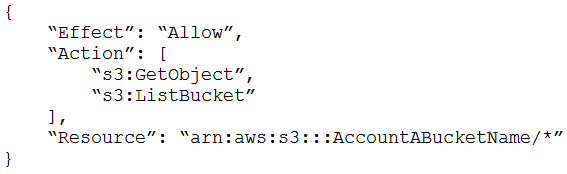
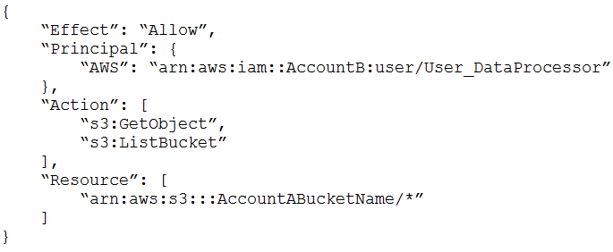

# 1
A company needs to architect a hybrid DNS solution. This solution will use an Amazon Route 53 private hosted zone for the domain cloud.example.com for the resources stored within VPCs.
The company has the following DNS resolution requirements:
On-premises systems should be able to resolve and connect to cloud.example.com.
All VPCs should be able to resolve cloud.example.com.
There is already an AWS Direct Connect connection between the on-premises corporate network and AWS Transit Gateway.
Which architecture should the company use to meet these requirements with the HIGHEST performance?

---

- 하이브리드 DNS 솔루션을 설계해야 함
- Amazon Route 53 프라이빗 호스티드존을 사용
    - VPCs 내에 저장된 리소스에 대한 cloud.example.com 도메인을 위함
    - Amazon Route 53 프라이빗 호스티드존
        > Private DNS 서비스로 VPC 내에서만 접근 가능한 도메인을 설정할 수 있음
        > 개발이나 테스트용으로 내부에서 DNS를 사용할 때 사용
        > [Route53로 Private DNS 만들기](https://brunch.co.kr/@topasvga/758)
- OP 시스템이 리졸브해서 cloud.example.com으로 접속할 수 있어야 함
- OP 회사망과 AWS Transit GW 사이에는 AWS Direct Connect가 연결됨
- 성능이 가장 좋은 요구조건을 선택해야 됨

---

A. Associate the private hosted zone to all the VPCs. Create a Route 53 inbound resolver in the shared services VPC. Attach all VPCs to the transit gateway and create forwarding rules in the on-premises DNS server for cloud.example.com that point to the inbound resolver.

---
- Shared VPC?
> 여러 프로젝트가 공유하여 사용할 수 있는 VPC 네트워크
> Route 53 inbound resolver는 OP → VPC로 들어오는 도메인 요청을 처리하므로 공용의 위치에 두는 곳이 용이함
> [Shared VPC](https://btcd.tistory.com/29)

---


B. Associate the private hosted zone to all the VPCs. Deploy an Amazon EC2 conditional forwarder in the shared services VPC. Attach all VPCs to the transit gateway and create forwarding rules in the on-premises DNS server for cloud.example.com that point to the conditional forwarder.

C. Associate the private hosted zone to the shared services VPC. Create a Route 53 outbound resolver in the shared services VPC. Attach all VPCs to the transit gateway and create forwarding rules in the on-premises DNS server for cloud.example.com that point to the outbound resolver.

---

- Route 53 outbound resolver?
> VPC → OP로 나가는 도메인 변환 요청을 처리

- Route 53 inbound resolver?
> OP → VPC로 들어오는 도메인 요청을 처리

---

D. Associate the private hosted zone to the shared services VPC. Create a Route 53 inbound resolver in the shared services VPC. Attach the shared services VPC to the transit gateway and create forwarding rules in the on-premises DNS server for cloud.example.com that point to the inbound resolver.
 
# 2
A company is providing weather data over a REST-based API to several customers. The API is hosted by Amazon API Gateway and is integrated with different AWS Lambda functions for each API operation. The company uses Amazon Route 53 for DNS and has created a resource record of weather.example.com. The company stores data for the API in Amazon DynamoDB tables. The company needs a solution that will give the API the ability to fail over to a different AWS Region.
Which solution will meet these requirements?

---

A. Deploy a new set of Lambda functions in a new Region. Update the API Gateway API to use an edge-optimized API endpoint with Lambda functions from both Regions as targets. Convert the DynamoDB tables to global tables.

B. Deploy a new API Gateway API and Lambda functions in another Region. Change the Route 53 DNS record to a multivalue answer. Add both API Gateway APIs to the answer. Enable target health monitoring. Convert the DynamoDB tables to global tables.

C. Deploy a new API Gateway API and Lambda functions in another Region. Change the Route 53 DNS record to a failover record. Enable target health monitoring. Convert the DynamoDB tables to global tables.

D. Deploy a new API Gateway API in a new Region. Change the Lambda functions to global functions. Change the Route 53 DNS record to a multivalue answer. Add both API Gateway APIs to the answer. Enable target health monitoring. Convert the DynamoDB tables to global tables.

---

## 문제 풀이
- 요구사항: API가 다른 리전으로 패일오버(fail over)하는 솔루션이 필요함
- 패일오버: 시스템의 가용성 유지를 위해 시스템 장애 시 대체 자원으로 전환하는 과정
- Edge-optimized API: 클라이언트 요청을 가장 가까운 AWS CloudFront 엣지 위치로 라우팅. API 응답 시간을 줄이고 사용자 경험 최적화
    - 패일오버 메커니즘이 자동화되어 있지 않음
- Multivalue answer routing policy은 다음 이유로 완전한 패일오버를 보장하지 못한다고 함
    - 헬스 체크(Health Check) 주기 지연: 주기적으로 엔드포인트의 헬스 체크를 확인하므로 실시간성이 떨어짐
    - 클라이언트 선택에 의존
        - 반환받은 여러 개의 IP 중 최종 IP는 결국 클라이언트 리졸버가 결정해야 함
        - 클라이언트가 IP를 받고 결정하는 과정 중에 엔드포인트에 장애가 발생할 가능성이 있음
    - 이 정책은 트래픽 분산의 목적으로 설계되었으며, 패일오버를 위한 주-보조(Primary-Secondary) 구조 설계가 부재함
 

# 3
A company uses AWS Organizations with a single OU named Production to manage multiple accounts. All accounts are members of the Production OU. Administrators use deny list SCPs in the root of the organization to manage access to restricted services.
The company recently acquired a new business unit and invited the new unit’s existing AWS account to the organization. Once onboarded, the administrators of the new business unit discovered that they are not able to update existing AWS Config rules to meet the company’s policies.
Which option will allow administrators to make changes and continue to enforce the current policies without introducing additional long-term maintenance?

A. Remove the organization’s root SCPs that limit access to AWS Config. Create AWS Service Catalog products for the company’s standard AWS Config rules and deploy them throughout the organization, including the new account.

B. Create a temporary OU named Onboarding for the new account. Apply an SCP to the Onboarding OU to allow AWS Config actions. Move the new account to the Production OU when adjustments to AWS Config are complete.

C. Convert the organization’s root SCPs from deny list SCPs to allow list SCPs to allow the required services only. Temporarily apply an SCP to the organization’s root that allows AWS Config actions for principals only in the new account.

D. Create a temporary OU named Onboarding for the new account. Apply an SCP to the Onboarding OU to allow AWS Config actions. Move the organization’s root SCP to the Production OU. Move the new account to the Production OU when adjustments to AWS Config are complete.
 
- IAM user(or role)와 SCP의 설정이 아래와 같이 된 경우, 
- IAM user(or role)은 d, e, f 권한만 사용 가능함
    - IAM 설정: a, b, c, d, e, f, g, h, i
    - SCP 설정:          d, e, f,
- 즉, SCP는 IAM user(or role) 권한의 가드레일(guard rail)을 설정함
- SCP가 IAM user(or role)처럼 직접 주체(pricipal)에 권한을 부여하지는 않음
- SCP는 상속되므로 root SCP를 옮기거나 삭제하는 행위는 옳바르지 않음


## IAM User vs. AWS Resource

- IAM User: 명시적으로 ```sts:AssumeRole``` 권한 필요
    - IAM User가 IAM Role을 수행하려면 ```sts:AssumeRole``` API를 호출해야 함
    - 이를 위해 IAM User의 정책에 명시적으로 ```Action: "sts:AssumeRole"```을 허용하는 규칙을 추가해야 함
    - 이 방식은 IAM User가 IAM Role을 수행할 수 있는지 명확하게 제어하고 추적하기 위해 필요함

- AWS Resource: 신뢰 정책만으로 충분
    - AWS Resource가 IAM Role을 수행할 때는 신뢰 정책만 올바르게 설정되어 있으면 됨
    - AWS 서비스는 내부적으로 ```sts:AssumeRole``` API를 호출하지만, 이를 위해 추가적인 권한 정책이 필요하지 않음
    - AWS Resource와 IAM Role 간의 관계는 신뢰 정책에 정의된 ```Principal``` 설정을 통해 제어됨

- IAM Role 주체(Principal) 추가의 필요성
    - IAM User가 sts:AssumeRole 권한을 가졌더라도, IAM Role의 주체로 ARN이 추가되지 않으면 역할 수행 불가능


- IAM Policy는 IAM User, Group, Role 제약이 없다보니 

## IAM User의 사용자 이름과 AWS Account의 계정 이름
- IAM User의 사용자 이름과 AWS Account의 계정 이름은 다른 것
- IAM User는 다음과 같이 사용자 이름을 가지며, 이에 따라 ARN이 부여됨
    - 사용자 이름: johndoe
    - ARN: arn:aws:iam::123456789012:user/johndoe
- AWS Account에는 일반적인 흔한 로그인 방식과는 달리 사용자 이름이 없음
    - 계정 이름: marketing-account
    - 이메일: marketing@example.com
 
- AWS Account가 사용자 이름을 가지라면 IAM User를 추가해야 함
- 여러 AWS Account에 동일한 IAM User를 추가할 수 있음(사용자 이름 중복 가능)

 https://chatgpt.com/share/674482f8-bce4-800a-877d-8584d9642518
 여기 좀 정리하자.


# Principal 종류
- IAM User, IAM Role, AWS Service, AWS Account, Federated Users, Anaonymous Users (URSA)

# IAM Policy
- 적용 가능: IAM User, IAM Group, IAM Role, Resource-Based Policy
- IAM Policy에는 Principal을 지정 불가
- IAM Policy → (IAM User, IAM Group, IAM Role, Resource-Based Policy): 추가 가능
    - 반대는 불가능

# 4
A company is running a two-tier web-based application in an on-premises data center. The application layer consists of a single server running a stateful application. The application connects to a PostgreSQL database running on a separate server. The application’s user base is expected to grow significantly, so the company is migrating the application and database to AWS. The solution will use Amazon Aurora PostgreSQL, Amazon EC2 Auto Scaling, and Elastic Load Balancing.
Which solution will provide a consistent user experience that will allow the application and database tiers to scale?

A. Enable Aurora Auto Scaling for Aurora Replicas. Use a Network Load Balancer with the least outstanding requests routing algorithm and sticky sessions enabled.
B. Enable Aurora Auto Scaling for Aurora writers. Use an Application Load Balancer with the round robin routing algorithm and sticky sessions enabled.
C. Enable Aurora Auto Scaling for Aurora Replicas. Use an Application Load Balancer with the round robin routing and sticky sessions enabled.
D. Enable Aurora Scaling for Aurora writers. Use a Network Load Balancer with the least outstanding requests routing algorithm and sticky sessions enabled.
 
# 5
A company uses a service to collect metadata from applications that the company hosts on premises. Consumer devices such as TVs and internet radios access the applications. Many older devices do not support certain HTTP headers and exhibit errors when these headers are present in responses. The company has configured an on-premises load balancer to remove the unsupported headers from responses sent to older devices, which the company identified by the User-Agent headers.
The company wants to migrate the service to AWS, adopt serverless technologies, and retain the ability to support the older devices. The company has already migrated the applications into a set of AWS Lambda functions.
Which solution will meet these requirements?

---

A. Create an Amazon CloudFront distribution for the metadata service. Create an Application Load Balancer (ALB). Configure the CloudFront distribution to forward requests to the ALB. Configure the ALB to invoke the correct Lambda function for each type of request. Create a CloudFront function to remove the problematic headers based on the value of the User-Agent header.

B. Create an Amazon API Gateway REST API for the metadata service. Configure API Gateway to invoke the correct Lambda function for each type of request. Modify the default gateway responses to remove the problematic headers based on the value of the User-Agent header.

C. Create an Amazon API Gateway HTTP API for the metadata service. Configure API Gateway to invoke the correct Lambda function for each type of request. Create a response mapping template to remove the problematic headers based on the value of the User-Agent. Associate the response data mapping with the HTTP API.

D. Create an Amazon CloudFront distribution for the metadata service. Create an Application Load Balancer (ALB). Configure the CloudFront distribution to forward requests to the ALB. Configure the ALB to invoke the correct Lambda function for each type of request. Create a Lambda@Edge function that will remove the problematic headers in response to viewer requests based on the value of the User-Agent header.

---

- Many older devices do not support certain HTTP headers and exhibit errors when these headers are present in responses.
    - 오래된 디바이스가 특정 HTTP 헤더를 지원하지 않고, 그런 헤더가 응답에 나타나면 오류를 발생

- 지원하지 않는 헤더를 제거하도록 온프레미스 로드밸런스 설정 필요
- 서비스를 AWS로 마이그레이션하고, 서버리스 기술 채택, 오래된 디바이스를 지원은 계쏙해야 함
- 람다 함수 세트로 애플리케이션으로 마이그레이션은 완료함

## Lambda@Edge vs. CloudFront Functions

| 항목               | **Lambda@Edge**                                     | **CloudFront Functions**                          |
|------------------|----------------------------------------------------|-------------------------------------------------|
| **기능**          | 고급 로직 처리 (복잡한 데이터 처리, API 호출 등)     | 간단한 요청/응답 수정 (헤더 추가/제거, 리다이렉션)  |
| **사용 사례**      | 동적 콘텐츠 수정, 인증, 복잡한 데이터 변환           | 간단한 헤더 수정, URL 리다이렉션 등 단순 작업       |
| **성능**           | 더 높은 지연 시간, 하지만 빠른 응답 속도               | 매우 빠르며, 낮은 지연 시간                        |
| **가격**           | 요청 및 실행 시간에 따라 비용 발생                    | 더 저렴하며, 경량 작업에 적합                      |
| **확장성**         | 고급 기능을 지원하는 더 넓은 확장성                   | 제한적인 기능, 간단한 작업에 적합                  |

- **Lambda@Edge**는 복잡한 처리 로직을 필요로 하는 경우에 적합하며, **CloudFront Functions**는 단순한 헤더 수정, 리다이렉션 같은 **가벼운 작업**에 적합합니다.
- **성능 측면**에서 CloudFront Functions가 더 빠르지만, 로직의 복잡성에 따라 선택해야 함
- 이 문제에서는 헤더의 삭제 작업을 요구하는 비교적 간단한 작업이 요구되므로 Lambda@Edge 보다는 CloudFront Functions를 사용하는 것이 비용 및 성능 관점에서 더 효율적이라 판단됨

---
 
# 6
A retail company needs to provide a series of data files to another company, which is its business partner. These files are saved in an Amazon S3 bucket under Account A, which belongs to the retail company. The business partner company wants one of its IAM users, User_DataProcessor, to access the files from its own AWS account (Account B).
Which combination of steps must the companies take so that User_DataProcessor can access the S3 bucket successfully? (Choose two.)

--- 

- Retail Comp.는 일련의 파일을 비즈니스 파트너인 다른 Comp.로 제공해야 함
- 파일들은 Retail Comp.의 A계정 아래 S3 버킷에 저장
- 파트너 Comp.는 IAM User 중 한 명인 User_DataProcessor가 자체 AWS계정(B계정)에서 파일에 접근하기를 원함
- User_DataProcessor가 S3버킷에 성공적으로 접근할 수 있도록 조합된 단계는?

### ?????
- S3 bucket policy에 Principal을 지정하면 누가 이 버킷의 권한을 사용할 수 있는지 명시하는 것일까?

네, 맞습니다. **S3 버킷 정책(S3 bucket policy)**에서 **Principal**을 지정하면, 해당 버킷의 권한을 **누가** 사용할 수 있는지 명시하는 것입니다.

- **Principal**은 **정책을 적용할 대상 사용자** 또는 **엔터티(주체)**를 정의합니다. 예를 들어, 특정 **IAM 사용자**, **AWS 서비스**, **AWS 역할**, **정책을 사용하는 외부 계정** 등이 될 수 있습니다.
- 이를 통해, **버킷에 대한 접근 권한을 가진 주체가 누구인지**를 정의할 수 있습니다.

IAM Policy에는 Principal 지정 불가
---


A. Turn on the cross-origin resource sharing (CORS) feature for the S3 bucket in Account A.

B. In Account A, set the S3 bucket policy to the following:



C. In Account A, set the S3 bucket policy to the following:


D. In Account B, set the permissions of User_DataProcessor to the following:


E. In Account B, set the permissions of User_DataProcessor to the following:



 
# 7
A company is running a traditional web application on Amazon EC2 instances. The company needs to refactor the application as microservices that run on containers. Separate versions of the application exist in two distinct environments: production and testing. Load for the application is variable, but the minimum load and the maximum load are known. A solutions architect needs to design the updated application with a serverless architecture that minimizes operational complexity.
Which solution will meet these requirements MOST cost-effectively?

---

A. Upload the container images to AWS Lambda as functions. Configure a concurrency limit for the associated Lambda functions to handle the expected peak load. Configure two separate Lambda integrations within Amazon API Gateway: one for production and one for testing.

B. Upload the container images to Amazon Elastic Container Registry (Amazon ECR). Configure two auto scaled Amazon Elastic Container Service (Amazon ECS) clusters with the Fargate launch type to handle the expected load. Deploy tasks from the ECR images. Configure two separate Application Load Balancers to direct traffic to the ECS clusters.

C. Upload the container images to Amazon Elastic Container Registry (Amazon ECR). Configure two auto scaled Amazon Elastic Kubernetes Service (Amazon EKS) clusters with the Fargate launch type to handle the expected load. Deploy tasks from the ECR images. Configure two separate Application Load Balancers to direct traffic to the EKS clusters.

D. Upload the container images to AWS Elastic Beanstalk. In Elastic Beanstalk, create separate environments and deployments for production and testing. Configure two separate Application Load Balancers to direct traffic to the Elastic Beanstalk deployments.
 

## ECS vs. EKS
- ECS가 EKS보다 비용이 더 낮은 이유를 설명해줘.
- ECS는 AWS에서 제공하는 관리형 컨테이너 서비스로, AWS의 기본 인프라에 최적화됨
- 별도의 관리 클러스터(Control Plane)가 필요 없으며 모든 작업(태스크 관리, 스케줄링 등)은 AWS의 기본 제공 서비스에서 처리
- 관리 비용이 무료이며, ECS 자체를 사용하는 데 추가 비용이 발생하지 않음
- EKS는 쿠버네티스의 관리형 서비스로, 쿠버네티스 클러스터를 AWS가 운영
- **클러스터 관리비용이 발생 시간당 $0.10 비용이 추가되는데, 이건 ECS에서는 없는 비용**
- 기본적인 설정 및 유지 관리를 사용자가 많이 해야 함


# 8
A company has a multi-tier web application that runs on a fleet of Amazon EC2 instances behind an Application Load Balancer (ALB). The instances are in an Auto Scaling group. The ALB and the Auto Scaling group are replicated in a backup AWS Region. The minimum value and the maximum value for the Auto Scaling group are set to zero. An Amazon RDS Multi-AZ DB instance stores the application’s data. The DB instance has a read replica in the backup Region. The application presents an endpoint to end users by using an Amazon Route 53 record.
The company needs to reduce its RTO to less than 15 minutes by giving the application the ability to automatically fail over to the backup Region. The company does not have a large enough budget for an active-active strategy.
What should a solutions architect recommend to meet these requirements?

---

A. Reconfigure the application’s Route 53 record with a latency-based routing policy that load balances traffic between the two ALBs. Create an AWS Lambda function in the backup Region to promote the read replica and modify the Auto Scaling group values. Create an Amazon CloudWatch alarm that is based on the HTTPCode_Target_5XX_Count metric for the ALB in the primary Region. Configure the CloudWatch alarm to invoke the Lambda function.

B. Create an AWS Lambda function in the backup Region to promote the read replica and modify the Auto Scaling group values. Configure Route 53 with a health check that monitors the web application and sends an Amazon Simple Notification Service (Amazon SNS) notification to the Lambda function when the health check status is unhealthy. Update the application’s Route 53 record with a failover policy that routes traffic to the ALB in the backup Region when a health check failure occurs.

C. Configure the Auto Scaling group in the backup Region to have the same values as the Auto Scaling group in the primary Region. Reconfigure the application’s Route 53 record with a latency-based routing policy that load balances traffic between the two ALBs. Remove the read replica. Replace the read replica with a standalone RDS DB instance. Configure Cross-Region Replication between the RDS DB instances by using snapshots and Amazon S3.

D. Configure an endpoint in AWS Global Accelerator with the two ALBs as equal weighted targets. Create an AWS Lambda function in the backup Region to promote the read replica and modify the Auto Scaling group values. Create an Amazon CloudWatch alarm that is based on the HTTPCode_Target_5XX_Count metric for the ALB in the primary Region. Configure the CloudWatch alarm to invoke the Lambda function.
 
# 9
A company is hosting a critical application on a single Amazon EC2 instance. The application uses an Amazon ElastiCache for Redis single-node cluster for an in-memory data store. The application uses an Amazon RDS for MariaDB DB instance for a relational database. For the application to function, each piece of the infrastructure must be healthy and must be in an active state.
A solutions architect needs to improve the application's architecture so that the infrastructure can automatically recover from failure with the least possible downtime.
Which combination of steps will meet these requirements? (Choose three.)

---

A. Use an Elastic Load Balancer to distribute traffic across multiple EC2 instances. Ensure that the EC2 instances are part of an Auto Scaling group that has a minimum capacity of two instances.

B. Use an Elastic Load Balancer to distribute traffic across multiple EC2 instances. Ensure that the EC2 instances are configured in unlimited mode.

C. Modify the DB instance to create a read replica in the same Availability Zone. Promote the read replica to be the primary DB instance in failure scenarios.

D. Modify the DB instance to create a Multi-AZ deployment that extends across two Availability Zones.

E. Create a replication group for the ElastiCache for Redis cluster. Configure the cluster to use an Auto Scaling group that has a minimum capacity of two instances.

F. Create a replication group for the ElastiCache for Redis cluster. Enable Multi-AZ on the cluster.
 
# 10
A retail company is operating its ecommerce application on AWS. The application runs on Amazon EC2 instances behind an Application Load Balancer (ALB). The company uses an Amazon RDS DB instance as the database backend. Amazon CloudFront is configured with one origin that points to the ALB. Static content is cached. Amazon Route 53 is used to host all public zones.
After an update of the application, the ALB occasionally returns a 502 status code (Bad Gateway) error. The root cause is malformed HTTP headers that are returned to the ALB. The webpage returns successfully when a solutions architect reloads the webpage immediately after the error occurs.
While the company is working on the problem, the solutions architect needs to provide a custom error page instead of the standard ALB error page to visitors.
Which combination of steps will meet this requirement with the LEAST amount of operational overhead? (Choose two.)

---

- 리테일 회사는 이커머스 애플리케이션을 AWS에서 운영중
- 애플리케이션은 ALB - EC2에서 실행
- DB는 RDS DB 인스턴스 사용
- CloudFront는 ALB로 연결되는 하나의 오리진으로 구성

---

A. Create an Amazon S3 bucket. Configure the S3 bucket to host a static webpage. Upload the custom error pages to Amazon S3.

B. Create an Amazon CloudWatch alarm to invoke an AWS Lambda function if the ALB health check response Target.FailedHealthChecks is greater than 0. Configure the Lambda function to modify the forwarding rule at the ALB to point to a publicly accessible web server.

C. Modify the existing Amazon Route 53 records by adding health checks. Configure a fallback target if the health check fails. Modify DNS records to point to a publicly accessible webpage.

D. Create an Amazon CloudWatch alarm to invoke an AWS Lambda function if the ALB health check response Elb.InternalError is greater than 0. Configure the Lambda function to modify the forwarding rule at the ALB to point to a public accessible web server.

E. Add a custom error response by configuring a CloudFront custom error page. Modify DNS records to point to a publicly accessible web page.

# 11 
A company has many AWS accounts and uses AWS Organizations to manage all of them. A solutions architect must implement a solution that the company can use to share a common network across multiple accounts.
The company’s infrastructure team has a dedicated infrastructure account that has a VPC. The infrastructure team must use this account to manage the network. Individual accounts cannot have the ability to manage their own networks. However, individual accounts must be able to create AWS resources within subnets.
Which combination of actions should the solutions architect perform to meet these requirements? (Choose two.)

A. Create a transit gateway in the infrastructure account.

B. Enable resource sharing from the AWS Organizations management account.

C. Create VPCs in each AWS account within the organization in AWS Organizations. Configure the VPCs to share the same CIDR range and subnets as the VPC in the infrastructure account. Peer the VPCs in each individual account with the VPC in the infrastructure account.

D. Create a resource share in AWS Resource Access Manager in the infrastructure account. Select the specific AWS Organizations OU that will use the shared network. Select each subnet to associate with the resource share.

E. Create a resource share in AWS Resource Access Manager in the infrastructure account. Select the specific AWS Organizations OU that will use the shared network. Select each prefix list to associate with the resource share.

# 12
A company wants to use a third-party software-as-a-service (SaaS) application. The third-party SaaS application is consumed through several API calls. The third-party SaaS application also runs on AWS inside a VPC.

The company will consume the third-party SaaS application from inside a VPC. The company has internal security policies that mandate the use of private connectivity that does not traverse the internet. No resources that run in the company VPC are allowed to be accessed from outside the company’s VPC. All permissions must conform to the principles of least privilege.

Which solution meets these requirements?

A. Create an AWS PrivateLink interface VPC endpoint. Connect this endpoint to the endpoint service that the third-party SaaS application provides. Create a security group to limit the access to the endpoint. Associate the security group with the endpoint.

B. Create an AWS Site-to-Site VPN connection between the third-party SaaS application and the company VPC. Configure network ACLs to limit access across the VPN tunnels.

C. Create a VPC peering connection between the third-party SaaS application and the company VPUpdate route tables by adding the needed routes for the peering connection.

D. Create an AWS PrivateLink endpoint service. Ask the third-party SaaS provider to create an interface VPC endpoint for this endpoint service. Grant permissions for the endpoint service to the specific account of the third-party SaaS provider.
 
Question #13Topic 1
A company needs to implement a patching process for its servers. The on-premises servers and Amazon EC2 instances use a variety of tools to perform patching. Management requires a single report showing the patch status of all the servers and instances.
Which set of actions should a solutions architect take to meet these requirements?

A. Use AWS Systems Manager to manage patches on the on-premises servers and EC2 instances. Use Systems Manager to generate patch compliance reports.
B. Use AWS OpsWorks to manage patches on the on-premises servers and EC2 instances. Use Amazon QuickSight integration with OpsWorks to generate patch compliance reports.
C. Use an Amazon EventBridge rule to apply patches by scheduling an AWS Systems Manager patch remediation job. Use Amazon Inspector to generate patch compliance reports.
D. Use AWS OpsWorks to manage patches on the on-premises servers and EC2 instances. Use AWS X-Ray to post the patch status to AWS Systems Manager OpsCenter to generate patch compliance reports.
 
Question #14Topic 1
A company is running an application on several Amazon EC2 instances in an Auto Scaling group behind an Application Load Balancer. The load on the application varies throughout the day, and EC2 instances are scaled in and out on a regular basis. Log files from the EC2 instances are copied to a central Amazon S3 bucket every 15 minutes. The security team discovers that log files are missing from some of the terminated EC2 instances.
Which set of actions will ensure that log files are copied to the central S3 bucket from the terminated EC2 instances?

A. Create a script to copy log files to Amazon S3, and store the script in a file on the EC2 instance. Create an Auto Scaling lifecycle hook and an Amazon EventBridge rule to detect lifecycle events from the Auto Scaling group. Invoke an AWS Lambda function on the autoscaling:EC2_INSTANCE_TERMINATING transition to send ABANDON to the Auto Scaling group to prevent termination, run the script to copy the log files, and terminate the instance using the AWS SDK.
B. Create an AWS Systems Manager document with a script to copy log files to Amazon S3. Create an Auto Scaling lifecycle hook and an Amazon EventBridge rule to detect lifecycle events from the Auto Scaling group. Invoke an AWS Lambda function on the autoscaling:EC2_INSTANCE_TERMINATING transition to call the AWS Systems Manager API SendCommand operation to run the document to copy the log files and send CONTINUE to the Auto Scaling group to terminate the instance.
C. Change the log delivery rate to every 5 minutes. Create a script to copy log files to Amazon S3, and add the script to EC2 instance user data. Create an Amazon EventBridge rule to detect EC2 instance termination. Invoke an AWS Lambda function from the EventBridge rule that uses the AWS CLI to run the user-data script to copy the log files and terminate the instance.
D. Create an AWS Systems Manager document with a script to copy log files to Amazon S3. Create an Auto Scaling lifecycle hook that publishes a message to an Amazon Simple Notification Service (Amazon SNS) topic. From the SNS notification, call the AWS Systems Manager API SendCommand operation to run the document to copy the log files and send ABANDON to the Auto Scaling group to terminate the instance.
 
Question #15Topic 1
A company is using multiple AWS accounts. The DNS records are stored in a private hosted zone for Amazon Route 53 in Account A. The company’s applications and databases are running in Account B.
A solutions architect will deploy a two-tier application in a new VPC. To simplify the configuration, the db.example.com CNAME record set for the Amazon RDS endpoint was created in a private hosted zone for Amazon Route 53.
During deployment, the application failed to start. Troubleshooting revealed that db.example.com is not resolvable on the Amazon EC2 instance. The solutions architect confirmed that the record set was created correctly in Route 53.
Which combination of steps should the solutions architect take to resolve this issue? (Choose two.)

A. Deploy the database on a separate EC2 instance in the new VPC. Create a record set for the instance’s private IP in the private hosted zone.
B. Use SSH to connect to the application tier EC2 instance. Add an RDS endpoint IP address to the /etc/resolv.conf file.
C. Create an authorization to associate the private hosted zone in Account A with the new VPC in Account B.
D. Create a private hosted zone for the example com domain in Account B. Configure Route 53 replication between AWS accounts.
E. Associate a new VPC in Account B with a hosted zone in Account A. Delete the association authorization in Account A.
 
Question #16Topic 1
A company used Amazon EC2 instances to deploy a web fleet to host a blog site. The EC2 instances are behind an Application Load Balancer (ALB) and are configured in an Auto Scaling group. The web application stores all blog content on an Amazon EFS volume.
The company recently added a feature for bloggers to add video to their posts, attracting 10 times the previous user traffic. At peak times of day, users report buffering and timeout issues while attempting to reach the site or watch videos.
Which is the MOST cost-efficient and scalable deployment that will resolve the issues for users?

A. Reconfigure Amazon EFS to enable maximum I/O.
B. Update the blog site to use instance store volumes for storage. Copy the site contents to the volumes at launch and to Amazon S3 at shutdown.
C. Configure an Amazon CloudFront distribution. Point the distribution to an S3 bucket, and migrate the videos from EFS to Amazon S3.
D. Set up an Amazon CloudFront distribution for all site contents, and point the distribution at the ALB.
 
Question #17Topic 1
A company with global offices has a single 1 Gbps AWS Direct Connect connection to a single AWS Region. The company’s on-premises network uses the connection to communicate with the company’s resources in the AWS Cloud. The connection has a single private virtual interface that connects to a single VPC.
A solutions architect must implement a solution that adds a redundant Direct Connect connection in the same Region. The solution also must provide connectivity to other Regions through the same pair of Direct Connect connections as the company expands into other Regions.
Which solution meets these requirements?

A. Provision a Direct Connect gateway. Delete the existing private virtual interface from the existing connection. Create the second Direct Connect connection. Create a new private virtual interface on each connection, and connect both private virtual interfaces to the Direct Connect gateway. Connect the Direct Connect gateway to the single VPC.
B. Keep the existing private virtual interface. Create the second Direct Connect connection. Create a new private virtual interface on the new connection, and connect the new private virtual interface to the single VPC.
C. Keep the existing private virtual interface. Create the second Direct Connect connection. Create a new public virtual interface on the new connection, and connect the new public virtual interface to the single VPC.
D. Provision a transit gateway. Delete the existing private virtual interface from the existing connection. Create the second Direct Connect connection. Create a new private virtual interface on each connection, and connect both private virtual interfaces to the transit gateway. Associate the transit gateway with the single VPC.
 
Question #18Topic 1
A company has a web application that allows users to upload short videos. The videos are stored on Amazon EBS volumes and analyzed by custom recognition software for categorization.
The website contains static content that has variable traffic with peaks in certain months. The architecture consists of Amazon EC2 instances running in an Auto Scaling group for the web application and EC2 instances running in an Auto Scaling group to process an Amazon SQS queue. The company wants to re-architect the application to reduce operational overhead using AWS managed services where possible and remove dependencies on third-party software.
Which solution meets these requirements?

A. Use Amazon ECS containers for the web application and Spot instances for the Auto Scaling group that processes the SQS queue. Replace the custom software with Amazon Rekognition to categorize the videos.
B. Store the uploaded videos in Amazon EFS and mount the file system to the EC2 instances for the web application. Process the SQS queue with an AWS Lambda function that calls the Amazon Rekognition API to categorize the videos.
C. Host the web application in Amazon S3. Store the uploaded videos in Amazon S3. Use S3 event notification to publish events to the SQS queue. Process the SQS queue with an AWS Lambda function that calls the Amazon Rekognition API to categorize the videos.
D. Use AWS Elastic Beanstalk to launch EC2 instances in an Auto Scaling group for the web application and launch a worker environment to process the SQS queue. Replace the custom software with Amazon Rekognition to categorize the videos.
 
Question #19Topic 1
A company has a serverless application comprised of Amazon CloudFront, Amazon API Gateway, and AWS Lambda functions. The current deployment process of the application code is to create a new version number of the Lambda function and run an AWS CLI script to update. If the new function version has errors, another CLI script reverts by deploying the previous working version of the function. The company would like to decrease the time to deploy new versions of the application logic provided by the Lambda functions, and also reduce the time to detect and revert when errors are identified.
How can this be accomplished?

A. Create and deploy nested AWS CloudFormation stacks with the parent stack consisting of the AWS CloudFront distribution and API Gateway, and the child stack containing the Lambda function. For changes to Lambda, create an AWS CloudFormation change set and deploy; if errors are triggered, revert the AWS CloudFormation change set to the previous version.
B. Use AWS SAM and built-in AWS CodeDeploy to deploy the new Lambda version, gradually shift traffic to the new version, and use pre-traffic and post-traffic test functions to verify code. Rollback if Amazon CloudWatch alarms are triggered.
C. Refactor the AWS CLI scripts into a single script that deploys the new Lambda version. When deployment is completed, the script tests execute. If errors are detected, revert to the previous Lambda version.
D. Create and deploy an AWS CloudFormation stack that consists of a new API Gateway endpoint that references the new Lambda version. Change the CloudFront origin to the new API Gateway endpoint, monitor errors and if detected, change the AWS CloudFront origin to the previous API Gateway endpoint.
 
Question #20Topic 1
A company is planning to store a large number of archived documents and make the documents available to employees through the corporate intranet. Employees will access the system by connecting through a client VPN service that is attached to a VPC. The data must not be accessible to the public.
The documents that the company is storing are copies of data that is held on physical media elsewhere. The number of requests will be low. Availability and speed of retrieval are not concerns of the company.
Which solution will meet these requirements at the LOWEST cost?

A. Create an Amazon S3 bucket. Configure the S3 bucket to use the S3 One Zone-Infrequent Access (S3 One Zone-IA) storage class as default. Configure the S3 bucket for website hosting. Create an S3 interface endpoint. Configure the S3 bucket to allow access only through that endpoint.
B. Launch an Amazon EC2 instance that runs a web server. Attach an Amazon Elastic File System (Amazon EFS) file system to store the archived data in the EFS One Zone-Infrequent Access (EFS One Zone-IA) storage class Configure the instance security groups to allow access only from private networks.
C. Launch an Amazon EC2 instance that runs a web server Attach an Amazon Elastic Block Store (Amazon EBS) volume to store the archived data. Use the Cold HDD (sc1) volume type. Configure the instance security groups to allow access only from private networks.
D. Create an Amazon S3 bucket. Configure the S3 bucket to use the S3 Glacier Deep Archive storage class as default. Configure the S3 bucket for website hosting. Create an S3 interface endpoint. Configure the S3 bucket to allow access only through that endpoint.
 
