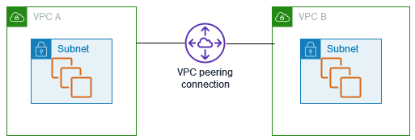

# AWS Transit Gateway
- VPC와 VPC, VPC와 온프레미스 간 네트워크를 상호 연결할 수 있도록 만들어주는 네트워크 전송허브

- VPC peering을 통해 연결하는 것도 좋은 방법이지만, 연결된 커넥션이 많을수록 관리가 어렵고 라우팅 테이블이 복잡하므로 쉬운 관리 및 확장성을 가진 Transit Gateway를 많이 사용

# VPC Peering
- 프라이빗 IPv4 또는 IPv6를 사용하여 두 VPC 간 트래픽을 라우팅할 수 있도록 하기 위한 VP 간 네트워킹 연결

- 동일한 네트워크에 속하는 경우처럼 VPC의 인스턴스가 서로 통신 가능

- 사용자의 자체 VPC 또는 다른 AWS 계정의 VPC와 VPC 피어링 연결을 만들 수 있으며, VPC는 상이한 리전에 있을 수 있음

- 고객은 한 리전 내에서 VPC를 상호 연결하기 위해 VPC 피어링 사용
- VPC 피어링은 한 리전에서 적은 수의 VPC를 상호 연결하여 메시 연결성을 달성하려 할 때 일반적으로 사용
- 대규모 수백 똔느 수천개의 VPC를 상호 연결하려고 하면 AWS Transit Gateway 및 AWS PrivateLink가 권장됨

- 2021년 5월부터 AZ 내 유지되는 VPC 피어링 연결을 통한 모든 데이터 전송은 무료이지만, AZ를 가로지르는 연결은 전송요금이 청구됨

### 참고사이트
- [AWS Transit Gateway란? AWS계정간 VPC 통신하기](https://jaykos96.tistory.com/48)

- [[AWS] VPC Peering이란 무엇인가?](https://cloud-allstudy.tistory.com/1085)