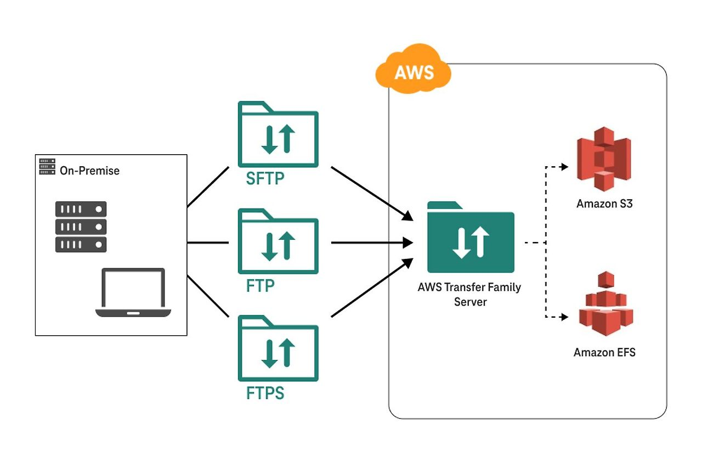

# AWS Transfer Family

- AWS Transfer Family는 안전한 파일 전송을 지원하는 AWS 관리형 서비스
- SFTP, FTPS, FTP 프로토콜을 통해 데이터를 Amazon S3 또는 Amazon EFS로 직접 전송할 수 있게 함
- 이는 기존의 파일 전송 프로토콜을 클라우드 환경에서도 안전하고 원활하게 사용할 수 있게 하여, 온프레미스 워크로드를 클라우드로 쉽게 이전할 수 있도록 도움

### AWS Transfer Family의 주요 특징
1. **보안 및 규정 준수**: 데이터 전송 중 암호화, 사용자 인증을 지원하여 파일 전송의 보안성을 높이며 AWS의 다양한 보안 및 규정 준수 기능과 통합됩니다.

2. **기존 SFTP/FTPS/FTP 클라이언트 호환**: 기존에 사용하던 클라이언트 프로그램을 수정할 필요 없이 AWS Transfer Family와 연동할 수 있습니다.

3. **Amazon S3 및 EFS와의 통합**: AWS S3와 EFS에 데이터를 저장하여, 데이터 레이크나 분석, 머신러닝 파이프라인과 같은 다양한 AWS 서비스와 쉽게 통합이 가능합니다.

4. **확장성 및 고가용성**: AWS 인프라 기반으로 자동 확장과 높은 가용성을 제공하여 트래픽의 급증에도 안정적인 전송이 가능합니다.

5. **액세스 제어와 로깅**: IAM을 통한 사용자 인증, 접속 제어 및 AWS CloudWatch와 CloudTrail을 통한 파일 전송 및 사용자 활동 모니터링이 가능합니다.

### AWS Transfer Family의 작동 방식
AWS Transfer Family는 **전송 서버(Transfer Server)**를 생성하고, 이를 통해 SFTP, FTPS, 또는 FTP 프로토콜을 사용하는 클라이언트와 데이터를 주고받습니다.  
주요 작업 흐름은 다음과 같습니다.

1. **서버 설정**: SFTP, FTPS, FTP 중 사용할 프로토콜을 선택해 서버를 생성합니다.
2. **사용자 관리**: IAM 사용자 및 역할을 설정하여 각 사용자에게 Amazon S3나 EFS 버킷의 접근 권한을 지정합니다.
3. **데이터 전송**: 사용자들이 SFTP, FTPS, FTP 클라이언트로 데이터를 AWS로 전송하면, AWS Transfer Family가 이 데이터를 S3나 EFS에 저장합니다.
4. **모니터링 및 로깅**: 전송된 파일 수, 트래픽, 오류 로그는 AWS CloudWatch와 CloudTrail을 통해 모니터링하고 로깅할 수 있습니다.

### AWS Transfer Family의 사용 사례
1. **기업 내 B2B 파일 전송 및 공유**: 파트너사 간 안전하게 대용량 파일을 공유하고 전송할 수 있습니다.
2. **백업 및 복구**: 주기적으로 온프레미스 데이터를 S3에 저장하여 백업하고 복구 작업을 수행할 수 있습니다.
3. **데이터 파이프라인 구축**: IoT, 분석, 머신러닝 워크로드를 위해 대규모 데이터를 AWS로 전송해 저장하고 처리하는 데 적합합니다.

### AWS Transfer Family의 비용 구조
AWS Transfer Family는 **사용 시간**과 **데이터 전송량**에 따라 요금이 부과됩니다. 전송 서버가 활성화된 시간과 전송된 데이터의 양을 기준으로 요금이 책정되며, 데이터 전송량에 따라 추가 요금이 발생할 수 있습니다.