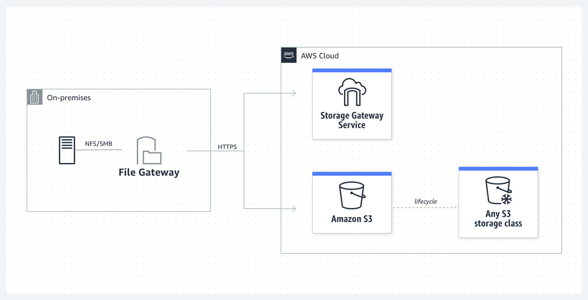

# Amazon S3 File Gateway

Amazon S3 File Gateway는 **AWS Storage Gateway**의 한 유형으로, 온프레미스 애플리케이션이 AWS S3에 안전하게 데이터를 저장하고, S3에서 파일을 손쉽게 읽고 쓸 수 있게 해주는 **파일 기반 스토리지 서비스**입니다. 이를 통해 로컬 파일 시스템에서 S3 객체 스토리지로 데이터를 통합하고, AWS의 클라우드 기능을 온프레미스 환경에 쉽게 연결할 수 있습니다.

### 주요 기능 및 특징
1. **파일 기반 인터페이스 (NFS/SMB) 제공**:
   - 로컬 애플리케이션은 S3 File Gateway를 마치 **네트워크 파일 시스템(NFS)** 또는 **서버 메시지 블록(SMB)** 공유처럼 사용할 수 있습니다.
   - 이를 통해 애플리케이션이 변경 없이 로컬 파일 시스템을 사용하는 것처럼 파일을 읽고 쓸 수 있습니다.

2. **S3와의 연동**:
   - 로컬에서 생성한 파일을 S3에 자동으로 업로드하여, S3 버킷 내 객체로 저장합니다.
   - 온프레미스 애플리케이션이 사용하는 파일을 S3로 백업하거나 아카이브할 수 있어, 장기적인 데이터 보존에 적합합니다.

3. **캐싱 기능**:
   - 자주 사용하는 파일을 로컬로 캐싱하여, 파일 접근 시 **저지연**의 성능을 제공합니다.
   - 필요할 때만 데이터를 S3로 전송하거나 가져오기 때문에, **네트워크 대역폭**을 절약할 수 있습니다.

4. **S3 버킷의 객체를 파일처럼 제공**:
   - S3에 이미 저장된 파일을 온프레미스에서 파일처럼 액세스할 수 있습니다.
   - S3 버킷의 데이터를 로컬에서 탐색하고 필요한 파일을 온프레미스 애플리케이션이 읽어올 수 있습니다.

5. **암호화 및 보안**:
   - 전송 중인 데이터와 저장된 데이터를 모두 암호화하여 안전하게 보호합니다.
   - AWS IAM을 통해 S3 접근 권한을 세밀하게 관리할 수 있습니다.

6. **온프레미스 스토리지 비용 절감**:
   - 필요한 만큼의 파일만 캐싱하고 나머지는 S3에 저장하기 때문에, 대규모 파일 스토리지가 필요 없는 경우에 유용합니다.
   - 오래된 데이터를 저렴한 S3 스토리지 클래스로 전환하여 저장 비용을 절감할 수 있습니다.

### 주요 사용 사례
1. **클라우드 백업 및 아카이빙**:
   - 온프레미스에서 생성된 파일을 자동으로 S3로 업로드하여 장기 보존이 가능합니다. 비디오 파일, 로그 파일, 데이터 백업 등의 데이터 아카이빙에 적합합니다.

2. **하이브리드 클라우드 스토리지**:
   - 로컬 환경에서 S3 버킷에 있는 데이터를 파일 시스템처럼 사용할 수 있어, 하이브리드 클라우드 환경에서 파일을 공유하고 협업하는 데 유용합니다.

3. **데이터 분석 및 머신러닝 워크로드**:
   - S3에 저장된 데이터를 AWS의 데이터 분석 및 머신러닝 서비스와 통합하여 쉽게 분석할 수 있습니다. 로컬에서 데이터를 저장하고 AWS 클라우드에서 처리하는 구조로 유연하게 활용할 수 있습니다.

### 요약
Amazon S3 File Gateway는 기존의 온프레미스 애플리케이션이 AWS S3에 데이터를 저장하고 관리하는 과정을 단순화해주는 서비스입니다. 온프레미스 스토리지와 클라우드 간의 데이터를 유기적으로 통합할 수 있으며, 파일 캐싱 및 백업 기능을 통해 성능과 비용을 최적화할 수 있습니다.

- AWS Storage Gateway 서비스의 한 구성 요소로, 온프레미스 애플리케이션이 Amazon S3를 백엔드 스토리지로 사용하여 파일을 저장하고 검색할 수 있도록 지원
- S3 File Gateway는 파일 인터페이스를 제공하여, 기존의 파일 기반 애플리케이션이 Amazon S3의 확장성과 내구성을 활용할 수 있게 함

# 주요 특징
## 1. 파일 인터페이스 지원
- S3 File Gateway는 NFS(Network File System)와 SMB(Server Message Block)와 같은 산업 표준 파일 프로토콜을 지원
- 이를 통해 온프레미스 애플리케이션이 Amazon S3에 파일을 저장하고 검색할 수 있음

## 2. 가상 어플라이언스
- S3 File Gateway는 가상 머신(VM) 형태로 배포할 수 있음
- VMware ESXi, Microsoft Hyper-V, KVM 등 다양한 하이퍼바이저 환경에서 실행할 수 있음

## 3. 하이브리드 클라우드 스토리지
- 온프레미스 환경과 클라우드 스토리지를 통합하여 하이브리드 클라우드 스토리지 솔루션을 제공함
- 로컬 캐시를 사용하여 자주 액세스하는 데이터를 빠르게 제공하고, 나머지 데이터는 Amazon S3에 저장

## 4. 데이터 보호 및 보안
- S3 File Gateway는 데이터 암호화, 액세스 제어, 감사 로그 등의 보안 기능을 제공
- Amazon S3의 버전 관리 및 S3 Object Lock 기능을 사용하여 데이터 보호 및 보존 정책을 구현할 수 있음

## 5. 확장성 및 내구성
- Amazon S3의 확장성과 내구성을 활용하여 대규모 데이터를 안전하게 저장할 수 있음
- S3 File Gateway는 자동으로 데이터를 Amazon S3에 업로드하고, 필요할 때 데이터를 검색할 수 있음

# 사용 사례
- 백업 및 아카이빙
    - 온프레미스 파일 서버의 데이터를 Amazon S3로 백업하거나 아카이빙할 수 있음
    - 장기 보존이 필요한 데이터를 안전하게 저장할 수 있음

- 파일 공유 및 협업
    - 여러 지사나 원격 근무자가 파일을 공유하고 협업할 수 있도록 지원
    - Amazon S3의 글로벌 인프라를 활용하여 빠르고 안정적인 파일 액세스를 제공

- 데이터 레이크
    - 온프레미스 데이터를 Amazon S3로 이동하여 데이터 레이크를 구축할 수 있음
    - 데이터 분석, 머신 러닝 등의 워크로드에 활용할 수 있음

# 작동 방식
## 1. 설치 및 구성
- S3 File Gateway를 가상 머신으로 설치하고, AWS Management Console을 통해 구성
- NFS 또는 SMB 파일 공유를 생성하고, 이를 온프레미스 애플리케이션에 마운트

## 2. 데이터 전송
- 온프레미스 애플리케이션이 파일을 NFS 또는 SMB 파일 공유에 저장하면, S3 File Gateway는 이를 Amazon S3에 업로드
- 자주 액세스하는 데이터는 로컬 캐시에 저장되어 빠르게 제공

## 3. 데이터 액세스
- 온프레미스 애플리케이션이 파일을 요청하면, S3 File Gateway는 로컬 캐시에서 데이터를 제공하거나, Amazon S3에서 데이터를 검색하여 제공

요약
Amazon S3 File Gateway는 온프레미스 애플리케이션이 Amazon S3를 백엔드 스토리지로 사용하여 파일을 저장하고 검색할 수 있도록 지원하는 서비스입니다. NFS와 SMB와 같은 파일 프로토콜을 지원하며, 가상 머신 형태로 배포할 수 있음
백업 및 아카이빙, 파일 공유 및 협업, 데이터 레이크 구축 등의 다양한 사용 사례에 활용할 수 있음 S3 File Gateway는 하이브리드 클라우드 스토리지 솔루션을 제공하여, 온프레미스 환경과 클라우드 스토리지를 통합할 수 있음