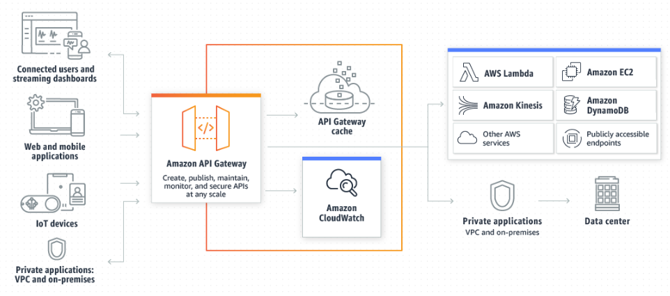

# Amazon API Gateway

- 규모와 관계없이 REST 및 WebSocket API를 생성, 게시, 유지, 모니터링 및 보호하기 위한 AWS 서비스

- API 개발자는 AWS 또는 다른 웹 서비스를 비롯해 AWS 클라우드에 저장된 데이터에 액세스하는 API를 생성할 수 있음

- API Gateway의 API 개발자는 자체 클라이언트 애플리케이션에서 사용할 API를 생성할 수 있음

- 타사 앱 개발자가 API를 사용하도록 제공할 수 있음

- API Gateway는 다음과 같은 RESTful API를 생성
  - HTTP 기반
  - 상태 비저장 클라이언트-서버 통신 활성화
  - 표준 HTTP 메서드 구현

## 아키텍처

  

- AWS 서버리스 애플리케이션 빌드를 위한 통합적이고 일관된 개발자 환경을 제공
- 최대 수 십만 개의 동시 API 호출 허용 및 처리에 관련된 모든 작업을 다룸
- 트래픽 관리, 권한 부여 및 액세스 제어, 모니터링, API 버전 관리 포함
- EC2에서 실행 중인 워크로드, AWS Lambda에서 실행중인 코드, 웹 애플리케이션, 실시간 통신 애플리케이션과 같은 백엔드 서비스에서 데이터, 비즈니스 로직 또는 기능에 액세스할 수 있게 해주는 정문 역할을 함

## 기능

- 상태저장(WebSocker) 및 상태 비저장(HTTP 및 REST) API에 대한 지원
- 강력하고 유연한 인증 메커니즘(AWS IAM 정책, Lambda 권한 부여자 함수, Amazon Cognito 사용자 풀 등)
- 변경사항 안전하게 롤아웃 하기 위한 Canary 릴리스 배포
- API 사용 및 API 변경에 대한 CloudTrail 로깅 및 모니터링
- 경보 설정 기능을 포함한 CloudWatch 액세스 로깅 및 실행 로깅
- AWS CloudFormation 템플릿을 사용하여 API 생성을 활성화하는 기능
- 사용자 지정 도메인 이름 지원
- 일반적인 웹 익스플로잇으로부터 API를 보호하기 위해 AWS WAF 통합
  > 익스플로잇? 보안 취약점 혹은 보안 취약점을 이용한 공격을 뜻하는 말로, 보통 후자로 사용되는 경우가 많음. 
- 성능 지연 시간 파악 및 학습을 위해 AWS X-Ray 통합

## References
- [mazon API Gateway란 무엇입니까?](https://docs.aws.amazon.com/ko_kr/apigateway/latest/developerguide/welcome.html)