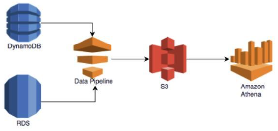

# Amazon Athena
- S3에 저장된 데이터를 SQL을 사용하여 분석할 수 있는 서버리스 쿼리 서비스
- 설정이나 관리가 필요 없으며, 사용자는 표준 SQL을 사용하여 데이터를 쿼리할 수 있음
- Apache Presto를 기반으로 하며, 다양한 데이터 형식을 지원함

# 주요 기능
- 서버리스
    - 인프라를 관리할 필요 없이 즉시 쿼리를 실행할 수 있음
    - 자동으로 화갖오디며, 사용한 만큼만 비용 지불
- 표준 SQL 지원
    - 표준 SQL을 사용하여 데이터를 쿼리할 수 있음
    - 복잡한 쿼리도 쉽게 작성할 수 있음
- 다양한 데이터 형식 지원
    - CSV, JSON, ORC, Avro, Parquet 등 다양한 데이터 형식을 지원
    - S3에 저장된 데이터를 직접 쿼리할 수 있음
- 통합
    - Amazon QuickSight와 통합하여 데이터 시각화를 쉽게 할 수 있음
    - AWS Glue와 통합하여 데이터 카탈로그를 관리할 수 있음
- 보안
    - AWS IAM을 사용하여 접근 제어를 관리할 수 있음
    - 데이터 암호화 및 네트워크 격리를 지원

# 사용 사례
- 데이터 분석
- 비즈니스 인텔리전스
- 데이터 탐색

- 표준 SQL을 사용하여 S3에 저장된 데이터를 간편하게 분석할 수 있는 대화식 쿼리 서비스
- 서버리스 서비스로 관리할 인프라가 없고 실행한 쿼리에 대해서만 비용 지불

