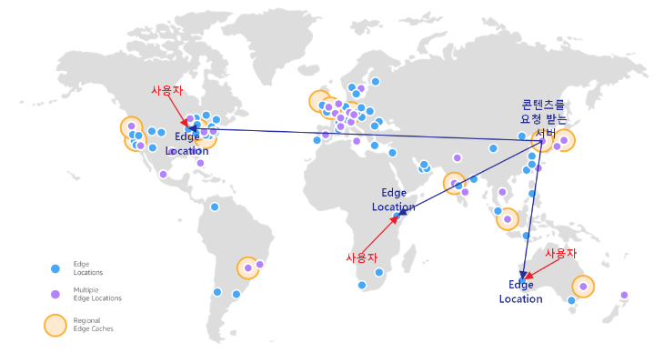
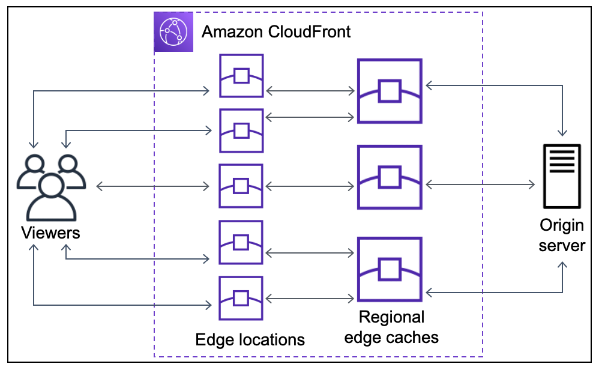

# AWS CloudFront

- AWS의 CDN(Content Delivery Network) 서비스
- Client의 콘텐츠 요청으로 서버에서 받아온 콘텐츠를 캐싱한 후 같은 요청에 대해 캐싱한 것으로 제공하는 서비스
  - 물리적으로 거리가 먼 곳에도 빠르게 요청을 처리 가능
  - 서버의 부하를 낮출 수 있음

## Edge Location
- CloudFront 서비스가 콘텐츠를 캐싱하고 Client에게 제공하는 지점 혹은 캐시 서버를 의미

- 장소나 환경에 구애를 최대한 받지 않도록 빠른 서비스를 제공하기 위해 전 세계 주요 도시에 300개 이상의 Edge Location이 분포

- 사용자가 요청한 콘텐츠의 캐시가 Edge Location에 있다면 멀리 있는 서버에 직접 요청이 아닌 가까운 Edge Location에 저장된 캐시를 불러올 수 있음



## Region Edge Cache(REC)
- 사용자가 접근할 수 있는 글로벌 하게 배포되어 있는 CloudFront 위치
- Origin과 Edge Location 사이에 위치해 있는데, 콘텐츠가 캐시가 유지될 정도로 인기 있지 않아도 캐시는 더 오랫동안 남으며 Edge Location 보다 캐시 스토리지 용량이 더 큼
- REC로 인해 CloudFront가 Origin에 요청하는 것을 줄여줌

## CloudFront 동작 순서


1. 사용자가 애플리케이션에 요청을 함
2. DNS는 사용자에게 적합한 Edge Location으로 라우팅 함
3. Edge Location에 캐시를 확인하고 있으면 이것을 사용자에게 반환함
4. 없으면 가장 가까운 REC로 캐시가 있는지 요청함
5. 없으면 CloudFront는 오리진으로 요청을 전달함
6. 오리진은 오리진 > REC > Edge Location > CloudFront가 사용자에게 전달수순을 밟음
7. REC에 캐시가 있다면 REC는 콘텐츠를 요청한 Edge Location으로 반환
8. REC로부터 콘텐츠의 첫 번째 바이트가 도착하는 즉시 Edge Location은 이를 사용자에게 반환함
9. Edge Location은 나중을 위해 이 콘텐츠 캐시를 저장함

## CloudFonrt의 Static / Dynamic 콘텐츠 처리
- CLoudFront는 다른 CDN과 다르게 정적, 동적 콘텐츠 모두 처리

- 정적 콘텐츠에는 서버(EC2)가 필요하지 않은 이미지나 HTML, CSS 등의 리소스가 포함
  - 캐싱하여 모든 사용자에게 동일하게 전달해도 무방한 데이터

- 동적 콘텐츠는 데이터베이스와 같이 수시로 변경되는 콘텐츠를 의미
  - 이런 데이터를 정적 캐싱한다면 TTL 시간 동안 사용자는 새롭게 추가/수정된 데이터를 볼 수 없음

- 동적 콘텐츠의 경우 서버(EC2)의 연산이 필요하므로 요청을 EC2로 향하게 Distribution 처리
- 정적 콘텐츠의 경우 S3 버킷 등으로 Distribution 처리


### as origin
- ```the ALB as origins```: Amazon CloudFront 배포(Distribution)의 원본(origin)으로 ALB를 사용한다는 의미로, CloudFront 배포가 콘텐츠를 제공하기 위해 ALB를 원본 서버로 사용한다는 뜻
- ```S3 버킷과 ALB를 원본으로 사용```: CloudFront가 콘텐츠를 제공할 때, 일부 콘텐츠는 S3 버킷에서 가져오고, 다른 일부 콘텐츠는 ALB를 통해 제공되는 애플리케이션 서버에서 가져옴
- 

## 참고사이트
- [[AWS] CloudFront 에 대하여](https://bosungtea9416.tistory.com/entry/AWS-CloudFront)

