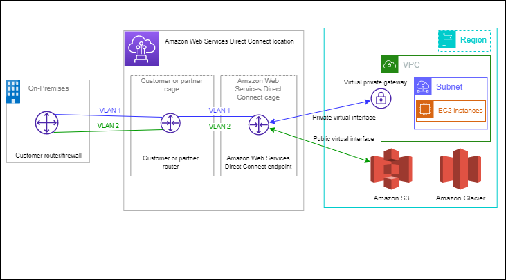

# AWS Direct Connect
- AWS Direct Connect는 표준 이더넷 광섬유 케이블을 거쳐 내부 네트워크를 AWS Direct Connect location으로 연결
- 케이블 한 쪽은 라우터가, 다른 쪽은 AWS Direct Connect 라우터가 연결
- 이 연결로 네트워크 경로에서 인터넷 서비스 제공업체를 우회하여 Amazon S3와 같은 퍼블릭 AWS 서비스나 Amazon VPC를 가상 인터페이스를 직접적으로 생성할 수 있음
- AWS Direct Connect location은 연결된 지역에 AWS 접근을 제공
- 퍼블릭 Region이나 AWS GovCloud(US)에서 모든 다른 퍼블릭 Region으로 퍼블릭 AWS 서비스에 접근하는 단독의 연결을 사용할 수 있음
- 다음의 다이어그램은 당신 네트워크에 AWS Direct Connect가 당신의 네트워크와 인터페이스하는 높은 수준의 개요를 보여줍니다.

- 회사 내부 네트워크 혹은 기존 데이터 센터 환경의 온프레미스 IT 자원과 AWS 클라우드 자원을 전용 회선으로 연결하여, 하이브리드 환경을 구축할 수 있는 서비스

### 참고사이트
- [[AWS] AWS Direct Connect란 무엇인가?](https://cloud-allstudy.tistory.com/747)
- [What is AWS Direct Connect?](https://docs.aws.amazon.com/directconnect/latest/UserGuide/Welcome.html)