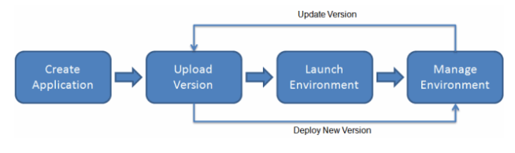

# AWS Elastic Beanstalk

- Elastic Beanstalk를 이용하면 애플리케이션 운영에 필요한 인프라에 대한 학습 없이 AWS 클라우드에서 애플리케이션을 관리하고 빠르게 배포할 수 있음
- Elastic Beanstalk는 선택이나 통제 제한 없이 관리 복잡성을 줄임
- 애플리케이션을 간단히 업로드하여고 Elastic Beanstalk를 이용하여 자등으로 Capacity 프로비저닝의 상세한 부분과 로드밸런싱, 스케일링, 애플리케이션 Health 모니터링을 다룰 수 있음

- Elastic Beanstalk는 Go, Java, .NET, Node.js, PHP, Python, 그리고 Ruby로 개발된 애플리케이션을 지원함
- 애플리케이션을 배포하면 Elastic Beanstalk는 선택된 지원 플랫폼 버전을 빌드하고, 애플리케이션을 동작시키기 위해 Amazon EC2 인스턴스 같은 한 개 이상의 AWS 리소스를 비저닝할 수 있음

- Elastic Beanstalk 콘솔, AWS CLI, 혹은 eb, Elastic Beanstalk를 위해 전문적으로 설계된 고수준 CLI 등을 이용하여 Elastic Beanstalk과 상호작용할 수 있음

To learn more about how to deploy a sample web application using Elastic Beanstalk, see Getting Started with AWS: Deploying a Web App.

You can also perform most deployment tasks, such as changing the size of your fleet of Amazon EC2 instances or monitoring your application, directly from the Elastic Beanstalk web interface (console).

To use Elastic Beanstalk, you create an application, upload an application version in the form of an application source bundle (for example, a Java .war file) to Elastic Beanstalk, and then provide some information about the application. Elastic Beanstalk automatically launches an environment and creates and configures the AWS resources needed to run your code. After your environment is launched, you can then manage your environment and deploy new application versions. The following diagram illustrates the workflow of Elastic Beanstalk.

After you create and deploy your application, information about the application—including metrics, events, and environment status—is available through the Elastic Beanstalk console, APIs, or Command Line Interfaces, including the unified AWS CLI.

## References
- [What is AWS Elastic Beanstalk?](https://docs.aws.amazon.com/elasticbeanstalk/latest/dg/Welcome.html)