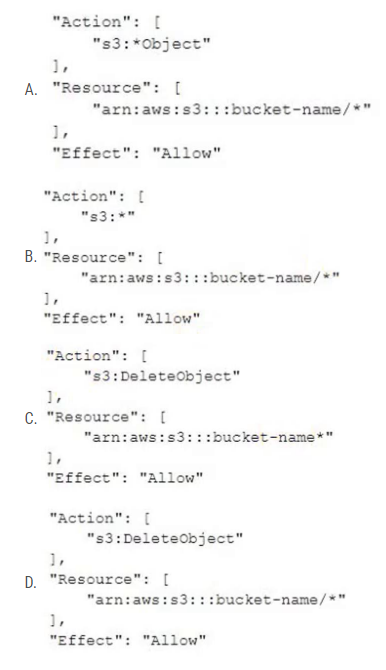

# 451
A company is migrating its applications and databases to the AWS Cloud. The company will use Amazon Elastic Container Service (Amazon ECS), AWS Direct Connect, and Amazon RDS.

Which activities will be managed by the company's operational team? (Choose three.)

A. Management of the Amazon RDS infrastructure layer, operating system, and platforms
B. Creation of an Amazon RDS DB instance and configuring the scheduled maintenance window
C. Configuration of additional software components on Amazon ECS for monitoring, patch management, log management, and host intrusion detection
D. Installation of patches for all minor and major database versions for Amazon RDS
E. Ensure the physical security of the Amazon RDS infrastructure in the data center
F. Encryption of the data that moves in transit through Direct Connect

# 452
A company runs a Java-based job on an Amazon EC2 instance. The job runs every hour and takes 10 seconds to run. The job runs on a scheduled interval and consumes 1 GB of memory. The CPU utilization of the instance is low except for short surges during which the job uses the maximum CPU available. The company wants to optimize the costs to run the job.

Which solution will meet these requirements?

A. Use AWS App2Container (A2C) to containerize the job. Run the job as an Amazon Elastic Container Service (Amazon ECS) task on AWS Fargate with 0.5 virtual CPU (vCPU) and 1 GB of memory.
B. Copy the code into an AWS Lambda function that has 1 GB of memory. Create an Amazon EventBridge scheduled rule to run the code each hour.
C. Use AWS App2Container (A2C) to containerize the job. Install the container in the existing Amazon Machine Image (AMI). Ensure that the schedule stops the container when the task finishes.
D. Configure the existing schedule to stop the EC2 instance at the completion of the job and restart the EC2 instance when the next job starts.

# 453
A company wants to implement a backup strategy for Amazon EC2 data and multiple Amazon S3 buckets. Because of regulatory requirements, the company must retain backup files for a specific time period. The company must not alter the files for the duration of the retention period.

Which solution will meet these requirements?

A. Use AWS Backup to create a backup vault that has a vault lock in governance mode. Create the required backup plan.
B. Use Amazon Data Lifecycle Manager to create the required automated snapshot policy.
C. Use Amazon S3 File Gateway to create the backup. Configure the appropriate S3 Lifecycle management.
D. Use AWS Backup to create a backup vault that has a vault lock in compliance mode. Create the required backup plan.

# 454
A company has resources across multiple AWS Regions and accounts. A newly hired solutions architect discovers a previous employee did not provide details about the resources inventory. The solutions architect needs to build and map the relationship details of the various workloads across all accounts.

Which solution will meet these requirements in the MOST operationally efficient way?

A. Use AWS Systems Manager Inventory to generate a map view from the detailed view report.
B. Use AWS Step Functions to collect workload details. Build architecture diagrams of the workloads manually.
C. Use Workload Discovery on AWS to generate architecture diagrams of the workloads.
D. Use AWS X-Ray to view the workload details. Build architecture diagrams with relationships.

# 455
A company uses AWS Organizations. The company wants to operate some of its AWS accounts with different budgets. The company wants to receive alerts and automatically prevent provisioning of additional resources on AWS accounts when the allocated budget threshold is met during a specific period.

Which combination of solutions will meet these requirements? (Choose three.)

A. Use AWS Budgets to create a budget. Set the budget amount under the Cost and Usage Reports section of the required AWS accounts.
B. Use AWS Budgets to create a budget. Set the budget amount under the Billing dashboards of the required AWS accounts.
C. Create an IAM user for AWS Budgets to run budget actions with the required permissions.
D. Create an IAM role for AWS Budgets to run budget actions with the required permissions.
E. Add an alert to notify the company when each account meets its budget threshold. Add a budget action that selects the IAM identity created with the appropriate config rule to prevent provisioning of additional resources.
F. Add an alert to notify the company when each account meets its budget threshold. Add a budget action that selects the IAM identity created with the appropriate service control policy (SCP) to prevent provisioning of additional resources.

# 456
A company runs applications on Amazon EC2 instances in one AWS Region. The company wants to back up the EC2 instances to a second Region. The company also wants to provision EC2 resources in the second Region and manage the EC2 instances centrally from one AWS account.

Which solution will meet these requirements MOST cost-effectively?

A. Create a disaster recovery (DR) plan that has a similar number of EC2 instances in the second Region. Configure data replication.
B. Create point-in-time Amazon Elastic Block Store (Amazon EBS) snapshots of the EC2 instances. Copy the snapshots to the second Region periodically.
C. Create a backup plan by using AWS Backup. Configure cross-Region backup to the second Region for the EC2 instances.
D. Deploy a similar number of EC2 instances in the second Region. Use AWS DataSync to transfer the data from the source Region to the second Region.

# 457
A company that uses AWS is building an application to transfer data to a product manufacturer. The company has its own identity provider (IdP). The company wants the IdP to authenticate application users while the users use the application to transfer data. The company must use Applicability Statement 2 (AS2) protocol.

Which solution will meet these requirements?

A. Use AWS DataSync to transfer the data. Create an AWS Lambda function for IdP authentication.
B. Use Amazon AppFlow flows to transfer the data. Create an Amazon Elastic Container Service (Amazon ECS) task for IdP authentication.
C. Use AWS Transfer Family to transfer the data. Create an AWS Lambda function for IdP authentication.
D. Use AWS Storage Gateway to transfer the data. Create an Amazon Cognito identity pool for IdP authentication.

# 458
A solutions architect is designing a RESTAPI in Amazon API Gateway for a cash payback service. The application requires 1 GB of memory and 2 GB of storage for its computation resources. The application will require that the data is in a relational format.

Which additional combination ofAWS services will meet these requirements with the LEAST administrative effort? (Choose two.)

A. Amazon EC2
B. AWS Lambda
C. Amazon RDS
D. Amazon DynamoDB
E. Amazon Elastic Kubernetes Services (Amazon EKS)

# 459
A company uses AWS Organizations to run workloads within multiple AWS accounts. A tagging policy adds department tags to AWS resources when the company creates tags.

An accounting team needs to determine spending on Amazon EC2 consumption. The accounting team must determine which departments are responsible for the costs regardless ofAWS account. The accounting team has access to AWS Cost Explorer for all AWS accounts within the organization and needs to access all reports from Cost Explorer.

Which solution meets these requirements in the MOST operationally efficient way?

A. From the Organizations management account billing console, activate a user-defined cost allocation tag named department. Create one cost report in Cost Explorer grouping by tag name, and filter by EC2.
B. From the Organizations management account billing console, activate an AWS-defined cost allocation tag named department. Create one cost report in Cost Explorer grouping by tag name, and filter by EC2.
C. From the Organizations member account billing console, activate a user-defined cost allocation tag named department. Create one cost report in Cost Explorer grouping by the tag name, and filter by EC2.
D. From the Organizations member account billing console, activate an AWS-defined cost allocation tag named department. Create one cost report in Cost Explorer grouping by tag name, and filter by EC2.

# 460
A company wants to securely exchange data between its software as a service (SaaS) application Salesforce account and Amazon S3. The company must encrypt the data at rest by using AWS Key Management Service (AWS KMS) customer managed keys (CMKs). The company must also encrypt the data in transit. The company has enabled API access for the Salesforce account.

A. Create AWS Lambda functions to transfer the data securely from Salesforce to Amazon S3.
B. Create an AWS Step Functions workflow. Define the task to transfer the data securely from Salesforce to Amazon S3.
C. Create Amazon AppFlow flows to transfer the data securely from Salesforce to Amazon S3.
D. Create a custom connector for Salesforce to transfer the data securely from Salesforce to Amazon S3.

# 461
A company is developing a mobile gaming app in a single AWS Region. The app runs on multiple Amazon EC2 instances in an Auto Scaling group. The company stores the app data in Amazon DynamoDB. The app communicates by using TCP traffic and UDP traffic between the users and the servers. The application will be used globally. The company wants to ensure the lowest possible latency for all users.

Which solution will meet these requirements?

A. Use AWS Global Accelerator to create an accelerator. Create an Application Load Balancer (ALB) behind an accelerator endpoint that uses Global Accelerator integration and listening on the TCP and UDP ports. Update the Auto Scaling group to register instances on the ALB.
B. Use AWS Global Accelerator to create an accelerator. Create a Network Load Balancer (NLB) behind an accelerator endpoint that uses Global Accelerator integration and listening on the TCP and UDP ports. Update the Auto Scaling group to register instances on the NLB.
C. Create an Amazon CloudFront content delivery network (CDN) endpoint. Create a Network Load Balancer (NLB) behind the endpoint and listening on the TCP and UDP ports. Update the Auto Scaling group to register instances on the NLB. Update CloudFront to use the NLB as the origin.
D. Create an Amazon CloudFront content delivery network (CDN) endpoint. Create an Application Load Balancer (ALB) behind the endpoint and listening on the TCP and UDP ports. Update the Auto Scaling group to register instances on the ALB. Update CloudFront to use the ALB as the origin.

# 462
A company has an application that processes customer orders. The company hosts the application on an Amazon EC2 instance that saves the orders to an Amazon Aurora database. Occasionally when traffic is high the workload does not process orders fast enough.

What should a solutions architect do to write the orders reliably to the database as quickly as possible?

A. Increase the instance size of the EC2 instance when traffic is high. Write orders to Amazon Simple Notification Service (Amazon SNS). Subscribe the database endpoint to the SNS topic.
B. Write orders to an Amazon Simple Queue Service (Amazon SQS) queue. Use EC2 instances in an Auto Scaling group behind an Application Load Balancer to read from the SQS queue and process orders into the database.
C. Write orders to Amazon Simple Notification Service (Amazon SNS). Subscribe the database endpoint to the SNS topic. Use EC2 instances in an Auto Scaling group behind an Application Load Balancer to read from the SNS topic.
D. Write orders to an Amazon Simple Queue Service (Amazon SQS) queue when the EC2 instance reaches CPU threshold limits. Use scheduled scaling of EC2 instances in an Auto Scaling group behind an Application Load Balancer to read from the SQS queue and process orders into the database.

# 463
An IoT company is releasing a mattress that has sensors to collect data about a user’s sleep. The sensors will send data to an Amazon S3 bucket. The sensors collect approximately 2 MB of data every night for each mattress. The company must process and summarize the data for each mattress. The results need to be available as soon as possible. Data processing will require 1 GB of memory and will finish within 30 seconds.

Which solution will meet these requirements MOST cost-effectively?

A. Use AWS Glue with a Scala job
B. Use Amazon EMR with an Apache Spark script
C. Use AWS Lambda with a Python script
D. Use AWS Glue with a PySpark job

# 464
A company hosts an online shopping application that stores all orders in an Amazon RDS for PostgreSQL Single-AZ DB instance. Management wants to eliminate single points of failure and has asked a solutions architect to recommend an approach to minimize database downtime without requiring any changes to the application code.

Which solution meets these requirements?

A. Convert the existing database instance to a Multi-AZ deployment by modifying the database instance and specifying the Multi-AZ option.
B. Create a new RDS Multi-AZ deployment. Take a snapshot of the current RDS instance and restore the new Multi-AZ deployment with the snapshot.
C. Create a read-only replica of the PostgreSQL database in another Availability Zone. Use Amazon Route 53 weighted record sets to distribute requests across the databases.
D. Place the RDS for PostgreSQL database in an Amazon EC2 Auto Scaling group with a minimum group size of two. Use Amazon Route 53 weighted record sets to distribute requests across instances.

# 465
A company is developing an application to support customer demands. The company wants to deploy the application on multiple Amazon EC2 Nitro-based instances within the same Availability Zone. The company also wants to give the application the ability to write to multiple block storage volumes in multiple EC2 Nitro-based instances simultaneously to achieve higher application availability.

Which solution will meet these requirements?

A. Use General Purpose SSD (gp3) EBS volumes with Amazon Elastic Block Store (Amazon EBS) Multi-Attach
B. Use Throughput Optimized HDD (st1) EBS volumes with Amazon Elastic Block Store (Amazon EBS) Multi-Attach
C. Use Provisioned IOPS SSD (io2) EBS volumes with Amazon Elastic Block Store (Amazon EBS) Multi-Attach
D. Use General Purpose SSD (gp2) EBS volumes with Amazon Elastic Block Store (Amazon EBS) Multi-Attach

# 466
A company designed a stateless two-tier application that uses Amazon EC2 in a single Availability Zone and an Amazon RDS Multi-AZ DB instance. New company management wants to ensure the application is highly available.

What should a solutions architect do to meet this requirement?

A. Configure the application to use Multi-AZ EC2 Auto Scaling and create an Application Load Balancer
B. Configure the application to take snapshots of the EC2 instances and send them to a different AWS Region
C. Configure the application to use Amazon Route 53 latency-based routing to feed requests to the application
D. Configure Amazon Route 53 rules to handle incoming requests and create a Multi-AZ Application Load Balancer


# 467
A company uses AWS Organizations. A member account has purchased a Compute Savings Plan. Because of changes in the workloads inside the member account, the account no longer receives the full benefit of the Compute Savings Plan commitment. The company uses less than 50% of its purchased compute power.

A. Turn on discount sharing from the Billing Preferences section of the account console in the member account that purchased the Compute Savings Plan.
B. Turn on discount sharing from the Billing Preferences section of the account console in the company's Organizations management account.
C. Migrate additional compute workloads from another AWS account to the account that has the Compute Savings Plan.
D. Sell the excess Savings Plan commitment in the Reserved Instance Marketplace.


# 468
A company is developing a microservices application that will provide a search catalog for customers. The company must use REST APIs to present the frontend of the application to users. The REST APIs must access the backend services that the company hosts in containers in private VPC subnets.

Which solution will meet these requirements?

A. Design a WebSocket API by using Amazon API Gateway. Host the application in Amazon Elastic Container Service (Amazon ECS) in a private subnet. Create a private VPC link for API Gateway to access Amazon ECS.
B. Design a REST API by using Amazon API Gateway. Host the application in Amazon Elastic Container Service (Amazon ECS) in a private subnet. Create a private VPC link for API Gateway to access Amazon ECS.
C. Design a WebSocket API by using Amazon API Gateway. Host the application in Amazon Elastic Container Service (Amazon ECS) in a private subnet. Create a security group for API Gateway to access Amazon ECS.
D. Design a REST API by using Amazon API Gateway. Host the application in Amazon Elastic Container Service (Amazon ECS) in a private subnet. Create a security group for API Gateway to access Amazon ECS.

# 469
A company stores raw collected data in an Amazon S3 bucket. The data is used for several types of analytics on behalf of the company's customers. The type of analytics requested determines the access pattern on the S3 objects.

The company cannot predict or control the access pattern. The company wants to reduce its S3 costs.

Which solution will meet these requirements?

A. Use S3 replication to transition infrequently accessed objects to S3 Standard-Infrequent Access (S3 Standard-IA)
B. Use S3 Lifecycle rules to transition objects from S3 Standard to Standard-Infrequent Access (S3 Standard-IA)
C. Use S3 Lifecycle rules to transition objects from S3 Standard to S3 Intelligent-Tiering
D. Use S3 Inventory to identify and transition objects that have not been accessed from S3 Standard to S3 Intelligent-Tiering

# 470
A company has applications hosted on Amazon EC2 instances with IPv6 addresses. The applications must initiate communications with other external applications using the internet. However the company’s security policy states that any external service cannot initiate a connection to the EC2 instances.

What should a solutions architect recommend to resolve this issue?

A. Create a NAT gateway and make it the destination of the subnet's route table
B. Create an internet gateway and make it the destination of the subnet's route table
C. Create a virtual private gateway and make it the destination of the subnet's route table
D. Create an egress-only internet gateway and make it the destination of the subnet's route table

# 471
A company is creating an application that runs on containers in a VPC. The application stores and accesses data in an Amazon S3 bucket. During the development phase, the application will store and access 1 TB of data in Amazon S3 each day. The company wants to minimize costs and wants to prevent traffic from traversing the internet whenever possible.

Which solution will meet these requirements?

A. Enable S3 Intelligent-Tiering for the S3 bucket
B. Enable S3 Transfer Acceleration for the S3 bucket
C. Create a gateway VPC endpoint for Amazon S3. Associate this endpoint with all route tables in the VPC
D. Create an interface endpoint for Amazon S3 in the VPC. Associate this endpoint with all route tables in the VPC

# 472
A company has a mobile chat application with a data store based in Amazon DynamoDB. Users would like new messages to be read with as little latency as possible. A solutions architect needs to design an optimal solution that requires minimal application changes.

Which method should the solutions architect select?

A. Configure Amazon DynamoDB Accelerator (DAX) for the new messages table. Update the code to use the DAX endpoint.
B. Add DynamoDB read replicas to handle the increased read load. Update the application to point to the read endpoint for the read replicas.
C. Double the number of read capacity units for the new messages table in DynamoDB. Continue to use the existing DynamoDB endpoint.
D. Add an Amazon ElastiCache for Redis cache to the application stack. Update the application to point to the Redis cache endpoint instead of DynamoDB.

# 473
A company hosts a website on Amazon EC2 instances behind an Application Load Balancer (ALB). The website serves static content. Website traffic is increasing, and the company is concerned about a potential increase in cost.

A. Create an Amazon CloudFront distribution to cache state files at edge locations
B. Create an Amazon ElastiCache cluster. Connect the ALB to the ElastiCache cluster to serve cached files
C. Create an AWS WAF web ACL and associate it with the ALB. Add a rule to the web ACL to cache static files
D. Create a second ALB in an alternative AWS Region. Route user traffic to the closest Region to minimize data transfer costs

# 474
A company has multiple VPCs across AWS Regions to support and run workloads that are isolated from workloads in other Regions. Because of a recent application launch requirement, the company’s VPCs must communicate with all other VPCs across all Regions.

Which solution will meet these requirements with the LEAST amount of administrative effort?

A. Use VPC peering to manage VPC communication in a single Region. Use VPC peering across Regions to manage VPC communications.
B. Use AWS Direct Connect gateways across all Regions to connect VPCs across regions and manage VPC communications.
C. Use AWS Transit Gateway to manage VPC communication in a single Region and Transit Gateway peering across Regions to manage VPC communications.
D. Use AWS PrivateLink across all Regions to connect VPCs across Regions and manage VPC communications

# 475
A company is designing a containerized application that will use Amazon Elastic Container Service (Amazon ECS). The application needs to access a shared file system that is highly durable and can recover data to another AWS Region with a recovery point objective (RPO) of 8 hours. The file system needs to provide a mount target m each Availability Zone within a Region.

A solutions architect wants to use AWS Backup to manage the replication to another Region.

Which solution will meet these requirements?

A. Amazon FSx for Windows File Server with a Multi-AZ deployment
B. Amazon FSx for NetApp ONTAP with a Multi-AZ deployment
C. Amazon Elastic File System (Amazon EFS) with the Standard storage class
D. Amazon FSx for OpenZFS

# 476
A company is expecting rapid growth in the near future. A solutions architect needs to configure existing users and grant permissions to new users on AWS. The solutions architect has decided to create IAM groups. The solutions architect will add the new users to IAM groups based on department.

Which additional action is the MOST secure way to grant permissions to the new users?

A. Apply service control policies (SCPs) to manage access permissions
B. Create IAM roles that have least privilege permission. Attach the roles to the IAM groups
C. Create an IAM policy that grants least privilege permission. Attach the policy to the IAM groups
D. Create IAM roles. Associate the roles with a permissions boundary that defines the maximum permissions

# 477
A group requires permissions to list an Amazon S3 bucket and delete objects from that bucket. An administrator has created the following IAM policy to provide access to the bucket and applied that policy to the group. The group is not able to delete objects in the bucket. The company follows least-privilege access rules.

```js
{
    "Version": "2012-10-17",
    "Statement": [
        {
            "Action": [
                "s3:ListBucket",
                "s3:DeleteObject"
            ],
            "Resource": [
                "arn:aws:s3:::bucket-name"
            ],
            "Effect": "Allow"
        }
    ]
}
```

Which statement should a solutions architect add to the policy to correct bucket access?



# 478
A law firm needs to share information with the public. The information includes hundreds of files that must be publicly readable. Modifications or deletions of the files by anyone before a designated future date are prohibited.

Which solution will meet these requirements in the MOST secure way?

A. Upload all files to an Amazon S3 bucket that is configured for static website hosting. Grant read-only IAM permissions to any AWS principals that access the S3 bucket until the designated date.
B. Create a new Amazon S3 bucket with S3 Versioning enabled. Use S3 Object Lock with a retention period in accordance with the designated date. Configure the S3 bucket for static website hosting. Set an S3 bucket policy to allow read-only access to the objects.
C. Create a new Amazon S3 bucket with S3 Versioning enabled. Configure an event trigger to run an AWS Lambda function in case of object modification or deletion. Configure the Lambda function to replace the objects with the original versions from a private S3 bucket.
D. Upload all files to an Amazon S3 bucket that is configured for static website hosting. Select the folder that contains the files. Use S3 Object Lock with a retention period in accordance with the designated date. Grant read-only IAM permissions to any AWS principals that access the S3 bucket.

# 479
A company is making a prototype of the infrastructure for its new website by manually provisioning the necessary infrastructure. This infrastructure includes an Auto Scaling group, an Application Load Balancer and an Amazon RDS database. After the configuration has been thoroughly validated, the company wants the capability to immediately deploy the infrastructure for development and production use in two Availability Zones in an automated fashion.

What should a solutions architect recommend to meet these requirements?

A. Use AWS Systems Manager to replicate and provision the prototype infrastructure in two Availability Zones
B. Define the infrastructure as a template by using the prototype infrastructure as a guide. Deploy the infrastructure with AWS CloudFormation.
C. Use AWS Config to record the inventory of resources that are used in the prototype infrastructure. Use AWS Config to deploy the prototype infrastructure into two Availability Zones.
D. Use AWS Elastic Beanstalk and configure it to use an automated reference to the prototype infrastructure to automatically deploy new environments in two Availability Zones.

# 480
A business application is hosted on Amazon EC2 and uses Amazon S3 for encrypted object storage. The chief information security officer has directed that no application traffic between the two services should traverse the public internet.

Which capability should the solutions architect use to meet the compliance requirements?

A. AWS Key Management Service (AWS KMS)
B. VPC endpoint
C. Private subnet
D. Virtual private gateway

# 481
A company hosts a three-tier web application in the AWS Cloud. A Multi-AZAmazon RDS for MySQL server forms the database layer Amazon ElastiCache forms the cache layer. The company wants a caching strategy that adds or updates data in the cache when a customer adds an item to the database. The data in the cache must always match the data in the database.

Which solution will meet these requirements?

A. Implement the lazy loading caching strategy
B. Implement the write-through caching strategy
C. Implement the adding TTL caching strategy
D. Implement the AWS AppConfig caching strategy

# 482
A company wants to migrate 100 GB of historical data from an on-premises location to an Amazon S3 bucket. The company has a 100 megabits per second (Mbps) internet connection on premises. The company needs to encrypt the data in transit to the S3 bucket. The company will store new data directly in Amazon S3.

Which solution will meet these requirements with the LEAST operational overhead?

A. Use the s3 sync command in the AWS CLI to move the data directly to an S3 bucket
B. Use AWS DataSync to migrate the data from the on-premises location to an S3 bucket
C. Use AWS Snowball to move the data to an S3 bucket
D. Set up an IPsec VPN from the on-premises location to AWS. Use the s3 cp command in the AWS CLI to move the data directly to an S3 bucket

# 483
A company containerized a Windows job that runs on .NET 6 Framework under a Windows container. The company wants to run this job in the AWS Cloud. The job runs every 10 minutes. The job’s runtime varies between 1 minute and 3 minutes.

Which solution will meet these requirements MOST cost-effectively?

A. Create an AWS Lambda function based on the container image of the job. Configure Amazon EventBridge to invoke the function every 10 minutes.
B. Use AWS Batch to create a job that uses AWS Fargate resources. Configure the job scheduling to run every 10 minutes.
C. Use Amazon Elastic Container Service (Amazon ECS) on AWS Fargate to run the job. Create a scheduled task based on the container image of the job to run every 10 minutes.
D. Use Amazon Elastic Container Service (Amazon ECS) on AWS Fargate to run the job. Create a standalone task based on the container image of the job. Use Windows task scheduler to run the job every 10 minutes.

# 484
A company wants to move from many standalone AWS accounts to a consolidated, multi-account architecture. The company plans to create many new AWS accounts for different business units. The company needs to authenticate access to these AWS accounts by using a centralized corporate directory service.

Which combination of actions should a solutions architect recommend to meet these requirements? (Choose two.)

A. Create a new organization in AWS Organizations with all features turned on. Create the new AWS accounts in the organization.
B. Set up an Amazon Cognito identity pool. Configure AWS IAM Identity Center (AWS Single Sign-On) to accept Amazon Cognito authentication.
C. Configure a service control policy (SCP) to manage the AWS accounts. Add AWS IAM Identity Center (AWS Single Sign-On) to AWS Directory Service.
D. Create a new organization in AWS Organizations. Configure the organization's authentication mechanism to use AWS Directory Service directly.
E. Set up AWS IAM Identity Center (AWS Single Sign-On) in the organization. Configure IAM Identity Center, and integrate it with the company's corporate directory service.

# 485
A company is looking for a solution that can store video archives in AWS from old news footage. The company needs to minimize costs and will rarely need to restore these files. When the files are needed, they must be available in a maximum of five minutes.

What is the MOST cost-effective solution?

A. Store the video archives in Amazon S3 Glacier and use Expedited retrievals.
B. Store the video archives in Amazon S3 Glacier and use Standard retrievals.
C. Store the video archives in Amazon S3 Standard-Infrequent Access (S3 Standard-IA).
D. Store the video archives in Amazon S3 One Zone-Infrequent Access (S3 One Zone-IA).

# 486
A company is building a three-tier application on AWS. The presentation tier will serve a static website The logic tier is a containerized application. This application will store data in a relational database. The company wants to simplify deployment and to reduce operational costs.

Which solution will meet these requirements?

A. Use Amazon S3 to host static content. Use Amazon Elastic Container Service (Amazon ECS) with AWS Fargate for compute power. Use a managed Amazon RDS cluster for the database.
B. Use Amazon CloudFront to host static content. Use Amazon Elastic Container Service (Amazon ECS) with Amazon EC2 for compute power. Use a managed Amazon RDS cluster for the database.
C. Use Amazon S3 to host static content. Use Amazon Elastic Kubernetes Service (Amazon EKS) with AWS Fargate for compute power. Use a managed Amazon RDS cluster for the database.
D. Use Amazon EC2 Reserved Instances to host static content. Use Amazon Elastic Kubernetes Service (Amazon EKS) with Amazon EC2 for compute power. Use a managed Amazon RDS cluster for the database.

# 487
A company seeks a storage solution for its application. The solution must be highly available and scalable. The solution also must function as a file system be mountable by multiple Linux instances in AWS and on premises through native protocols, and have no minimum size requirements. The company has set up a Site-to-Site VPN for access from its on-premises network to its VPC.

Which storage solution meets these requirements?

A. Amazon FSx Multi-AZ deployments
B. Amazon Elastic Block Store (Amazon EBS) Multi-Attach volumes
C. Amazon Elastic File System (Amazon EFS) with multiple mount targets
D. Amazon Elastic File System (Amazon EFS) with a single mount target and multiple access points

# 488
A 4-year-old media company is using the AWS Organizations all features feature set to organize its AWS accounts. According to the company's finance team, the billing information on the member accounts must not be accessible to anyone, including the root user of the member accounts.

Which solution will meet these requirements?

A. Add all finance team users to an IAM group. Attach an AWS managed policy named Billing to the group.
B. Attach an identity-based policy to deny access to the billing information to all users, including the root user.
C. Create a service control policy (SCP) to deny access to the billing information. Attach the SCP to the root organizational unit (OU).
D. Convert from the Organizations all features feature set to the Organizations consolidated billing feature set.

# 489
An ecommerce company runs an application in the AWS Cloud that is integrated with an on-premises warehouse solution. The company uses Amazon Simple Notification Service (Amazon SNS) to send order messages to an on-premises HTTPS endpoint so the warehouse application can process the orders. The local data center team has detected that some of the order messages were not received.

A solutions architect needs to retain messages that are not delivered and analyze the messages for up to 14 days.

Which solution will meet these requirements with the LEAST development effort?

A. Configure an Amazon SNS dead letter queue that has an Amazon Kinesis Data Stream target with a retention period of 14 days.
B. Add an Amazon Simple Queue Service (Amazon SQS) queue with a retention period of 14 days between the application and Amazon SNS.
C. Configure an Amazon SNS dead letter queue that has an Amazon Simple Queue Service (Amazon SQS) target with a retention period of 14 days.
D. Configure an Amazon SNS dead letter queue that has an Amazon DynamoDB target with a TTL attribute set for a retention period of 14 days.

# 490
A gaming company uses Amazon DynamoDB to store user information such as geographic location, player data, and leaderboards. The company needs to configure continuous backups to an Amazon S3 bucket with a minimal amount of coding. The backups must not affect availability of the application and must not affect the read capacity units (RCUs) that are defined for the table.

Which solution meets these requirements?

A. Use an Amazon EMR cluster. Create an Apache Hive job to back up the data to Amazon S3.
B. Export the data directly from DynamoDB to Amazon S3 with continuous backups. Turn on point-in-time recovery for the table.
C. Configure Amazon DynamoDB Streams. Create an AWS Lambda function to consume the stream and export the data to an Amazon S3 bucket.
D. Create an AWS Lambda function to export the data from the database tables to Amazon S3 on a regular basis. Turn on point-in-time recovery for the table.

# 491
A solutions architect is designing an asynchronous application to process credit card data validation requests for a bank. The application must be secure and be able to process each request at least once.

Which solution will meet these requirements MOST cost-effectively?

A. Use AWS Lambda event source mapping. Set Amazon Simple Queue Service (Amazon SQS) standard queues as the event source. Use AWS Key Management Service (SSE-KMS) for encryption. Add the kms:Decrypt permission for the Lambda execution role.
B. Use AWS Lambda event source mapping. Use Amazon Simple Queue Service (Amazon SQS) FIFO queues as the event source. Use SQS managed encryption keys (SSE-SQS) for encryption. Add the encryption key invocation permission for the Lambda function.
C. Use the AWS Lambda event source mapping. Set Amazon Simple Queue Service (Amazon SQS) FIFO queues as the event source. Use AWS KMS keys (SSE-KMS). Add the kms:Decrypt permission for the Lambda execution role.
D. Use the AWS Lambda event source mapping. Set Amazon Simple Queue Service (Amazon SQS) standard queues as the event source. Use AWS KMS keys (SSE-KMS) for encryption. Add the encryption key invocation permission for the Lambda function.


# 492
A company has multiple AWS accounts for development work. Some staff consistently use oversized Amazon EC2 instances, which causes the company to exceed the yearly budget for the development accounts. The company wants to centrally restrict the creation of AWS resources in these accounts.

Which solution will meet these requirements with the LEAST development effort?

A. Develop AWS Systems Manager templates that use an approved EC2 creation process. Use the approved Systems Manager templates to provision EC2 instances.
B. Use AWS Organizations to organize the accounts into organizational units (OUs). Define and attach a service control policy (SCP) to control the usage of EC2 instance types.
C. Configure an Amazon EventBridge rule that invokes an AWS Lambda function when an EC2 instance is created. Stop disallowed EC2 instance types.
D. Set up AWS Service Catalog products for the staff to create the allowed EC2 instance types. Ensure that staff can deploy EC2 instances only by using the Service Catalog products.

# 493
A company wants to use artificial intelligence (AI) to determine the quality of its customer service calls. The company currently manages calls in four different languages, including English. The company will offer new languages in the future. The company does not have the resources to regularly maintain machine learning (ML) models.

The company needs to create written sentiment analysis reports from the customer service call recordings. The customer service call recording text must be translated into English.

Which combination of steps will meet these requirements? (Choose three.)

A. Use Amazon Comprehend to translate the audio recordings into English.
B. Use Amazon Lex to create the written sentiment analysis reports.
C. Use Amazon Polly to convert the audio recordings into text.
D. Use Amazon Transcribe to convert the audio recordings in any language into text.
E. Use Amazon Translate to translate text in any language to English.
F. Use Amazon Comprehend to create the sentiment analysis reports.

# 494
A company uses Amazon EC2 instances to host its internal systems. As part of a deployment operation, an administrator tries to use the AWS CLI to terminate an EC2 instance. However, the administrator receives a 403 (Access Denied) error message.


The administrator is using an IAM role that has the following IAM policy attached:
What is the cause of the unsuccessful request?

A. The EC2 instance has a resource-based policy with a Deny statement.
B. The principal has not been specified in the policy statement.
C. The "Action" field does not grant the actions that are required to terminate the EC2 instance.
D. The request to terminate the EC2 instance does not originate from the CIDR blocks 192.0.2.0/24 or 203.0.113.0/24.

# 495
A company is conducting an internal audit. The company wants to ensure that the data in an Amazon S3 bucket that is associated with the company’s AWS Lake Formation data lake does not contain sensitive customer or employee data. The company wants to discover personally identifiable information (PII) or financial information, including passport numbers and credit card numbers.

Which solution will meet these requirements?

A. Configure AWS Audit Manager on the account. Select the Payment Card Industry Data Security Standards (PCI DSS) for auditing.
B. Configure Amazon S3 Inventory on the S3 bucket Configure Amazon Athena to query the inventory.
C. Configure Amazon Macie to run a data discovery job that uses managed identifiers for the required data types.
D. Use Amazon S3 Select to run a report across the S3 bucket.


# 496
A company uses on-premises servers to host its applications. The company is running out of storage capacity. The applications use both block storage and NFS storage. The company needs a high-performing solution that supports local caching without re-architecting its existing applications.

Which combination of actions should a solutions architect take to meet these requirements? (Choose two.)

A. Mount Amazon S3 as a file system to the on-premises servers.
B. Deploy an AWS Storage Gateway file gateway to replace NFS storage.
C. Deploy AWS Snowball Edge to provision NFS mounts to on-premises servers.
D. Deploy an AWS Storage Gateway volume gateway to replace the block storage.
E. Deploy Amazon Elastic File System (Amazon EFS) volumes and mount them to on-premises servers.

# 497
A company has a service that reads and writes large amounts of data from an Amazon S3 bucket in the same AWS Region. The service is deployed on Amazon EC2 instances within the private subnet of a VPC. The service communicates with Amazon S3 over a NAT gateway in the public subnet. However, the company wants a solution that will reduce the data output costs.

Which solution will meet these requirements MOST cost-effectively?

A. Provision a dedicated EC2 NAT instance in the public subnet. Configure the route table for the private subnet to use the elastic network interface of this instance as the destination for all S3 traffic.
B. Provision a dedicated EC2 NAT instance in the private subnet. Configure the route table for the public subnet to use the elastic network interface of this instance as the destination for all S3 traffic.
C. Provision a VPC gateway endpoint. Configure the route table for the private subnet to use the gateway endpoint as the route for all S3 traffic.
D. Provision a second NAT gateway. Configure the route table for the private subnet to use this NAT gateway as the destination for all S3 traffic.

# 498
A company uses Amazon S3 to store high-resolution pictures in an S3 bucket. To minimize application changes, the company stores the pictures as the latest version of an S3 object. The company needs to retain only the two most recent versions of the pictures.

The company wants to reduce costs. The company has identified the S3 bucket as a large expense.

Which solution will reduce the S3 costs with the LEAST operational overhead?

A. Use S3 Lifecycle to delete expired object versions and retain the two most recent versions.
B. Use an AWS Lambda function to check for older versions and delete all but the two most recent versions.
C. Use S3 Batch Operations to delete noncurrent object versions and retain only the two most recent versions.
D. Deactivate versioning on the S3 bucket and retain the two most recent versions.

# 499
A company needs to minimize the cost of its 1 Gbps AWS Direct Connect connection. The company's average connection utilization is less than 10%. A solutions architect must recommend a solution that will reduce the cost without compromising security.

Which solution will meet these requirements?

A. Set up a new 1 Gbps Direct Connect connection. Share the connection with another AWS account.
B. Set up a new 200 Mbps Direct Connect connection in the AWS Management Console.
C. Contact an AWS Direct Connect Partner to order a 1 Gbps connection. Share the connection with another AWS account.
D. Contact an AWS Direct Connect Partner to order a 200 Mbps hosted connection for an existing AWS account.

# 500
A company has multiple Windows file servers on premises. The company wants to migrate and consolidate its files into an Amazon FSx for Windows File Server file system. File permissions must be preserved to ensure that access rights do not change.

Which solutions will meet these requirements? (Choose two.)

A. Deploy AWS DataSync agents on premises. Schedule DataSync tasks to transfer the data to the FSx for Windows File Server file system.
B. Copy the shares on each file server into Amazon S3 buckets by using the AWS CLI. Schedule AWS DataSync tasks to transfer the data to the FSx for Windows File Server file system.
C. Remove the drives from each file server. Ship the drives to AWS for import into Amazon S3. Schedule AWS DataSync tasks to transfer the data to the FSx for Windows File Server file system.
D. Order an AWS Snowcone device. Connect the device to the on-premises network. Launch AWS DataSync agents on the device. Schedule DataSync tasks to transfer the data to the FSx for Windows File Server file system.
E. Order an AWS Snowball Edge Storage Optimized device. Connect the device to the on-premises network. Copy data to the device by using the AWS CLI. Ship the device back to AWS for import into Amazon S3. Schedule AWS DataSync tasks to transfer the data to the FSx for Windows File Server file system.