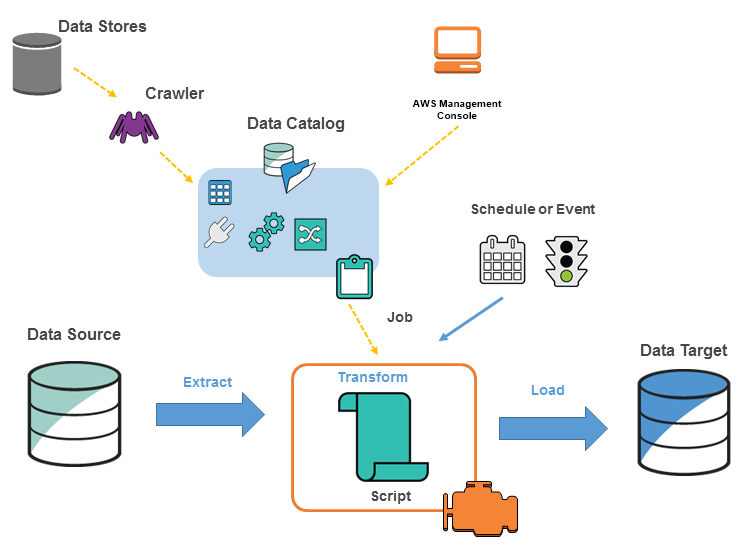

# AWS Glue

# AWS Glue

## 요약
- AWS Glue는 데이터의 추출(Extract), 변환(Transform), 저장(Load) 작업을 자동화하는 서버리스 ETL 서비스

## 개요
- AWS Glue는 다양한 데이터 소스로부터 데이터를 추출하고, 변환한 후, 데이터 웨어하우스나 데이터 레이크에 저장하는 ETL 서비스
- 서버리스 아키텍처로 인프라 설정이나 관리가 필요 없음

## 주요 기능 및 특징
- **ETL 작업**: 데이터를 다양한 소스로부터 추출하고, 변환한 후, 데이터 웨어하우스나 데이터 레이크에 저장
- **서버리스**: 인프라 설정이나 관리가 필요 없음
- **Dynamic Frame**: Apache Spark의 DataFrame과 호환되며, 스키마가 필요 없는 고급 변환 세트를 제공
- **스케줄링**: 주기적인 작업 실행을 자동화
- **북마크 기능**: 작업 상태를 저장하여 중단된 시점부터 작업 재개 가능
- **AWS Glue Data Catalog**: 중앙 메타데이터 리포지토리로, 모든 데이터를 한 곳에 모아 ETL 작업을 수행
- **자동 코드 생성**: Python 및 Scala 코드를 자동으로 생성하는 ETL 엔진
- **작업 모니터링 및 재시도**: 종속성 확인, 작업 모니터링 및 재시도를 관리하는 유연한 스케줄러

## 구성
- **ETL 작업**: 데이터를 추출, 변환, 저장하는 작업
- **Data Catalog**: 메타데이터를 저장하고 관리하는 중앙 리포지토리
- **Crawler**: 데이터 소스를 스캔하여 메타데이터를 자동으로 생성
- **Job**: ETL 작업을 정의하고 실행
- **Trigger**: 작업 실행을 자동화하는 트리거

## 작동 방식
1. AWS Glue 콘솔에서 Crawler를 생성하여 데이터 소스를 스캔
2. Crawler가 데이터 소스의 메타데이터를 Data Catalog에 저장
3. ETL Job을 생성하여 데이터를 추출, 변환, 저장하는 작업 정의
4. Trigger를 설정하여 주기적으로 ETL Job 실행
5. ETL Job이 데이터를 추출, 변환, 저장

## 다른 서비스와의 연관성
- **Amazon S3**: 데이터 레이크로 사용 가능
- **Amazon Redshift**: 데이터 웨어하우스로 사용 가능
- **AWS Lambda**: 데이터 변환 작업에 사용 가능
- **Amazon RDS**: 데이터 소스로 사용 가능

## 사용 사례
- **데이터 웨어하우스나 데이터 레이크로의 데이터 이동**: 다양한 소스로부터 데이터를 추출하여 저장
- **데이터 변환 및 정제**: 데이터를 변환하고 정제하여 분석에 적합한 형태로 저장
- **주기적인 ETL 작업**: 주기적으로 데이터를 추출, 변환, 저장하는 작업 자동화

## 결론
- AWS Glue는 데이터의 추출, 변환, 저장 작업을 자동화하는 서버리스 ETL 서비스
- 다양한 데이터 소스로부터 데이터를 추출하고, 변환한 후, 데이터 웨어하우스나 데이터 레이크에 저장
- 서버리스 아키텍처로 인프라 설정이나 관리가 필요 없으며, 다양한 사용 사례에 적용 가능

### 예제 코드
```python
import boto3

# Glue 클라이언트 생성
glue = boto3.client('glue')

# Crawler 생성
response = glue.create_crawler(
    Name='my-crawler',
    Role='AWSGlueServiceRole',
    DatabaseName='my-database',
    Targets={
        'S3Targets': [
            {
                'Path': 's3://my-bucket/data/'
            }
        ]
    }
)

print(response)

# ETL Job 생성
response = glue.create_job(
    Name='my-etl-job',
    Role='AWSGlueServiceRole',
    Command={
        'Name': 'glueetl',
        'ScriptLocation': 's3://my-bucket/scripts/my-etl-script.py'
    }
)

print(response)

# Trigger 생성
response = glue.create_trigger(
    Name='my-trigger',
    Type='SCHEDULED',
    Schedule='cron(0 12 * * ? *)',
    Actions=[
        {
            'JobName': 'my-etl-job'
        }
    ]
)

print(response)

```

# AWS Glue와 Amazon Kinesis Data Firehose 비교

## 요약
- AWS Glue와 Amazon Kinesis Data Firehose는 데이터 처리 및 이동을 위한 AWS 서비스지만, 목적과 사용 사례가 다름

## 개요
- **AWS Glue**: 데이터의 추출(Extract), 변환(Transform), 저장(Load) 작업을 자동화하는 서버리스 ETL 서비스
- **Amazon Kinesis Data Firehose**: 실시간 스트리밍 데이터를 수집, 변환, 로드하는 서비스

## 주요 기능 및 특징
### AWS Glue
- **ETL 작업**: 데이터를 다양한 소스로부터 추출하고, 변환한 후, 데이터 웨어하우스나 데이터 레이크에 저장
- **서버리스**: 인프라 설정이나 관리가 필요 없음
- **Dynamic Frame**: Apache Spark의 DataFrame과 호환되며, 스키마가 필요 없는 고급 변환 세트를 제공
- **스케줄링**: 주기적인 작업 실행을 자동화
- **AWS Glue Data Catalog**: 중앙 메타데이터 리포지토리로, 모든 데이터를 한 곳에 모아 ETL 작업을 수행
- **자동 코드 생성**: Python 및 Scala 코드를 자동으로 생성하는 ETL 엔진

### Amazon Kinesis Data Firehose
- **실시간 데이터 스트리밍**: 실시간 스트리밍 데이터를 수집, 변환, 로드
- **자동 스케일링**: 데이터 처리량에 따라 자동으로 확장
- **데이터 변환**: Lambda 함수를 사용하여 실시간 데이터 변환
- **다양한 대상**: Amazon S3, Amazon Redshift, Amazon Elasticsearch Service, Splunk 등으로 데이터 로드
- **내구성**: 데이터를 안전하게 저장하고 전송

## 구성
### AWS Glue
- **ETL 작업**: 데이터를 추출, 변환, 저장하는 작업
- **Data Catalog**: 메타데이터를 저장하고 관리하는 중앙 리포지토리
- **Crawler**: 데이터 소스를 스캔하여 메타데이터를 자동으로 생성
- **Job**: ETL 작업을 정의하고 실행
- **Trigger**: 작업 실행을 자동화하는 트리거

### Amazon Kinesis Data Firehose
- **Delivery Stream**: 데이터를 수집하고 전송하는 스트림
- **Lambda 함수**: 실시간 데이터 변환을 위한 함수
- **대상**: 데이터를 로드할 대상 서비스 (S3, Redshift 등)

## 작동 방식
### AWS Glue
1. Crawler를 생성하여 데이터 소스를 스캔
2. Crawler가 데이터 소스의 메타데이터를 Data Catalog에 저장
3. ETL Job을 생성하여 데이터를 추출, 변환, 저장하는 작업 정의
4. Trigger를 설정하여 주기적으로 ETL Job 실행
5. ETL Job이 데이터를 추출, 변환, 저장

### Amazon Kinesis Data Firehose
1. Delivery Stream을 생성하여 데이터를 수집
2. Lambda 함수를 사용하여 실시간 데이터 변환
3. 데이터를 지정된 대상(S3, Redshift 등)으로 전송
4. 자동 스케일링을 통해 데이터 처리량에 따라 확장

## 다른 서비스와의 연관성
### AWS Glue
- **Amazon S3**: 데이터 레이크로 사용 가능
- **Amazon Redshift**: 데이터 웨어하우스로 사용 가능
- **AWS Lambda**: 데이터 변환 작업에 사용 가능
- **Amazon RDS**: 데이터 소스로 사용 가능

### Amazon Kinesis Data Firehose
- **Amazon S3**: 데이터를 저장할 대상
- **Amazon Redshift**: 데이터를 로드할 대상
- **Amazon Elasticsearch Service**: 데이터를 로드할 대상
- **AWS Lambda**: 실시간 데이터 변환에 사용

## 사용 사례
### AWS Glue
- **데이터 웨어하우스나 데이터 레이크로의 데이터 이동**: 다양한 소스로부터 데이터를 추출하여 저장
- **데이터 변환 및 정제**: 데이터를 변환하고 정제하여 분석에 적합한 형태로 저장
- **주기적인 ETL 작업**: 주기적으로 데이터를 추출, 변환, 저장하는 작업 자동화

### Amazon Kinesis Data Firehose
- **실시간 데이터 분석**: 실시간 스트리밍 데이터를 분석
- **로그 및 이벤트 데이터 수집**: 애플리케이션 로그 및 이벤트 데이터를 실시간으로 수집
- **데이터 파이프라인**: 실시간 데이터 파이프라인을 구축하여 다양한 대상에 데이터 전송

## 결론
- AWS Glue는 데이터의 추출, 변환, 저장 작업을 자동화하는 서버리스 ETL 서비스로, 주로 배치 처리에 사용
- Amazon Kinesis Data Firehose는 실시간 스트리밍 데이터를 수집, 변환, 로드하는 서비스로, 실시간 데이터 처리에 적합


---

## ETL
- Extract: 데이터 저장소로부터 데이터를 가져옴
- Transform: 데이터를 조회 또는 분석의 목적으로 적절한 포맷으로 변경 (예시: 3월 29일 → 0329)
- Load: 데이터 웨어하우스나 데이터 레이크, 데이터 저장 서비스로 저장


## AWS Glue 특징

- 서버리스: 설정이나 관리할 인프라가 없음
- 원본데이터를 변경하거나 변경된 데이터를 저장하기 위한 별도의 저장소가 필요 없고, 메타데이터만으로 ETL 작업 수행 가능
- 정형 데이터 뿐만 아니라 반정형 데이터도 함께 작동하도록 설계
- ETL 스크립트에서 사용할 수 있는 Dynamic Frame이라는 구성 요소를 사용하여 Apache Spark의 Data Frame과 완벽 호환되고, 스키마가 필요없고 Dynamic Frame용 고급 변환 세트를 이용할 수 있음
- 고성능의 워커로 빠른 작업을 수행할 수 있음
- 스케쥴링 기능으로 주기적인 작업 실행을 자동화할 수 있음
- 북마크 기능으로 작업상태를 저장하여 중단된 시점부터 작업 재개 가능
- 작업에 대한 모니터링 지원

- 중앙 메타데이터 리포지토리, AWS Glue Data Catalog
    - 모든 데이터를 한 곳에 모아 ETL 작업을 할 수 있도록 제공
- 자동으로 Python 및 Scala 코드를 생성하는 ETL 엔진
    - 스크립트를 자동으로 생성할 수 있는 Built-in Transforms라는 기능을 제공
- 종속성 확인, 작업 모니터링 및 재시도를 관리하는 유연한 스케쥴러
    - CloudWatch를 통해 모니터링하고 트리거를 통해 실행하고 관리할 수 있음
- 데이터 웨어하우스 또는 데이터 레이크의 스토리지에 데이터를 구성, 정리, 검증 및 포맷할 수 있음
- 반정형 데이터를 가져와 변환을 통해 원하는 형태로 데이터를 저장할 수 있음

## 구성요소
1. Data Store: S3, RDS, Redshift, Kinesis, Apache Kafka 등 데이터 저장 서비스나 데이터 스크림 서비스
2. Classifier: 데이터의 스키마를 결정하고 일반적인 파일들의 분류자를 제공( ex: csv, tsv파일 등)
3. Crawler: Classifier의 우선 순위 지정 목록을 통해 데이터의 스키마를 결정한 다음, 메타 데이터 테이블을 생성
4. Data Catalog: 테이블 정의, 작업 정의 및 기타 관리 정보를 포함
5. Job: ETL 작업을 수행하는 데 필요한 변환 스크립트, 데이터 원본 및 데이터 대상으로 구성된 비즈니스 로직
6. Connection: AWS의 다른 데이터 저장 서비스나 사용자의 VPC환경 내부에 있는 데이터베이스에서 데이터 추출을 위한 장치
 7. Script: Apache Spark에서 사용하는 PySpark, Scala 등으로 짜여진 ETL 작업 스크립트
 8. Schedule or Event: Job이 실행되는 주기를 설정하거나, 혹은 특정 이벤트로 인한 트리거로 실행할 수 있음

<p align="center">
    
</p>

## Glue Studio
- AWS Glue의 새로운 시각적 인터페이스로, 추출-변환-로드(ETL)가 필요한 개발자들이 AWS Glue에서 ETL 작업을 손쉽게 작성하여 실행 및 모니터링 가능
- 경험 수준과 관계없이 모든 사용자가 코드를 작성하지 않고 AWS Glue의 서버리스 Apache Spark 기반 ETL 플랫폼에서 빅데이터를 처리 가능
- Glue Studio를 통해 여러 데이터 소스에서 카탈로그로 메타데이터만 가져오고, ETL 작업 후 데이터를 저장하거나 엔드포인트를 생성하여 Sagemaker, EMR, QuickSight 등의 서비스로 연결할 수 있음

## Tracking Processed data using job bookmarks
- AWS Glue는 이전 ETL 잡에서 처리했던 데이터를 상태 정보로 저장하여 추적
- 이 영속화된 상태 정보를 job bookmark라고 부름
- Job bookmark는 AWS Glue가 상태 정보를 유지하고 예전 데이터를 다시 처리하지 않게 지원
- Job bookmark로 스케쥴 잔격에 따른 재실행 시 새로운 데이터를 처리할 수 있음
- Job bookmark는 sources, transformations, and targets와 같이 job의 다양한 요소에 대한 상태들로 구성

## 참고사이트
- [AWS Glue 개념 정리](https://jaynamm.tistory.com/entry/AWS-Glue-%EA%B0%9C%EB%85%90-%EC%A0%95%EB%A6%AC)

- [[소개] AWS Glue Studio란?](https://tech.cloud.nongshim.co.kr/2021/08/19/__trashed/)