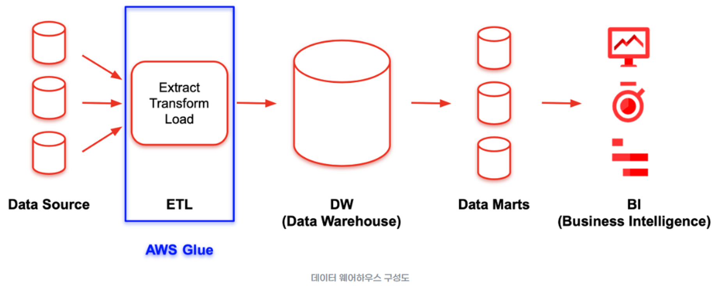

# AWS Glue

- ETL 서비스
- 완전 관리형 추출(Extract), 변환(Transform), 저장(Load) ETL 서비스
- 추출하고 변환해 다시 저장하는 ETL 서비스를 완전히 AWS Glue를 통해 관리할 수 있다고 이해할 수 있으며, 이러한 서비스를 통해 간단하게 데이터를 정리하고 검증하고 옮길 수 있도록 해줌

## AWS Glue 특징

- 서버리스
- 중앙 메타데이터 리포지토리, AWS Glue Data Catalog
    - 모든 데이터를 한 곳에 모아 ETL 작업을 할 수 있또록 제공
- 자동으로 Python 및 Scala 코드를 생성하는 ETL 엔진
    - 스크립트를 자동으로 생성할 수 있는 Built-in Transforms라는 기능을 제공
- 종속성 확인, 작업 모니터링 및 재시도를 관리하는 유연한 스케쥴러
    - CloudWatch를 통해 모니터링하고 트리거를 통해 실행하고 관리할 수 있음
- 데이터 웨어하우스 또는 데이터 레이크의 스토리지에 데이터를 구성, 정리, 검증 및 포맷할 수 있음
- 반정형 데이터를 가져와 변환을 통해 원하는 형태로 데이터를 저장할 수 있음

## 참고사이트
- [AWS Glue 개념 정리](https://jaynamm.tistory.com/entry/AWS-Glue-%EA%B0%9C%EB%85%90-%EC%A0%95%EB%A6%AC)