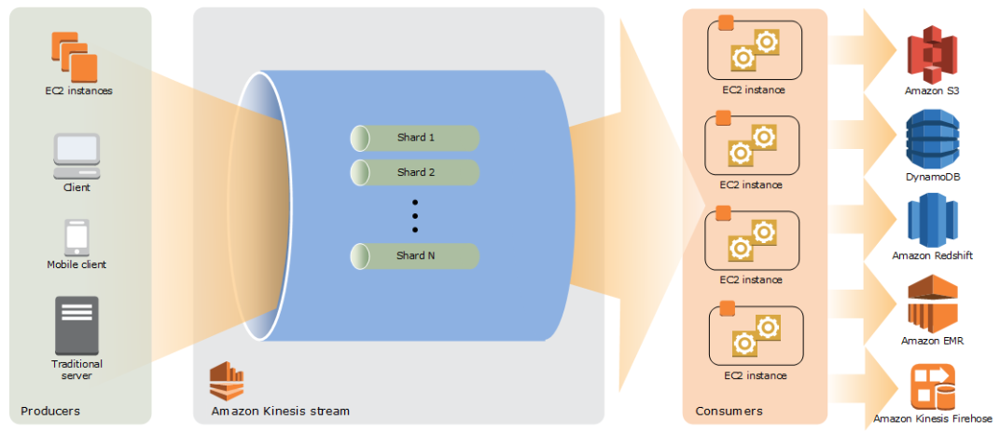

# Amazon Kinesis Data Streams

- 다음 다이어그램은 Kinesis Data Streams의 상위 수준 아키텍처를 보여줌
- 생산자가 계속해서 Kinesis Data Streams에 데이터를 푸시하고 소비자가 실시간으로 데이털르 처리

- EC2에서 실행되는 사용자 지정 애플리케이션 또는 Amazon Data Firehose 전송 스트림 등의 소비자는 Amazon DynamoDB, Amazon Redshift 또는 Amazon S3와 같은 AWs 서비스를 사용하여 결과를 저장할 수 있음

  

## References
- [Amazon Kinesis Data Streams 용어 및 개념](https://docs.aws.amazon.com/ko_kr/streams/latest/dev/key-concepts.html)
