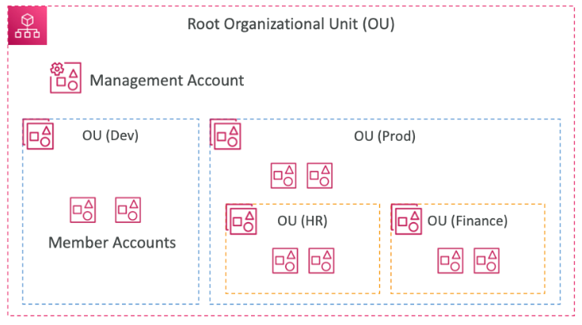
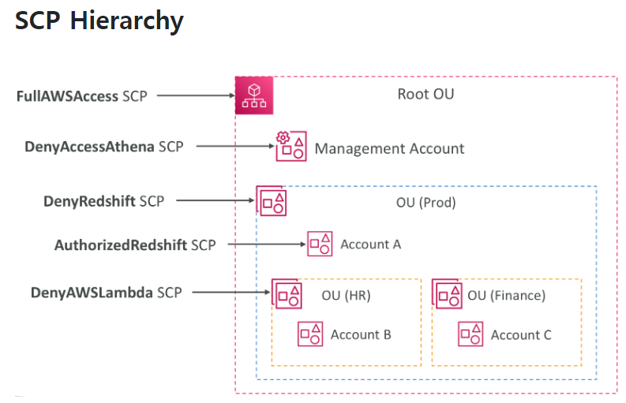
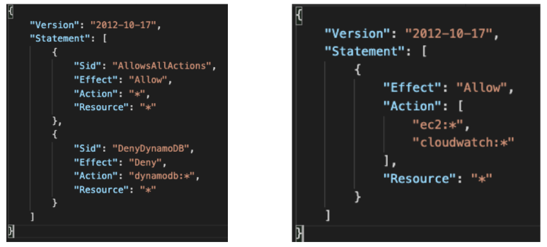

# AWS Organizations
- 글로벌 서비스
- 여러 개의 AWS 계정을 관리할 수 있음
- 조직을 생성하면 조직의 메인 계정이 관리 계정으로, 다른 계정은 멤버 계정이 됨
- 멤버 계정은 한 개의 조직에만 속할 수 있음
- 모든 계정의 비용을 통합 결제 가능
- 집계된 사용량에 기반한 비용 할인을 받을 수 있음(EC2, S3 등의 모든 계정의 사용량에 따른 할인)
- 계정 간 예약 인스턴스와 Saving Plans 할인 공유
- AWS 계정 생성을 자동화하기 위한 API 제공

## Advantages
- 다수의 계정을 가지므로 다수의 VPC를 가진 단일 계쩡에 비해 보안이 뛰어남
  - 계정이 VPC보다 독립적이기 때문
- 청구 목적을 위한 태그 기준을 적용할 수 있음
- 한 번에 모든 계정에 대해 CloudTrail 활성하ㅗ 및 로그를 중앙 S3 계정으로 전송
- CloudWatch Logs를 중앙 로깅 계정으로 전송
- 관리용으로 Cross Account 역할 설정

## Security: 서비스 제어 정책(Service Control Policies, SCP)
- OU 또는 계정에 적용되는 IAM 정책으로 사용자 및 역할 제한
- SCP는 모든 계정에 적용되나 관리 계정에는 적용되지 않음
- 명시적 허용이 필요함 (IAM과 마찬가지로 기본적으로는 아무것도 허용 안 됨)

## SCP Hierarchy

- 관리 계정(Management Account)
  - 관리 계정에는 SCP가 적용되지 않음
  - 모든 작업 가능
  - 모든 대상에 대해 관리자 권한을 가짐
- Account A
  - Redshift 액세스 제외 모든 작업 가능
- Account B
  - Redshift, Lambda 액세스 외 모든 작업 가능
- Account C
  - Redshift 액세스 외 모든 작업 가능

## SCP Examples
- SCP에는 Blocklist(차단 목록)과 Allowlist(허용 목록) 두 가지 전략이 있음

## 참고사이트
- [[AWS] Advanced Identity in AWS](https://velog.io/@gagaeun/AWS-Advanced-Identity-in-AWS)