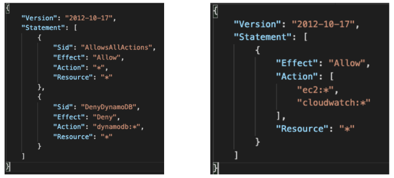

# AWS Organizations
- 글로벌 서비스
- 여러 개의 AWS 계정을 관리할 수 있음
- 조직을 생성하면 조직의 메인 계정이 관리 계정으로, 다른 계정은 멤버 계정이 됨
- 멤버 계정은 한 개의 조직에만 속할 수 있음
- 모든 계정의 비용을 통합 결제 가능
- 집계된 사용량에 기반한 비용 할인을 받을 수 있음(EC2, S3 등의 모든 계정의 사용량에 따른 할인)
- 계정 간 예약 인스턴스와 Saving Plans 할인 공유
- AWS 계정 생성을 자동화하기 위한 API 제공

## Advantages
- 다수의 계정을 가지므로 다수의 VPC를 가진 단일 계쩡에 비해 보안이 뛰어남
  - 계정이 VPC보다 독립적이기 때문
- 청구 목적을 위한 태그 기준을 적용할 수 있음
- 한 번에 모든 계정에 대해 CloudTrail 활성하ㅗ 및 로그를 중앙 S3 계정으로 전송
- CloudWatch Logs를 중앙 로깅 계정으로 전송
- 관리용으로 Cross Account 역할 설정

## Security: 서비스 제어 정책(Service Control Policies, SCP)
- OU 또는 계정에 적용되는 IAM 정책으로 사용자 및 역할 제한
- SCP는 모든 계정에 적용되나 관리 계정에는 적용되지 않음
- 명시적 허용이 필요함 (IAM과 마찬가지로 기본적으로는 아무것도 허용 안 됨)

## SCP Hierarchy

- 관리 계정(Management Account)
  - 관리 계정에는 SCP가 적용되지 않음
  - 모든 작업 가능
  - 모든 대상에 대해 관리자 권한을 가짐
- Account A
  - Redshift 액세스 제외 모든 작업 가능
- Account B
  - Redshift, Lambda 액세스 외 모든 작업 가능
- Account C
  - Redshift 액세스 외 모든 작업 가능

## SCP Examples
- SCP에는 Blocklist(차단 목록)과 Allowlist(허용 목록) 두 가지 전략이 있음

## Managing access permissions for your organization
- 루트, OU, 계정, 조직 내 정책 등 모든 AWS 리소스는 AWS 계정에 의해 소유되고, 리소스를 만들거나 접근하는 권한은 권한 정책에 의해 통치됨
- 조직을 위해 관리 계정은 모든 리소스를 소유하며, 계정 관리자는 IAM 정체성(users, groups, and roles) 권한 정책을 더하여 AWS 리소스로의 접근을 통제할 수 있음
- 권한을 부여할 때, 사용자는 누가 권한을 얻을지, 권한을 얻을 리소스와 그런 리소스에 허락하고 싶은 구체적인 활동들을 결정
- 기본적으로 IAM 사용자와 그룹, 역할은 아무런 권한이 없음
- 조직의 관리 계정 내 관리자에 이해 행적적인 태스크를 수행하거나 관리 계정 내의 다른 IAM 사용자나 역할에 대한 관리자 권한을 위임할 수 있음
- 이를 위해 IAM 사용자, 그룹, 역할에 있어 IAM 권한 정책을 더함
- 기본적으로 사용자는 어떤 권한도 없으며 이는 implicit deny라고 불림
- 정책은 implicit deny를 explicit allow로 오버라이드 하는데, explicit allow는 사용자가 수행할 수 있는 어떤 활동과 그 활동을 위해 필요한 리소스들을 구체화함
- 만약 권한이 역할에 부여된다면, 조직의 다른 계정의 사용자들은 역할을 맡을 수 있음

## 참고사이트
- [[AWS] Advanced Identity in AWS](https://velog.io/@gagaeun/AWS-Advanced-Identity-in-AWS)
- [Managing access permissions for your organization](https://docs.aws.amazon.com/organizations/latest/userguide/orgs_permissions_overview.html)