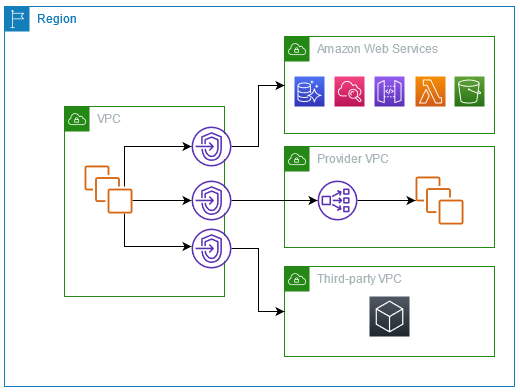

# AWS PrivateLink
- 가용성 높고 확장 유연한, 프라빗하게 VPC를 서비스가 마치 VPC에 있는 것처럼 서비스를 연결함
- VPC로부터 도달하는 기술된 API 엔드포인트, 사이트, 서비스 통제 가능
- igw가 불필요 하고, NAT Device, Public IP 주소, AWS Direct Connect dusruf, Site-to-Site VPN 연결을 Private 서브넷에서 서브로의 연결 허용

## Use cases
- VPC 엔드포인트를 생성하여 AWS PrivateLink와 통합되는 VPC의 리소스를 VPC 엔드포인트를 만들 수 있음
- 사용자 고유의 VPC 엔드포인트 서비스를 만들 수 있고, 이 서비스는 다른 AWS 고객이 이용할 수 있음
- 다음 다이어그램에서 좌측 VPC는 프라이빗 서브넷 내에 몇 개의 EC2 인스턴스와 세 가지 인터페이스 VPC 엔드포인트를 가짐
- 가장 상단의 VPC 엔드포인트는 AWS 서비스와 연결됨
- 중앙의 VPC 엔드포인트는 또 다른 AWS 계정(VPC 엔드포인트 서비스)에 의해 호스트된 서비스에 연결됨
- 하단의 VPC 엔드포인트는 AWS 마켓플레이스 파트너 서비스에 연결됨

## Concepts
- VPC를 정의하기 위해 Amazon VPC를 사용하는데, 이것은 지역적으로 격리된 가상 네트워크임
- AWS 리소스를 VPC에서 런치할 수 있는데, VPC 내의 리소스가 VPC 바깥의 리소스에 연결할 수 있도록 함
- 예를 들어, VPC가 인터넷에 접근 할 수 있도록 인터넷 게이트웨이를 추가하면 되고, 온프레미스 네트워크에 접근할 수 있도록 VPN 연결을 추가하면 됨
- 대안으로 사용자의 VPC 내의 리소스가 프라이빗 IP 주소를 사용하는 다른 VPC의 서비스에 연결할 수 있도록 AWS PrivateLink를 사용하면 됨

