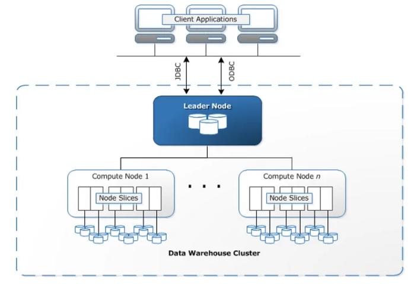

# Redshift

- AWS의 MPP(Massive Parallel Processing) Database
- PostgreSQL 기반이나 PostgreSQL과 다르게 구현된 특징과 기능을 가짐

## Massive Parallel Processing
- 다수 컴퓨팅 노드가 각 노드의 코어마다 전체 데이터를 분할하여 동일하게 컴파일된 쿼리 세그먼트를 실행
- 데이터를 병렬로 처리할 수 있도록 테이블의 행을 계산 노드에 배포
- 각 테이블마다 적절한 분산키를 선택하면 데이터 분석 최적화 가능

## Columnar data storage
- 데이터베이스 테이블 정보를 열 기반 방식으로 저장하므로 디스크 I/O 요청 수나 디스크에서 로드하는 데이터 크기를 감소시킬 수 있음

## Cluster
- 클러스터로 구성되어 있으며 리더 노드와 하나 이상의 컴퓨팅 노드로 구성
- 외부 애플리케이션은 리더 노드와 통신

## OLTP 기능
- 데이터 삽입 및 삭제와 같은 온라인 트랜잭션(OLTP) 기능을 포함하여 일반적인 RDBMS와 동일한 기능을 제공하고, 매우 큰 데이터 세트의 분석에 최적화
- 디스크 I/O를 떨어뜨려 쿼리 성능 향상
- 쿼리를 실행하면 압축된 데이터를 메모리로 읽은 후 쿼리 실행 도중 압축 해제

## 참고사이트
- [[AWS] Redshift의 특징들. 다른 DB와 뭐가 다른가?](https://jaemunbro.medium.com/aws-redshift-%EA%B8%B0%EC%B4%88%EC%A7%80%EC%8B%9D-987aedcb2830)