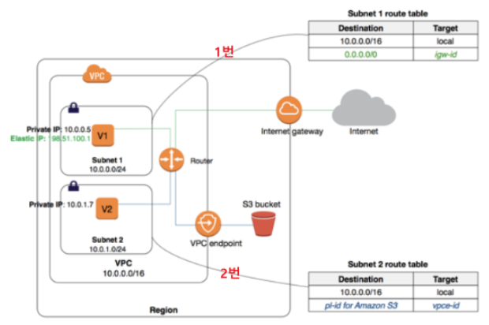

# VPC Endpoint

- Endpoint는 요청을 보낼 때 필요한 목적지라 할 수 있음
  - 어떤 서비스나 리소스로 접근할 수 있는 특정 URL이나 네트워크 주소가 될 수 있음
- VPC Endpoint는 Endpoint 유형 중 하나로, VPC Endpoint를 사용하면 VPC 내부 또는 외부에 있는 AWS 서비스들과 통신할 때 인터넷 통신이 되지 않아도 Prvate한 통신 환경을 통해 서비스에 접근할 수 있도록 함

## VPC Endpoint 종류

1. Gateway Endpoint
- NAT 디바이스가 없어도 VPC에 연결된 라우팅 테이블을 참조하여 S3 또는 DynamoDB로 전달되는 트래픽에 사용
- AWS PrivateLink를 활성화하지 않음

- 1번: V1이 참조하는 라우팅 테이블은 10.0.0.0/16 대역의 IP는 Local로, 그외의 모든 IP대역은 igw로 향함. 인터넷을 통해 S3로 접근
- 2번: 반면, V2가 참조하는 라우팅 테이블은 동일하게 10.0.0.0/16 대역의 IP는 Local로 가지만, S3에 대한 Endpoint IP대역은 모두 VPC Endpoint로 향하게 됨

2. Interface Endpoint
- AWS PrivateLink 기술을 사용하여 구성
- VPC 내부 전용 라우팅 테이블이 생성
- Interface Endpoint를 생성하게 되면 AWS 서비스에 대한 ENI가 일반적으로 한개 생성
  - VPC 내부에서 전용 IP를 사용하여 AWS 서비스와 통신하는 인터페이스

## 참고사이트
- [[소개] VPC Endpoint란?](https://tech.cloud.nongshim.co.kr/2023/03/16/%EC%86%8C%EA%B0%9C-vpc-endpoint%EB%9E%80/)