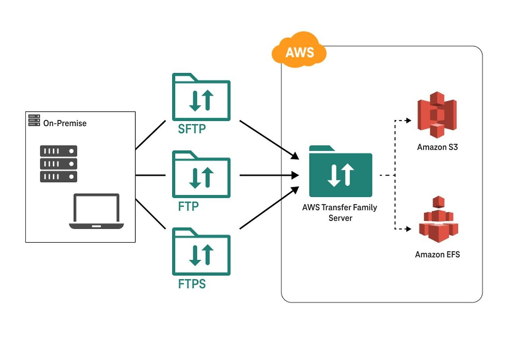

# AWS Transfer Family



## 요약
- 안전하고 확장 가능한 파일 전송 서비스 제공함

## 개요
- SFTP, FTPS, FTP 프로토콜을 지원하여 파일을 Amazon S3 또는 Amazon EFS로 전송할 수 있게 함

## 주요 기능 및 특징
- SFTP, FTPS, FTP 프로토콜 지원
- Amazon S3 및 Amazon EFS와 통합
- 사용자 인증 및 권한 관리 기능 제공
- 데이터 암호화 및 전송 중 보호 기능 제공
- 확장 가능한 인프라 제공
- 자동 확장 및 고가용성 지원
- 사용자 활동 및 파일 전송 모니터링 가능
- AWS CloudTrail과 통합하여 로깅 및 감사 기능 제공

## 구성
- AWS Management Console, AWS CLI, AWS SDK를 통해 설정 및 관리 가능
- 사용자 계정 및 권한 설정
- 데이터 전송 및 모니터링

## 작동 방식
1. AWS Management Console에 로그인
2. AWS Transfer Family 서비스 선택
3. 서버 생성 및 프로토콜 선택
4. 사용자 계정 및 권한 설정
5. 데이터 전송 및 모니터링

## 다른 서비스와의 연관성
- Amazon S3 및 Amazon EFS와 직접 통합되어 파일 저장 및 관리 가능
- AWS IAM과 통합되어 사용자 인증 및 권한 관리 가능
- AWS CloudTrail과 통합되어 로깅 및 감사 기능 제공

## 사용 사례
- 기업 내 파일 전송 자동화
- 안전한 파일 전송을 통한 데이터 공유
- 기존 FTP 서버의 클라우드 마이그레이션

## 결론
- AWS Transfer Family는 안전하고 확장 가능한 파일 전송 서비스를 제공하여 다양한 비즈니스 요구를 충족시킴

## 예제 코드
```python
import boto3

client = boto3.client('transfer')

response = client.create_server(
    EndpointType='PUBLIC',
    IdentityProviderType='SERVICE_MANAGED',
    Protocols=['SFTP']
)

print(response)
```