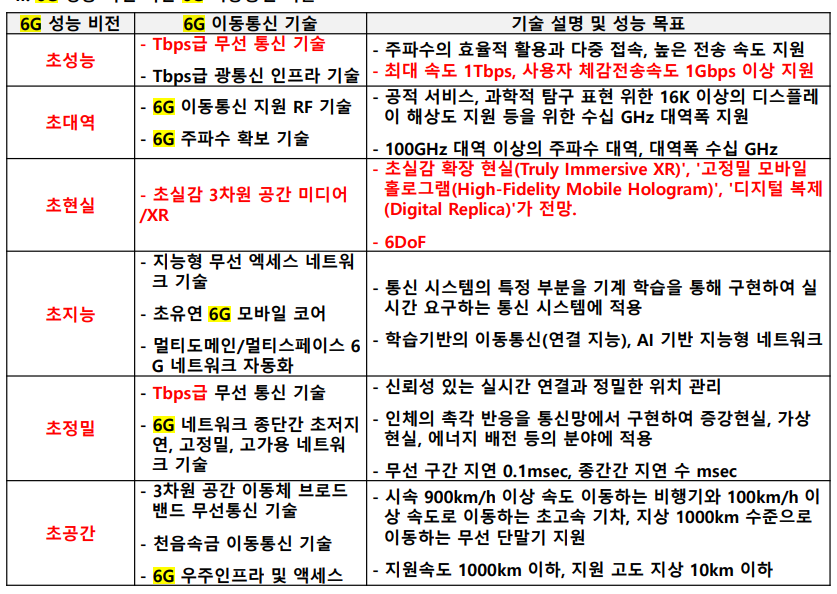
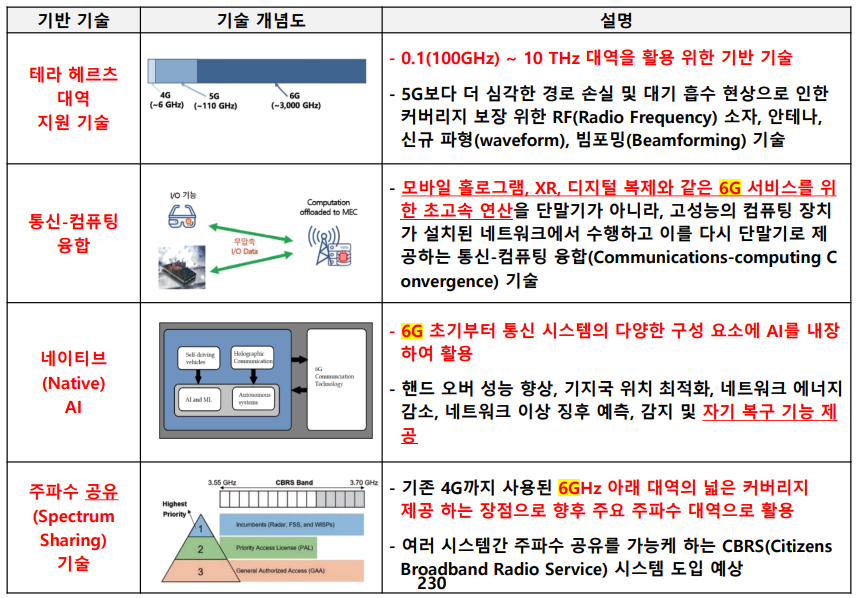
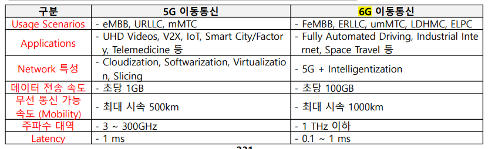

## I. 새로운 차원의 초연결 경험, 6G 이동통신 기술 개요
- 폭발적인 디바이스 간 연결 증가, 실시간 고속 데이터 트래픽 처리를 위해 1Tbps 최대 전송 용량과 1Gbps 사용자 체감 속도 등을 지원하는 이동 통신 기술

## II. 6G 성능 비전 및 이동통신 기술

## III. 6G 이동통신 지원 기술

## IV. 5G와 6G 기술성능 목표 비교
