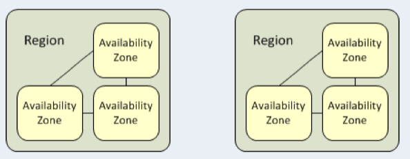
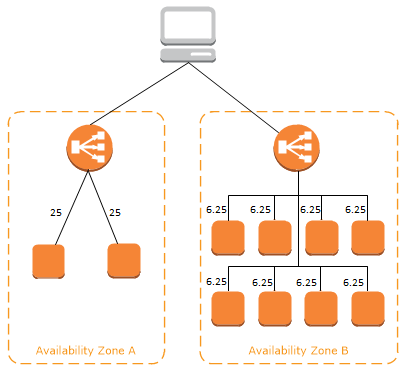
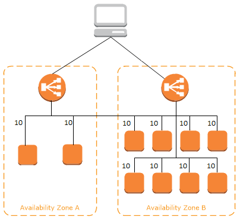

# ELB(Elastic Load Balancer)
- 키워드: Load Balancing, Listener, Target Group, Resource
- AWS의 사용자 정의 네트워크인 ```VPC(Virtual Private Network)```에 탑재
- 사용자 요청을 VPC 안의 EC2와 같은 ```Resource```로 부하 분산
- <b>Listener</b>와 <b>Target Group</b>으로 구성
  - Listener: 외부 요청을 받아 분산하여 전달
  - Target Group: 요청을 처리하는 Resource의 그룹
- 여러 개의 Listener와 Target Group을 거느릴 수 있음
- Resource는 Health Check로 끊임없이 상태 확인
- Listener는 외부 요청을 받아 들이는 Service Port 보유
  > Service Port로 들어오는 외부 요청만 처리함
- Listener가 적합한 요청을 Target Group에게 전달할 때는 Port Translation을 실시하므로, Target Group의 Port는 Listener의 Port와 달라도 됨
- L4 스위치와 비교해보면 Listener는 Virtual Server, Target Group은 Pool에 해당
- ELB는 크게 외부 인터넷에서 접속 가능한 공인/사설 IP 모두를 갖는 Internet LB와 내부 접근만을 허용하는 사설 IP만 갖는 Internal LB로 구분
- L4와 L7에 대한 부하 제어가 가능
- 둘 이상의 가용 영역에서 EC2 인스턴스 컨테이너, IP 주소 등 여러 대상에 걸쳐 수신되는 트래픽을 자동으로 분산
- 서버의 기본 주소가 바뀌면 LB를 새로 생성해아 하며, 하나의 주소에는 하나의 Target Group을 보냄
  > 즉, Target Group의 개수에 비례하여 LB의 개수와 비용이 늘어남
- AWS 환경에서는 4가지 유형의 LB를 지원하며, 사용자의 요구 사항과 환경에 맞춰 선택할 수 있음


## 가용 영역(Availability Zone, AZ)

- Region은 최소 2개 이상의 AZ로 구성
- AZ는 최소 1개 이상의 데이터 센터로 구성
- 개별 데이터 센터는 일반적으로 50,000 ~ 80,000대의 물리적 서버가 있음
- 각 AZ는 같은 Region이지만, 천재지변이나 테러 등의 재해에에 대비하기 위해 지리적으로 멀리 떨어짐
- 가용영역 확인: [AWS 글로벌 인프라](https://aws.amazon.com/ko/about-aws/global-infrastructure/)


## Load Balancing Method

- 정적 로드 밸런싱
  - 라운드 로빈, 가중치 기반 라운드 로빈 등
  - IP 해시: 클라이언트 IP를 숫자로 변환하여 개별 서버에 매핑
- 동적 로드 밸런싱
  - 최소 연결 방법: 활성 연결이 가장 적은 서버로 트래픽 전송
  - 최소 응답시간 방법: 응답시간이 가장 짧은 서버로 트래픽 전송

|Method|Description|
|---|---|
|Round Robin|Load Balancer가 다수 서버에 순서대로 요청 할당|
|Least Connection|요청 전달 후 생성된 Connection이 가장 적은 서버로 요청 전달|
|Ratio|Connection 비율에 따라 요청 전달|
|Fastest|응답 속도가 가장 빠른 서버에게 우선적으로 할당|

## Load Balancer Node
- VPC 내 하나의 형태로 존재하는 다수의 NI(Network Interface)
- 공인/사설 IP 모두 보유 가능
- ELB는 실질적으로 사용자의 요청을 받아 Resource로 부하를 분산함
- AWS 콘솔상에서 NI 형태로만 보이므로 EC2의 NI에서 확인 가능
- Load Balancer Node는 AZ마다 하나씩 존재하고, 소속된 AZ 내의 Resource에게 요청을 전달함
- VPC에서 바라보는 ELB는 Load Balancer Node와 EC2의 집합으로 보이며, 각각 Listener(Load Balancer Node), Target Group(EC2 집합)에 해당
- AZ에 부하가 불균등하게 분산되는 현상을 해결하기 위해 교차 영역(Cross Zone) LB 수행




## ELB 요청 처리 과정
- 사용자는 LB의 DNS 이름을 통해 ELB에 접속
  - DNS 이름을 통해 접속하면 ELB는 요청을 Target Group에 전달되면 EC2가 요청 처리

1. 사용자가 LB에 접근하기 위해 Amazon의 DNS 서버에 LB의 도메인 해석 요청
2. Amazon의 DNS 서버가 LB Node IP 리스트를 사용자에게 전달
3. 사용자는 IP 중 하나를 선택하요 LB에 접근 ( +Port 입력 )
4. 사용자는 LB의 (Port가 일치하는) Listner에 접근하게 되며, Listner는 요청을 받아들여 적절한 Target Group으로 전달
5. Listener에게 전달받은 요청을 EC2가 처리 후 다시 사용자에게 반환


## ELB 구성 요소

### Listener
- 사용자의 요청을 받아 적잘한 Target Groupd으로 라우팅
- LB로의 접근은 해당 Listener의 Port로 접근하는 것이므로, Listner ID에 포트 명시해야 함
- 하나의 LB는 다수의 Listener을 보유할 수 있으며, SSL 인증서를 게시하여 SSL Offload를 실시할 수도 있음

### Target Group
- Listener가 전달한 요청을 처리하기 위한 부하분산 대상들의 모임
- Group에 등록된 EC2의 각종 정보(인스턴스 ID, Port, AZ 등)가 적혀 있고, EC2가 요청을 처리할 수 있는지를 나타내는 Health Check, 요청 처리에 관한 Monitoring이 있음. 여기서 Monitoring이라 함은 Target Group에 요청 처리가 가능한 EC2가 몇 개인지, 불가능한 EC2는 몇 개인지를 의미함

### Security Group
- LB Node 역시 NI 형태를 띄므로 Security Group를 가질 수 있음
- 따라서 사용자가 전달하는 요청을 처리하려면 해당 요청의 포트를 Security Group에서 열어둬야 함
- 또한 Target Group의 EC2 역시 LB 노드가 있는 Subnet의 요청을 처리할 수 있도록 EC2의 Security Group 또한 작업해야 함

### Health Check
- Target Group의 Ec2의 상태를 체크
- Health Check를 통과하지 못하면 더이상 요청을 전달받지 못함
- ELB의 Health Check에는 TCP, HTTP, HTTPS가 있으며, 제한 시간이나 간격, 성공 판단 횟수를 정의할 수 있음

### Connection Time Out
- 사용자가 ELB를 거쳐 EC2에 접근하여 서비스에 접속하면 Connection이 생성
- 이 Connection을 통해 사용자의 EC2가 통신하는 것인데, 통신이 더이상 발생하지 않는다면 Connection Time Out이 발생
- Connection Time Out이 지나면 Connection이 사라지므로, Connection 삭제에 대한 허용 시간 설정이 필요함 


## ALB (Application Load Balancer)
- **OSI 계층 중 7계층인 Apllication Layer에서 작동**
  - SSL 적용 가능하고, HTTP/HTTPS 트래픽에 적합

- **HTTP/HTTPS Header 정보를 이용한 지능적 라우팅**
   - HTTP Header나 SSL Session ID 같은 요청 콘텐츠를 확인하여 트래픽을 Redirection
   - 요청을 받으면 우선 순위에 따라 Listener 규칙을 평가하여 적용할 규칙을 결정한 다음, Target Group에서 Resource를 선택
   - 클라이언트 연결 유지가 필요 없는 콘텐츠(이미지, 비디오 등), 연결 유지가 필요한 콘텐츠(장바구니, 결제 등) 각각에 대해 서버를 분리하여 전송 요청

- **Path-based Routing을 지원**
  - ALB에 연결된 인스턴스들은 여러 개의 URL과 Path를 가질 수 있음
  - LB 하나만 설정하면 트래픽을 모니터링 하여 각 Target Group에 라우팅 할 수 있음  

- **Port에 따른 Target Group을 매핑**
  - Docker Container 환경에서 유용하게 작동 가능
  - 더 많은 Container를 넣어 비용을 최적화할 수 있음
  - 동일한 Port라도 Path등에 따라 다르게 분기할 수도 있음

- **Resource를 EC2 뿐만 아니라 Lambda, IP로도 할 수 있음**
  - 특정 요청에 대해 서버 없이 직접 응답 메시지를 작성할 수 있으므로 MA 구성이 용이

## NLB (Network Load Balancer)
- **OSI 7계층 중 네 번째 Transport Layer를 다루는 LB**
  - TCP, UPD 요청을 부하 분산
  - HTTP Header를 해석하지 못함
  - IP 및 기타 네트워크 정보 검사하여 트래픽을 최적으로 Redirection
  - Network 수준에서 LB를 제공
  - 애플리케이션 트래픽의 Source를 추적  

- **여러 서버에 고정 IP 할당 가능**
  - ALB와 달리 EIP(Elastic IP) 고정 가능
  - LB 접근 시 IP, DNS 모두 사용 가능

- **고성능 요구하는 환경에서 적합한 솔루션**
  - Low Latency로 초당 수 백만 건의 요청 처리 가능
  - 갑작스러운 트래픽 증대 및 변화에 최적화
  - 실시간 스트리밍 서비스나 화상 회의, 채팅 애플리케이션에 NLB가 적합
  - 단순 라우팅이 필요하고, 트래픽이 극도로 많은 경우 ALB보다 적합

## CLB (Classic Load Balancer)
- ALB와 NLB가 출시되기 전 사용하던 LB으로, 가장 오래된 ELB의 기본적인 형태
- L4에서 L7계층까지 LB가 가능하며, TCP, SSL, HTTP, HTTPS 등 다양한 프로토콜 수용
- 기본주소 바뀐 LB 새로 생성해야 하고, 하나의 주소에 하나의 대상 그룹 밖에 보내지 못함
- 데이터를 수정/변경할 수 없어 Port, Header 등을 변경하지 못하는 단점이 있음
- CLB 구조의 한계로 인해 서버 구성이나 아키텍처의 크기 및 복잡도에 따라 LB의 개수와 비용이 증가
- 현재는 레거시로 분류되었으며, NLB 또는 ALB를 많이 사용

## GWLB (Gateway Load Balancer)
- OSI 7계층 중 3계층인 Network Layer에서 작동
- 방화벽, 침입 탐지 및 방지 시스템, 심층 패킷 검사 시스템 등의 가상 어플라이언스 배포, 확장 및 관리 가능
- 트래픽이 EC2에 도달하기 전에 트래픽 검사, 분석, 인증, 로깅을 수행할 수 있음
- LB라기 보다는 트래픽을 체크하는 솔루션으로, 최근 LB 배포 및 확장과 AWS의 타사 네트워크 가상 어플라이언스의 플릿 관리에 사용


# 참고사이트
- [참고사이트](https://hudi.blog/region-and-availability-zone/)
- [AWS Elastic Load Balancer(ELB) 쉽게 이해하기 #1](https://aws-hyoh.tistory.com/128)
- [AWS Elastic Load Balancer(ELB) 쉽게 이해하기 #2](https://aws-hyoh.tistory.com/133)

- [SMILESHARK](https://www.smileshark.kr/post/what-is-a-load-balancer-a-comprehensive-guide-to-aws-load-balancer)