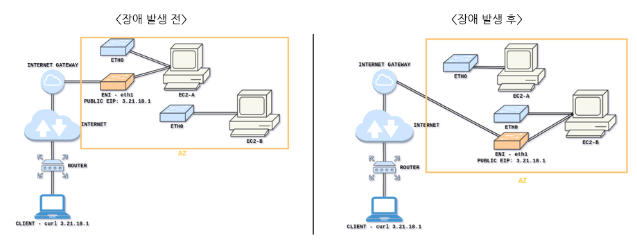

# ENI (Elastic Network Interface)
- VPC에서 가상 네트워크 카드를 나타내는 논리적 네트워크 구성 요소
- 인스턴스가 AWS 서비스, 다른 인스턴스, 온프레미스 서버, 인터넷 등 다른 네트워크 리소스와 통신할 수 있도록 함
- Secure Shell(SSH) 또는 Remote Desktop Protocol(RDP) 등을 이용해 인스턴스에서 실행중인 OS와 통신할 수 있게 해줌
- 모든 인스턴스는 기본 ENI가 있어야 하고, 이 인터페이스는 하나의 서브넷에만 연결되어야 함
- 인스턴스(eth0)의 기본 NI
  - 인스턴스에서 제거 및 Subnet 변경 불가능
  - 기본 ENI는 Public 트래픽을 처리
- 인스턴스(eth1)의 보조 NI는 백엔드 관리 트래픽 처리

- ENI는 특정 AZ에 바인딩되고,
- Private/Public/Elastic IP, Subnet, MAC Address, Security Group 속성을 가짐
- 아래와 같이 기본 ENI인 Eth0에 연결되어 EC2 인스턴스 연결을 제공
- 독립적으로 생성된 ENI로 즉시 연결하지 않고 Sub ENI를 사용하여 장애 조치 용도로 사용 가능

- [[AWS] Elastic Network Interface(ENI), Enhanced Networking(성능강화 네트워크)](https://kimjingo.tistory.com/197)
- [[AWS SAA] Elastic Network Interfaces(ENI)](https://velog.io/@jungmyeong96/AWS-SAA-Elastic-Network-InterfacesENI)
- [AWS ENI / AWS ENA](https://blog.naver.com/barampull2/223249639927?trackingCode=rss)

- [ENI (Elastic Network Interface) - 개요](https://ssunw.tistory.com/entry/EC2-SSA-Level-ENI-Elastic-Network-Interface-%EA%B0%9C%EC%9A%94)

여기 보고 정리!!!
- [ENI(Elastic Network Interface)](https://tadaiswhatever.tistory.com/m/396)