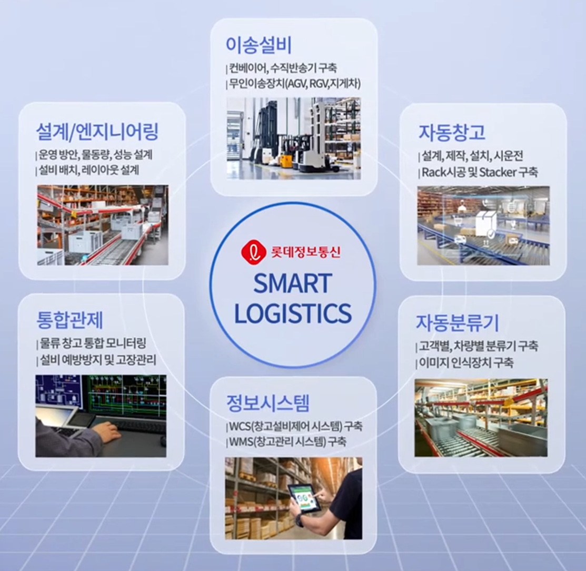
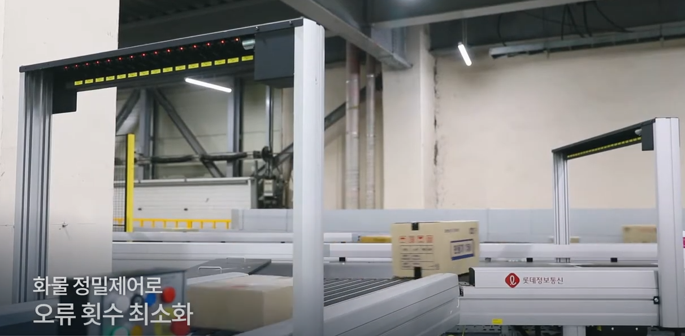
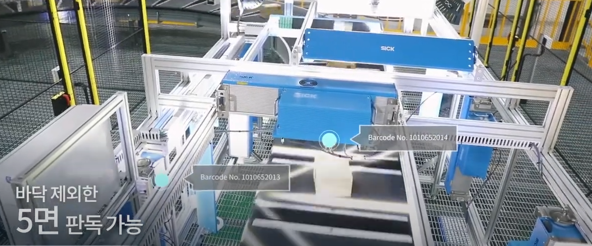
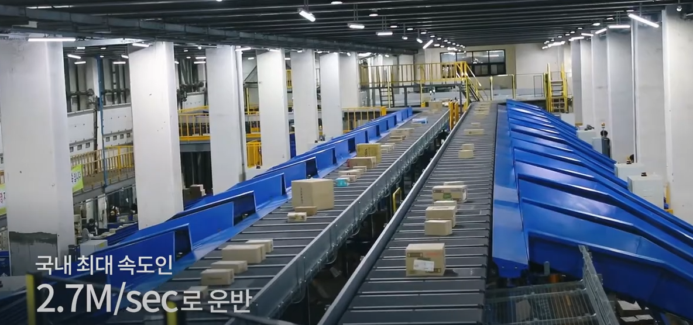
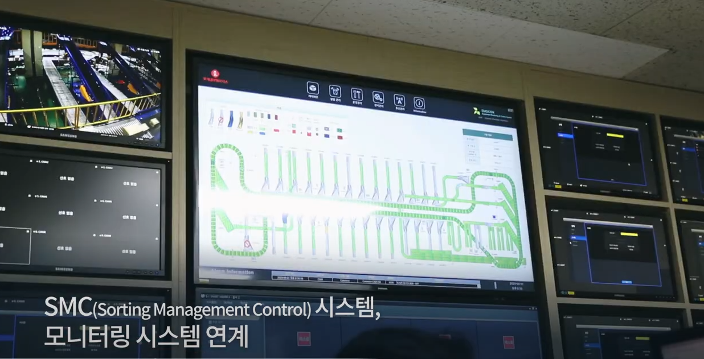
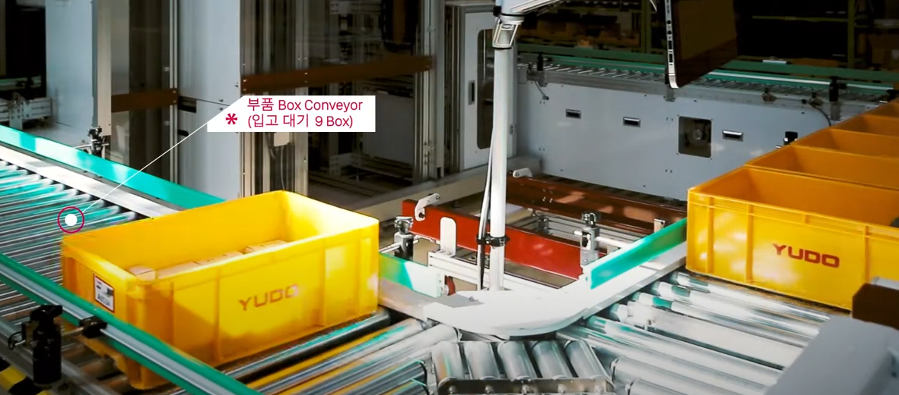
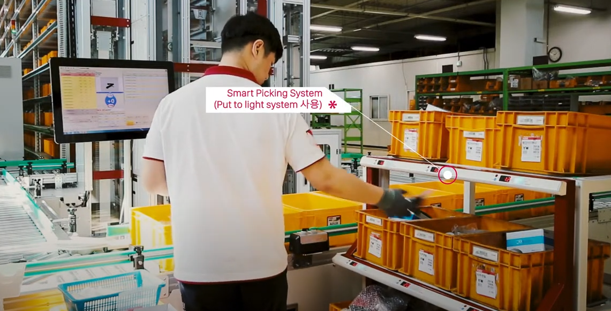
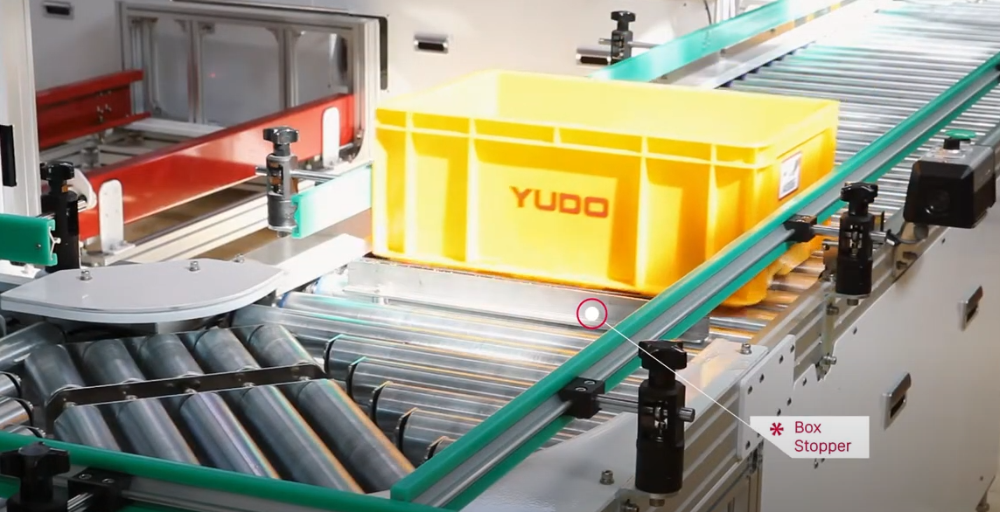
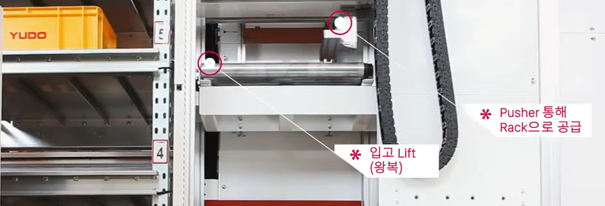

# 삼성SDS 물류 자동화 | 물류 혁신 기술
- [영상보기](https://www.youtube.com/watch?v=MA6P77QrQ5c)

- 적치/피킹: AGV(무인반송차), AMR, Robot Shuttle, Unmmanned forklift, Vision Picking
- 반송: AGV, Unmanned forklift
- 보관: AGV, Robot Shuttle
- 분류: DAS(디지털분배시스템)
- 재고조사: Drone
- 포장: Auto Packing Machine
- 입고

# 롯데정보통신 물류 자동화 솔루션
- [영상보기](https://www.youtube.com/watch?v=bqpHwmAC91E)

- 인덕션
  - 자동투입장치로, 소터의 개별 캐리어에 화물을 정중앙에 투입
  - 화물 위치, 길이 등을 감지
  - 화물 정밀제어로 오류 횟수 최소화

- IPS(Image processing System)
  - 송장에 부착된 바코드를 촬영하여 화물의 도착지 등을 인식하는 장비
  - 바닥 제외한 5면 판독 가능

- 출고슈트
  - 14개 수도권 및 지방 터미널로 화물을 출고처리 하는 라인
  - 유선형 설계로 안정적 고속 운반 가능
  - 양방향에서 상, 하차 작업 가능

- SMC(Sorting Management Control) 시스템
  - 모니터링 시스템 연계
  - 기능별 모듈화를 통해 장애 시에도 시스템 운영 가능
  - 고장 예지 및 시스템 원격 모니터링

# 사람이 없는 물류센터...초국경 택배에 자동화 경쟁 치열
- [영상보기](https://www.youtube.com/watch?v=H_AqcbdOEO4)
- CJ Logistics(대한통운) 제품 소개
- 글로벌 물류 시장 규모 2021년 97조원 → 2026년 178조원(추정)으로 증가
  - 시장이 앞으로 계속 커질 분야임

# [ AS/RS 자동창고 ] Smart Warehouse Solution
- [영상보기](https://www.youtube.com/watch?v=ptl5JfEbnHg)
- 입고 및 출고를 위해 토트가 대기

- 출고 Lift, Air Lift
- WMS Software
- Smart Picking System(Put to light system 사용)

- 위 사진에서 좌측 모니터에 나오는 게 WMS Software
- Box Stopper

- Barcode Scanner, Barcode Sensor(대상 Box Lift 진입시)
- Pusher가 Rack으로 공급
- Shuttle이 토트 가져다가 적재

# AGV를 연계한 GTP
- [영상보기](https://www.youtube.com/watch?v=flGG8F-2OGk)
- 출고 지시를 받은 GV가 랙을 자동 운반
- 랙이 스테이션에 도착하면 PPS가 피킹 대상 제품의 위치와 수량 표시
  - 작업자는 손쉽게 제품 토탈 피킹
- 효율적 공간 구성, 피킹과 분류를 짧은 동선 내에서 수행
- 다품종 소량 물류 특성은 가진 e커머스, 의류, 제약 등 적용 가능
- 피킹 후 분류 작업을 수행하여 작업자 동선 최소화