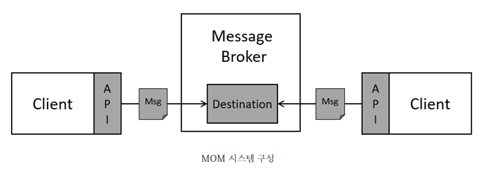
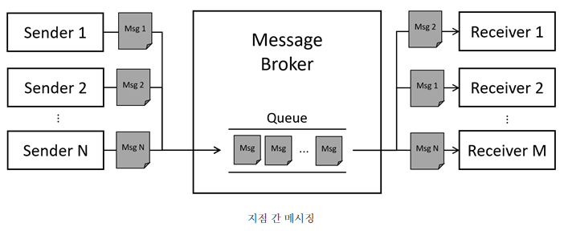
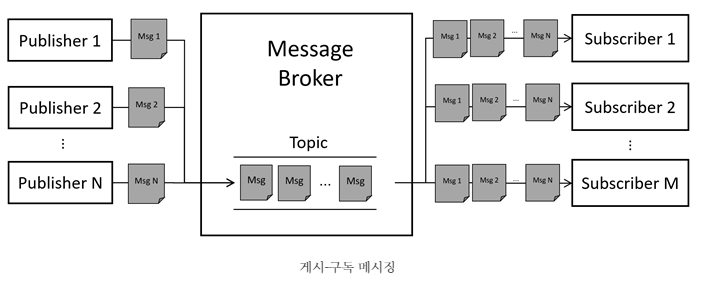

# [Review] Message Orineted Middleware

## 메시지 지향 미들웨어(Message Oriented Middleware, MOM)

```
미들웨어는 다른 소프트웨어 구성 요소 간의 통합을 쉽게 할 수 있도록 표준화된 인터페이스를 제공하며, 소프트웨어의 확장 및 축소를 유연하게 할 수 있도록 소프트웨어 계층 간의 결합도(coupling)를 낮춰준다. 미들웨어는 다수의 프로세스나 소프트웨어 계층 간의 효과적인 데이터 교환을 목적으로 구현된다. 본 글에서는 미들웨어인 메시지 지향 미들웨어에 대해 살펴본다.
```

### 1. MOM 시스템 구성



```
MOM 기반의 시스템은 위의 그림과 같이 클라이언트, 메시지 및 메시지 브로커(broker) 구성된다. 클라이언트는 메시지의 송신 혹은 수신 중 하나의 행동만 수행할 수 있으며, 메시지의 송·수신은 API를 이용하여 이루어진다. 브로커는 송신측 클라이언트로부터 받은 메시지를 목적지(destination)에 저장하여 수신측 클라이언트의 요청이 발생할 때까지 보관한다.
```

```
MOM 시스템에서 클라이언트 간에는 느슨할 결합을 갖는다. 클라이언트 간에 메시지를 직접 교환한다면 메시지 교환 참여자들은 상대방의 연결 및 유휴 상태를 수시로 파악해야 하며, 메시지를 교환하려는 클라이언트가 늘어날 때마다 서로 간의 쌍(pair) 수립을 설정하는 번거로운 과정을 거쳐야 한다. 그러나 MOM 시스템에서 메시지의 처리나 관리 이슈는 모두 MOM이 담당하기 때문에 클라이언트는 오로지 메시지 송·수신 행동만 수행하면 된다.
```

### 2. 메시징 방식

```
클라이언트와 MOM은 지점 간 메시징(point-to-point messaing)이나 게시-구독(publish-subscribe messaing) 방식으로 통신한다.
```



```
지점 간 메시징에서 메시지 생산자는 발신자(sender), 소비자는 수신자(receiver)라고 하며, 둘 간의 메시지 교환을 위해 목적지로 큐(queue)를 이용한다. 발신자의 메시지가 큐에 생성(produce)되면 수신자는 큐의 메시지를 소비(consume)한다. 여러 발신자는 동일한 큐에 메시지를 생성할 수 있고, 여러 수신자 또한 동일한 큐에 접근하여 메시지를 요청할 수 있다. 그러나 수신자에 의해 요청되는 즉시 메시지는 삭제되므로 하나의 메시지를 여러 수신자가 소비할 수는 없다.
```



```
게시-구독 메시징에서 메시지 생산자는 게시자(publisher), 소비자는 구독자(subscriber)라고 하며, 둘 간의 메시지 교환을 위해 목적지로 토픽(topic)을 이용한다. 게시자가 토픽에 대해 메시지를 생성하면 구독자는 구독 중인 토픽에서 메시지를 소비할 수 있다. 게시-구독 메시징 방식에서도 여러 발행자와 구독자가 동일한 토픽에 접근 가능하지만, 지점 간 메시징 방식과는 달리 구독자는 토픽에 게시된 메시지의 복사본을 갖기 때문에 여러 구독자가 동시에 메시지를 소비할 수 있다. 따라서 구독자 측에서 메시지를 필터링하지 않는다면 구독자는 토픽에 게시된 모든 메시지를 구독할 수 있다.
```

### 3. 브로커 메시지 전달 방식

```
브로커는 소비자에게 메시지 전달을 위해 push나 pull 방식을 채택할 수 있다. push를 채택한 브로커는 소비자의 요청과는 무관하게 메시지 생산자로부터 받은 메시지를 소비자에게 전달하고, pull 방식을 채택한 브로커는 소비자가 요청할 때만 메시지를 소비자에게 전달한다.
```

```
push 방식은 메시지의 최신성을 보장하기에 유용한 방식이다. pull 방식에서 메시지의 최신성을 보장하기 위해서는 브로커-소비자 간 협의에 따라 메시지 전달 방식을 약속해야 하지만, push 방식의 경우에는 브로커에 의해 일방적으로 소비자에게 메시지가 전달되기 때문에 브로커는 큐나 토픽에 메시지가 생성되는 즉시 소비자에게 메시지를 전달할 수 있다. 다만 이 과정에서 브로커는 소비자의 메시지 수신여부를 알 수 없기 때문에 이를 보완하기 위한 추가적인 조치가 필요하다.
```

```
pull 방식은 새로운 소비자를 늘려 네트워크를 확장하기 용이하다. push 방식의 경우에는 브로커가 메시지를 전달하기 위해서는 메시지를 전달하기 이전 시점에 이미 소비자의 주소를 알고 있어야 한다. 브로커는 네트워크에 참여하는 신규 소비자가 생기거나 기존 소비자의 주소가 변경될 때 소비자의 주소를 최신화 해야 한다. 이는 시스템 관점에서 브로커와 소비자 간의 높은 커플링을 유발하여 네트워크의 규모를 확장하기 어렵게 하는 원인 중 하나이다.
```

```
하지만 pull 방식의 경우에는 메시지를 전달받는 소비자가 브로커의 주소를 기억한다. 브로커는 소비자의 요청으로부터 소비자의 주소를 파악하여 소비자가 원하는 메시지를 전달할 뿐이다. 즉, 브로커는 네트워크에 신규 소비자가 참여하거나 기존 소비자의 주소가 변경되어도 신경 쓸 필요 없기 때문에 네트워크 규모 확장이 push 방식에 비해 용이하다
```

### 4. 메시지 영속화(persistence)

```
브로커가 메시지를 저장하는 목적지인 큐나 토픽은 메모리 상에서 동작한다. 따라서 불가피한 이유로 MOM 시스템이 종료된다면 큐나 토픽에 기억된 모든 메시지가 사라져버린다. 이 뿐만 아니라 네트워크 구성 및 상태와 관련된 정보 역시 사라져 버리기 때문에, MOM 시스템을 재시작하였을 때 네트워크 설정을 다시 해야한다. 따라서 MOM은 데이터베이스나 파일시스템 등의 방식을 이용하여 생산자에 의해 전달된 메시지 및 네트워크와 관련 정보를 영속화하여 재시작 시 이를 참고하여 이전 메시지와 설정을 복원한다.
```

### 5. Apache Kafka

```
빅데이터 처리에 오랜 시간이 걸린다면, 처리 중에 하드웨어 고장이나 성능 이슈으로 시스템이 종료될 가능성이 커진다. 이런 경우에 대비하여 빅데이터 처리 시스템은 장애에 대응하여 시스템 재구동 시 이전 작업을 복구할 수 있어야 한다. 또한 빅데이터 처리 성능 향상을 위하여 처리 프로세스나 분산 노드 확장이 유용하고, 빅데이터를 효과적으로 교환할 수 있어야 한다. MOM 차원에서 장애와 확장성에 대응하기 위해서는, 메시지 브로커는 주기적으로 메시지 생산자로부터 받은 메시지를 스토리지에 저장하여 데이터를 영속화해야 하며, 메시지를 pull 방식으로 사용자에게 메시지를 전달할 수 있어야 한다. 아파치 카프카는 이러한 요구 조건을 모두 만족하는 MOM이다.
```

```
아파치 카프카는 링크드인 사이트에서 발생하는 대량의 웹로그를 효율적으로 처리하기 위한 목적으로 개발되었다. 다른 제품 보다 데이터 영속화에 주목하여 관련된 기능과 성능을 향상시켰으며, 소비자가 임의 시점에 데이터를 전달받을 수 있도록 pull 방식을 채택하여 소비자에게 메시지를 전달할 뿐만 아니라, 분산 환경에서 노드를 확장하기 유용하다.
```

```
카프카에서는 메시지 전달 시 높은 처리량에 더 집중하고자 메시지 중복을 허용하기 위해 ‘적어도 1회 전달(At Least Once)’ 수준으로 메시지 전달을 보증한다. 또한 브로커는 메시지 수신여부를 알리기 위해 생산자에게 Ack를 전달하며, 메시지의 오프셋을 변경하여 소비자의 메시지 수신지점을 기록한다.
```

### 6. RabbitMQ

작성중…

### 7. 참고문헌

[1] [https://www.redhat.com/ko/topics/middleware/what-is-middleware](https://www.redhat.com/ko/topics/middleware/what-is-middleware)
[2] [https://docs.oracle.com/cd/E19340-01/820-6424/aerbj/index.html](https://docs.oracle.com/cd/E19340-01/820-6424/aerbj/index.html)
[3] [https://docs.oracle.com/cd/E19340-01/820-6424/aerbk/index.html](https://docs.oracle.com/cd/E19340-01/820-6424/aerbk/index.html)
[4] [https://kafka.apache.org/documentation/#design](https://kafka.apache.org/documentation/#design)