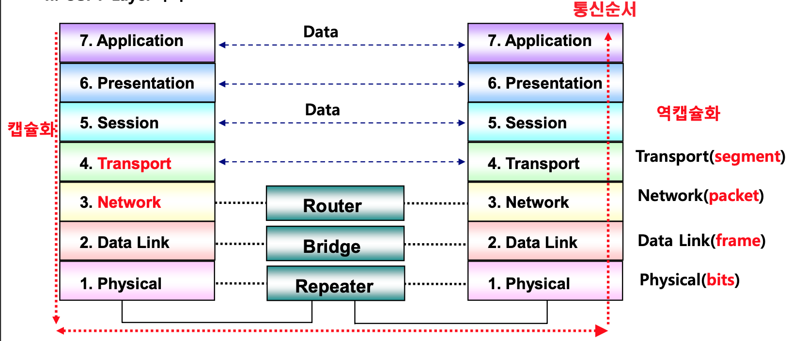

## I. 통신 프로토콜의 ISO 국제 표준, OSI 7 Layer 정의

### 가. OSI(Open System Interconnection: 개방형 시스템간 상호접속) 7 Layer 정의
- 모든 네트워크 통신상에서 발생하는 여러 네트워크 충돌 문제 해결하기 위해 ISO에서 표준화된 네트워크 구조를 제시한 기본 모델

### 나. OSI 7 Layer 특징

특징 | 설명
-- | --
계층 구조 | - 네트워크 통신 기능의 레이어별 집합 - 서로 다른 계층에 영향을 미치지 않아 관리용이 - 네트워크 학습과 이해 용이
캡슐화 | - 상위 계층에서 하위 계층으로 데이터를 전송될 때 계층의 특성/제어정보를 헤더화시켜 붙이는 과정 
역캡슐화 | - 캢슐화와 반대로 하위 계층에서 상위 계층으로 데이터를 전송할 때 헤더를 제거하는 과정
통합 모델 | - 모든 네트워크 표준을 하나의 모델로 통합하고 서로 다른 네트워크 환경에서의 통신 지침 제공 
참조 모델 | - 네트워크 표준 개발 공동 기법 제시, 이해관계자 간 공통 언어 제공

## II. OSI 7 Layer 구조 및 상세내용

### 가. OSI 7 Layer 구조

- OSI 7 Layer는 각 계층마다 특정한 서비스를 제공하고, 이를 위한 각각의 프로토콜이 존재

### 나. OSI 7 Layer별 상세 내용

Layer | 설명 | 정보단위 | 프로토콜
-- | -- | -- | --
Application | - 데이터 통신을 수행하는 애플리케이션에 통신  서비스를 제공 | - | - HTTP, FTP, DHCP, SSH
Presentation | - Apllication이 다루는 정보를 통신에 알맞은 형태로 만듦 - 하위 계층에서 온 데이터를 사용자가 이해할 수 있는 형태로 만듦 - 포장, 압축, 암호화 기능 제공 | - | MIME, TLS, SSL
Session | 두 프로세스 사이에 데이터가 흐를 수 있는 가상 경로(=세션) 확립과 유지, 해제. OS가 담당 | - | -
Transport | - 성공적인 데이터 전송에 대한 책임을 갖고 연결 수립(Establish Connection) 담당 - 오류제어, 흐름제어, 혼잡제어 | 세그먼트 | - TCP, UPD
Network | - 시스템 간 데이터 전송 위한 최적의 <u>통신경로</u> 선택 - Router 장비가 동작하는 계층 - 직접 주소를 할당하는 계층적인 <u>논리적인 주소 구조</u>를 가짐 | 패킷 | ARP, IP, ICMP, IPsec, IGMP
DataLink | - 인접한 시스템 사이의 물리적인 통신 위한 통신로를 확림(Link) - 프레임에 물리적주소(MAC) 부여 - 오류 제어, 재전송, 흐름 제어 | 프레임 | 이더넷
Physical | - 통신회선으로 데이터의 비트 정보를 내보내기 위한 전기적 변환, 기계적 작업 수행 - 각 장치 간 물리적인 인터페이스로 데이터 전송을 담당 - 직렬/병령 케이블, NIC, Connector 등이 해당 계층에 속함 | 비트 | - RS-232, RS-422, RS-485

### (참고)
-   Keep Alive: 연결된 소켓에 IN/OUT의 액세스가 마지막 종료된 시점부터 정의된 시간까지 액세스가 없어도 대기하는 구조 