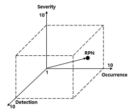
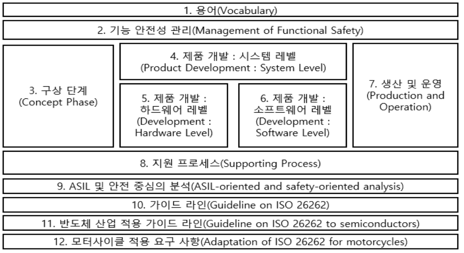
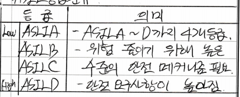

문제)
1. IEC 61508 개념
2. 기능 안전 분석 기법
3. 자동차, 의료기기, 항공기 기능안전 표준 비교
4. ISO 26262 구조도와 ASIL 설명

## I. SW 기능 안전성 국제 표준, IEC 61508 개념 (17줄)
### 가. IEC 61508 정의 (3줄)
- 전기/전자/프로그램 가능한 시스템의 정확한 기능을 통한 안전 확보를 목표로 SW 생애 전반에서의 준수 기준을 제시하는 안전 규칙 국제 표준

### 나. IEC 61508 구성 (12줄)
구분 | 주제 | 설명
-- | -- | --
Part1 | 일반요구사항 | - 전체 안전요구사항 개발   - 안전관련시스템의 설치/운영
Part2 | E/E/PE 안전  관련 시스템 요구사항  | - E/E/PE 안전관련시스템 구현
Part3 | SW 요구사항 | - 안전관련SW 구현
Part4 | 용어 정의/약어 | - 용어와 약어를 정의
Part5 | 안전도 수준 결정방법 사례 | - 안전 무결성 요구사항개발  - 리스크 기반 접근법
Part6 | Part2, 3 적용지침 | - Part2, 3 적용 위한 지침
Part7 | 기술/방법의 개관 | - 기법과 수단의 개요

- E/E/PE 안전관련시스템은 <u>전기/전자/프로그램 가능한 시스템</u>을 의미함

## II. 기능 안전 분석 기법 (13줄)

<table>
  <tr>
    <th>방법</th>
    <th>개념도</th>
    <th>설명</th>    
  </tr>
  <tr>
    <td>FTA</td>
    <td></td>
    <td class="desc">
      - Fault Tree Analysis  
      - 트리다이어그램 이용  
      - 연역적, 정성/정량적  
    </td>
  </tr>

  <tr>
    <td>FMEA</td>
    <td></td>
    <td class="desc">
      - Failure Mode and Effects Analysis   
      - 고장 도출/정량화   
      - 위험도 우선순위/등급별 대응    
    </td>
  </tr>

  <tr>
    <td>HAZOP</td>
    <td></td>
    <td class="desc">
      - Hazard and Operability Study   
      - 공정변수와 가이드워드 조합   
      - 예외동작의 영향 분석
    </td>  
  </tr>

  <tr>
    <td>STPA</td>
    <td class="desc" colspan="2">    
      - System Theoretic Process Analysis   
      - 시스템 요소 간 상호작용이 안정성에 미치는 영향 분석    
    </td>  
  </tr>
</table>

## III. 각 분야별 표준 비교 (30줄)

### 가. 각 분야별 기능안전 국제 표준 정의

구분 | 표준 | 설명
-- | -- | --
항공기 | DO-178B | - 1992년 상용 항공 산업 내 사용된 SW 인증 표준
항공기 | DO-178C | - DO-178B의 안정성/신기술 보완   - 상해에 대한 등급 및 안전 테스트 방법 기술
의료기기 | IEC 60601 | - 의료기기 안전요구사항 도출, 안정성 분석
의료기기 | IEC 62304 | - 의료기기 SW 개발 생명주기 정의   - 단계별 활동, 지표, 산출물로 안정성 평가
의료기기 | ISO 14971 | - 의료기기 SW 개발단계 적용   - 개발 시 위험 분석방법 규정
자동차 | ISO 26262:2011 | - IEC 61508 기반의 표준   - ECU 오작동 사고와 인명손실 최소화 목적
자동차 | ISO 26262:2018 | - 자율주행, 차량 반도체 및 차량   전반에 대한 기능 안정성 개정 표준

### 나. 각 분야별 기능안전 국제 표준 비교

구분 | IEC 61508 | DO-178C | ISO 62304 | ISO 26262
-- | -- | -- | -- | -- 
적용대상 | 전기/전자/프로그램 가능한 시스템 | 항공시스템 및 장비 | 의료기기 및 SW | 자동차 전기/전자  시스템, HW, SW
구성 | 7개 파트 | 9개 파트 | 2개 파트 | 13개 파트
안전무결성 단위 | SIL (Safety Integrity Level) | SL (Software Level) | SSC (Software Safety Class) | ASIL (Automotive SIL)
장애등급 | - | Catastrophic Hazardous/Severe Major, Minor | - | -
개발프로세스 테일러링 | Techniques/Measures 테일러링 | Objectives 테일러링 | Templated 테일러링 | Methods 테일러링
SW테스팅 | 모듈/통합 테스팅 함께 다룸(V모델) | 코드커버리지 정량적 테스트 시뮬레이션  HW결합테스팅 | SW개발/유지보수 단계별 테스팅 수행(V모델) | 테스트 단계별 고려요소 명확히 구분(V모델)
테스트산출물 검증 | 도입 | 도입 | 도입 | 도입

## IV. ISO 26262 구조도 및 ASIL 설명

### 가. ISO 26262 구조도

### 나. ASIL(Automotive Software Integrity Levels) 설명
- ASIL은 IEC 61508의 안전성보전등급(SIL) 개념을 자동차 특성에 맞게 개선한 ISO 26262의 차량안전성보전등급
- 위험 수준에 따라 ASIL A ~ ASIL D 등급으로 분류

