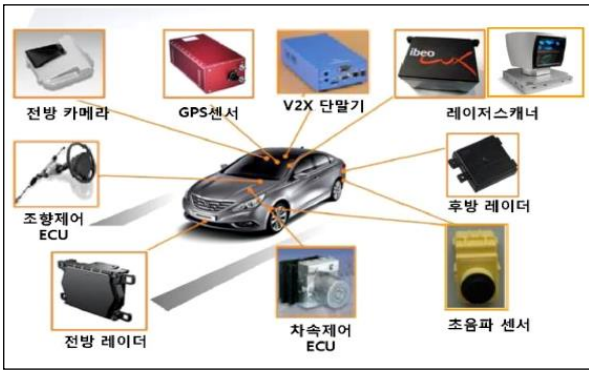
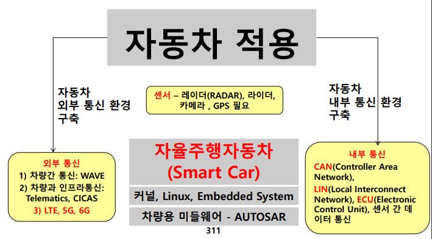

문제)
1. 자율주행 자동차 개념 및 설명
2. 레이다와 라이다 비교
3. V2X 통신 기술

답)
 
## I. 운전자 없이 스스로 안전운행, 자율주행 자동차 개념

- 스스로 주변환경과 위험을 인식함으로써 운전자 주행조작을 최소화하고 안전주행이 가능한 자동차

## II. 자율주행 자동차 SW 구성도 및 주요기술

### 가. 자율주행 자동차 주요기술

기술구분 | 설명 | 사용기술
-- | -- | --
자동차 제어 | - 차내망 통신 기술 이용하여 차내 각종 구성요소로 이동 - 주어진 경로 추종위해 조향, 가감속, 엔진토크, 기어 등 액츄에이터 제어 | X-by-Wire
차량용 센서 | 센서정보 수집, 처리, 가공 단계별 기술 -환경인식, 위치인식, 맵핑  | - 라이다, 레이더, 영상, 초음파, GPS 센서 등
차량 통신 | - 다수 차량에 대한 무선통신 이용한 V2V, V2I 네트워킹 기술  | - WAV, V2X
판단 | - 목적지까지 경로 계획 - 장애물 회피경로 계획 - 주행 상황별 행동판단 | - 상황인식, 기계학습, 최단경로 알고리즘
서비스 | - 차량 제어, 실시간 데이터 수집, 운전자/차량 서비스 | - 헤드업 디스플레이, TTS, 음성인식, HVI

### 나. 자율주핸 자동차 센서 종류

구분 | 개념 | 역할
-- | -- | --
레이다 (RADAR) | - RAdio Detection and Ranging - 전자기파 반사 - 무선탐지, 거리측정  | - 물체와의 거리/속도/각도 측정 - 크루즈 컨트롤, 충돌방지 시스템
라이다 (LIDAR) | - LIght Detection And Ranging - 빛 이용/정밀 관측 | - 반경 360도/3D 정보취득 - 보행자감지, 자동주차
카메라 | - 광학계 통해 차선/보행자 감지 | - ADAS, LKAS  -운전자 감시, 주변환경 인식
GPS | - 차량의 위치 측위 | - 현재 위치, 속도 분석

### III. 레이다와 라이다 비교

구분 | 레이다(RADAR) | 라이다(LIDAR)
-- | -- | --
개념 | - 전파 사용. 대상 거리/방향/각도/속도 측정하는 시스템 | - 빛으로 물체 감지하고 거리 맵핑
키워드 | - 전파/반사파 측정 | - 반사되는 빛 분석
대역 | - 마이크로파 40MHz ~ 40GHz | - 1550nm 파장 대역
의미 | - 출력된 신호가 물체에 부딪쳐 반사돼 돌아오는 시간차 이용 - 거리 늘수록 작은 부분 분석 어려움 | - 빛 파장 특성 이용. 레이다 보다 정밀 - 파장 짧아 세밀한 공간분해 가능
거리 | - 1m 이내 거리 ~ 200m 이상 | - 근거리 감지 어려움  -수m~200m 이상
응용 | - 군사정보, 항공, 선박 | - 고해상도 스캔, 자율주행 자동차, 3D 항공지도

### IV. 차량 간 통신(V2X) 기술
구분 | 통신기술 | 상세설명
-- | -- | --
차량간 통신 V2V | WAVE | 차량 간 고속 통신 및 인프라 간 통신 지원하는 IEEE 1609와 IEEE 802.11p 규격 조합
차량간 통신 V2V | 이동통신 | - LTE/5G 기반 V2V 기술
차량간 통신 V2V | VMC | - 차량간 실시간 무선 통신 통해 차간 사고, 돌발 상황 방지, 네비게이션 연동, 고장 원격 점검 등을 실현하는 텔레메틱스 기술(Wireless Access in Vehicle Environment)
차량-인프라 간 통신 V2I | Telematics | - 자동차와 컴퓨터, 이동통신 기술 결합  - 교통 정보 및 제어 등의 서비스 제공
차량-인프라 간 통신 V2I | CICAS | - 미국. 민관합동 교9차로 충돌방지 시스템 개발 프로젝트 - Cooperative Intersection Collision Avoidance System
차량-인프라 간 통신 V2I | CALM | - Continuous Air Interface for Long and Medium Range - 끊김없는 통신, ITS와 인터넷 서비스, Master/Slave 모드, P2P 모드, Transparent 네트워크 제공 -V2V, I2I, V2I 등의 응용 위한 다양한 통신 방법 지원

https://ssl.pstatic.net/imgstock/upload/research/industry/1624492631355.pdf