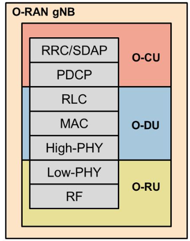
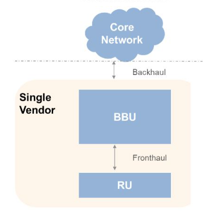
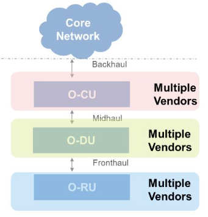

## I. 개방적/지능화된 무선 접속망 구현 위한 O-RAN 개요
### 가. O-RAN(Open Radio Access Network) 정의
- AI 기반 무선 제어 및 가상화된 무선 접속망 구축을 위해 설계
- 표준화된 인터페이스 기반으로 3GPP 및 다른 표준 지원하여 개방적/상호운용 가능한 연동 NW 플랫폼

### 나. O-RAN 필요성
구분 | 설명
-- | --
호환성 문제 | - 장비 연결 위한 SW를 국제 표준화함으로써 다양한 기업의 통신장비 상호호환 가능
공급사 다양성 상실 | - 통신장비 공급업체의 독점으로 인한 경쟁력 상싱 우려
기술 개발 도모 | - 국내 기업의 기술 개발 도모하여 통신장비 대외 의존도 감소

## II. O-RAN 구성도와 구성요소
### 가. O-RAN 구성도

- O-CU, O-DU에 RIC 연결
### 나. O-RAN 구성요소

구성요소 | 기반기술 | 설명
-- | -- | --
RIC | - RIC near-RT, RIC non-RT | - RAN Intelligent Controller  - 데이터 수집과 분석을 기반으로 RAN요소와 자원 제어/최적화
O-CU | - RRC/SDAP, RDCP | - O-RAN Centralized Unit - RRC, PDCP 계층 실행하는 중앙 집중식 장치 - CU Control/User Plane 구성, 미드홀 통해 O-DU 작동제어
O-DU | - RLC, MAC, High PHY | - O-RAN Distributed Unit  - O-RU 근처에서 PLC, MAC 및 PHY 계층 일부 실행하는 분산 장치
O-RU | -RF, Low-PHY | - O-RAN Radio Unit - 안테나 근처에서 송수신되는 무선신호를 프론트홀 통해 O-DU로 전송. 디지털 신호 변환

## III. 기존 RAN과 O-RAN 비교
구분 | 기존 RAN | O-RAN
-- | -- | --
개념도 |  | 
공급 | - 단일 벤더 | - 다중 벤더
플랫폼 | - 공급업체 종속 - 시장출시 기간 길고, 고비용 | - Software Defined, 개방형 H/W
모듈성 | - 제어, 데이터, 인터페이스 통합 구성 | - 제어, 데이터, Open API 분리
애플리케이션 및 네트워크 적응성 | - 제어로직과 네트워크 리소스 고정 | - 네트워크 조건에 따라 프로그래밍 가능

http://dl.kotra.or.kr/pyxis-api/1/digital-files/c4c9464e-616b-44eb-9275-85e0484df769

## IV. O-RAN 기대효과
구분 | 설명
-- | --
시장점유율 상승 | - 통신 장비 간 호환성이 사라져 국내 기업의 시장 점유율 상승
CAPEX 절감 | - 업체 간 경쟁에 따른 통신 장비 가격 하락
특화망 본격화 | - 특정 산업/지역에 특화된 맞춤형 네트워크 구성 

## 아래 특화망

https://blog.skby.net/5g-%ED%8A%B9%ED%99%94%EB%A7%9D-private-5g/

