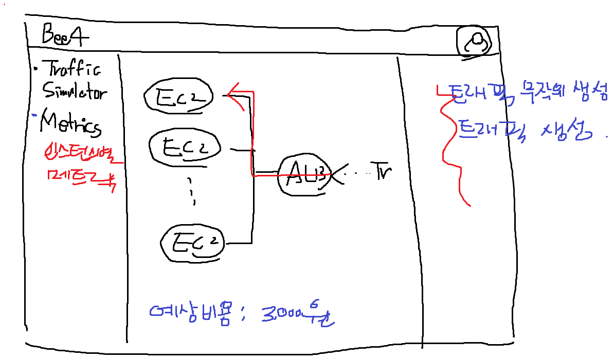

# bee4 241026
1) 웹에 접속한다.
2) 온라인 상태의 EC2 인스턴스 이미지가 나타난다.
3) Request 발생 버튼을 누른다.
4) Request를 배정받은 EC2 인스턴스 이미지가 깜박인다.

# bee4 241018
- 트래픽 자동 생성: Go 언어
- Metrics 모니터링
- 로드밸런싱 자동화/시각화
- 비용 추적
- 리액트 UI 만들기
- Spring Boot
- Netty
- 테라폼
- AWS Trusted Advisor
- AWS Organizations, SCP 등 계정 통합

# bee4 로그인&인증
1) AWS Organizations, SCP 등 계정 통합
2) Cognito를 이용한 인증
3) Role, Policy 부여

# [탭1] bee4 트래픽 시뮬레이터
1) 엔드포인트 생성 기능
  - ALB, NLB, API Gateway

2) 트래픽 발생 기능
  - 트래픽 한 개씩 발생, 트래픽 무작위 발생, 트래픽 동시 생성

3) 트래픽 이동 애니메이션
4) 트래픽에 따른 비용 정산 기능
5) 엔드포인트에서 수행할 함수 설계



# [탭2] bee4 인스턴스별 Metrics
- 인스턴스별 Metrics 그래프가 나타남

# bee4 (beeFour) 정의 및 목표

## bee4 정의
- 꿀벌과 Net의 조합
- 꿀벌은 영어로 bee이고, Network의 Net은 한글발음이 넷인데, 숫자 4도 넷이라고 발음함
- 꿀벌은 한 마리의 여왕을 필두로 집단을 이루고 있음
- Network는 상호협력을 최우선으로 여김
- 즉, bee4은 우두머리(매니저)에 의한 협력이 강조되는 네트워크 시스템을 의미함

## bee4 목표

# bee4 설계

## 구성

## 매니저
### 역할
- DB와 Worker 사이의 Broker로써, DB에서 Task를 조회하여 Worker에게 전달
- Worker에게 Task를 균등하게 분배하여 병목을 해소
### 기능
- **조회(Selection)**: 주기적으로 DB를 조회하여 Task를 조회
- **스케쥴링(Scheduling)**: Worker의 유휴 상태를 확인하여 Worker들의 처리 순서 결정
- **전달(Delivery)**: 메시지큐에 Worker가 처리해야 할 Task를 전달
- **Health Check**: 클러스터상에서 Working-Manager의 Health를 StandBy-Manager가 확인
- **Fall Out(???용어 뭐드라)**: 고장 시 Stand-by Manager가 이어 받아 계속 진행

## 참고
- 아래 파일 참고하여 설계
  - E:\Study\References\유출금지_정리중\(참고)텍스톰 수집  네트워크 설계 v0.6.pptx
  - E:\Study\Toy-project\PROJECT_Earthling.pptx
  - E:\Study\Toy-project\스마트메모 시스템 구성도.pptx


## Java 17 JDK & Gradle 설치
```bash
sudo apt install openjdk-17-jdk

gradle init --type java-library
sudo apt install wget
wget https://services.gradle.org/distributions/gradle-7.5.1-bin.zip -P /tmp
sudo apt-get install unzip
cd /tmp
sudo unzip -d /opt/gradle /tmp/gradle-7.5.1-bin.zip
sudo vim /etc/profile.d/gradle.sh
# ************ 아래 내용 입력 ************ 
export GRADLE_HOME=/opt/gradle/gradle-7.5.1
export PATH=${GRADLE_HOME}/bin:${PATH}
# ***************************************
sudo chmod +x /etc/profile.d/gradle.sh
source /etc/profile.d/gradle.sh
gradle -v

```

## Gradle Library 생성
```bash
gradle init --type java-library
```

## Gradle 파일명 변경하기
- 다음의 <b><font color="yellow">[링크](https://docs.gradle.org/current/dsl/org.gradle.api.tasks.bundling.Jar.html#org.gradle.api.tasks.bundling.Jar:archiveVersion)</font></b>를 참고하여 build.gradle 내용 추가하기
```gradle
jar {
    archiveBaseName = "grpc-interface"
    archiveVersion = "1.0.0"
    archiveClassifier = ""
}

```

## 참고주소
- https://www.lesstif.com/spring/gradle-java-application-29590240.html
- https://velog.io/@k0000k/%EB%A6%AC%EB%88%85%EC%8A%A4%EC%97%90%EC%84%9C-Gradle-%EC%84%A4%EC%B9%98%ED%95%98%EA%B8%B0


### gRPC Java Server 실행시키기

- MINGW64로 실행
  - WSL은 Ubuntu가 불완전하기 때문에 CMD에서 호환이 되지 않는 명령어가 일부 있음
  - MINGW64가 그나마 가장 잘 작동함

### Java Server Application Jar 생성
- 아래 경로에서 ```./gradlew build```를 입력하여 생성
  -  Java Server Application Jar 경로: /c/Users/zhkim/AppData/Local/Packages/CanonicalGroupLimited.Ubuntu20.04LTS_79rhkp1fndgsc/LocalState/rootfs/home/zhkim/git/Programs/gRPCSample/java/server/app/build/libs

### Java Server Application 실행
- 다음 명령어를 입력하여 두 개의 애플리케이션을 서로 다른 포트에서 실행

```bash
java -jar app-1.0-SNAPSHOT.jar --grpc.server.port=9090
java -jar app-1.0-SNAPSHOT.jar --grpc.server.port=9091
```
