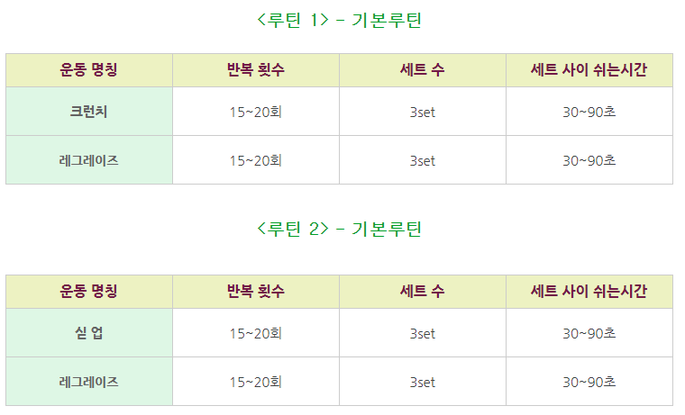
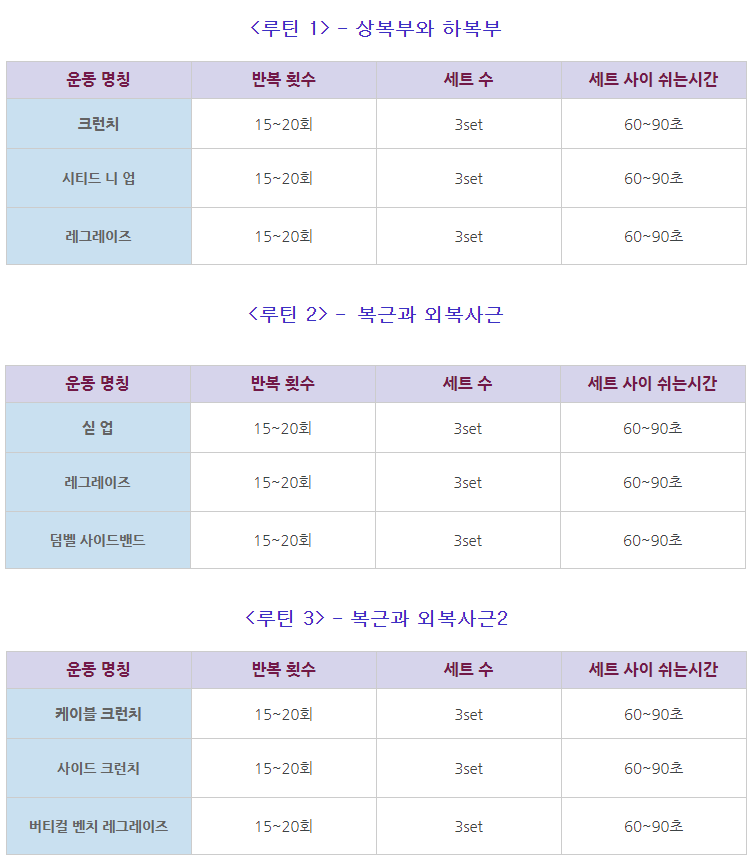
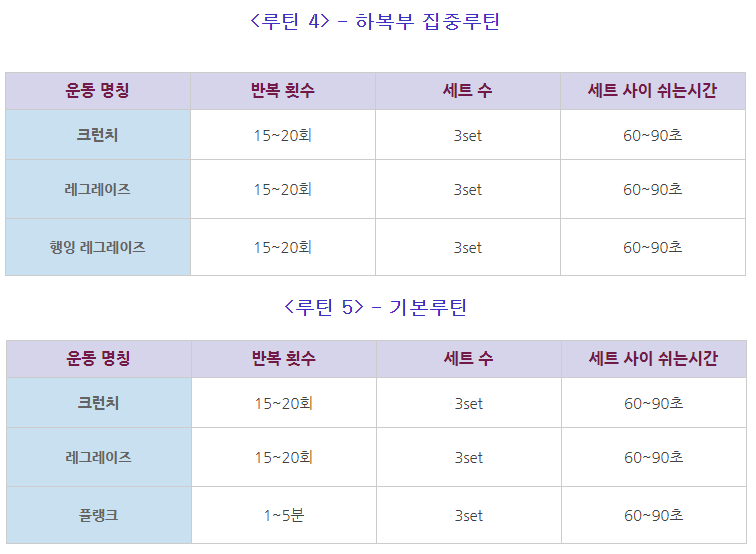

# 달리기

## Long Time Running (LTR)
- 10km의 거리를 시간에 상관없이 오래 달림
- 지구력 향상

## Fast Pace Running (FPR)
- 6km의 거리를 최대한 빠르게 달림
- 5'47'' 이하가 목표
- 근력 향상을 향상하여 장거리 시간 단축이 목적

## Short Slow Running (SSR)
- 5km의 거리를 느리게 달림
- LTR과 FPR의 피로 해소위한 달리기
- 피로와 긴장감을 해소하기 위한 강도 낮은 달리기

## Light Sample Running (LSR)
- 3km의 거리를 느리게 달림
- 최악의 컨디션일 때 최소 거리/속도의 가장 강도 낮은 달리기 

# 헬스

## 복근 운동
- [복근운동](https://blog.naver.com/nabuilder/220321648651)

  

  

  

